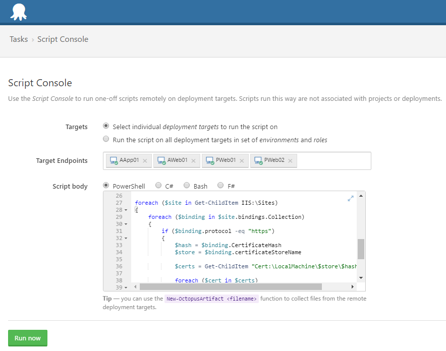

If you've been following technology news recently, you will have seen that [Google announced](https://security.googleblog.com/2017/02/announcing-first-sha1-collision.html) a new attack that makes it [practically possible to generate SHA1 hash collisions](http://shattered.io/). 

The risk seems to focus on areas where certificates are used for digital signatures, not encryption. So far we haven't seen any clear reports that this applies to SSL/TLS - my understanding is that there's a risk someone could make a fake certificate and it could be "trusted" as if it were a real one, but not that SSL/TLS data could be decrypted. Of course, I'm no expert! 

Either way, SHA1 has been on the way out for some time, and certificate authorities stopped issuing SHA1 certificates quite some time ago. This is just another nail in the coffin for SHA1. 

In this post, I want to explain what this means for Octopus, and provide some PowerShell scripts to see whether the apps you deploy are impacted. 

## Octopus and Tentacle currently use SHA1

When you install Octopus and the Tentacle agent, they both generate X.509 certificates that are used to encrypt the connection between them (via TLS). When we generate these self-signed certificates, **we use SHA1**. This is the default setting of the [certificate generation function](https://msdn.microsoft.com/en-us/library/windows/desktop/aa376039(v=vs.85).aspx) that we call in the Windows API, and not something we ever thought to change. 

Mitigations:

 - **Right now**  
   In the mean time, if you are concerned, there is a workaround: you can generate your own certificates, and tell Octopus and Tentacle to use them instead. For details, check our documentation page on [how to use custom certificates with Octopus and Tentacle](https://octopus.com/docs/how-to/how-to-use-custom-certificates-with-octopus-server-and-tentacle). 
 - **Very soon**  
   We'll soon release an update that changes the algorithm to SHA256. This will apply to new installations, but for older installations you'll have to regenerate the certificates and update the trust between all the machines. 
 - **Later**  
   We'll add some features in Octopus to automatically regenerate the certificates on the Octopus server and all Tentacles, and update them all for you. If you have many machines to manage, you might want to wait for this. There's a bit more work involved in this, but we'll try to have it done with time to spare before Google publish the details of the technique in 90 days. 

## Other things you should check

You'll want to check whether SHA1 is being used in other places. Common examples for Octopus users might include:

 - The certificate used for the Octopus web frontend if you use HTTPS. Normally this is something people provide themselves. 
 - Certificates used for authenticating with third party services, like Azure management certificates
 - Certificates used to provide HTTPS for web sites that you deploy

## Detecting SHA1 certificates with PowerShell

Given an `X509Certificate2` object, here's a PowerShell function that checks whether it uses SHA1:

```powershell
function Test-CertificateIsSha1{
    [cmdletbinding()]
    param(  
    [Parameter(
        Position=0, 
        Mandatory=$true, 
        ValueFromPipeline=$true)
    ]
    [System.Security.Cryptography.X509Certificates.X509Certificate2[]]$Certificate
    ) 

    process 
    {
       foreach($cert in $Certificate)
       {
           $algorithm = $cert.SignatureAlgorithm.FriendlyName
           $isSha1 = $algorithm.Contains("sha1")
           Write-Output $isSha1
       }
    }
}
```

Here's a PowerShell script that you can use to check whether a website is using a SHA1 certificate. Kudos to Jason Stangroome for the initial implementation of [Get-RemoteSSLCertificate](https://gist.github.com/jstangroome/5945820):

```powershell
function Get-RemoteSSLCertificate {
    [CmdletBinding()]
    param (
        [Parameter(Position=0, Mandatory=$true, ValueFromPipeline=$true)]
        [System.Uri[]]
        $URI
    )
    process 
    {
       foreach ($u in $URI)
       {
            $Certificate = $null
            $TcpClient = New-Object -TypeName System.Net.Sockets.TcpClient
            try {
                $TcpClient.Connect($u.Host, $u.Port)
                $TcpStream = $TcpClient.GetStream()
                $Callback = { param($sender, $cert, $chain, $errors) return $true }
                $SslStream = New-Object -TypeName System.Net.Security.SslStream -ArgumentList @($TcpStream, $true, $Callback)
                try {
                    $SslStream.AuthenticateAsClient('')
                    $Certificate = $SslStream.RemoteCertificate
                } finally {
                    $SslStream.Dispose()
                }
            } finally {
                $TcpClient.Dispose()
            }
            if ($Certificate) {
                if ($Certificate -isnot [System.Security.Cryptography.X509Certificates.X509Certificate2]) {
                    $Certificate = New-Object -TypeName System.Security.Cryptography.X509Certificates.X509Certificate2 -ArgumentList $Certificate
                }

                Write-Output $Certificate
            }
        }
    }
}

$sites = @("https://www.yoursite.com", "https://anothersite.com")
$sites | ForEach-Object {
    $site = $_
    $cert = Get-RemoteSSLCertificate -Uri $site
    if (Test-CertificateIsSha1 -Certificate $cert) {
        Write-Warning "Site: $site uses SHA1"
    }
}
```

And here's a script that checks whether your IIS server is using any SHA1 certificates:

```powershell
Import-Module WebAdministration

foreach ($site in Get-ChildItem IIS:\Sites)
{
    foreach ($binding in $site.bindings.Collection)
    {
        if ($binding.protocol -eq "https") 
        {
            $hash = $binding.CertificateHash
            $store = $binding.certificateStoreName

            $certs = Get-ChildItem "Cert:\LocalMachine\$store\$hash"

            foreach ($cert in $certs) 
            {
                if (Test-CertificateIsSha1 -Certificate $cert) 
                {
                    Write-Warning "Site: $site.Name uses SHA1"
                }
            } 
        }
    }
}
```

You can easily run this in the [Octopus Script Console](https://octopus.com/docs/administration/script-console) across all of your machines: 



## Certificates feature in Octopus

This is a good time to give a shout out to the [new certificates feature](https://octopus.com/blog/certificates-feature) in Octopus 3.11. If you're going to be updating your web site certificates anyway, why not use Octopus to manage them? 


 
