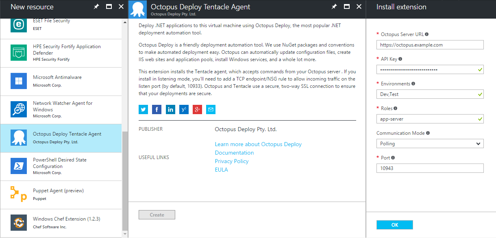

Back in October 2014, we were pretty excited to [announce](https://octopus.com/blog/azure-vm-extension) a Virtual Machine extension for Azure that would allow you to install the Tentacle agent, and wire it up to your Octopus Server.

However, in the world of software (and with the Cloud especially) things move on. Microsoft made substantial updates to the Azure portal and the infrastructure that makes these extensions available - our extension was no longer compatible and was removed from the portal.

Today, I'm happy to announce that we've re-written the extension from scratch, and it's now available for your delectation.

## What can I do with it?

The new extension allows you to install or uninstall a Tentacle, as well as update the Tentacle's configuration on an Azure Virtual Machine.

You can do this via the [Azure Portal](https://octopus.com/docs/installation/installing-tentacles/azure-virtual-machines/via-the-azure-portal), [PowerShell](https://octopus.com/docs/installation/installing-tentacles/azure-virtual-machines/via-powershell), [Azure CLI](https://octopus.com/docs/installation/installing-tentacles/azure-virtual-machines/via-the-azure-cli) or [ARM Template](https://octopus.com/docs/installation/installing-tentacles/azure-virtual-machines/via-an-arm-template). (I'm told that this even works via [Terraform](https://www.terraform.io/docs/providers/azurerm/r/virtual_machine_extension.html), but thats a tad outside the scope of this post!)

## Using the new Azure Portal

In the Azure Portal, select your VM, click on `Extensions` and click the `+ Add` button. Select the `Octopus Deploy Tentacle Agent` extension and click `Create`. Fill in the fields as required, click `OK` and the extension will be deployed.



## Using PowerShell (Azure Resource Manager (ARM) mode)

```powershell
$publicSettings = "{`"OctopusServerUrl`": `"https://octopus.example.com`", `"Environments`": [ `"Env1`", `"Env2`" ], `"Roles`": [ `"app-server`", `"web-server`" ], `"CommunicationMode`": `"Listen`", `"Port`": 10933 }"
$privateSettings = "{`"ApiKey`": `"MY SECRET API KEY`"}"

Set-AzureRmVMExtension -ResourceGroupName "resource-group-name" `
    -Location "Australia East" `
    -VMName "vm-name" `
    -Name "OctopusDeployWindowsTentacle" `
    -Publisher "OctopusDeploy.Tentacle" `
    -TypeHandlerVersion "2.0" `
    -Settings $publicSettings `
    -ProtectedSettings $privateSettings
```

## Using an ARM Template

You can deploy the extension at virtual machine creation time, or update an extension resource group to apply the extension later.

Create your ARM template as normal, and add a `resources` element under your `Microsoft.Compute/virtualMachine` resource:

```json
"resources": [
  {
    "type": "Microsoft.Compute/virtualMachines/extensions",
    "name": "[concat(parameters('vmName'),'/OctopusDeployWindowsTentacle')]",
    "apiVersion": "2015-05-01-preview",
    "location": "[resourceGroup().location]",
    "dependsOn": [
      "[concat('Microsoft.Compute/virtualMachines/', parameters('vmName'))]"
    ],
    "properties": {
      "publisher": "OctopusDeploy.Tentacle",
      "type": "OctopusDeployWindowsTentacle",
      "typeHandlerVersion": "2.0",
      "autoUpgradeMinorVersion": "true",
      "settings": {
        "OctopusServerUrl": "http://localhost:81",
        "Environments": [
          "Development",
          "Staging"
        ],
        "Roles": [
          "App Server",
          "Web Server"
        ],
        "CommunicationMode": "Listen",
        "Port": 10933
      },
      "protectedSettings": {
        "ApiKey": "API-ABCDEF1234567890ABCDEF12345"
      }
    },
    "dependsOn": [
      "[concat('Microsoft.Compute/virtualMachines/', parameters('vmName'))]"
    ]
  }
]
```

For further information and examples, including instructions for Azure Service Management (ASM) mode, Azure CLI and more, please [checkout out our documentation](https://octopus.com/docs/installation/installing-tentacles/azure-virtual-machines).