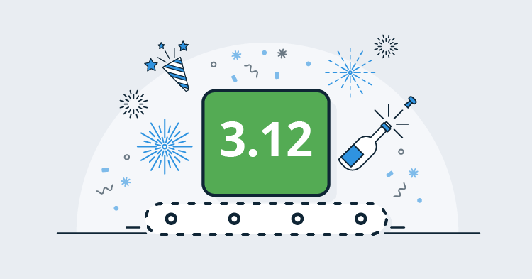
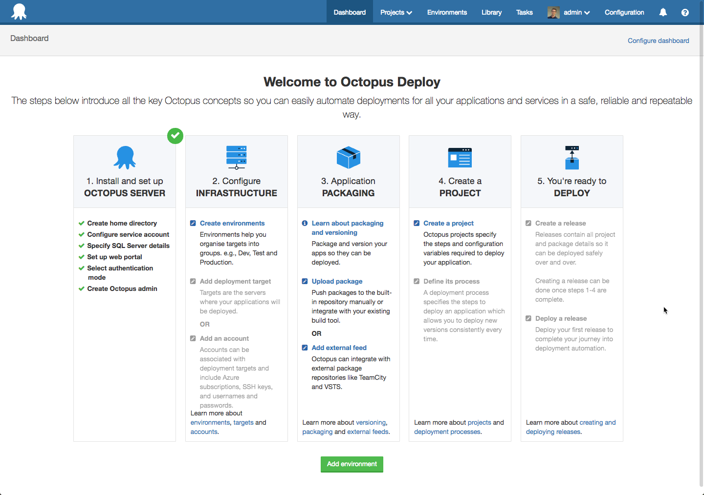
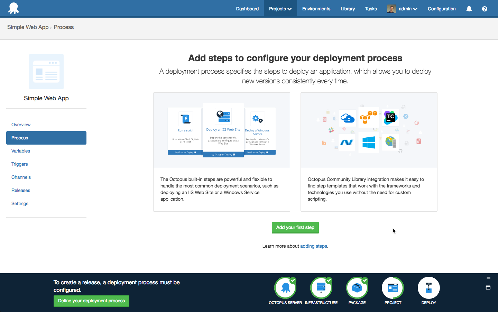
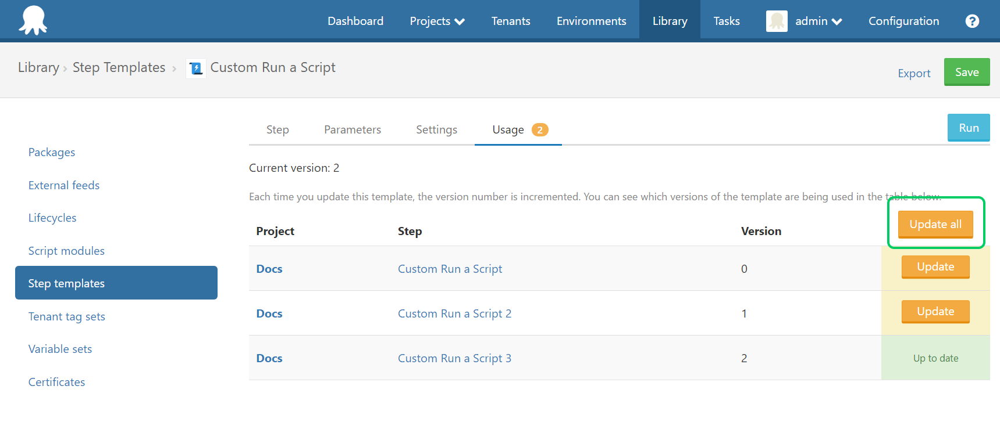
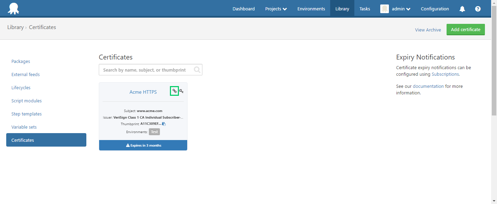
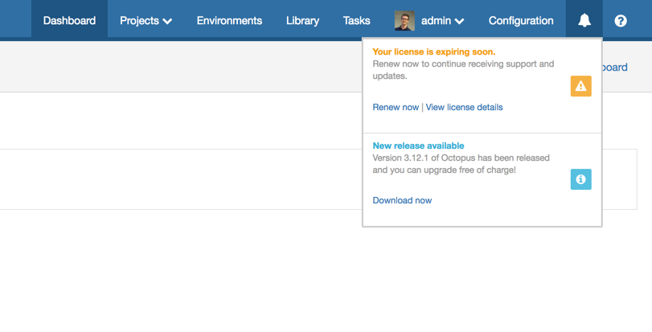

Octopus 3.12 is now available to download and we’re trying a new monthly release cadence.  This means we’ll ship a new release on a predictable schedule that you can count on.  These releases will include new features, and a roll-up of all the patches from that month.  We are doing this experiment with the following goals in mind:

- Make it easier for you to stay across new features and enhancements in Octopus Deploy
- Make it easier for you to plan when and how to upgrade
- Improve the quality and predictability of each monthly release by having a structured delivery schedule and quality gates

**NOTE**: We’ll still continue to ship small enhancements and bug fixes in patches as soon as they’re ready.  We want to get those changes in your hands as soon as possible so that won’t change.  

## Release Tour

<iframe width="560" height="315" src="https://www.youtube.com/embed/ZswEEN4pMVM" frameborder="0" allowfullscreen></iframe>

!toc

## Getting started with Octopus is now even easier

Octopus Deploy has always aimed to help make it easy for new users to automate their deployments, but it can still be a long and complicated road to automation nirvana.

The new onboarding experience introduces the concepts of Octopus and guides new users to their first successful deployment. When a new instance of Octopus server is installed, the dashboard displays a getting started guide that outlines the basic steps required to complete a deployment. For experienced users, the guide can be accessed from the help menu at anytime.  It can be helpful to refer to it if you are setting up a new instance for a project, conducting training, or for consultants setting up a deployment pipeline for a new client.

The step by step process is what we think is the easiest way to make your first deployment and realize the awesomeness of Octopus. To help you keep track of your progress, we have included a progress bar at the bottom of the screen. This will give you hints and links to what the next step is in the process and it disappears after your first deployment.

Our goal with this work is to help new and experienced users get to deploy their first release as quickly and easily as possible and then continue to automate their other projects. It’s a pleasant side effect that makes everything look a little bit nicer :) We think we’ve achieve this goal and we’d love your feedback. Spin up a virtual machine and start a fresh new instance or simply have a play with your existing Octopus installation.

## Update steps across all projects

Updating steps across multiple projects requires a lot of work because each step needs to be updated manually. You have let us know about that [loud and clear](https://octopusdeploy.uservoice.com/forums/170787-general/suggestions/6072178-when-updating-a-step-template-update-across-all) in the past. Today we are happy to announce that we have automated [that process](https://octopus.com/docs/deploying-applications/step-templates/updating-step-templates) and all it requires from you is a single click.

## Substitute variables in files now supports extended wildcard pattern matching

A popular feature on package steps is the ability for Octopus to do [variable substitution](https://octopus.com/docs/deploying-applications/substitute-variables-in-files) in configuration and JSON files. Which lets you make use of the [embedded template syntax](https://octopus.com/docs/reference/variable-substitution-syntax).

The way these extra configuration actions worked was on a fixed set of files, 1 line per file. This was a rigid configuration, if the file was missing it would fail the deploy. This may be desirable if you've got a handful of files, but there were 90 user voice votes for this to be more flexible. The issue was with larger deployments there would be an unknown and changing amount of configuration files that needed to be transformed. The breaking of a build because of moved configuration files was a terrible experience.

To the rescue comes extended wildcard pattern matching for these configuration options. With this enhancement you can use patterns to specify sets of filenames with wildcard characters to determine the set of files that will be modified. Here's two examples: `**/*.config` which will match any file that ends in `.config` in any depth of nesting, and `Area1/**/*.config` will match only `*.config` files any folder in `Area1` and deeper.

## PowerShell debugging support

If you've ever written a Step Template or Script Step for Octopus that was more than a few lines long, I'm sure you've run into issues where you've had to tweak things and re-run until you've made it work the way you want. Maybe you've even resorted to `write-host` based debugging. Well, now you can use a fully fledged debugger (such as PowerShell ISE) with your PowerShell scripts to debug issues. You can even debug remotely via PSRemoting! Take a look at our [guide to remote debugging](/docs/guides/debugging-powershell-scripts) or our [documentation](/docs/deploying-applications/custom-scripts/debugging-powershell-scripts) to get started.

## Performance improvements

We have put in a lot of effort over this release to make Octopus perform better than ever for large and small scale deployments alike. The notable improvements are:

- 60-90% reduction in deployment time, especially for deployments with lots of steps or machines. In our load test scenario a 3 hour deployment was reduced to 6 minutes from end-to-end!
- 10X improvement when working with large task logs. In our test scenario an 18MB task log went from a parse time of 5,000ms down to 500ms.
- CPU, RAM, and SQL Database usage have all been reduced for the vast majority of normal workloads meaning Octopus will scale better for harder workloads and more users.

We highly recommend upgrading to Octopus 3.12 just so you can benefit from these performance improvements. All of these performance improvements are also available in the latest patch of Octopus 3.11, just in case you can't upgrade to Octopus 3.12 right now.

## Certificate-Chain support

Octopus version 3.11 delivered the [Certificates feature](https://octopus.com/blog/certificates-feature), and we have been refining it over the past weeks.  3.12 continues this by adding support for [PFX files containing certificate-chains](https://octopus.com/docs/deploying-applications/certificates/certificate-chains).  

## Improved license notifications

Our final update this month is a minor improvement to help show your Octopus License status.   We’ve updated our license page to show you an alert if your license is expiring soon or expired and we added a very subtle reminder so Octopus users are aware of their license status.  We’ve found that the developers who use Octopus are often unaware of their company's license status and therefore cannot always take advantage of new features or enhancements so we’ve made it easier to know when it’s time to renew.  That said, we've worked hard to make sure that it is very subtle and doesn’t annoy you.

It’s worth pointing out that this currently only shows license expiring notifications and new release notifications (as per your preferences) but we will build upon it in the future.

## Upgrading

All of the usual [steps for upgrading Octopus Deploy](https://octopus.com/docs/administration/upgrading) apply. In this release we have introduced some security enhancements. If any of your users have problems after the upgrade please try the following steps:

1. Refresh the Octopus Deploy portal in the web browser
2. Sign out of the Octopus Deploy web portal
3. Sign in again

## Wrap Up

That’s it for this month.  We hope you enjoy the latest features and our new release cadence.  Feel free to leave us a comment and let us know what you think!  Happy deployments!
