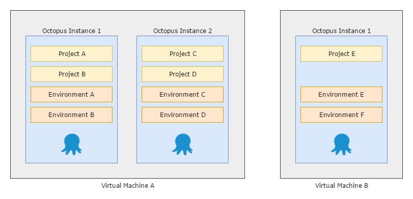

When we first built Octopus, we imagined it would be used by small teams to deploy applications to a dozen or so machines. Over time, we've [seen customers scale Octopus up to many thousands of machines](https://octopus.com/blog/octostats), deploying hundreds of different projects. At that scale, customers need their Octopus servers to be online at all times, so we support running a single [Octopus server across a multi-node, high availability cluster](https://octopus.com/high-availability).

One great big Octopus server isn't always a great idea though, especially when it's used by a large number of teams that don't share a lot in common. That was the case at Accenture, who [standardized on Octopus](https://channel9.msdn.com/Shows/ANZMVP/Updating-Octopus-Deploy-at-Accenture-with-Jim-Szubryt-and-Damian-Brady) across the organization, and had many hundreds of teams on a handful of very large Octopus servers. For their scenario, it made much more sense to split the big Octopus servers into lots of small ones, effectively giving each team or handful of teams their own small, isolated Octopus servers.

Another very common scenario is [security isolation](https://octopus.com/docs/patterns/isolated-octopus-deploy-servers). Customers who [deploy their applications into PCI Compliant environments](https://octopus.com/docs/reference/pci-compliance-and-octopus-deploy) typically end up managing two separate Octopus servers: one in their development/insecure environment, and one in their production/secure environment. In this scenario the difficulty is in synchronizing projects across the two security zones.

## Why would I split up my Octopus servers?

The more we thought about it, the more we realized there are a few compelling reasons why might split up your Octopus servers:

1. **Independent teams:** Your organization has multiple teams that work independently. Currently Octopus has many entities that are shared between Projects (e.g. Lifecycles, Variable Sets, Step Templates, etc). Separate Octopus servers ensure your peas and carrots stay on their own sides of the plate.

1. **Scale:** A single server has finite resources. Whilst a [high availability cluster](https://octopus.com/high-availability) allows you to scale work across multiple servers, there are many situations where having large numbers of entities (Environments, Machines, Projects, etc) impacts performance and usability.

1. **Security:** For security and compliance reasons your organization doesn't allow network communication between development and production environments. In most cases, you also need strict controls around which people can access your production environment. Many customers address this by having an Octopus Server in each security zone.

1. **Distributed Environments:** Many organizations deploy to environments across multiple geographic regions. Deployment performance (particularly package transfers) can be dramatically improved by hosting an Octopus Server instance in each location.

## You can do all this with Octopus right now, but it hurts

All of these are real-world scenarios, and our customers are dealing with them right now. And in each of these cases we have found ways to get the job done, but it still doesn't feel like we've solved all of these problems in a "first-class" way.

Let's take a look at some examples.

### Scaling out across multiple Octopus servers

The _independent teams_ and _scale_ scenarios are typically dealt with by spreading many Octopus servers across one or more machines, often using [high availability clusters](https://octopus.com/docs/administration/high-availability) somewhere in the mix.

OK, now let's figure out how you want to manage identity and access control across your servers. And how you want to manage Octopus upgrades across you servers. Oh, and what if you wanted to share some things like [step templates](https://octopus.com/docs/deploying-applications/step-templates), [variable sets](https://octopus.com/docs/deploying-applications/variables/library-variable-sets), or even [deployment targets](https://octopus.com/docs/deployment-targets)?

To solve the identity and access control problem you could use one of our federated [authentication providers](https://octopus.com/docs/administration/authentication-providers) to enable single-sign on (SSO), but managing the rights each user is granted on your Octopus servers can be painful.

You can share data between Octopus servers using [data migration](https://octopus.com/docs/administration/data-migration), but this is complex and there is no good way to handle conflicts.

Finally, regarding Octopus upgrades, you might have some teams who want to stay on a specific version during a period of stability, and other teams who want to install a newer version in order to access a new feature or bug fix. Some customers like Accenture have gone to the lengths of [using Octopus to manage Octopus](https://channel9.msdn.com/Shows/ANZMVP/Updating-Octopus-Deploy-at-Accenture-with-Jim-Szubryt-and-Damian-Brady) which is cool, but a lot of extra work.

### Deploying releases across multiple Octopus servers

The _security_ and _distributed environments_ scenarios are predominantly dealt with by installing multiple, [isolated Octopus servers](https://octopus.com/docs/patterns/isolated-octopus-deploy-servers).

_INSERT DIAGRAM HERE_

Let's look briefly at the _security_ scenario in particular. How are you going to promote a release of a project between your network security zones, and then share the results of the deployments? You could do it all manually... (please don't do it all manually). You could use an [offline package drop](https://octopus.com/docs/deployment-targets/offline-package-drop) but [they have some important limitations](https://octopusdeploy.uservoice.com/search?filter=ideas&query=offline%20drop) including the fact you [cannot use output variables in offline drops](https://octopusdeploy.uservoice.com/forums/170787-general/suggestions/9196032-output-variables-for-offline-drops) and [the dashboard can get confusing](https://octopusdeploy.uservoice.com/forums/170787-general/suggestions/13066998-offline-drop-specific-dashboard-status). You could take it a step further and use [data migration](https://octopus.com/docs/administration/data-migration) to move your project and release data around, but like we said before, this is complex and comes with a whole host of other problems.

## We want to make all of this easier

Can you imagine a tool which lets you manage identity, access control, upgrades, and information sharing across an entire farm of Octopus servers? We can!

Can you imagine promoting a release from one Octopus server to another, and seeing the deployment results flow back across, even if the servers are completely disconnected? We can imagine that too!

_INSERT DIAGRAM HERE_