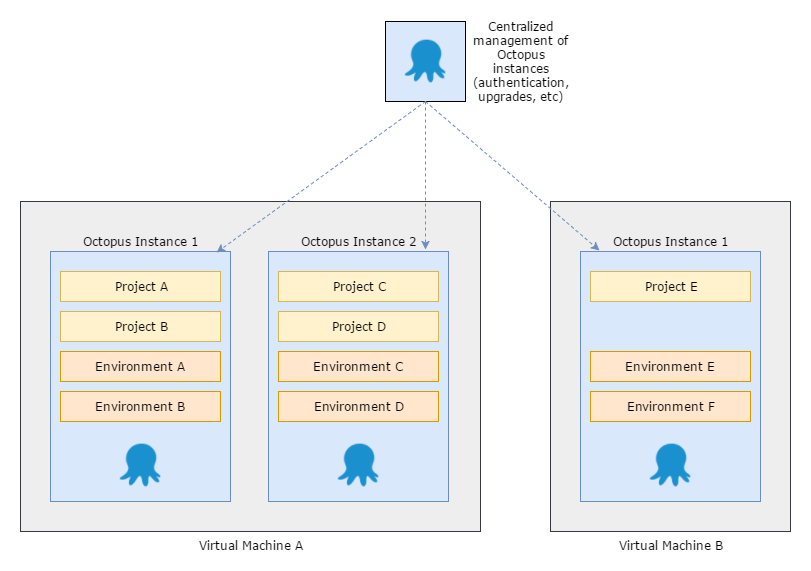
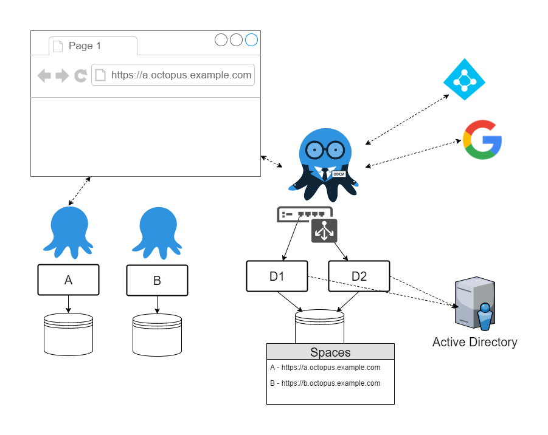

In an [earlier post](octopuses.md) we talked about some of the real world problems our customers are having with Octopus at scale, and introduced some of our vision for solving those problems in Octopus 4.0. In that post we floated the idea of a tool that centrally manages a number of Octopus servers.

In this post we are going to talk more about what this tool, provisionally named **Octopus Data Center Manager** (ODCM), would look like.

## Usage Scenarios

To help set the scene we'll go through some specific usage scenarios, and then look at the ODCM features that will enable them.

### Scenario 1: Lisa Shipping
Lisa is responsible for a team who are delivering some new internal software. They are nearing their first delivery milestone and don't want any surprises. They have been working happily with a specific version of Octopus, they aren't experiencing any issues, and they want to keep it that way.

### Scenario 2: Bob Specialist
Bob is a developer who has some specialist skills and is going to do some work with Lisa's team. He also works on another team who are using Octopus and he doesn't want new credentials or to have to remember a new Url.

### Scenario 3: Geoff Outsider
Geoff is a consultant from an external company who is also joining Lisa's team. He already has an Azure AD login managed by his company, and would really prefer to not have another set of credentials to manage.

### Scenario 4: Barry Infrastructure
Barry is responsible for the company's Octopus infrastructure. Some critical projects rely on this infrastructure and it's important he knows when any Octopus servers go offline.

Barry also manages sets of variables that define various organization level values the teams may need when deploying their projects.

## Features
The following diagram shows what we think a typical ODCM installation might look like. ODCM is shown in a Highly Available style configuration (like Octopus Deploy itself, it will support single node and HA configuration depending on your requirements). A HA configuration will be important for Barry, to ensure he can always get reliable feedback on the rest of the Octopus servers.

### Giving teams their own Space
When we started talking about ODCM and its functionality internally something became apparent pretty quickly that some of the terminology can be overloaded and/or confusing. This was within our team, and we're living this stuff every day, so how do we avoid confusing everyone else?

As an example, we started talking about splitting out Octopus _instances_. But we already use instance to mean a running [instance of Octopus Server or Tentacle EXE](https://octopus.com/docs/administration/managing-multiple-instances), and that's not what we meant. We thought about Octopus _servers_, as I used above, but server could be confused with machine.

What we were talking about is what's represented by the URL that the users use to access Octopus. Not physically, but conceptually. What we were talking about was the ability to split that so teams had their own Space in which to work. And so we started talking about Spaces.

Of the users we talked about in the usage scenarios, only Barry Infrastructure will actually need to know much about Spaces directly. The others are all operating within a Space, but it will be fairly transparent.

ODCM will be where Barry spends his time managing Octopus. It will provide features to do things like:

- enlist an existing "Octopus servers" as a Space,
- separating things out of an existing Space into a new one,
- create a new blank Space
- monitor Spaces, via a dashboard and alerts
- report across Spaces

### Identity management
One of the keys to working across multiple Spaces is dealing with user identity and access control. We can solve these problems by having ODCM take responsibility for them.

When a Space is enlisted with ODCM its authentication will be configured to point to ODCM, which will centralize identity management and allow SSO across Spaces.

This helps in a number of the scenarios:

- Bob Specialist can move team and doesn't need a new identity or need to find a new URL
- Barry Infrastructure can locate Bob's existing identity to grant him access to Lisa Shipping's Space
- Barry can create an external identity for Geoff Outsider, who can then log in with his existing credentials.

Once Bob has access to multiple Spaces, his user experience in Octopus will change slightly to allow him to switch Spaces quickly and effortlessly. We're thinking it'll look something like this.

ODCM will support all of the external providers currently supported by Octopus Deploy. We are considering support for federated authentication across organizations at some point in the future, but this isn't targetted for our initial release.

### Access control
We picture access control operating across Spaces at two levels:

1. who can access a Space?
1. what can a user do within a Space?

If you're Barry Infrastructure, you will be able to control which groups of users have access to which Spaces. A group may consist of Users and/or external groups (i.e. those sourced from Active Directory or Azure AD).

If you're Lisa Shipping you'll be able to use Teams to manage which groups of users have which permissions in your Space, just like you would in Octopus today. For example, you could specify a Team which permits Developers to deploy things to the Dev environment. If Bob Specialist is a member of the Developer group in ODCM then when he is given access to the Space he'll be able to deploy to Dev immediately.

### Sharing
When you only have a single Space, sharing of information is a non-issue. Once you have lots of smaller Spaces, there is an increased likelihood you'll want/need to share information between them.

Our vision for Spaces is that they should be collections of related things, so the need for sharing should be minimal. We thought about which things are likely to need sharing, and think they'll be things like:

- Step Templates
- Server Extensions
- Variables
- Tentacles

With the exception of Tentacles, we think all of these will be shared from ODCM. We expect it will have the ability to host a version of the Community Step Template library, something similar for hosting Server Extensions and provide variable sets that the Spaces can access. ODCM won't have knowledge of Environments, Targets, Tenants or many of the other scoping concepts in Octopus Deploy itself, so there  may only be support for Unscoped variables.

A Tentacle can already be used by more than one Octopus server, so this still applies and it can be used by more than one Space.

### Multiple Octopus Deploy versions
Let's now consider what happens when another team starts up and Barry Infrastructure gets a request for a new Space. He looks across the current machines and sees that one has capacity to host another Space. It happens to be the machine that's hosting Lisa Shipping's Space. So whilst the machine has capacity, the Octopus version being used by Lisa's Space must not change.

The current Octopus Deploy MSI installer creates a problem here because it only allows a single version to be installed on a machine, by virtue of "*C:\Program Files*". You can use Octopus Server Manager to configure multiple instances on a single machine, but they are all sharing the same binaries and are therefore the same version.

You can work around this today but it takes some effort. We want to make it easy. Our current idea is that we'll include an agent on the machines hosting Spaces and automate the deployment of Octopus  itself.

Each Space will be an isolated copy of Octopus, and maintaining that isolation will be important. This is easier on some levels than on others. For example, isolation of versions based on binaries is fairly straightforward. Isolation across shared resources like CPU, RAM and disk is more problemmatic. We're investigating options at the moment and we'll share more once that's done.

### Octopus Deploy monitoring and reporting
ODCM will monitor the Spaces under its control, much like Octopus monitors Tentacles. It will collect information from each of the Spaces and aggregate it. Administrators like Barry Infrastructure can then view the information via ODCM's dashboard and reporting features.

We don't expect that all of the dashboard functionality and reports will make it into the initial release. We will focus on a minimal set and build on this over subsequent releases. The initial release may contain something like:

- a dashboard showing Spaces, with their server version and current status (online/offline)
- a report showing project count and target count per Space
- a report showing deployment counts (number of successful and failed deployments) per Space over a give timeframe

If there are other metrics you think would be valuable, please let us know.

## Licensing
ODCM will be a separate product to Octopus Deploy itself, and will have a different licence model. The model is still under discussion and we’ll share more details as they become available. The pricing will be friendly in regards to running lots of Spaces.

## Feedback
What we've talked about above is what we think will be the minimum viable product for ODCM. As always, we're keen to get your feedback and from there we'll be looking to start the implementation in the next couple of weeks.

We'd like to try something new for collecting feedback. We've created a [new repository](https://github.com/OctopusDeploy/Specs) on GitHub and in there you'll find a [TODO Spec document for ODCM](). The Spec is initially based off what we've shared here, and our plan is to use Issues and PRs to gather feedback and evolve it over the coming weeks and months. It will be a living document and we're hoping that through the Issues and PRs there'll be a good story around tracking how features came to be.