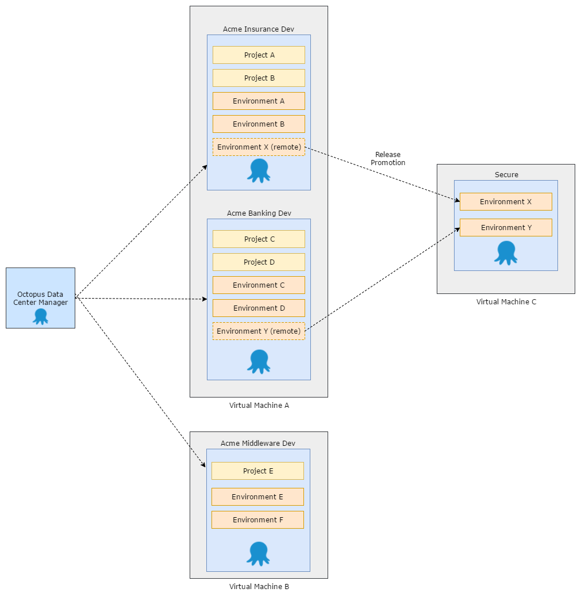

There are scenarios where it makes sense to have multiple Octopus Servers. These reasons can be broadly categorized as:

1. **Isolation:** Your organization has multiple teams that work independently. Currently Octopus has many entities that are shared between Projects (e.g. Lifecycles, Variable Sets, Step Templates, etc). Separate Octopus Servers ensures your peas and carrots stay on their own sides of the plate. 

2. **Scale:** A single server has finite resources. While High Available allows you to scale work across multiple servers, there are many situations where having large numbers of entities (Environments, Machines, Projects, etc) impact performance and usability.    

3. **Geography:** 
 - **3a. Teams:** Many organizations have teams that are geographically dispersed. Octopus Servers located in each region can be used to address network latency. 

 - **3b. Environments:** Similarly to 3a, many organisations deploy to environments in multiple georgraphic regions.  Deployment times (particularly package transfers) can be dramatically reduced by hosting an Octopus instance in each location. 

4. **Security:** For security (for example PCI DSS compliance) your organization doesn't allow network communication between development and production environments. Many customers address this by having an Octopus Server in each zone. 

A primary focus for Octopus 4.0 will be making it easier to manage multiple Octopus instances.

To do this, we are planning to introduce two new concepts: Spaces and Zones. 

We are going to talk about these in _much_ more detail in coming posts (you can expect RFC's on each in the next couple of weeks). 

The two concepts are orthogonal, but complementary. As a (very) brief introduction, Spaces are designed to address points **1**, **2**, and **3a** above, while Zones address points **3b** and **4**.

Both are essentially just an Octopus Server instance. The difference is in how they interact. 

Spaces are an isolated set of related entities (Projects, LifeCycles, Variable Sets, etc), managed by a central component to allow for authentication and easy navigation between Spaces. 

Zones will effectively allow you to split a Project across multiple Octopus instances, defining some Environments, Variables, Tenants etc on one instance, some on another. Releases will be able to promoted across Zones (manually if there is no network access). 

As mentioned, both will be covered in much more detail soon. 

In the meantime, below is an example of the architecture we want to support.

