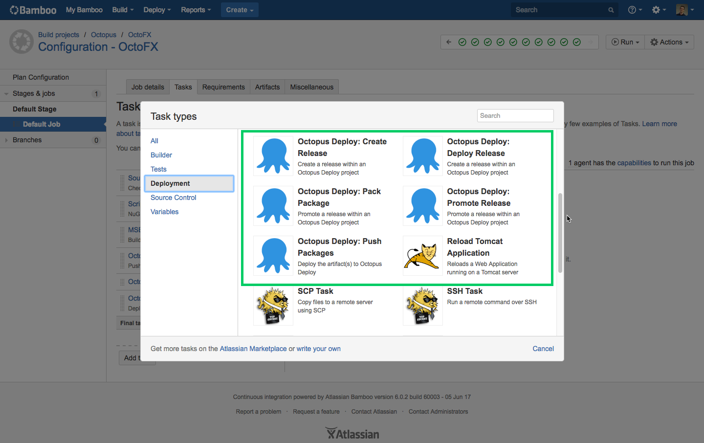
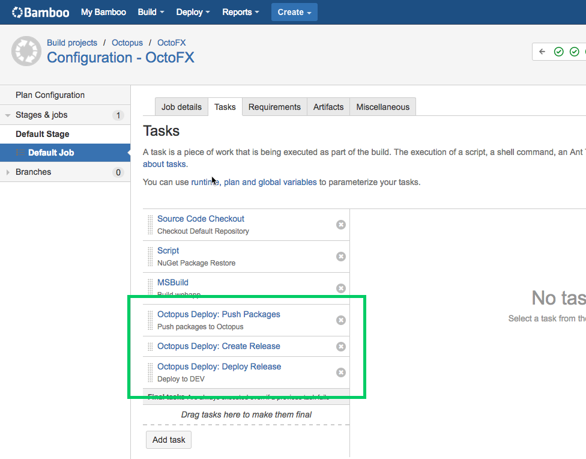
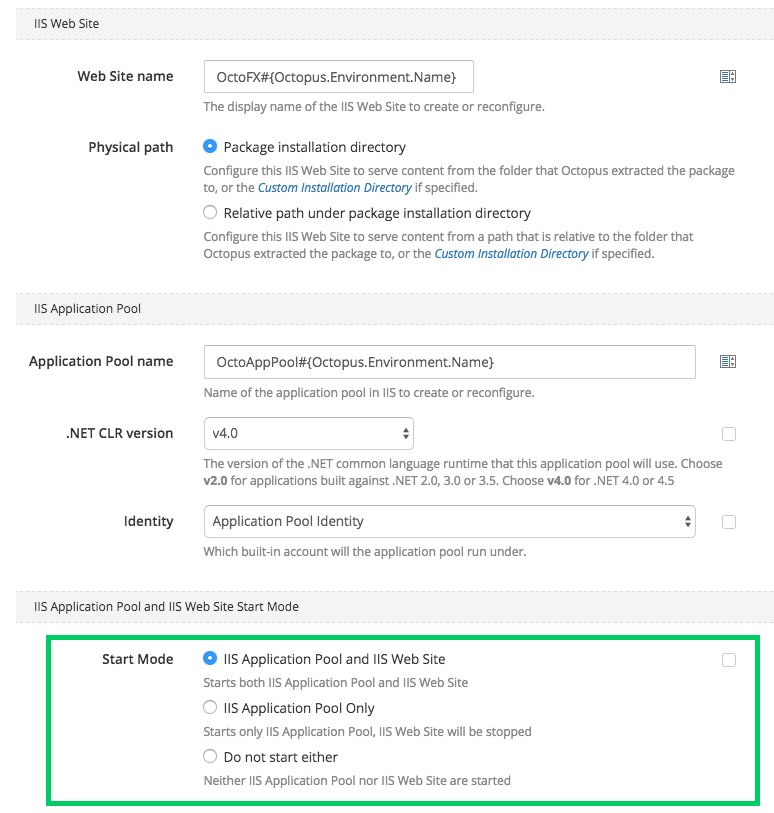
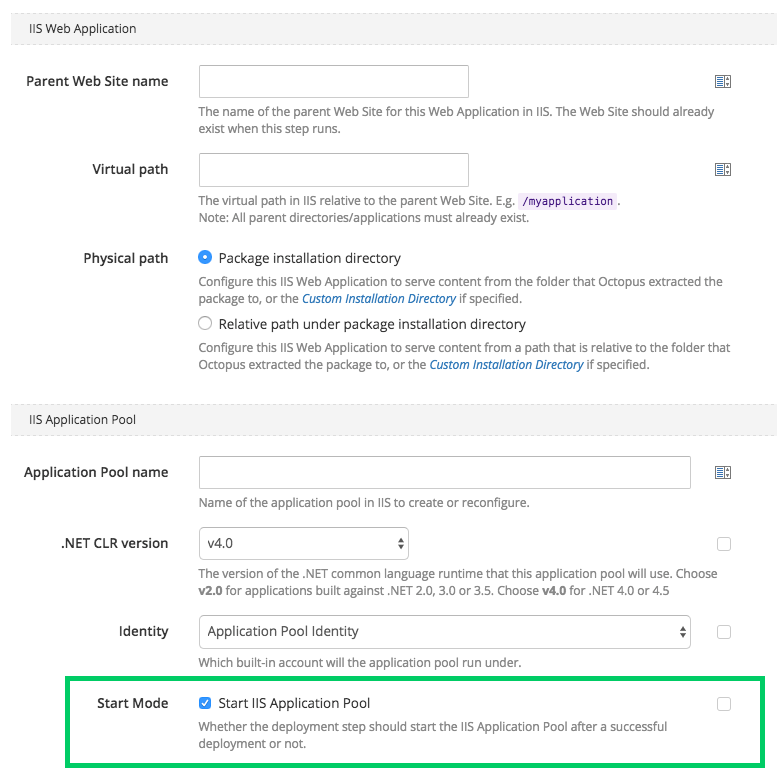
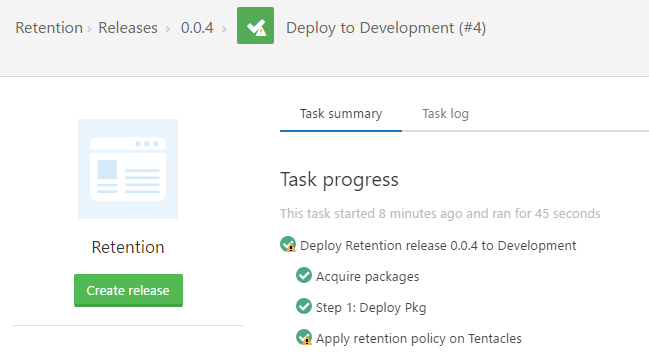
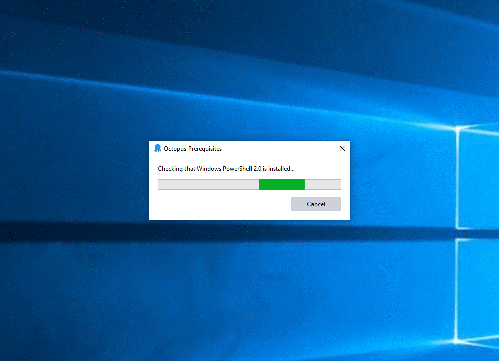

This month's release brings some exciting new features including our new Octopus Deploy plugin for Atlassian's [Bamboo](https://www.atlassian.com/software/bamboo) build server as well as easier upgrades, security improvements and better performance.

## In this post

!toc

## Release Tour

<iframe width="560" height="315" src="https://www.youtube.com/embed/CWf5Y-dk14c" frameborder="0" allowfullscreen></iframe>

## Octopus Bamboo Plugin

We are shipping a native Octopus Deploy plugin for Atlassian's [Bamboo build/continuous integration server](https://www.atlassian.com/software/bamboo).  This new add-on allows you to easily configure your build plan to pack applications for deployment, push packages to Octopus, create, deploy and promote releases in a first class way. This makes it easy to integrate Bamboo and Octopus to build your deployment pipeline and take advantage of the great features in both products!

The plugin is available on [Atlassian's Marketplace](https://marketplace.atlassian.com/plugins/com.octopus.bamboo/server/overview) and if you use Bamboo with Octopus, we highly recommend checking it out.

## 'Deploy to IIS' step improvements

We've updated our ‘Deploy to IIS’ step to add support to control how your web apps and app pools are started after a successful deployment.  This is available when configuring `Web Sites` as well as `Web Applications`.  This is a great addition to one of most popular steps.  
New option for `Web Site`:

New option for `Web Application`:

## Certificates are now generated using SHA256

As promised in our blog post on [shattered](http://octopus.com/blog/shattered), we have updated our certificate generation to use SHA256, rather than the previous SHA1. This ensures any new installations or regenerated certificates will use SHA256, but will not affect any existing certificates. We will be rolling out features in the near future to make it easier to replace older certificates.

## Tentacle split

Until now we have always released a new version of Tentacle with every version of Octopus Server. Today we split the Tentacle!

### Previous Tentacle cadence

With each release of Octopus Server we also released a version of Tentacle. As a result, every time you upgrade your Octopus Server you have been prompted to upgrade all of your Tentacles. In the majority of our releases we have made no changes to Tentacle.

### The new Tentacle cadence

A new version of Tentacle will only be released when the Tentacle has changed. At this stage changes will be signified by a bump in the Tentacle version. Octopus Server will bundle the version of Tentacle that was most recently released and use it for Tentacle upgrades.

### What does this mean for you?

Less Tentacle upgrades! Since the release of Octopus 3.0 there have been a few small tweaks to Tentacle, mostly adding new commands and minor changes to the communication stack. Octopus Server v3.x is compatible with all Tentacle 3.x versions. We hope splitting the Tentacle helps relieve some of the hassle and friction involved with upgrading Octopus and provides better communication about changes to Tentacle.

### Coming soon

We aim to give Tentacle and some of our other open source repositories their own release notes to save you having to sift through the Octopus Server release notes to find items of interest. We will also give you the ability to automatically upgrade your Tentacles as soon as a new Tentacle version is released rather than having to wait for the next Octopus Server release.

## Retention policy improvements

In rare cases a retention policy will fail during deployment, usually due to locked files or virus scanners. In the past this failure would cause your deployment to appear as if it had failed, when in fact the deployment was actually successful - we just couldn't clean up properly afterwards. Now, if a retention policy fails during deployment we will still log the details of the failure, but the deployment itself will be displayed as successful (with warnings).

## Performance improvements

In this release we have made further improvements to the general performance of Octopus:

- Each HTTP request now allocates 86% less memory (down from 1.44MB to 256KB on average) resulting in a 45% improvement in the number of requests Octopus can handle each second over a sustained period of time. This means Octopus can spend less time cleaning up after itself, and more time being productive on your behalf.
- We have added some built-in SQL indexes to the Releases table to reduce some of the most common query costs by 92%.
- We have improved the performance of the task scheduler and retention policies, leading to reduced contention and query cost on the SQL database.
- Writing Task Logs is now 10% faster leading to less lock contention and faster/smoother deployments.

Every Octopus customer should benefit from these improvements, but especially those with larger installations.

## Improved upgrade experience

Whenever we needed to change the database schema, those changes would be applied when the Octopus Server started up, somewhat invisibly to any users. This hasn't provided the best experience for customers with large installations or those using [Octopus High Availability](http://g.octopushq.com/HighAvailability) clusters. Now when you upgrade Octopus to 3.14.0, or newer, the database schema upgrade will be performed immediately after the software upgrade, clearly showing the progress of the schema changes.

## Upgrading

All of the usual [steps for upgrading Octopus Deploy](https://octopus.com/docs/administration/upgrading) apply. Please see the [release notes](https://octopus.com/downloads/compare?to=3.14.0) for further information.

## Wrap Up

That’s it for this month. We hope you enjoy the latest features and our new release. Feel free to leave us a comment and let us know what you think!  Happy deployments!
