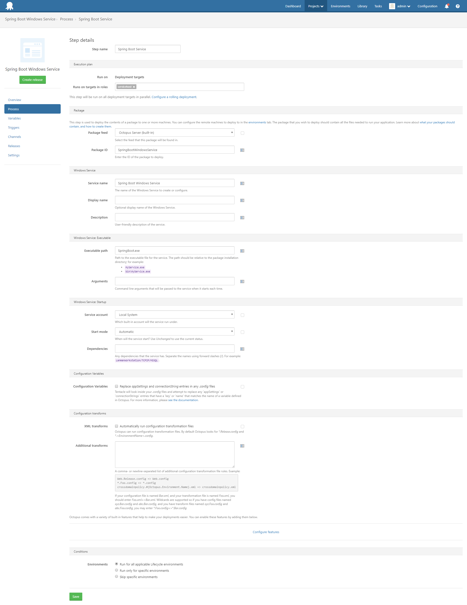
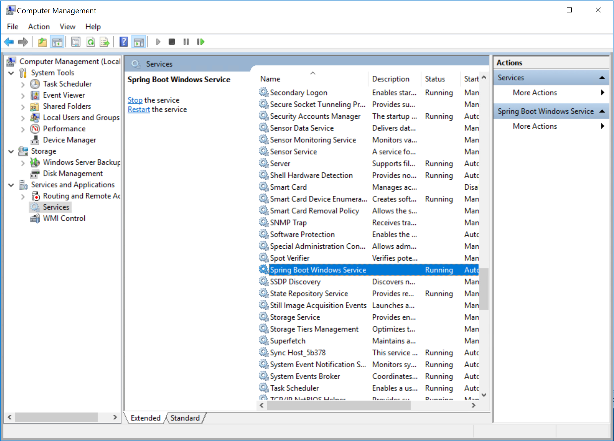

<div style="background-color:#e9edf2;">

</div>

A customer recently asked if it was possible to deploy a Spring Boot application as a Windows Service using Octopus Deploy. The [Spring documentation](https://docs.spring.io/spring-boot/docs/current/reference/html/deployment-install.html#deployment-windows) does briefly mention a method for running Spring Boot applications as Windows services, but a lot of the details are left to the reader to figure out. So in this blog post I'll show you how to quickly run a standard Spring Boot application as a service.

## Java and Windows services

There are two things we need to run a Spring Boot UberJAR as a Windows service.

The first thing is an executable that Windows can actually run as the service. This is provided by the [winsw](https://github.com/kohsuke/winsw) project. Winsw is not specifically tied to Java, but it can be used to execute `java`, which is all we need in order to start our Spring Boot JAR file.

The second thing is some way to gracefully shutdown a Java application running in the background. For that we have a simple project called the [Spring Boot Stopper](https://github.com/OctopusDeploy/SpringBootStopper). This application will communicate with a Spring Boot application via JMX and instruct it to shut down.

## Putting it all together

This [demo project](https://github.com/OctopusDeploy/SpringBootWindowsService) is a fairly stock Spring Boot REST MVC application generated using the [Spring Initializr](https://start.spring.io/) web site. The project hasn't been configured in special way, and when built will produce a stock Spring Boot JAR file.

In the `dist` folder of the project you will find a number of files.

* SpringBoot.exe - which the winsw executable renamed.
* SpringBoot.exe.config - the [winsw EXE configuration file](https://github.com/kohsuke/winsw/blob/master/doc/exeConfigFile.md)
* SpringBoot.xml - the [winsw XML configuration file](https://github.com/kohsuke/winsw/blob/master/doc/xmlConfigFile.md)
* SpringBootStopper.jar - the [Spring Boot Stopper](https://github.com/OctopusDeploy/SpringBootStopper) JAR file
* SpringBootWindowsService.jar - the Spring Boot JAR file

The XML configuration file is where most of the magic happens. Inside you will find the following settings:

```
  <executable>java</executable>
	<startargument>-Dspring.application.admin.enabled=true</startargument>
	<startargument>-Dcom.sun.management.jmxremote.port=50201</startargument>
	<startargument>-Dcom.sun.management.jmxremote.authenticate=false</startargument>
	<startargument>-Dcom.sun.management.jmxremote.ssl=false</startargument>
	<startargument>-jar</startargument>
	<startargument>SpringBootWindowsService.jar</startargument>
```

These settings define what the winsw executable will run when the Windows service is started. In this case we are starting the Spring Boot UberJAR with some additional system properties that configure JMX. Here we enable the [Spring Boot admin features](https://docs.spring.io/spring-boot/docs/current/reference/html/boot-features-spring-application.html#boot-features-application-admin), set the JMX port to `50201`, disable SSL and disable JMX authentication.

We then has some additional settings to define what the winsw executable will run when the Windows service is stopped.

```
  <stopexecutable>java</stopexecutable>
  <stopargument>-jar</stopargument>
  <stopargument>SpringBootStopper.jar</stopargument>
  <stopargument>50201</stopargument>
```

Here we run the `SpringBootStopper.jar` application passing in the same JMX port that was used when starting the Spring Boot application. These settings allow `SpringBootStopper.jar` to connect to the running Spring Boot instance and gracefully shut it down.

## Packing up the service

To package these files up for Octopus Deploy, use the [CLI tool](https://octopus.com/docs/packaging-applications/nuget-packages/using-octo.exe).

```
Octo.exe pack --format=zip --id=SpringBootWindowsService --version=1.0.0
```

This will produce a file called `SpringBootWindowsService.1.0.0.zip`, which you can then push to the Octopus server with the command:

```
Octo.exe push --server=http://my.octopus.server --apiKey=API-xxxxxxxxxxxxx --package=SpringBootWindowsService.1.0.0.zip
```

## Deploying the service

At this point you can deploy the package as a traditional Windows service executing the `SpringBoot.exe` executable.



Once deployed, the service will appear like any other Windows service.



# Conclusion
Start the service up, and open a browser to http://localhost:8080/greeting. Your Spring Boot application is now running as a Windows service!
