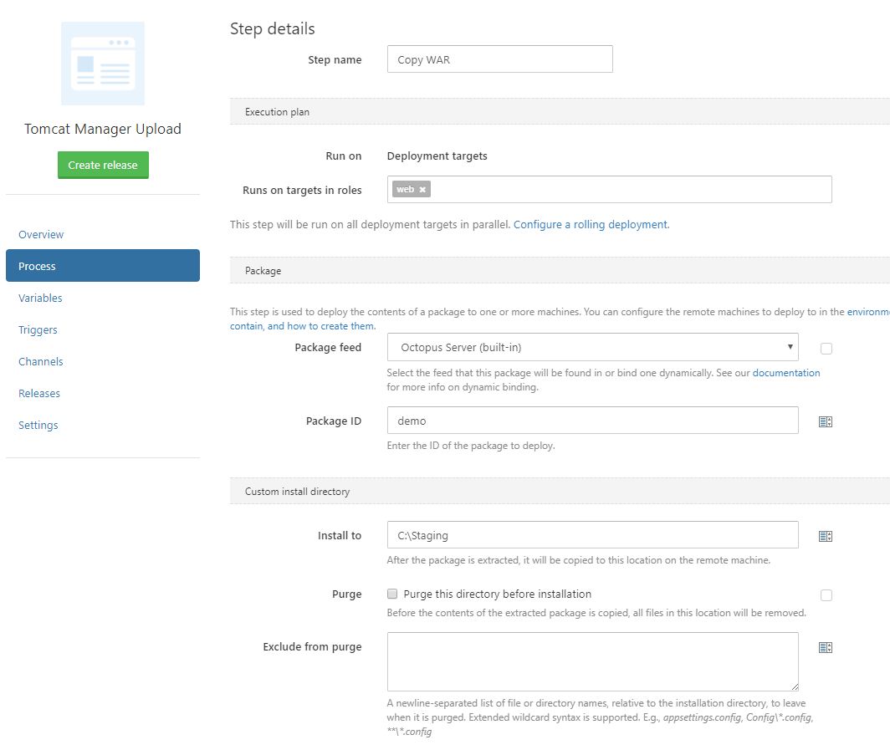
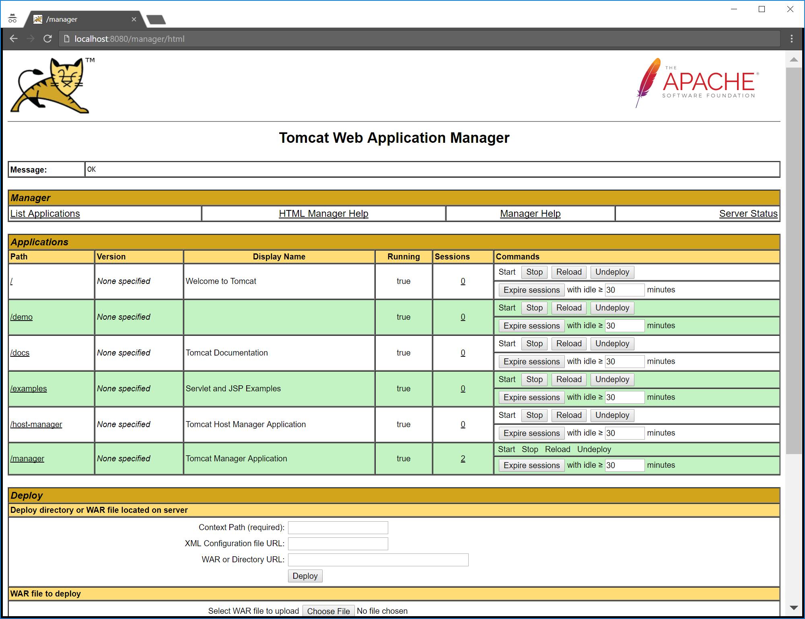

<div style="background-color:#e9edf2;">

</div>

In a previous post, I showed you how to deploy to Tomcat from Octopus Deploy by extracting a WAR file into the Tomcat `webapps` folder.  In addition to file copies, Tomcat also supports deploying WAR files through the [manager application](https://tomcat.apache.org/tomcat-7.0-doc/html-manager-howto.html) that is bundled with Tomcat distributions.

In this post, I’ll show you how to deploy WAR files in Tomcat via the Tomcat Manager.

## Configuring Tomcat

Before we can start uploading WAR files, we need to do some initial configuration.

### Configuring users

We need to define the credentials for interacting with the manager. The manager distinguishes between two types of users, those who use the web interface through a browser, and those who will use the API.

To define these users, we need to edit the `conf/tomcat-users.xml` file.

Browser based users are assigned to the `manager-gui` role, while API users are assigned to the `manager-script` role:

```xml
<user username="manager" password="s3cret" roles="manager-gui"/>
<user username="deployer" password="s3cret" roles="manager-script"/>
```

### Define maximum file upload size

By default you can only upload files of around 50MB through the manager. This is often not large enough for big packages, so you can set a higher limit by editing the `webapps/manager/WEB-INF/web.xml` file. Inside that file you will find a `<multipart-config>` element whose child elements define the maximum file upload size.

Here I have set the maximum file upload size to 250MB:

```xml
<multipart-config>
  <max-file-size>262144000</max-file-size>
  <max-request-size>262144000</max-request-size>
  <file-size-threshold>0</file-size-threshold>
</multipart-config>
```

## Uploading the WAR file

To get the WAR file into Octopus Deploy, follow the instructions under [Packaging the WAR File](https://octopus.com/blog/octopus-tomcat#packaging-the-war-file) and [Pushing the package](https://octopus.com/blog/octopus-tomcat#pushing-the-package) from the previous blog post.

You can then extract the WAR file onto the target server using the instructions at [Creating a Octopus Deploy project](https://octopus.com/blog/octopus-tomcat#creating-a-octopus-deploy-project).

But there is one important difference this time. Instead of extracting the WAR file to the `webapps` folder directly, we’ll extract it to a temporary location. In this case I have extracted the file to the `C:\staging` folder:



To deploy the file, we need to do a HTTP PUT to the `http://localhost:8080/manager/text/deploy` URL, with the WAR file to be deployed suppiled in the body of the request. The `path` query parameter defines the context path that will be assigned to the application. Note that it is important to have the leading slash in the path name.

The PowerShell command below uses [curl](https://curl.haxx.se/download.html) to make the HTTP request:

```powershell
& "C:\curl.exe" -u deployer:s3cret -X PUT -F "file=@C:\staging\demo.war" http://localhost:8080/manager/text/deploy?path=/demo
```

## Confirming the deployment

Open http://localhost:8080/manager and supply the credentials for the manager user we created earlier. You will see the application deployed under the `demo` path:



## Next steps

These procedures are being developed as a proof of concept for what will eventually be migrated into steps provided directly in Octopus Deploy.

If you have any questions about this process, please leave a comment. And if there are some Java features that you would like to see Octopus Deploy support in future, join the discussion on the [Java RFC post](https://octopus.com/blog/java-rfc).
