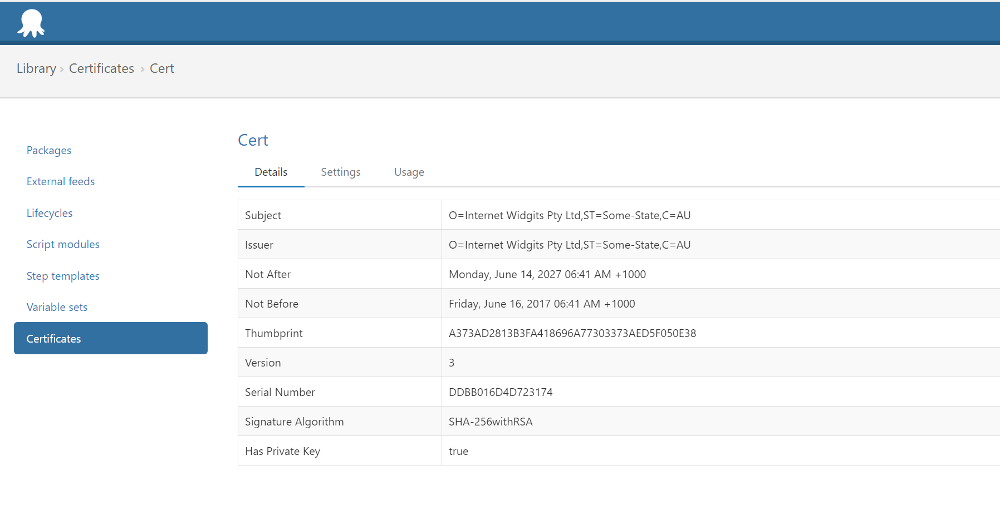
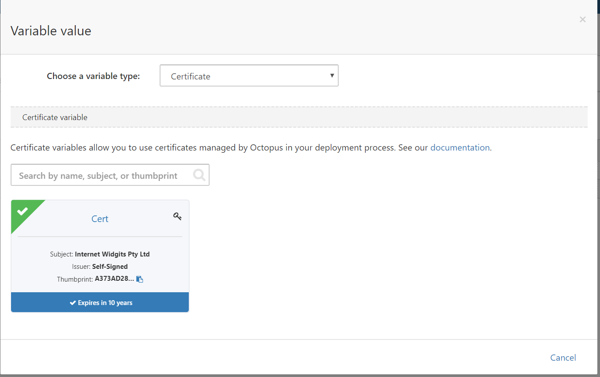
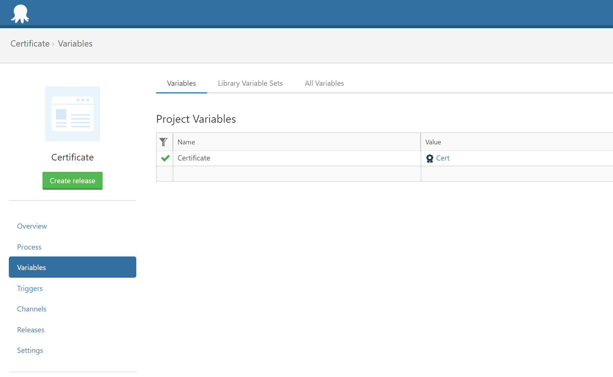
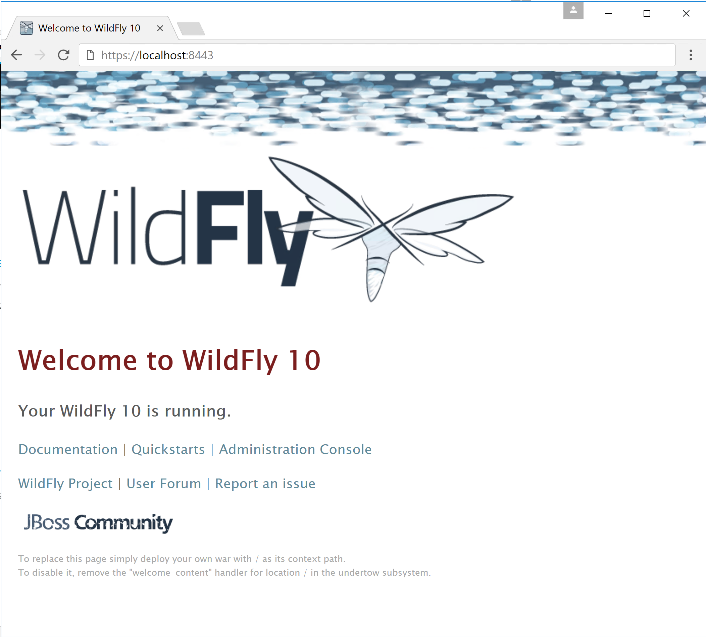
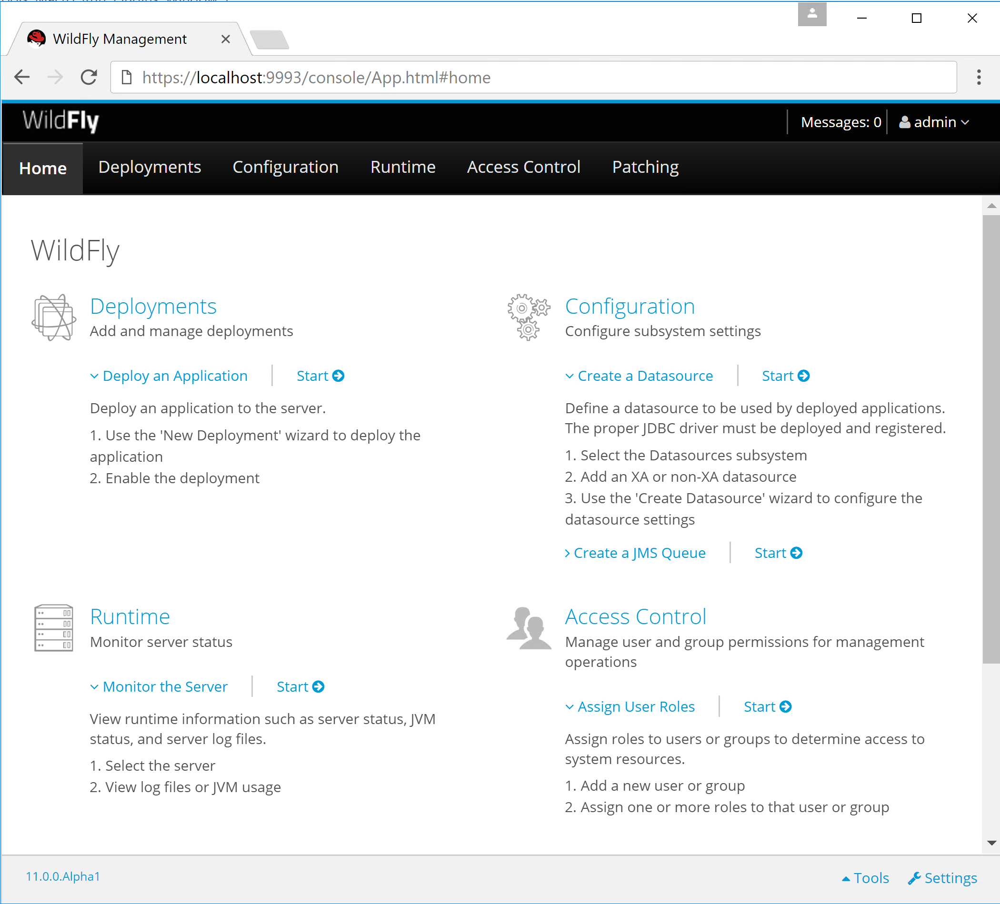

<div style="background-color:#e9edf2;">

</div>

A recent feature added to Octopus Deploy is the ability to [manage and deploy certificates](https://octopus.com/blog/certificates-feature) within your infrastructure. While some of the steps regarding the deployment of certificates are limited to Windows, it is not difficult to export certificates so they can be used by Java.

In this blog post I’ll show you how to export certificates from Octopus into a Java keystore, and then use that keystore to secure a WildFly standalone or domain instance running on Windows.

## Prerequisites
To run the commands and scripts in this blog post, you will need install some tools.

The first is an OpenSSL client. I have used the Windows OpenSSL binaries made available from [Shining Light Productions](https://slproweb.com/products/Win32OpenSSL.html).

The second is the Groovy SDK. You can download installers from the [Groovy downloads page](http://groovy-lang.org/download.html).

These steps were tested with [WildFly 11.0.0.Alpha1](http://wildfly.org/downloads/).

Finally you will also need Java 8 JDK installed.

## Creating the Certificate Store
To start with we’ll need a certificate and private key pair uploaded into Octopus Deploy. The easiest way to do that is to create a self signed certificate and private key, and then combine them both into a PKCS12 keystore.

To create the private key and certificate, run the following command:
```
openssl req -x509 -newkey rsa:2048 -keyout private.pem -out certificate.pem -days 356
```
You will be prompted to supply a password and fill in some personal information, after which two files will be created: `private.pem` and `certificate.pem`. These files are the private key and certificate.

We then need to combine these two files into a PKCS12 keystore, which we can do with the following command:
```
openssl pkcs12 -export -in certificate.pem -inkey private.pem -out combined.pfx -name octopus
```
The `combined.pfx` file now contains both the certificate and private key, and can be uploaded to Octopus Deploy.



## Exporting the Certificate Store
Now that the certificate is managed by Octopus, we need to create a project with a custom script step to get the certificate onto our WildFly servers.

First we need to reference the certificate through a variable. In the `Variables` section of your Octopus project, create a new variable called `Certificate` which references the certificate that was just uploaded.





Creating this variable gives us access to a [number of different representations of the information held in the certificate](https://octopus.com/docs/deploying-applications/variables/certificate-variables#expanded-properties).

The script below saves the certificate and private key back on the target server as PEM files, merges them into a combined PKCS12 keystore, and then imports the PKCS12 keystore into a Java keystore.

:::hint
As part of our [Java RFC](https://octopus.com/blog/java-rfc), exposing this certificate as a Java keystore directly is a feature that we’re aiming to include within Octopus. Today though we have to use a manual script that will extract the certificate details and import it into a Java keystore.
:::

The end result of this script is a file called `c:\keystore.jks`, which is the Java keystore that we can reference from WildFly to enable HTTPS support.
```powershell
if ([String]::IsNullOrWhiteSpace($OctopusParameters["Certificate.CertificatePem"])) {
    Write-Error "Certificate is empty"
}

if ([String]::IsNullOrWhiteSpace($OctopusParameters["Certificate.PrivateKeyPem"])) {
    Write-Error "Private key is empty"
}

$OctopusParameters["Certificate.CertificatePem"] | Out-File -Encoding ASCII "C:\certificate.pem"
$OctopusParameters["Certificate.PrivateKeyPem"] |  Out-File -Encoding ASCII "C:\private.pem"
# Fix the error
# WARNING: can't open config file: /usr/local/ssl/openssl.cnf
$env:OPENSSL_CONF="C:\OpenSSL-Win64\bin\openssl.cfg"
C:\OpenSSL-Win64\bin\openssl.exe pkcs12 -export -inkey C:\private.pem -in C:\certificate.pem -name octopus -out C:\keystore.pfx -password pass:Password01
if (Test-Path C:\keystore.jks) {
  rm C:\keystore.jks
}
C:\Java\x86\jdk1.8.0_131\bin\keytool -importkeystore -srckeystore C:\keystore.pfx -srcstoretype pkcs12 -destkeystore C:\keystore.jks -storepass Password01 -srcstorepass Password01 -noprompt
```

## Configuring HTTPS Support in WildFly
Before we start configuring WildFly to make use of the Java keystore, it is worth going over what exactly we mean by configuring HTTPS support in WildFly.

WildFly has two web interfaces: the interface that clients use to view the deployed Java applications, and the management interface. Both can be protected with HTTPS, although the process is slightly different for each.

In addition, WildFly can be deployed in a standalone mode, or as a domain. Again there are subtle differences between configuring HTTPS support for standalone servers and domain servers.

While the [WildFly CLI tool](https://docs.jboss.org/author/display/WFLY10/CLI+Recipes) is powerful and exposes all the functionality required to configure HTTPS support, it operates at a low level and does not include functions like `configureHTTPS()`. One of the drawbacks to the CLI tool is that it is not idempotent, which means configuring a WildFly instance using the CLI tool often requires a different sequence of steps depending on the current state of the server.

This is not ideal when you are deploying from a platform like Octopus. What you want is to have a way to describe the desired state you wish to achieve (like “have HTTPS configured”) without having to know what the current state of the server is.

To facilitate this we have created a [Groovy script](https://github.com/OctopusDeploy/JBossDeployment/blob/master/deploy-certificate.groovy) that hides the low level commands that need to be issued through the CLI tool in order to configure (or reconfigure) HTTPS support in WildFly.

## HTTPS Support in Standalone Mode
To configure a standalone WildFly instance with HTTPS support, run the following command:
```bash
groovy deploy-certificate.groovy --controller localhost --port 9990 --user admin --password password --keystore-file C:\keystore.jks --keystore-password Password01
```

:::hint
The username and password need to match those that you have already configured with the [adduser script](https://docs.jboss.org/author/display/WFLY10/add-user+utility). You can verify that these credentials work by opening http://localhost:9990 and entering them when prompted to log in.
:::

Behind the scenes the script starts by creating a security realm called `octopus-ssl-realm` which references the keystore:
```xml
<management>
   <security-realms>
      <security-realm name="octopus-ssl-realm">
         <server-identities>
            <ssl>
               <keystore path="C:\keystore.jks" keystore-password="Password01" alias="octopus" />
            </ssl>
         </server-identities>
      </security-realm>
      ...
   </security-realms>
</management>
```
It will then configure a https-listener that references the security realm:
```xml
<subsystem xmlns="urn:jboss:domain:undertow:4.0">
   <server name="default-server">
      <http-listener name="default" socket-binding="http" redirect-socket="https" enable-http2="true" />
      <https-listener name="https" socket-binding="https" security-realm="octopus-ssl-realm" enable-http2="true" />
      <host name="default-host" alias="localhost">
         <location name="/" handler="welcome-content" />
         <filter-ref name="server-header" />
         <filter-ref name="x-powered-by-header" />
         <http-invoker http-authentication-factory="application-http-authentication" />
      </host>
   </server>
   ...
</subsystem>
```
Finally, the server is restarted so the new settings can take effect. When you open https://localhost:8443/ you will see that WildFly is now protected with your self signed certificate.



:::hint
It is worth noting that since WildFly 10.1.0, [HTTPS support for the web interface with a self signed certificate is provided out of the box](http://wildfly.org/news/2016/08/19/WildFly10-1-Released/).
:::

## Securing the Standalone Management Interface
Securing the management interface can be done simply by adding the `--management-interface` parameter.
```bash
groovy deploy-certificate.groovy --controller localhost --port 9990 --user admin --password password --keystore-file C:\keystore.jks --keystore-password Password01 --management-interface
```
Although this is only a single parameter change from the previous command, the actual work being done is a bit different.

First the keystore is referenced from the `ManagementRealm`:
```xml
<security-realm name="ManagementRealm">
   <server-identities>
      <ssl>
         <keystore path="C:\keystore.jks" keystore-password="Password01" alias="octopus" />
      </ssl>
   </server-identities>
   ...
</security-realm>
```
Then the management interface is updated to include a https socket binding:
```xml
<management-interfaces>
   <http-interface security-realm="ManagementRealm">
      <http-upgrade enabled="true" />
      <socket-binding http="management-http" https="management-https" />
   </http-interface>
</management-interfaces>
```
And again the WildFly instance is restarted to allow the changes to take effect.

Now you can open https://localhost:9993 to interact with the management console via HTTPS.



## HTTPS Support in Domain Mode
If you are running WildFly as part of a domain, the command to secure the web interfaces with HTTPS is actually the same as if you were running in standalone mode.

However, there are some important things to keep in mind about configuring members of a WildFly domain.

The first thing is that the controller you are running the script against is the domain controller. Behind the scenes two files are being updated by the domain controller:
 * The `host.xml` file (or whatever you have passed into the `--host-config` [option](https://docs.jboss.org/author/display/WFLY8/Command+line+parameters) when the WildFly slave was started), which is located on the slave server filesystem.
 * The `domain.xml` file (or whatever you have passed to the `--domain-config` [option](https://docs.jboss.org/author/display/WFLY8/Command+line+parameters) when WildFly domain controller was started), which is located on the domain server filesystem.

The second thing is that the keystore path is relative to the slave server. So it is important to have copied the `keystore.jks` file to the slave server before running this command.
```bash
groovy deploy-certificate.groovy --controller domaincontroller --port 9990 --user admin --password password --keystore-file C:\keystore.jks --keystore-password Password01
```
As with the standalone server, running this command in a domain will configure a security realm, however this time in the `host.xml` file for all slaves currently in the domain.

If you only want to update specific hosts, pass them into the `--hosts` option. For example, this command would update the security realm for the hosts slave1 and slave2.
```bash
groovy deploy-certificate.groovy --controller domaincontroller --port 9990 --user admin --password password --keystore-file C:\keystore.jks --keystore-password Password01 --hosts slave1,slave2
```
It then configures the https-listener inside each profile managed by the domain. WildFly comes with 4 profiles out of the box: default, ha, full and full-ha. If you only want to update specific profiles, pass them into the `--profiles` option. For example, this command would update the https-listener in the default and ha profiles.
```bash
groovy deploy-certificate.groovy --controller domaincontroller --port 9990 --user admin --password password --keystore-file C:\keystore.jks --keystore-password Password01 --profiles ha,default
```

## Securing the Domain Management Interface
The command for securing the domain management interface is almost the same as the one used to secure the standalone management interface. The only change is the addition of the `--management-port` parameter, which defines the https port that the management console will be exposed on.
```bash
groovy deploy-certificate.groovy --controller domaincontroller --port 9990 --user admin --password password --keystore-file C:\keystore.jks --keystore-password Password01 --management-interface --management-port 9993
```
This will set the `secure-port` attribute on the socket interface.
```xml
<management>
   <management-interfaces>
      <native-interface security-realm="ManagementRealm">
         <socket interface="management" port="${jboss.management.native.port:19999}" />
      </native-interface>
      <http-interface security-realm="ManagementRealm">
         <http-upgrade enabled="true" />
         <socket interface="management" port="${jboss.management.http.port:9990}" secure-port="9993" />
      </http-interface>
   </management-interfaces>
   ...
</management>
```

## Using the HTTPS Management Interface
Once the management interface has been secured with HTTPS, you need to specify the `remote+https` protocol when running the script, which is done via the `--protocol` parameter. For example, this command configures the ha and default profiles on a domain controller that has a HTTPS secured management interface.
```bash
groovy deploy-certificate.groovy --controller domaincontroller --port 9993 --protocol remote+https --user admin --password password --keystore-file C:\keystore.jks --keystore-password Password01 --profiles ha,default
```

## Known Issues
It seems that occasionally the Domain Controller host will not restart properly. See [https://issues.jboss.org/browse/WFLY-8975](https://issues.jboss.org/browse/WFLY-8975) for more details.

You can prevent the restart with the `--no-restart` option.

```bash
groovy deploy-certificate.groovy --controller domaincontroller --port 9990 --user admin --password password --keystore-file C:\keystore.jks --keystore-password Password01 --management-interface --management-port 9993 --no-restart
```

## Next Steps
These Groovy scripts are being developed as a proof of concept for what will eventually be migrated into steps provided directly in Octopus Deploy.

If you have any questions about the script, please leave a comment. And if there are some Java features that you would like to see Octopus Deploy  support in future, join the discussion on the [Java RFC post](https://octopus.com/blog/java-rfc).
