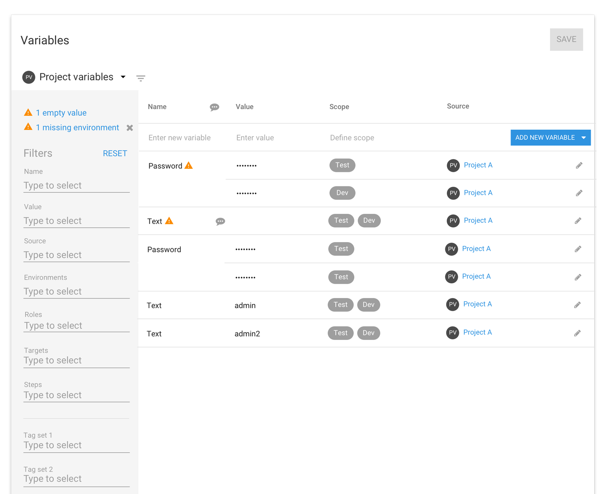
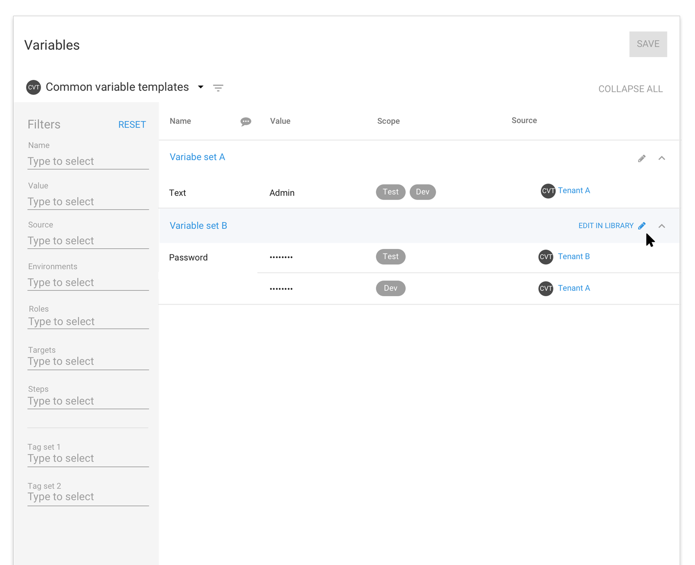
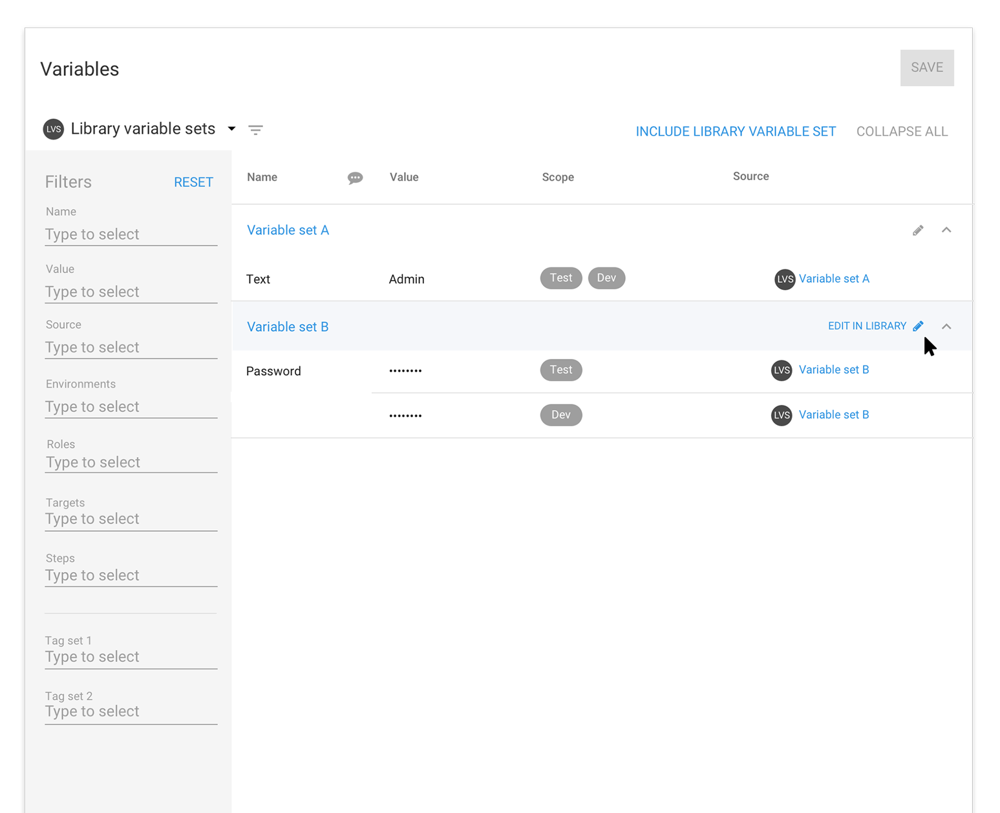
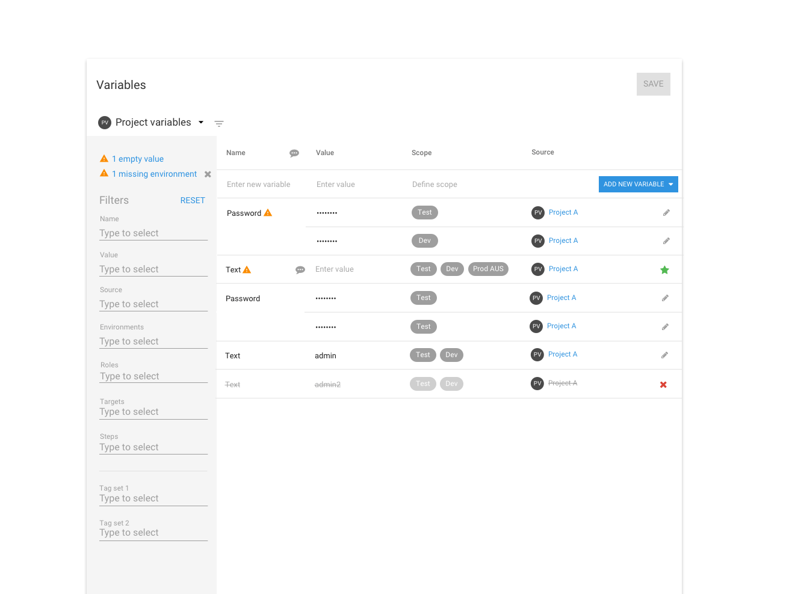
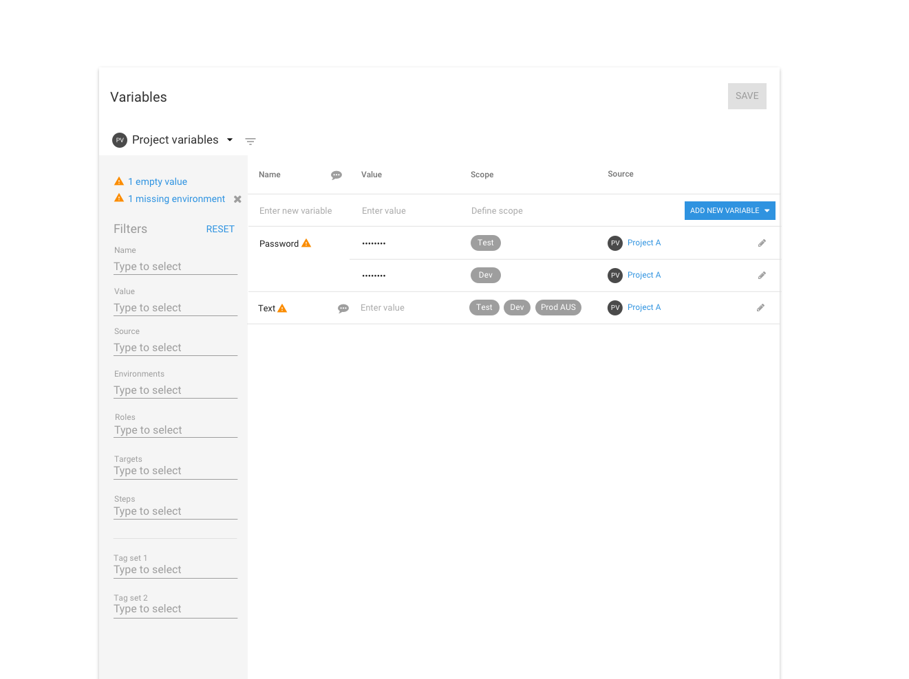
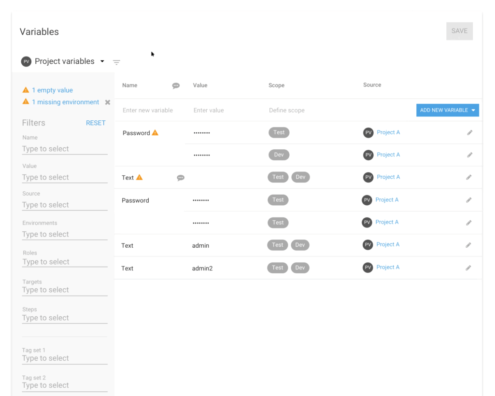
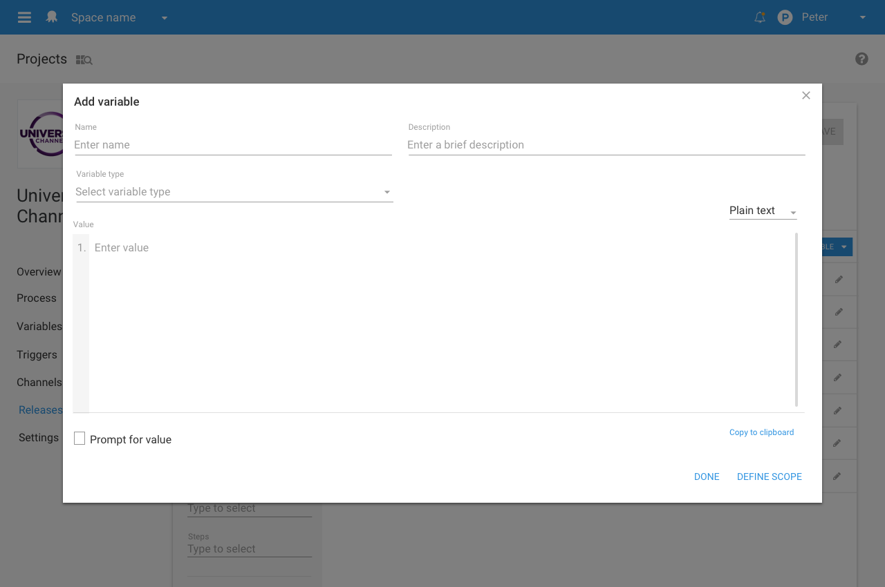
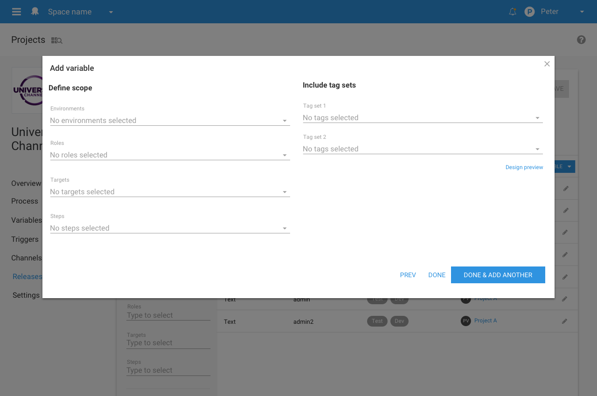

In the 4.0 release we plan to overhaul the variable editor. This has be one of our top <a href="https://octopusdeploy.uservoice.com/forums/170787-general/suggestions/7192251-improve-variables-ui" target="_blank">User Voice</a> suggestions and thank you to all our users who provided ideas on how to improve the variable editor.

Based on the feedback received our goal for the first release of the variable editor is to make a table editing experience work as expected with the inclusion of some new features:

- Provide multiple values with different scopes to one variable
- Add a description to a variable
- Ability to enter multiple values to a scope when adding a variable.

## User scenarios

We have focused on providing a solution for four user scenarios for the first release. These cover the common themes from the Octopus team and our users suggestions.

- A user is inputting hundreds of single text variables scoped to one or two environments. They need to do this quickly all by using the keyboard.

- A user has large amounts of code to add as a variable and needs to copy and paste it into a large text field. They have been asked to give each variable a description and scope it to tenant tag sets.

- A user has been given a list of usernames and passwords for each environment. Rather than adding each value one at a time and scoping them individually the user wants to be able to select the environment first and add multiple values to that environment.


- A user wants to see what values have been scoped to a particular scope configuration to see if there are any duplicates.

**Note** There were some great additional feature suggestions too. But we can’t include them all at once and see that the first release of the variable editor should focus on improving the basics and creating a solid platform for more advanced features.

## The new variable editor look

The variable editor will inherit the new 4.0 UI and maintain high-level concepts like switching between variable types, ability to filter, and view only library variable sets and common templates which are only editable in the Library.

Some new concepts introduced are the advanced filter and being able to filter by warning, and expanding panels so you can now see what variables belong to a variable set and what variable set common variable templates belong to.

#### Project variables

By default the project variables will be displayed first and the advanced filter will be open with the ability to be toggled off by the filter icon.

#### Project variable templates

Project variable templates can still be created and edited in the variable editor. This UI layout shows what the variable table would look like if the advanced filter was toggled off.

#### Common variable templates

Common variable templates are still edited in the Library but expanding panels let's you see what variable set it belongs to.

#### Library variable sets

Library variable sets include a list of the variables it includes which can still only be edited in the Library.

#### View all variables

When viewing all variables it is in view only mode. Source icons help distinguish between the variable types.

## Adding a new variable
The current variable editor table has the new variable row at the bottom of the table. Many users have can have lots of entries which cause this empty row to appear off the screen. We have moved the empty add row to the top of the table to make adding a variable quick and easy, no matter how many variables you have. You can click in the name cell to start adding a value or click the “Add new variable button” to create a new row. The video below shows a new variable being added.

## Adding multiple values to a scope

We are planning to include the ability to add multiple values to one scope. This action would appear as a dropdown on the add new variable button as “Add multiple values”. The adding experience would take place in the modal with the user defining the scope first.

## Table editing experience

Our goal for the new variable editor is for it to be a seamless table editing experience for users who input simple variables with minimal scope. We want to make sure a user can navigate the table by keyboard only, with the option to use the mouse.

The following are convention keyboard controls and shortcuts we are planning to use.

#### Keyboard control

<dl>
<dt>Tab </dt>
<dd>- Moves the cell focus through the row from left to right, top to bottom
- Moves the selector controls focus from top to bottom</dd>

<dt>Enter</dt>
<dd>- Adds another variable</dd>
<dd>- Performs the action of a selected button</dd>
<dd>- Selects item in dropdown list</dd>

<dt>Arrow up and down </dt>
<dd>- Moves the focus through a dropdown list</dd>
<dd>- Moves the focus from the form field to the Open editor link in the edit dialog</dd>
<dd>- Moves the focus of the rows in the variable table</dd>

<dt>esc</dt>
<dd>- collapses dropdown and puts cell in selected state</dd>
<dd>- exist edit/add mode if a cell is in a selected state</dd>
<dd>- Esc moves through the states until out of edit mode </dd>

<dt>Typing</dt>
<dd>Will activate any selectors/dropdowns</dd>

<dt>ctl+enter</dt>
<dd>selects multiple items in a drop down</dd>
</dl>

#### Shortcuts

<dl>
<dt>ctl+e</dt>
<dd>Opens editor modal</dd>

<dt>ctl+o</dt>
<dd>Creates a new variable</dd>
</dl>

## Row actions

Row actions will appear on hover as an overflow menu at the end of a row. This will replace the current right click function on the first cell.

## The modal editor

The modal editor is used to show advanced options and larger text fields for adding or editing variables. The modal editor can be opened at any time when editing an existing variable and there is the option to close the editor and keep entering data via the table. We want to make sure that if a user is only using the keyboard to enter variables that the modal was still accessible via a link and a keyboard shortcut (ctl+o). The same keyboard commands are used to navigate through the modal editor as the table.

The advanced settings in modal editor include:

- Description
- Large code editor
- Prompted value
- Tenant tag sets

## Performance

In 4.0 we are focusing on the ability to load lots of data quickly. This will greatly benefit users with many of variables and fast filtering.

## Feedback

We think what we have outlined above will improve the way we add variables and provide a better platform for us to add more advance features to the editor.

We would love to hear your feedback on our plans for the first release of the variable editor. Feel free to comment on the blog post here or leave detailed feedback on our Specs page **Include link**

