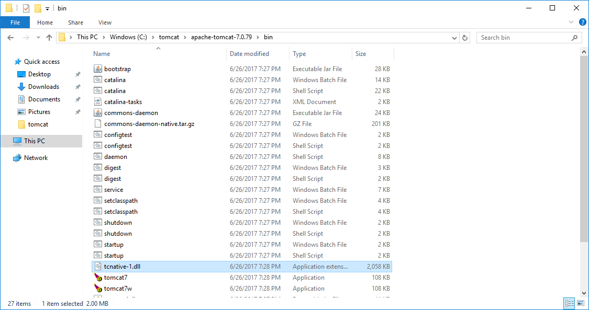
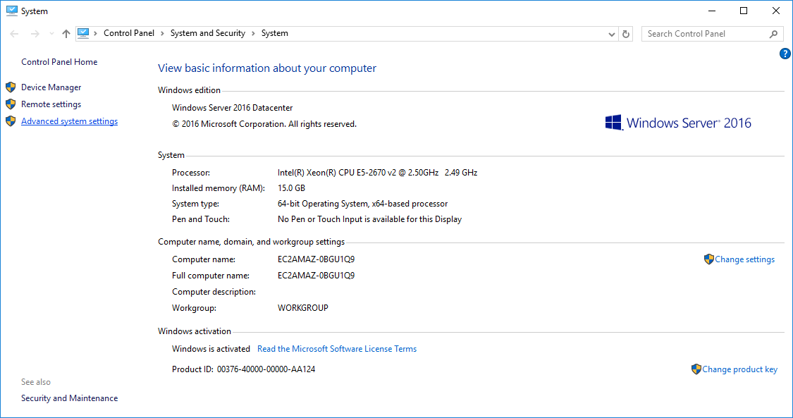
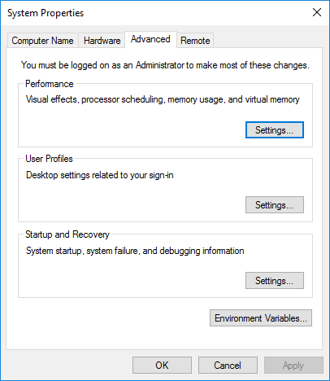
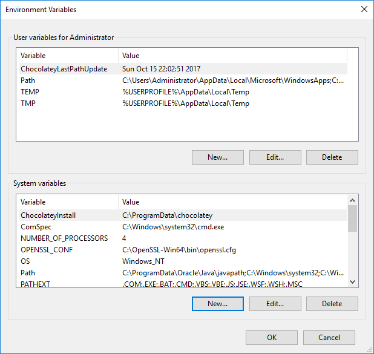
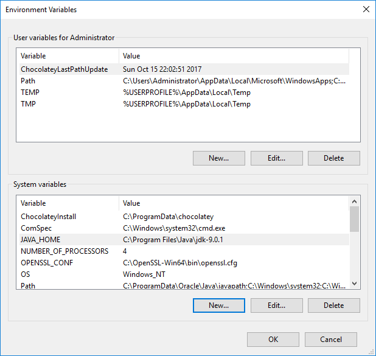
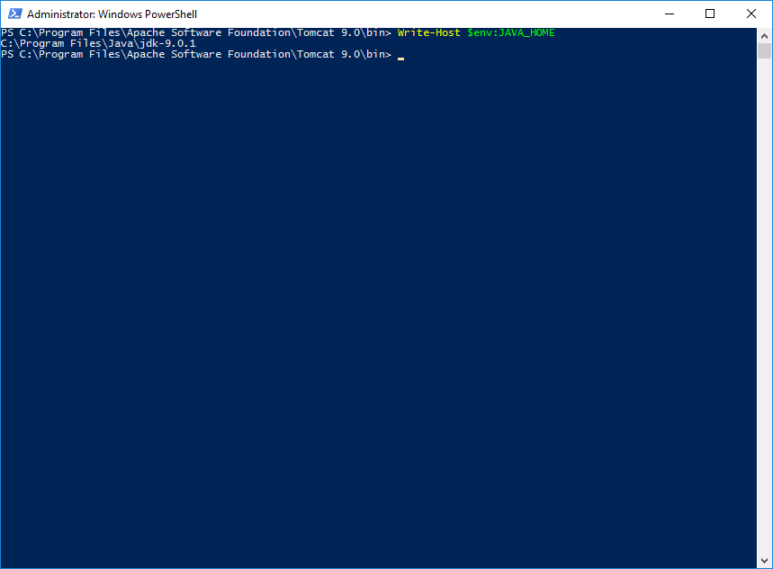
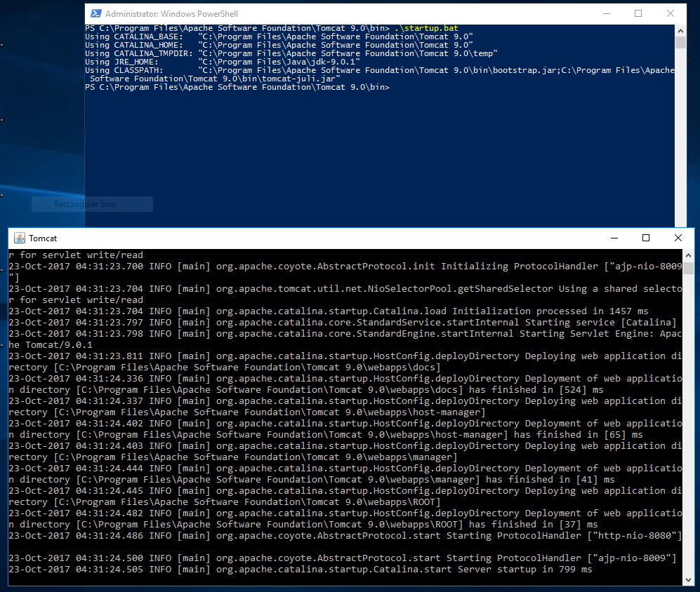
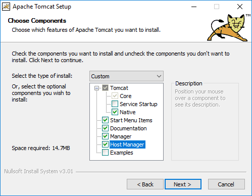
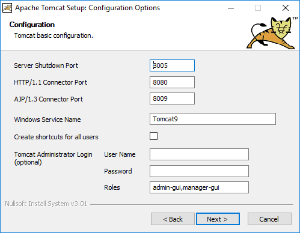
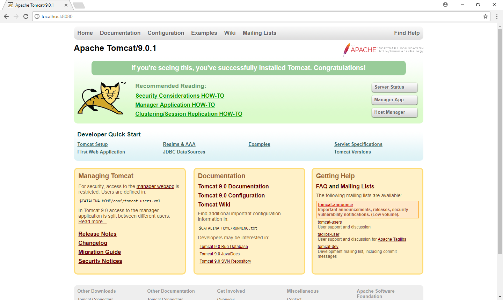

Tomcat is [the most popular Java web server available today](https://www.jetbrains.com/research/devecosystem-2017/java/), and is a solid choice for anyone looking to host their Java web applications.

One of the nice things about Tomcat is that it is quite easy to get started, often requiring little more than downloading and extracting the deployment archive. But there are a few steps that every Tomcat administrator should know to get the most out of their Tomcat installation.

In this blog post we'll walk through the process of setting up a Tomcat server.

## Install Java

Being a Java web server, Tomcat requires Java to be installed before it can be run.

[Tomcat 7 requires at least Java 6, Tomcat 8 requires Java 7, and Tomcat 9 requires Java 8](http://tomcat.apache.org/whichversion.html).

Keep in mind that you will need to install a version of Java that supports both Tomcat itself and the applications that Tomcat will host. If your applications are compiled for Java 8, then Tomcat will need to be run with Java 8 as well.

### JRE or JDK?

Java installations are provided either as the Java Runtime Environment (JRE) or the Java Development Kit (JDK).

The JRE provides all the functionality required to run Java applications, including Tomcat. The JDK provides the JRE, as well as some additional tools that developers use to compile and manage Java applications.

Tomcat will work with either the JRE or JDK. Typically the JDK is used by developers, and is a larger package, so if you are in doubt install the JRE.

### OpenJDK or Oracle JDK?

OpenJDK is an open source implementation of the Java platform. It is often included in Linux package managers with package names like `openjdk-8-jre` or `openjdk-8-jdk`.

OpenJDK is the name of the project, and while it includes the acronym "JDK" in its name, the OpenJDK project provides both a JRE and a JDK.

The Oracle JDK is an implementation of Java provided by Oracle. Typically you have to download and install the Oracle JDK manually from the [Oracle website](http://www.oracle.com/technetwork/java/javase/downloads/index.html).

Wether you use OpenJDK or Oracle JDK is a matter of personal choice. I'll use OpenJDK in Linux distributions because of the ease of installation using the package manager. In Windows or MacOS I'll install the Oracle JDK.

## Download Tomcat

Tomcat can be downloaded from [Apache Tomcat](https://tomcat.apache.org/index.html) homepage.

Tomcat can be downloaded as a zip, tar.gz, Windows zip or Windows exe.

At the time this blog post was written, Tomcat 8.5 was the latest official release, with Tomcat 9 being close to a final release. Tomcat 7 is still supported, and all previous versions are considered to be obsolete.

### Download Tomcat for Linux
If you are hosting Tomcat in Linux, then the tar.gz package are what you need. This is preferred over the zip package because the tar.gz format retains the executable flag on shell scripts.

If you download the zip package in Linux, you will need to manually set the executable flag on scripts like `bin/startup.sh` and `bin/shutdown.sh` with the command `chmod +x <scriptname>`.

### Download Tomcat for Windows
If you are running Tomcat in Windows then you can download any of the formats. However, I would recommend that Windows users download either the Windows zip or exe packages.

These packages include the `tcnative-1.dll` library, which is part of the [Tomcat Native](https://tomcat.apache.org/native-doc/) library. Tomcat Native is used to give Tomcat access to the [Apache Portable Runtime](https://apr.apache.org/) (APR). APR in turn is used for features like providing HTTPS via OpenSSL, which can provide much better performance than using the native Java HTTPS implementations (otherwise known as the JSSE implementation).

In addition, the Windows packages also include executables that are used to install Tomcat as a Windows service.



## Configuring the JAVA_HOME Environment Variable

The `JAVA_HOME` environment variable is used by Tomcat scripts to find the Java executable that will be used to launch the Tomcat web server.

### Configuring the JAVA_HOME Environment Variable in Windows

Windows defines environment variables in the system properties.

Open the `Advanced System Settings`.



Click the `Environment Variables` button.



Under `System Variables`, click the `New` button.



Enter `JAVA_HOME` as the `Variable name`, and enter the Java installation directory as the `Variable value`.


Click the `OK` button to save your changes.



Open up Powershell and type `Write-Host $env:JAVA_HOME` to see the value of the environment variable.

:::hint
For more information on how to use Powershell with PSDrives like `env`, check out [Learn How to Use the PowerShell Env: PSDrive](https://blogs.technet.microsoft.com/heyscriptingguy/2013/03/06/learn-how-to-use-the-powershell-env-psdrive/).
:::



### Configuring the JAVA_HOME Environment Variable in Linux

There are multiple ways to define environment variables in Linux. The most common is to add the environment variable to the `/etc/environment` file.

For example, you can configure the `JAVA_HOME` environment variable to reference the Oracle JRE 8 installation with the line:

```
JAVA_HOME="/usr/lib/jvm/java-8-oracle/jre"
```

:::hint
The location of the Java installation depends on the Linux distribution you are using, as well as the Java distribution. For example, if you installed Java using a package manager, you most likely installed OpenJDK. OpenJDK will be installed to a different directory than the Oracle JDK.
:::

## Manually Running Tomcat

To manually launch Tomcat, you will need to run the `bin\startup.bat` batch file for Windows, or the `bin/startup.sh` shell script for Linux.



## Installing Tomcat as a Service

Production Tomcat instances are typically started as service. This allows Tomcat to be started when the operating system boots, shutdown when the OS is shutdown, and managed with the service management tools built into the OS.

### Installing Tomcat as a Windows Service

The easiest way to install Tomcat as a Windows service is to run the `Windows Service Installer` exe, which is one of the Tomcat download package options. This installer provides a wizard that will configure Tomcat as a Windows service.





Alternatively you can use the `bin\service.bat` file to manually configure Tomcat as a Windows service. For example, running the command `service.bat install MyService` will configure Tomcat under a Windows service called `MyService`.

See this [documentation](https://tomcat.apache.org/tomcat-9.0-doc/windows-service-howto.html#Installing_services) for more information on manually configuring a Tomcat Windows service.

:::hint
The `service.bat` file that comes with the versions of Tomcat I tested didn't work well with the Java 9 JDK. I received the error `The JAVA_HOME environment variable is not defined correctly` when running `service.bat` against the Java 9 JDK.

This is because Java 9 has done away with the `jre` folder, but the `service.bat` batch file expects this folder to exist.

See [this StackOverflow answer](https://stackoverflow.com/a/46388190) for more details on the new folder structure in Java 9.

The workaround is to install the Java 8 JDK alongside Java 9 and override the `JAVA_HOME` environment variable while running `service.bat`, or to use the `Windows Service Installer` exe to create the service.
:::

### Installing Tomcat as a Linux Service

Unfortunately Tomcat does not provide service definition files for Linux operating systems. These service definition files differ depending on which Linux distribution you are running, and whether or not you are using init.d or systemd.

However, it is quite easy to provide your own services.

To start with I like to extract Tomcat into the `/opt` directory. The `/opt` directory ["is reserved for all the software and add-on packages that are not part of the default installation"](http://www.tldp.org/LDP/Linux-Filesystem-Hierarchy/html/opt.html), which describes our Tomcat installation nicely.

There are too many Linux distributions to provide service scripts for all of them. However I have provided a initd script that is based on examples I have found around the web.

The script assumes that a user called `tomcat` has been configured in Linux, and that Tomcat has been extracted into the `/opt/apache-tomcat-9` directory. You will need to tweak the script to match your local environment.

This file would be saved under `/etc/init.d/tomcat`. You will also need to ensure that the file is executable by running the command `chmod +x /etc/init.d/tomcat`. If your Linux OS uses systemd, then this legacy initd script can be enabled with the command `systemctl enable tomcat`.

```
#!/bin/bash
#
# chkconfig: 345 96 30
# description:  Start up the Tomcat servlet engine.
#
### BEGIN INIT INFO
# Provides:          tomcat
# Required-Start:    $local_fs $remote_fs $network
# Required-Stop:     $local_fs $remote_fs $network
# Should-Start:      $named
# Should-Stop:       $named
# Default-Start:     2 3 4 5
# Default-Stop:      0 1 6
# Short-Description: Start Tomcat.
# Description:       Start the Tomcat servlet engine.
### END INIT INFO

## run as a different user
TOMCAT_USER=tomcat

export CATALINA_HOME="/opt/apache-tomcat-9"

start() {
 echo "Starting Tomcat..."
 /bin/su -s /bin/bash ${TOMCAT_USER} -c $CATALINA_HOME/bin/startup.sh
}
stop() {
 echo "Stopping Tomcat..."
 /bin/su -s /bin/bash ${TOMCAT_USER} -c $CATALINA_HOME/bin/shutdown.sh
}
case $1 in
  start|stop) $1;;
  restart) stop; start;;
  *) echo "Usage : $0 <start|stop|restart>"; exit 1;;
esac

exit 0
```

## Configuring users

Tomcat comes with a number of administration tools built in. Links to these administration tools are provided as links called `Server Status`, `Manager App` and `Host Manager` on the default Tomcat welcome page. By default, the welcome page can be viewed at [http://localhost:8080](http://localhost:8080).



Before you can use these administration tools, you must first configure users within Tomcat.

Users are defined in the `conf/tomcat-users.xml` file.

Users are assigned to groups. Tomcat defines some standard groups which grant access to the administration tools. The `manager-gui` group is used to allow access to the browser based administration tools i.e. the tools you will access clicking the `Server Status`, `Manager App` and `Host Manager` links on the welcome page.

The following is an example of the `conf/tomcat-users.xml` file which defines a user called `tomcat` with a password of
`adminpass` which is assigned to the `manager-gui` role.

```xml
<tomcat-users xmlns:xsi="http://www.w3.org/2001/XMLSchema-instance"
              xmlns="http://tomcat.apache.org/xml"
              xsi:schemaLocation="http://tomcat.apache.org/xml tomcat-users.xsd"
              version="1.0">
    <role rolename="manager-gui"/>
    <user username="tomcat" password="adminpass" roles="manager-gui"/>
</tomcat-users>
```

When you attempt to open one of the administration tools, you will be prompted for a username and password. This prompt is where you would enter the `tomcat` username and `adminpass` prompt.

To learn more about the groups used by Tomcat to manage access to the administration tools, see the [Tomcat manager documentation](https://tomcat.apache.org/tomcat-9.0-doc/manager-howto.html#Configuring_Manager_Application_Access) under the heading "Configuring Manager Application Access".

## Conclusion

In this blog post we've looked at a number of decisions that need be made around what version of Java to run, how to configure Tomcat as a service, and how to add users to the stock Tomcat installation.

If you are interested in automating the deployment of your Java applications to Tomcat, [download a trail copy of Octopus Deploy](https://octopus.com/downloads), and take a look at [our documentation](https://octopus.com/docs/deploying-applications/deploy-java-applications).
