This post is a part of our Octopus 4.0 blog series.  Follow it on our [blog](https://octopus.com/blog) or our [twitter](https://twitter.com/octopusdeploy) feed.

---

## Octopus 4.0 UX and UI

We want Octopus to grow and become a robust industry-leading deployment tool, even more than it is today. But we recognize to give our users the best experience, we needed to rewrite and redesign to accommodate future growth and capabilities for new features. The new UI may be very different, but there are a lot of pages that haven’t had the layout or content changed so you should find most areas familiar.
The purpose of Octopus 4.0 UI was to update to a modern interface, reduce cognitive load for users, redesign to accommodate for growth and above all keep providing a great user experience.

### Modern UI

It was decided to use an existing CSS and pattern library so we could focus on building a great deployment tool experience. We really liked what Google's’ Material guidelines offered but were conscious not to lose some of the iconic Octopus styling, for example, the task details style. The Material-UI library had most of the patterns that were needed and we have adapted them to our own brand. By using an existing library, we utilize pre-existing patterns that most people already use so when you do upgrade to Octopus 4.0 it’s a familiar experience.

**Dashboard before**
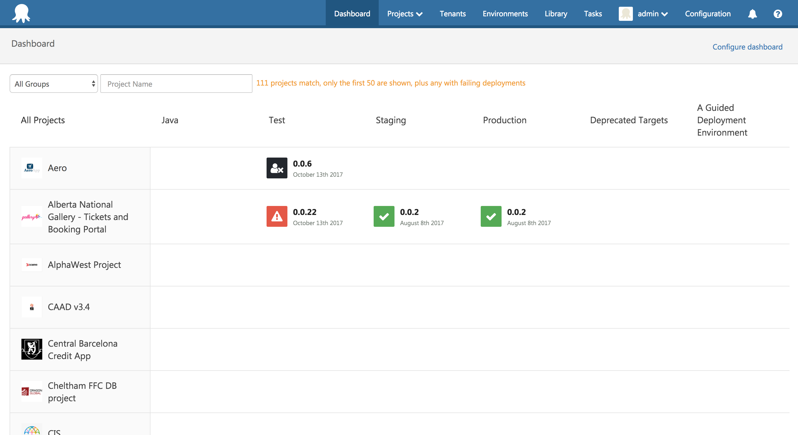

**Dashboard after**

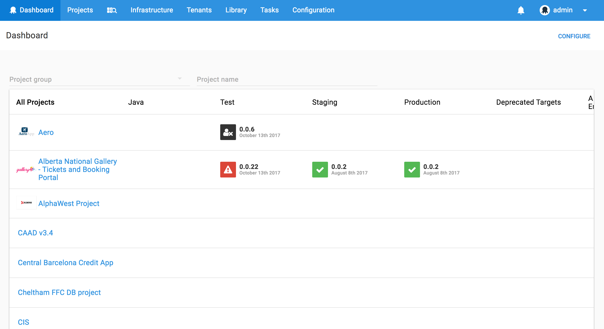

#### Reducing cognitive load

The goal for each page is to be intuitive, for a user to immediately know where they are, what to do, and how to do it. We recognized some pages were busy, with text explaining what each section was and buttons that looked the same. To reduce the amount of mental effort required we applied some simple design principles:
Hierarchy for focus and flow
Color, size, and position helped 4.0 achieve a level of hierarchy within the layout and components.

The button component uses color to determine primary actions, secondary actions, and ternary actions which usually appear inline. Any action that users don’t use often or we don’t want accidentally clicked is now in an overflow menu.

Using a page layout hierarchy allowed us to use patterns that helped visually represent a flow from high-level summary, detailed summary, to detailed data view. There were some cases where this didn’t work due to the purpose of the data, but most sections start with a card view and go to lists or table and then to forms and detailed data.

**Card view**

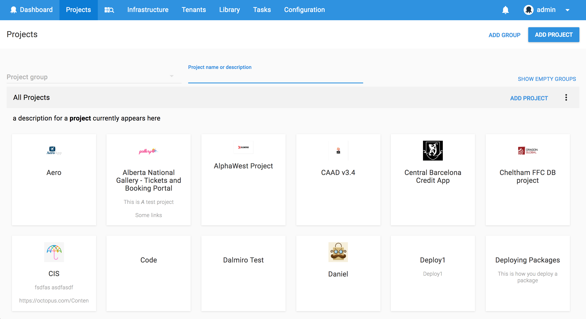

**List view**

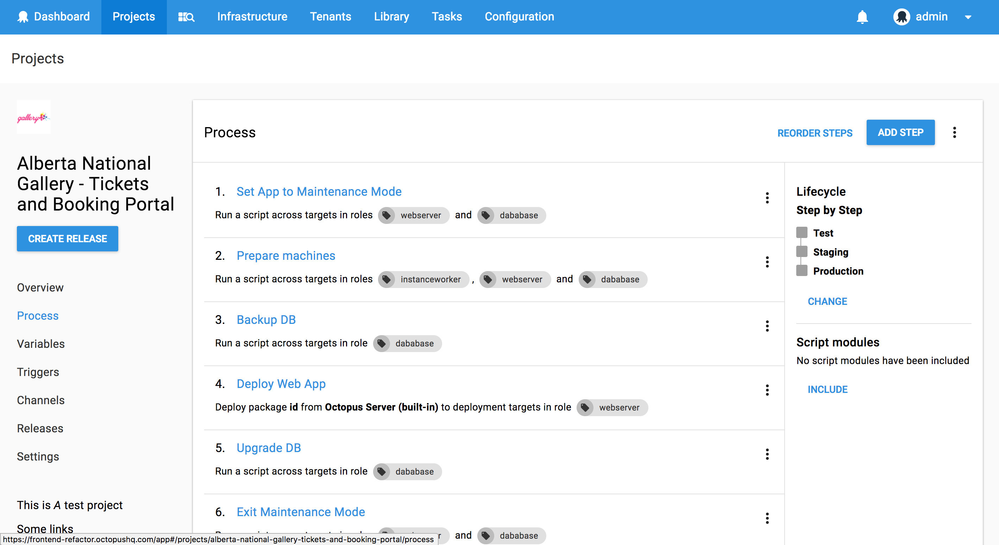

**Summary form view**

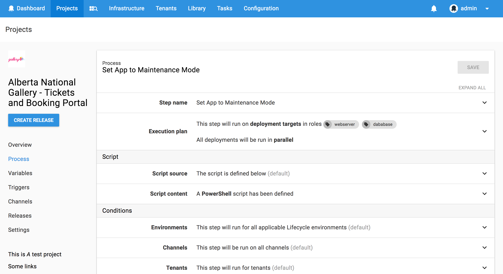

**Detailed form view**

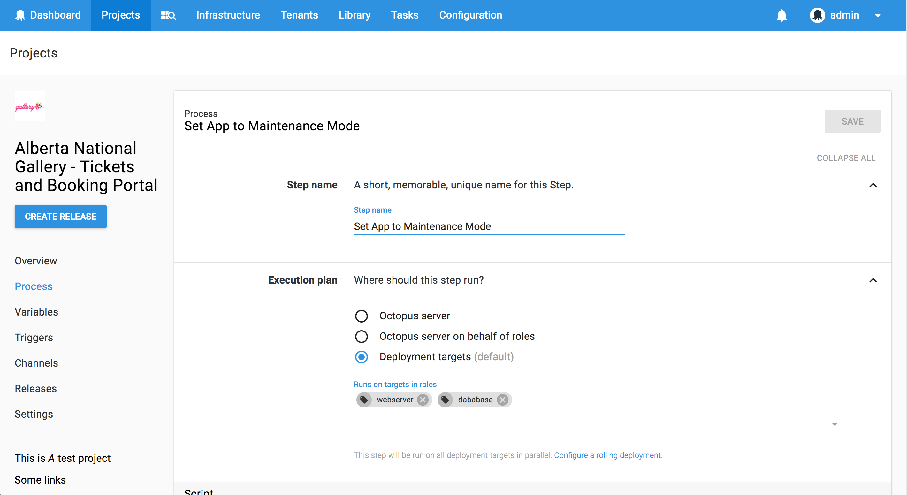

#### Keeping useful actions together

The interface was designed to have the action buttons positioned within the content area and visible at all times with a sticky section header. No more scrolling to get to the save button!
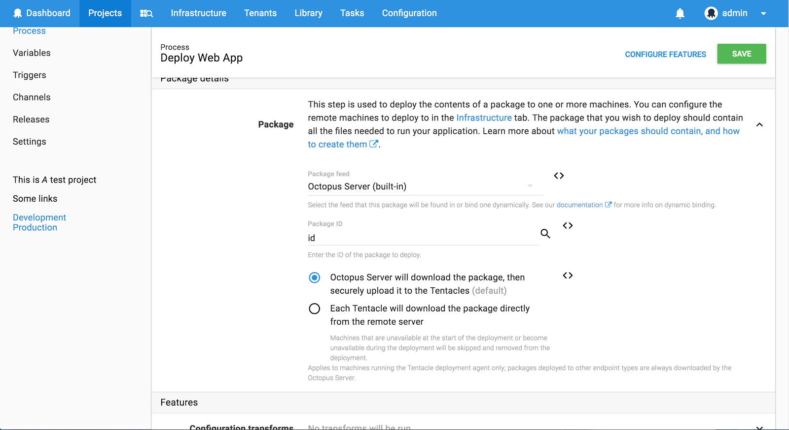

#### Consistency

By creating a design layout based on hierarchy and proximity, we immediately addressed the layout consistency issues. To make sure everyone was using the same components we developed a detailed style guide where our developers could easily find the right component.
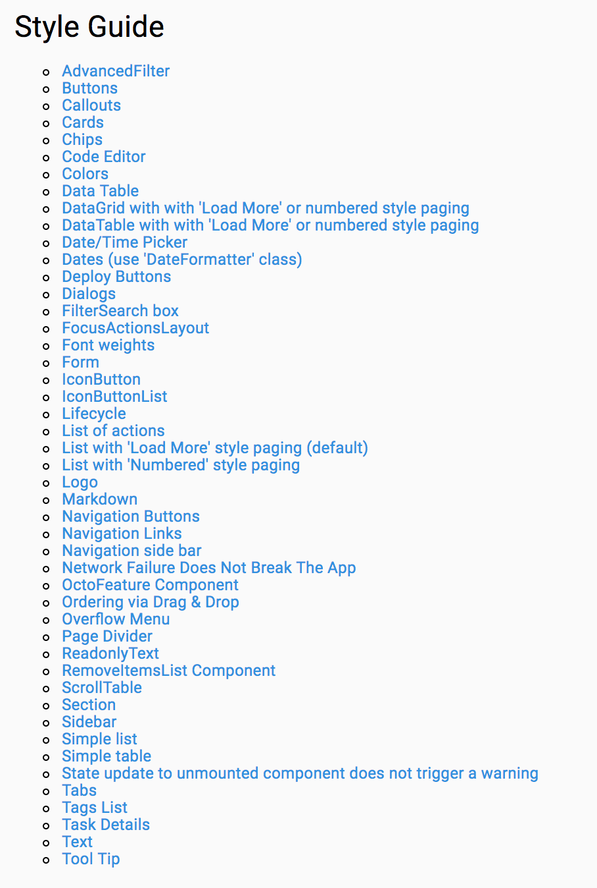

#### Summary views to provide clarity

One of the biggest changes in Octopus 4.0 UI is the expanding form sections. The expanding sections allow the interface to display a summary of the configuration of a step or project settings, without the noise of the other settings and as a result reducing the cognitive load for the user.

**Summary form view**

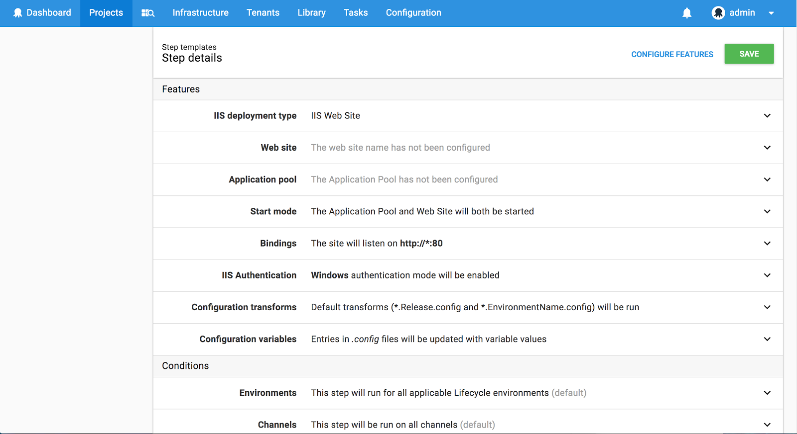

**Detailed form view**

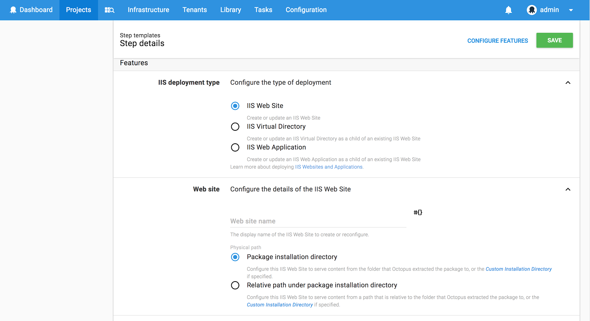

### Designing for scale

The previous Octopus UI didn’t display large amounts of data very well so Octopus 4.0 needed to make sure patterns, like the expanding panels and tables, were used to show as much data on the screen as possible. An area addressed for scale issues was the environments page and the introduction of the infrastructure overview page. An issue Octopus users face, with lots of data, is finding things. So to help we went a little crazy with filters, advanced filters, and pre-defined filters. I think we have some filters left to use ;)

**Environments page before**

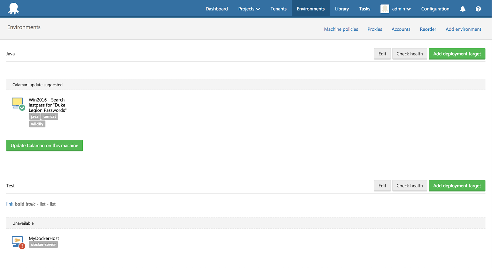

**Environments page after**

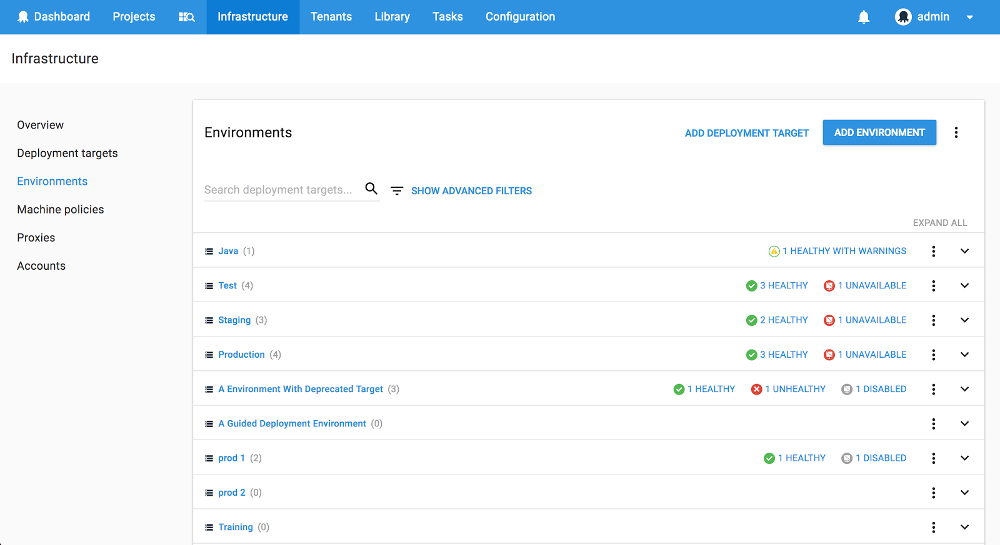

We understand that getting used to something new can be a challenge, but we believe our decision to redesign and restructure areas, like the variable editor and deployment page, has produced an awesome Octopus 4.0 release. This is thanks to the ongoing User Voice suggestions and most recently our users, who provided valuable feedback when testing Octopus 4.0 Alpha.
