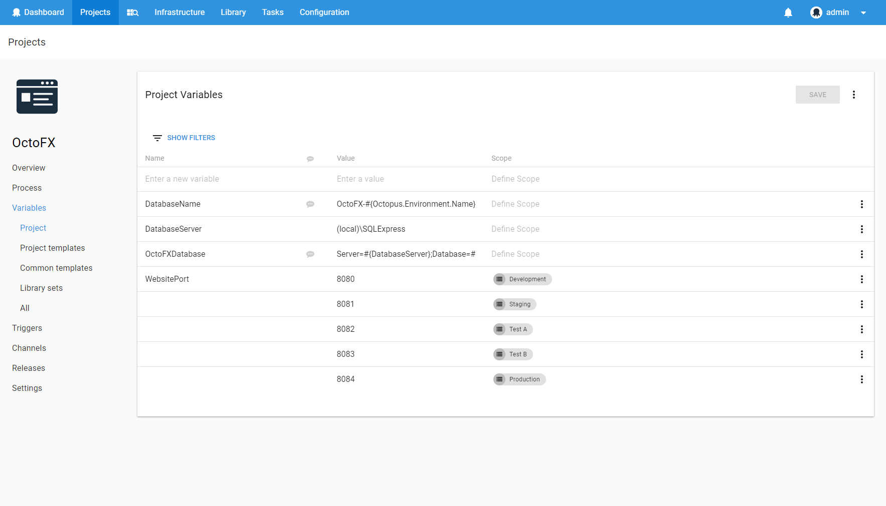
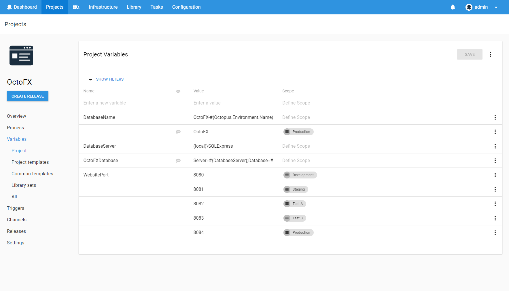
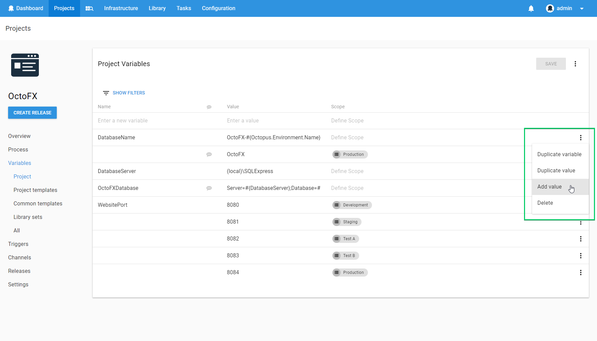
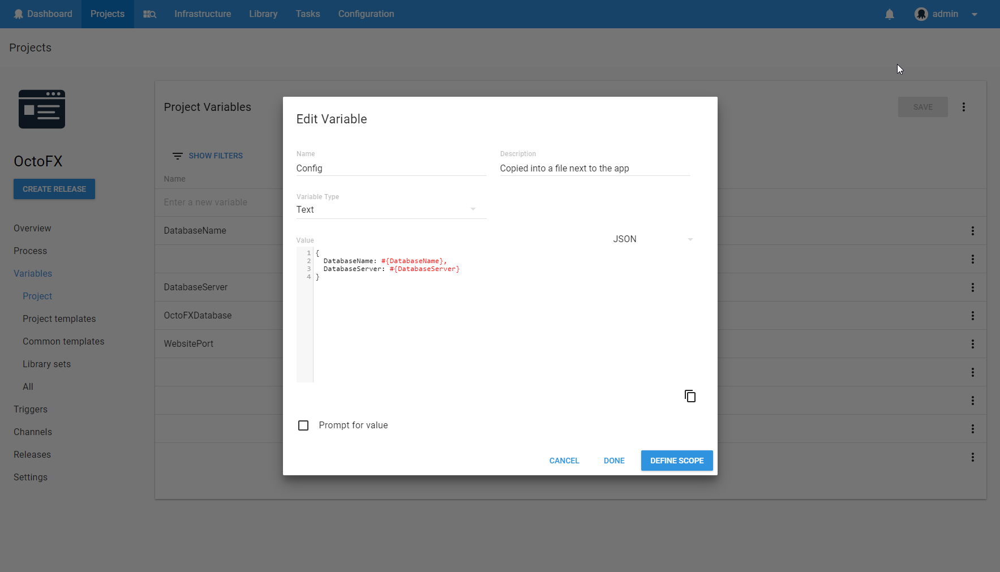
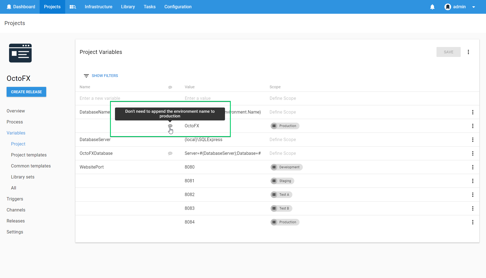
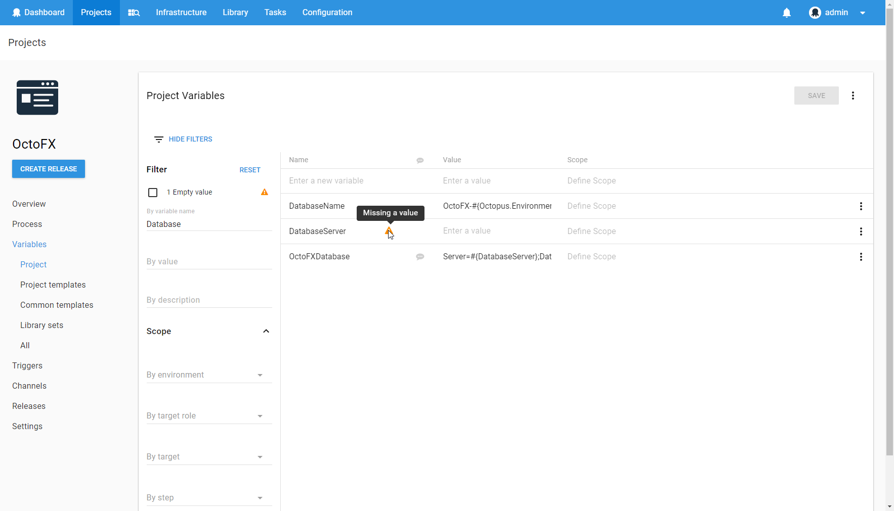

This post is a part of our Octopus 4.0 blog series. Follow it on our [blog](https://octopus.com/blog) or our [twitter](https://twitter.com/octopusdeploy) feed.

---

We previously released an [RFC](https://octopus.com/blog/variable-editor-update-rfc) on the redesign of the variable editor. This topic has generated a lot of interest, and it is our most popular suggestion on [User Voice](https://octopusdeploy.uservoice.com/forums/170787-general/suggestions/7192251-improve-variables-ui). 

The revamped variable editor will be released in our upcoming Octopus Deploy 4.0 release. Let's dive in to some of the changes we have made!

The variable editor has been built from the ground up using our new UI framework, based on React and Material Design. This fresh new look makes using the variable editor a very pleasant experience as well as giving it a consistent feel with the rest of the application.

**Variable groups**

The new variable editor forces users to think about variables a little bit differently when you are scoping variables. Instead of having multiple variables with the same name but different scopes, you now have a single variable with multiple values for different scopes. Conceptually, this is more closely aligned with how variables are used and means you always see your variables grouped appropriately in the UI. It also means we can provide some useful features, such as only needing to rename a variable once instead of multiple times for each value.

You can see in this example that all of the values for both `DatabaseName` and `WebsitePort` have been grouped together, allowing you to easily view and edit them together.

**Additional actions**

Just like the rest of the 4.0 UI, when there are extra contextual actions available they are shown in an overflow menu. There is an overflow menu button at the right side of each row in the variable editor. This allows to you perform more specific actions like duplicate, delete, or add a new value to an existing variable.

**Popup dialog**

Sometimes you need a bit more space to edit a variable and this is where the variable popup dialog comes into play. It is particularly useful if your variable is a script or contains a lot of data. It uses our code editor, which gives you syntax highlighting for the language that you have selected. The dialog also gives you an opportunity to perform some advanced variable setup, such as configuring prompted variables.

**Description**

Sometimes you want to annotate a variable with some extra information. Maybe this is a description of how the variable is used in the deployment process, or perhaps it is an explanation of why a particular value has been used. We now have a handy description on each variable. Simply hover over the description icon next to the variable name to view its description. You can edit the description in the variable popup dialog.

**Filtering**

We have also made significant changes to variable filtering. Filtering did exist in the version 3 and earlier variable editor, but it was not very discoverable and a lot of users did not even know that it existed! It is more prominent in the new variable editor and allows you to filter your variables in even more ways. For example, you can chose to only show variables that do not yet have a value.

**Keyboard**

A lot of users like to stay on the keyboard when editing variables. For this first release, we have focused on the tabbing experience. You can easily tab around the variable editor and change the name, value or scope of any of your variables without touching your mouse! Of course, if you prefer to use your mouse, that works well too.

Here is an example of adding a new variable with multiple values without leaving the keyboard.

**Performance**

Some users have very large variable sets, so we have made sure that the variable editor remains snappy under these conditions. Using React has helped us a lot here, as react has some useful strategies for optimising rendering performance. In addition, we have utilized UI virtualization techniques to only render the variables that are currently visible on screen. We believe that even our biggest customers should be pleased with the performance of the new variable editor.

**Feedback**

Thanks to everyone that has provided suggestions and feedback. Unfortunately, we could not address all of these issues in the first release of the variable editor. Instead, we have focused on making a solid foundation on which we can easily iterate and improve upon in upcoming releases of Octopus.

We look forward to getting this in your hands to see what you think!

