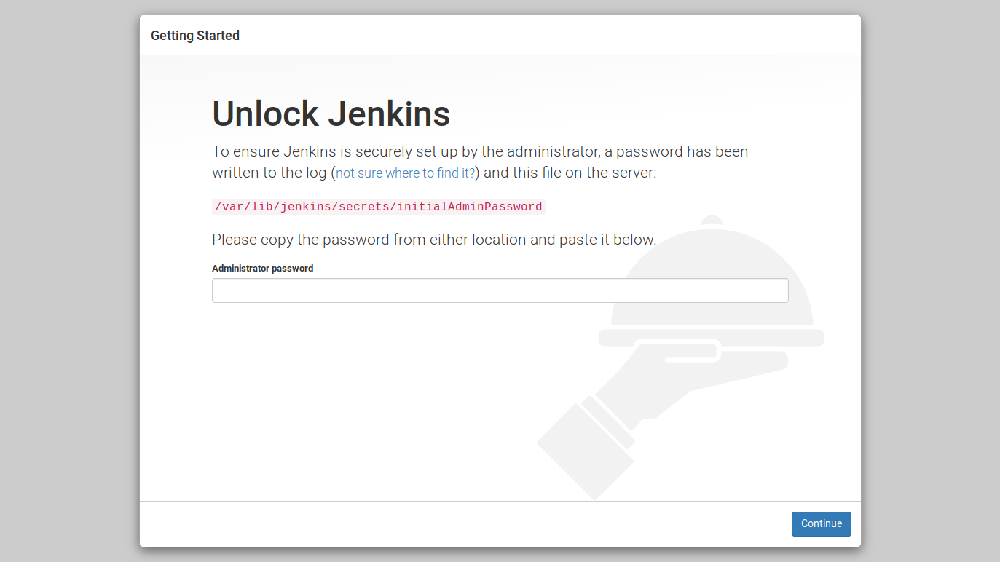
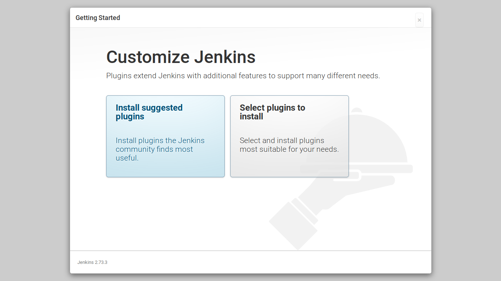
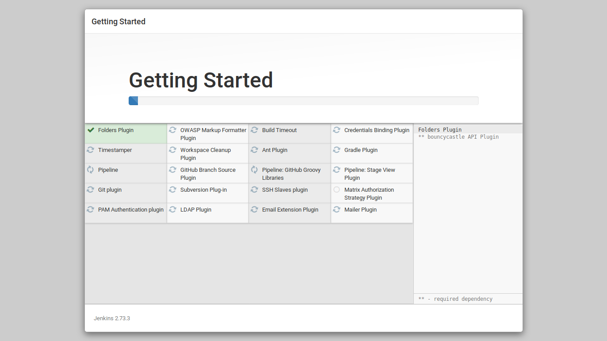
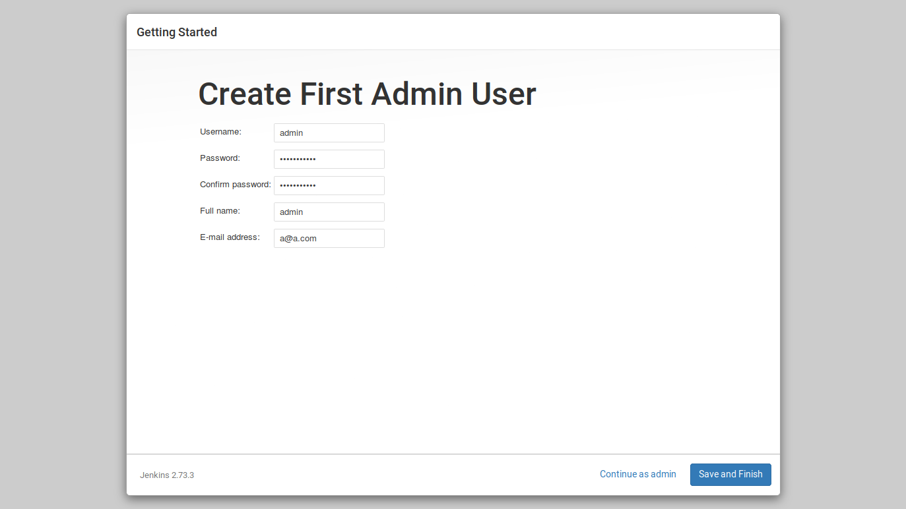
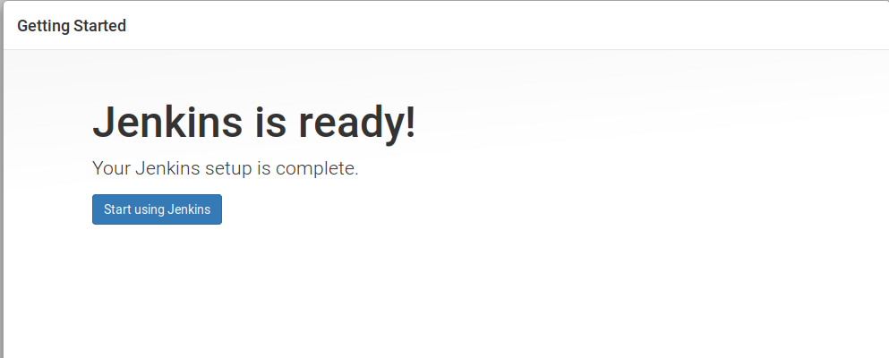
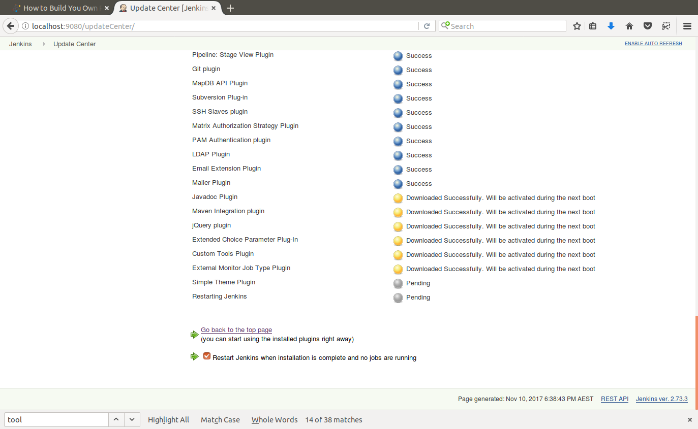
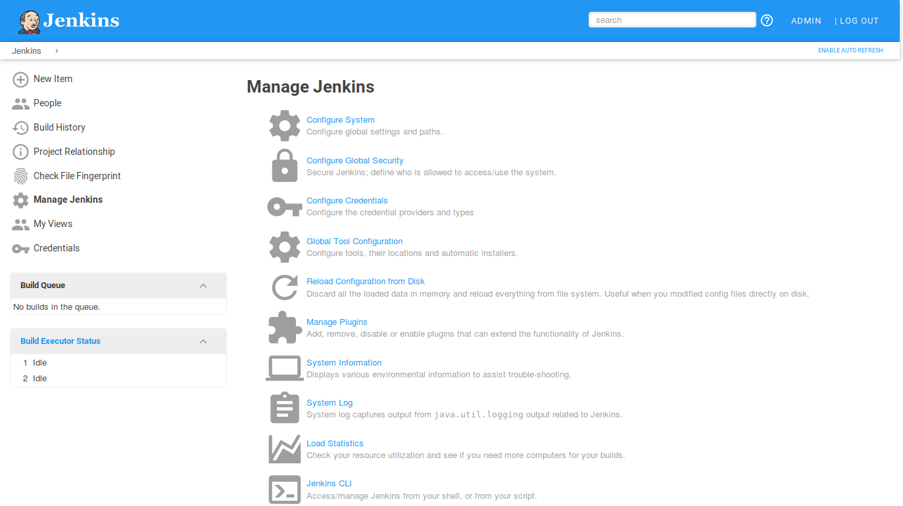
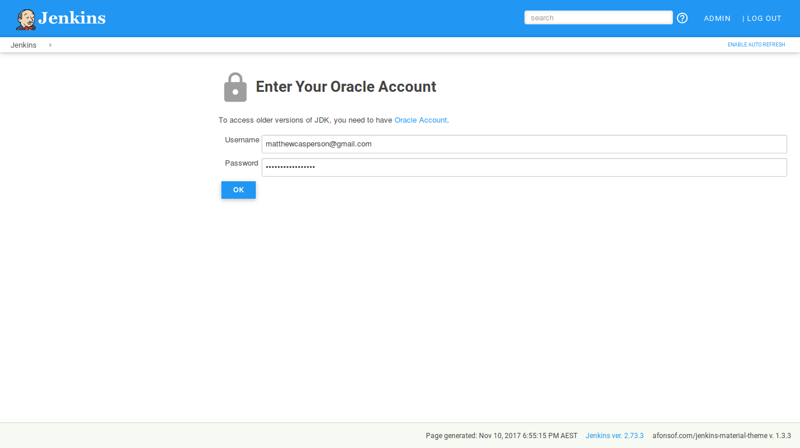
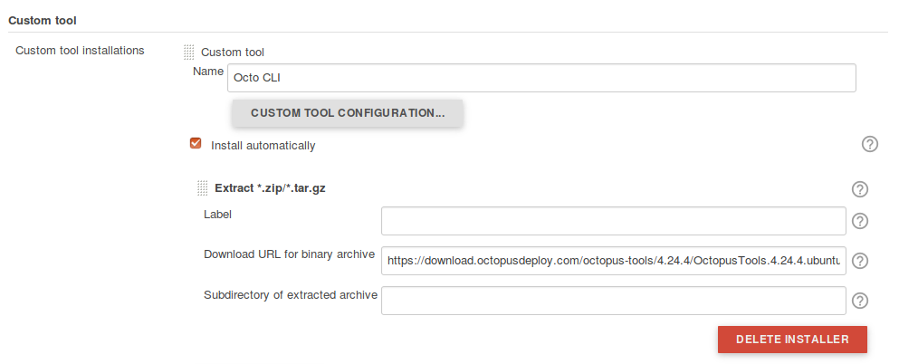
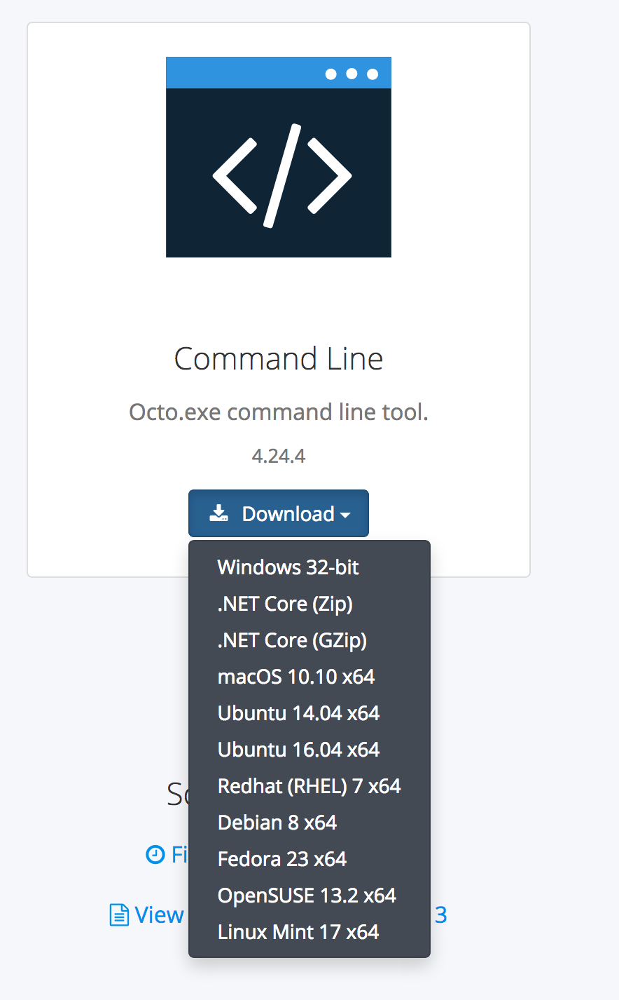

In the [2017 JetBrains developer ecosystem survey](https://www.jetbrains.com/research/devecosystem-2017/team-tools/) Jenkins topped the list of CI systems. With a wealth of plugins and a huge user base, Jenkins is a powerful solution for building your software projects, and in this blog post we'll take a look at how to get a basic Jenkins instance up and running.

## Installing Linux Tools

To start, I have a fresh install of Ubuntu 17.10.

We need to install a bunch of handy tools that don’t come with the standard Ubuntu installation. Only `git` and `openjdk-8-jdk` are required for Jenkins, but I use the other tools commonly enough to warrant installing them as a matter of course.

```
sudo apt-get install htop vim iftop git openssh-server openjdk-8-jdk
```

## Installing Jenkins

To install Jenkins, we’ll use the custom repo documented [here](https://pkg.jenkins.io/debian-stable/).

```
wget -q -O - https://pkg.jenkins.io/debian-stable/jenkins.io.key | sudo apt-key add -
deb https://pkg.jenkins.io/debian-stable binary/
sudo apt-get update
sudo apt-get install jenkins
```

## Initial Jenkins Configuration

Open up http://localhost:8080 in your web browser. You’ll see a message from Jenkins asking you to enter a password found in the file `/var/lib/jenkins/secrets/initialAdminPassword`.



You’ll then be prompted for the plugins that you want to install. At this point, I install the suggested plugins. We’ll add some more later.



Give Jenkins a few minutes to install the suggested plugins.



Create your first admin user.



And you’re done!



## Installing Additional Plugins

We'll need some additional plugins to allow us to build a Maven project and deploy it with Octopus.

Click {{Manage Jenkins>Manage}} Plugins.

Click the `Available` tab.

Tick the following plugins:

* [Maven Integration Plugin](https://wiki.jenkins.io/display/JENKINS/Maven+Project+Plugin)
* [Simple Theme Plugin](https://wiki.jenkins.io/display/JENKINS/Simple+Theme+Plugin)
* [Custom Tools Plugin](https://wiki.jenkins.io/display/JENKINS/Custom+Tools+Plugin)

Click `Download now and install after restart`.

Tick the `Restart Jenkins when installation is complete and no jobs are running` option.

After Jenkins restarts, you’ll have all the plugins you’ll need.



## Applying a Custom Jenkins Theme

The Simple Theme Plugin we installed earlier allows us to modernize the look of Jenkins with a single CSS file.

Click {{Manage Jenkins>Configure System}}, and under the `Theme` section add the URL `http://afonsof.com/jenkins-material-theme/dist/material-<color>.css` to the `URL of theme CSS` field. You can find a list of colors on the [Jenkins Material Themes website](http://afonsof.com/jenkins-material-theme/) to replace the <color> marker with. I went with blue, so the URL I entered was `http://afonsof.com/jenkins-material-theme/dist/material-blue.css`


I think you'll agree that these themes greatly improve the appearance of Jenkins.



## Preparing Jenkins

We need to configure a number of tools that we’ll make use of when building our projects. In particular, we want to add a Maven installation to use in our builds, a Java installation to run Maven, and an Octopus CLI custom tool for pushing and deploying files.

I find it easier to let Jenkins download and install these tools for me, which can be configured under {{`Manage Jenkins`>`Global Tool Configuration`}}.

### Configuring Java

We need a copy of Java in order to build our application. Under the `JDK` section click the `ADD JDK` button.


Give the tool a name (I went with `Java 9`) and select the version of the JDK to install.

:::hint
We'll refer to the name of these tools in the [next blog post](/blog/2017-11/deploying-to-octopus-from-jenkins.md) where we build and deploy a Java app using a Jenkinsfile.
:::


Enter in your Oracle credentials, which are required to download the JDK.



### Configuring Maven

Our Java project will be configured to use Maven, so we need an instance of Maven available to complete the build. Under the `Maven` section click the `ADD MAVEN` button.


Give the tool a name, and select the latest version of Maven.


### Configuring the Octopus CLI

Although the Octopus CLI tool is not available natively in Jenkins, the [Custom Tools Plugin](https://wiki.jenkins.io/display/JENKINS/Custom+Tools+Plugin) we installed does allow us to expose the CLI as a Jenkins tool quite easily.

Under the `Custom Tools` section, create a new tool called `Octo CLI` and enter the URL to the Ubuntu CLI in the `Download URL for binary archive` field.

:::hint
Make sure you leave the `Label` field blank.
:::



You can get the download link for Octo CLI from the [Octopus download page](https://octopus.com/downloads).



:::hint
Although the latest version of Ubuntu supported by the Octo CLI is 16.04, I had no trouble pushing packages and creating releases with it in Ubuntu 17.10.
:::

## Conclusion

At this point we have a basic installation of Jenkins configured with all the tools we will need to build a deploy a Java application.

In the [next blog post](/blog/2017-11/deploying-to-octopus-from-jenkins.md) we'll look at how to use [Jenkins Pipelines](https://jenkins.io/doc/book/pipeline/) to configure a Java application to be built and pushed to Octopus.

If you are interested in automating the deployment of your Java applications, [download a trial copy of Octopus Deploy](https://octopus.com/downloads), and take a look at [our documentation](https://octopus.com/docs/deploying-applications/deploy-java-applications).
