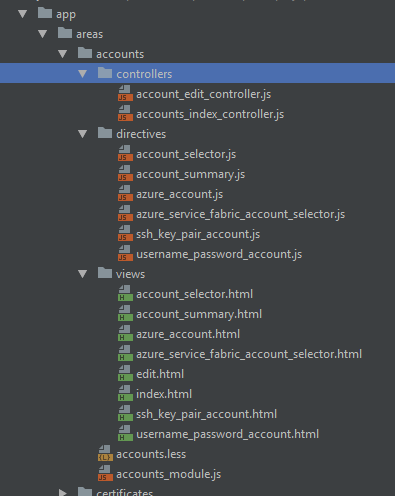
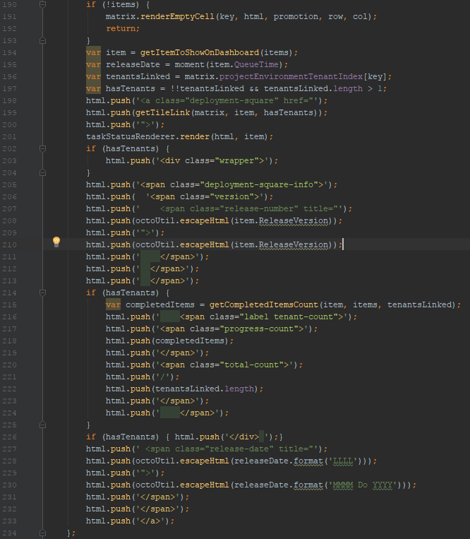
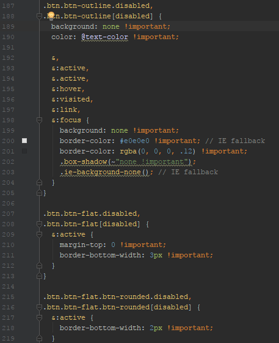

As part of our big portal overhaul in Octopus 4.0, we made the move from Angular to React. A lot of users have asked us for details on why we moved, so this post aims to go over some key points about the transition with some choices we made along the way.

## Decision Points ##
### A Maturing Codebase ###
The front end code base that lives inside the `3.x` versions of Octopus Deploy started it's life back in our [`2.0` move to Angular](https://octopus.com/blog/2.0). In 2013 Angular 1.2 was all the rage, dependencies were managed with bower, built with gulp and [Thrift Shop](https://www.youtube.com/watch?v=QK8mJJJvaes) was killing it on the airwaves. Since this initial release, the portal has been upgraded many times however it had still started to feel the strain of a product that had grown immensely, both in terms of functionality and number of active developers. Going from a team of 3 during the initial development of Octopus Web Portal `2.0`, the active number of developers working with this code base is now 23. As of the current `3.17` version of Octopus Deploy, the old web portal concatenated into `application.js` contains almost 1000 files covering over 40K lines of code (excluding 3rd party libraries and CSS).

Managing a small code base with 3 developers is much simpler than a large one with over 20 different people and like any code base, the existing architecture had become bloated, inconsistent and outdated. It roughly followed the old approach to structuring "mvc-like" applications with a directory for the controllers, one for the views and a separate one for the directives

This obviously falls apart fairly quickly once you have more than a couple of UI elements, who's constituent parts become split up over several directories. Though there is a more reasonable pattern to co-locate files that make up a single component, in our existing app the old pattern reigns supreme. Maybe manageable back when Octopus had a simpler feature offering, but not so much now that there is so much more to support and control from the front-end. With structural issues like these have no one to blame but ourselves, but there are always problems like this that grow out of an evolving codebase which needs the occasional pruning. In our case the garden has become overrun, and its time to consider slashing it right back and planting again.

### Performance Considerations ###
Scale had also become a concern as larger and larger customers began to notice performance issues in the portal when dealing with thousands upon thousands of machines, projects or steps and a large part of this is due to how Angular (pre 2.0) handles and renders state. As an experiment we ended up replacing some parts of our Angular code with small islands of React, hoping to leverage the benefits of a virtual dom, and removal of digest cycles. The results were clear. Rendering a screen of a few thousand tenants went from 20 seconds in Angular, to 2 seconds in React. While part of this may have been due to a much needed cleanup of our existing Angular code, it did show that some real improvements could be made if we rethought our existing codebase.

Here's a pop quiz. What does the following code look like?

No it's not an example of how to build a dynamic website pre JQuery days, it's the best way we found to get around Angular performance issues with rendering the project dashboard screen. When there are 1000's of deployment items that come back from the api call, which itself is updated every few seconds this can create quite noticeable issue and the quickest way to get it to the screen was to just build a html string in memory and push it to the DOM. Needless to say moving to React gave quite comparable performance results. The added cost of working with the Virtual DOM is largely offset by avoiding re-rendering large parts of the screen that don't even change. As you can imagine these parts of the codebase, while rare, got very little love and attention.

### CSS ###
Originally, Octopus 2.0 was written with Bootstrap 2.3.2 base with custom Octopus CSS layered on top (and at times, even inside the bootstrap styles!). In `3.0` a new custom design was added to the mix, right in between an updated version Bootstrap and the custom Octopus styles. Like adding a new 2nd floor to a building, sure its doable but there are going to be a lot of pipes and wires that need to line up _just right_. On top of all that were additional styles provided for various components like [Angular UI](https://angular-ui.github.io/bootstrap/), [select2](https://select2.org/) etc. That is more than 3 different design structures interacting with (and against) each other. I'm not going to add the [Family Guy CSS GIF](https://imgur.com/gallery/Q3cUg29) that im sure we have all seen, but just say that the emergence of `!important` all through your css is usually a sign that something is wrong. Our build process even needed to split up the concatenated css files in order to get around IE's limitation on a [maximum of 4095 rules per stylesheet!](https://blogs.msdn.microsoft.com/ieinternals/2011/05/14/stylesheet-limits-in-internet-explorer/) With the goal to provide a [fresh new design](/blog/2017-10/octopus-v4-uxui.md) to improve useability, a full site-wide rebuild felt like in many ways the most reasonable solution.

These styles must be really important! (Ok, this is a particular bad example)

## Still... why React? ##
With the Angular 1.4 version of our portal clearly outgrowing itself it was decided that to better scale for the future, both in terms of ease of development and performance for the end user, rebuilding the front end was critical. Going from Angular 1.x to 2.0 would be seen as almost a full rewrite so what better opportunity to evaluate what other options were available.

React had already displayed itself to be a clear contender. Buy utilizing the Virtual DOM (not to be confused with the [Shadow DOM](https://developer.mozilla.org/en-US/docs/Web/Web_Components/Shadow_DOM), a browser native feature) React is able to reduce document rendering to only those instances where something has changed. When dealing with thousands machines as some of our users do, any improvement to the UI is noticeable. The observer pattern as provided with Angular through the digest cycle only exacerbates the problem. Comparing the state of all our components after any change just proved to be far too expensive.

Ultimately no-one develops in a vacuum (and by "vacuum" I mean an environment that lacks StackOverflow as opposed to air) so the community engagement was a critical factor in our decision. The React ecosystem comes with a huge community of active contributors which in comparison with Angular 2.0, React won hands down. React has grown from just a simple front-end website framework, and is now available as a tool for building "native" browser apps (used in our mini IOS app [OctoWatch](https://itunes.apple.com/us/app/octowatch/id1232940032?mt=8)) or server-side rendering of websites.

All being said, React came down as the winner for our particular case although that's not to say that for some of you out there Angular isn't the best approach.

## A New Hope ##
Having picked React as the core engine underlying the new portal, lets take a look at how we ended up using it to build the brand new portal.

### No Redux ###
There appears to be a bit of an assumption through parts of the community that you can't build a React app without managing all your state in Redux. Dan Abramov, one of the authors of Redux said it best in his blogpost ["You might not need Redux"](https://medium.com/@dan_abramov/you-might-not-need-redux-be46360cf367)

> ... if you’re just learning React, don’t make Redux your first choice.
Instead learn to think in React. Come back to Redux if you find a real need for it, or if you want to try something new. But approach it with caution, just like you do with any highly opinionated tool.

and later in response to a [twitter thread](https://twitter.com/dan_abramov/status/725089243836588032?lang=en).

With our initial attempts at building the portal we started with the intention to use Redux as much as possible to maintain state across the project. Our apprehension started when we saw the amount of boiler plate required to perform the most mundane tasks. Our further concern was around the idea of storing so much data into a single, static (for all intents & purposes) state. The data for some of our users with huge deployment dashboards can be several megabytes in size. Ensuring that this state is cleaned  appropriately involves dispatching events at the right time during the component life cycle however this feels like a leaky abstraction (and a manual garbage collection act), requiring the components to know something about the storage mechanism in order to tell it when data needs to be cleaned and when it can be left. Ultimately the context of this data only makes sense on the dashboard component.

Knowing the right place in the object graph also requires knowing something about the context of the application as a whole. When I retrieve the `Project` resource, should I put it just on the root level at "Project"? What about if another component suddenly needs another project for a different purpose, or if we decide that there could now be multiple Projects loaded concurrently for different parts of the screen? These questions all have answers in the form of conventions, rules or libraries, but their presence gave us pause for thought as for what we were doing with Redux in the first place.

We responded by stripping back our usage of Redux and _only using them where the component-level state mechanism no longer made sense or was impractical_. Yes the sub heading is a bit of click bait, we still use Redux, however we only bring in state on a case-by-case bases when it is needed. Parts of our app that need to communicate or deal with non-localized state makes sense to live in the non-localized state management that Redux provides. For example where we want the page title and sidebar to display the Project name, which itself might need update in response to someone updating it's value down deep in the component tree. Contrary to some initial concerns, we found this to be no worse off a development and debugging experience than what the "whole app state in Redux" approach purports to be. The only downside is that this can make testing that little bit more complex since the data isn't injected through Redux but loaded by the component itself during the `componentDidMount` life cycle phase.

The key lesson for this is to understand your problems and limitations before looking for a solution, and to use that solution only where it makes sense, not just because everyone else is doing it.

Dave Ceddia summed it up in ["What Does Redux Do"](https://daveceddia.com/what-does-redux-do/)  by saying
> But this thing here, “plug any data into any component,” is the main event. If you don’t need that, you probably don’t need Redux.

### Javascript With Types ###

As someone who started building websites back in the day when Notepad.exe was the best IDE around, the first time TypeScript (TS) was proposed to me in a previous project I was an unabashedly against the idea. "External typing frameworks will only make it brittle and add overhead! Why would you want to lose some of the power of Javascript by statically typing it anyway? No-body puts baby in a corner!" Having introduced TS from the start of this new Octopus 4.0 project I can say that I am however, now a convert.

We found that in porting over some old code to the new portal, introducing TS actually exposed some bugs and incorrect assumptions that the code was making which we wouldn't have discovered otherwise. TS is just a superset of JavaScript so you can just convert your `.js` files to `.ts`, and slowly use it where appropriate. We added [tslint](https://palantir.github.io/tslint/) at the same time to help maintain some semblance of consistency across the project. The easiest thing is to start with a relaxed set of rules and tighten the screws by progressively enabling more as you feel up to the task of dealing with the wrath of the rest of the developers.

TypeScript might not be for everyone, but from my experience being able to confidently reason about what is being passed into your functions or components, saves an immense amount of time when refactoring or trying to work with another developer's code. It may be feasible to go without some sort of typing system when there is only 1 or 2 developers on a JS project but when you have over 20, working across hundreds of files, that's when it really starts to speak for itself (and I have even found myself using it on my own personal projects). As a replacement for Babel it allows us to write JavaScript that pollyfills features in older browsers using a soon-to-be-standardized native syntax and minor issues dealing with 3rd party library typings were able to be overcome with little effort. On the contrary I found TS was able increase productivity as compared with other projects of this size by eliminating some of the need to test minor things, like checks for input handling in functions that would previously ensure valid types are passed in (I said we were able to get by with _less_ tests, don't quote me as saying _none_). Sometimes the compiler would pick up silly enough mistakes like property capitalization that may have otherwise gone unnoticed.

In addition, and I can't state this highly enough,
> TypeScript reduced the amount of time needed to deconstruct and follow the call stack in my head, of code written by other developers. This it did with much better accuracy.

## What are your experiences? ##
We are lucky enough that our customers are basically just like ourselves. We speak the same language and tend to seek the same goals. While this means that we can use our experience in the software industry to build a product that _we_ would love to use, it also means that the experiences of our users can teach us a thing or two. Let us know if you have made the move to or away from React. What did you find the be the biggest lessons or pitfalls to watch out for?
