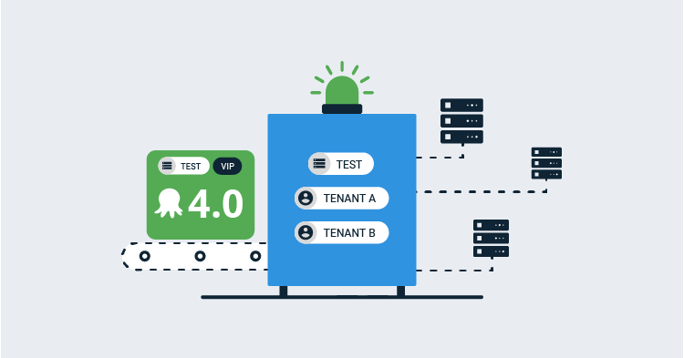
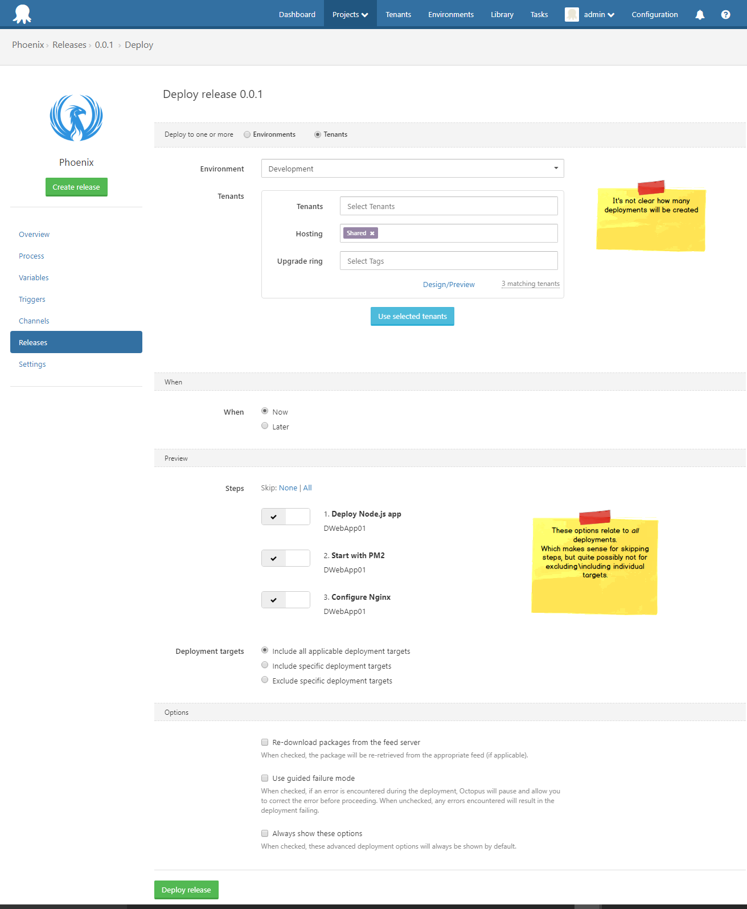
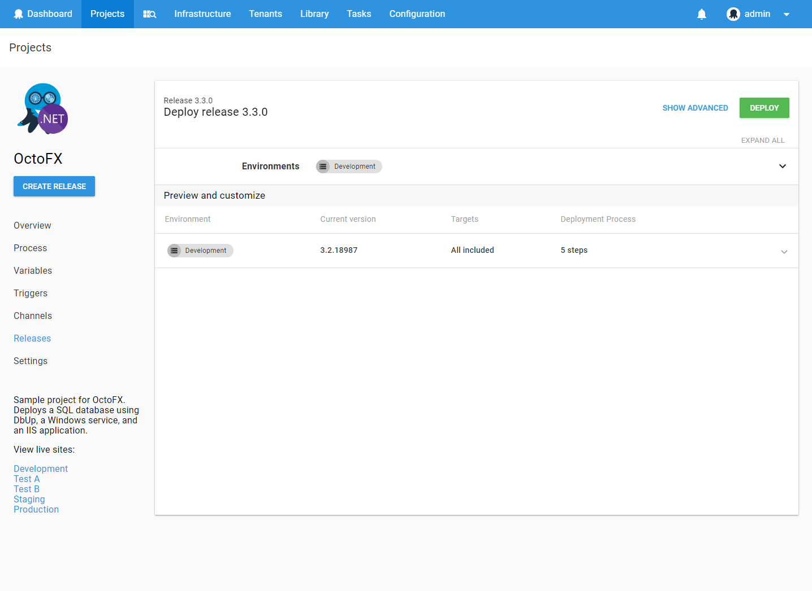
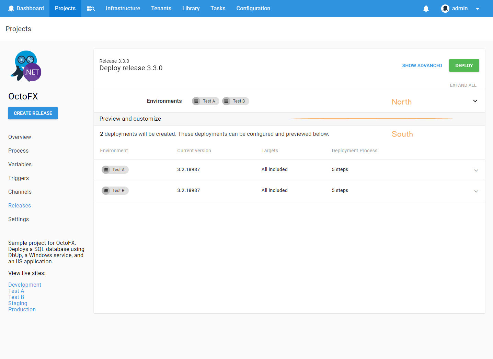
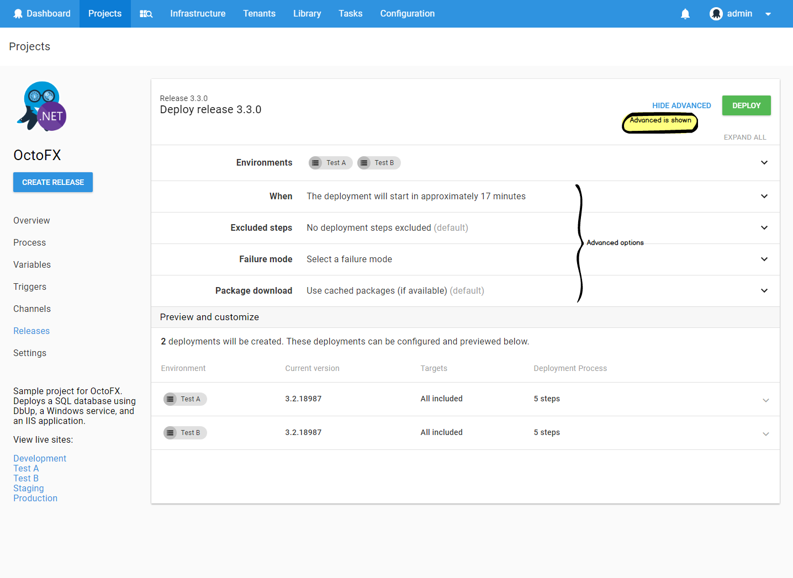
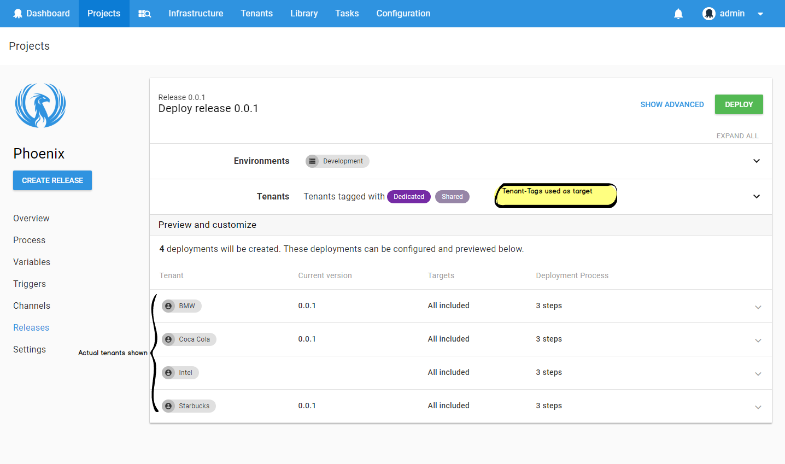
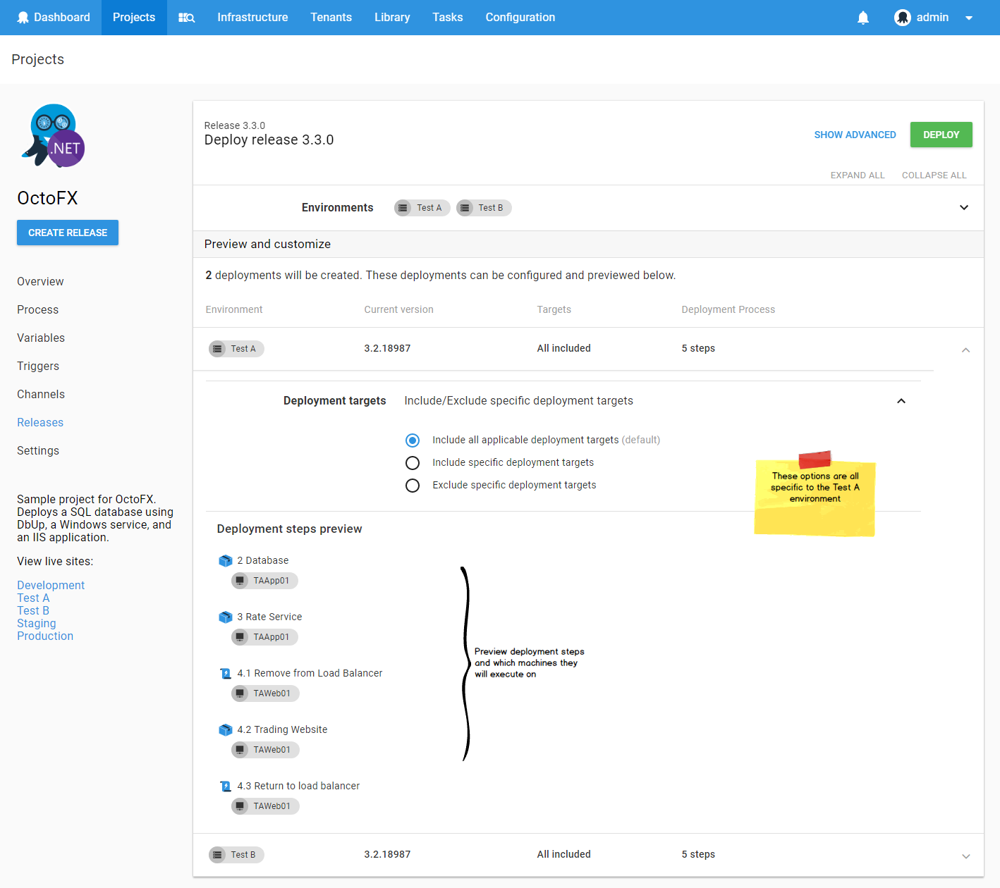
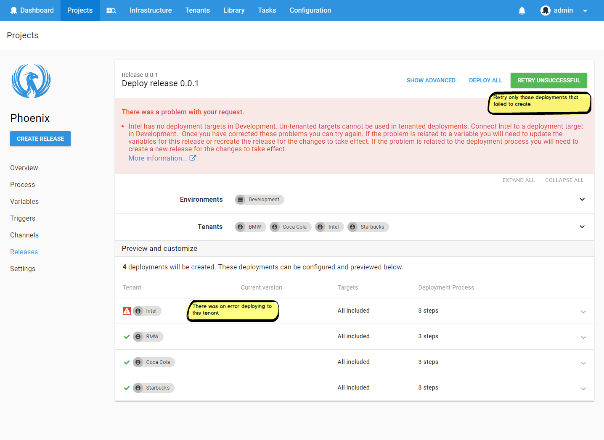

This post is a part of our Octopus 4.0 blog series. Follow it on our [blog](https://octopus.com/blog) or our [twitter](https://twitter.com/octopusdeploy) feed.

**Octopus Deploy 4.0 has shipped! Read the [blog post](/blog/2017-11/octopus-release-4-0.md) and [download](https://octopus.com/downloads) it today!**

---

While working on the UI-refresh for Octopus 4.0, many pages were essentially a direct port to the new look-and-feel.    
But there were a few where we took the opportunity to re-think the design. 

One of these was the page to deploy a release.

The existing page was originally created to deploy a release to a single environment.   
It was later extended to allow deploying to multiple environments.  Then the multi-tenancy feature came along, and we bolted on the ability to create deployments for one or more tenants. 

If we're honest, it was overdue for a re-design.

## Introducing the new Deploy Release page

The most significant changes are seen when deploying a release to multiple environments or tenants. 

We conceptually split the page into two sections: the **North** and the **South** (OK, perhaps some of us were watching too much Game of Thrones at the time).

In the image below, the _Preview and Customize_ separator forms the Equator.

- The North is where you select _where_ the release will be deployed (Environments and Tenants). It also allows you to configure some options which apply to _all_ the deployments that will be created.

- The South displays the deployments that will be created, and provides the ability for additional _per-deployment_ configuration.

### North

In the North, you select the environments and tenants (if it is a multi-tenant project) you wish to deploy to.

The _Show Advanced_ button reveals additional options, such as:

- Scheduling the deployments for a future time  
- Excluding steps from the deployment

### South

The South section hopefully clearly shows the deployments which will be created. This was something the existing design did not communicate effectively.

This becomes particularly important when using a complex tenant-tag expression in the North.  In this case, the South will evaluate the tag expression and display exactly which tenanted deployments will be created.

Expanding a deployment allows you to preview which deployment steps will be executed, and on which targets. 

You can also include\exclude specific deployment targets here.   

### When it's not rainbows and lollipops 

Sometimes creating a deployment fails.  
You may not have any matching targets in an environment, or you may be missing a required variable.

#### The old 

When deploying to many environments or tenants, and some deployments were successfully created while others failed, this left the user in an akward position. After resolving the errors, the deployment options needed to be reconfigured to ensure that the successfully created deployments were not redeployed. 

#### The new

In the new version we have provided a _Retry Unsuccessful_ button.  

For example, in the image below, the deployment to the _Intel_ tenant failed to be created.  Clicking _Retry Unsuccessful_ will re-attempt for only that tenant (there is also a _Deploy All_ button).   

## Tell us what you think 

We always love your feedback. 

Please tell us what you think about the new design.  We'd especially love for you to leave a comment if you had issues with the previous version.  Did we address them? 

Happy Deployments!   
_(Hopefully created via Octopus v4)_
