## Download Tomcat 9

For this demo we'll use Tomcat 9 on Windows 2016. You can download Tomcat 9 from [here](https://tomcat.apache.org/download-90.cgi). Grab the Windows installer, as this is the easiest way to configure Tomcat as a Windows service.

By default Tomcat 9 will install to `C:\Program Files\Apache Software Foundation\Tomcat 9.0`. This directory is referred to as `CATALINA_HOME` in later steps.

## Download Octopus Deploy 4.1

Grab a copy of Octopus Deploy 4.1 from the [downloads page](https://octopus.com/downloads). Version 4.1 has includes a number of new steps and features for integrating with Maven repos and deploying certificates. You can find more information on installing Octopus from the [documentation](https://octopus.com/docs/installation).

:::hint
Octopus 4.1 is currently in beta, so if it is not available from the downloads page now, it will be soon. Watch this space!
:::

## Configure Maven Central as an External Feed

Maven central is the default repository for Maven builds, and is where most public Maven artifacts are eventually deployed. It can be found at [https://repo.maven.apache.org/maven2/](https://repo.maven.apache.org/maven2/). We'll add this repository as an external feed called `Maven Central` in Octopus to allow us to consume its artifacts in a deployment process.

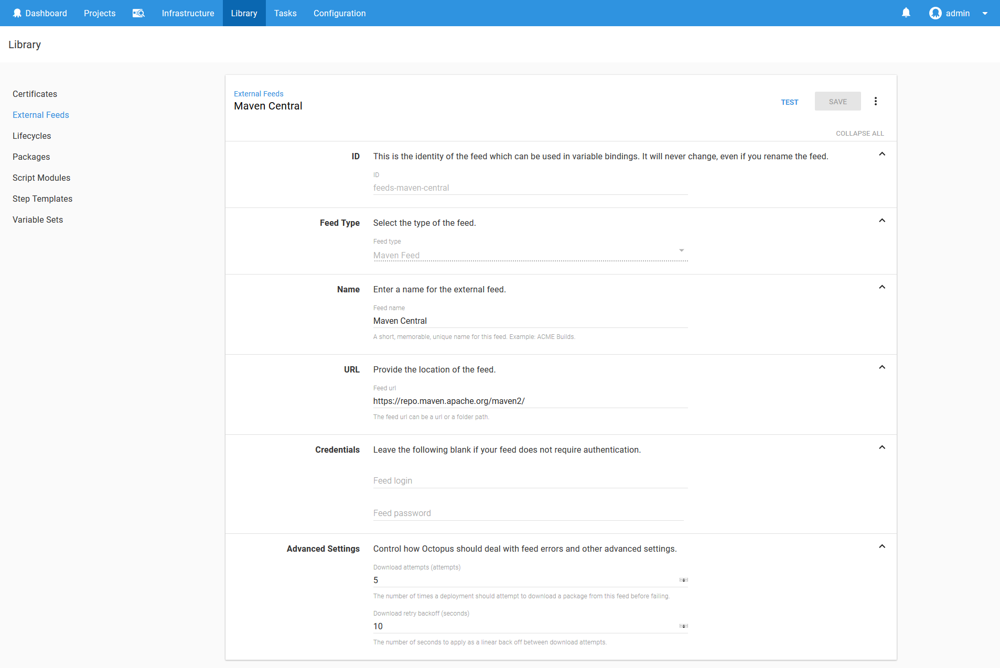

:::hint
When configuring external Maven repositories, we need to link to the repository itself and not the services that are used to search the repositories. For example URLs like [https://search.maven.org/](https://search.maven.org/) or [https://mvnrepository.com/](https://mvnrepository.com/) can't be entered because these are sites for searching the repositories, and not the repositories themselves.
:::

## Adding a Certificate

Run the following commands to generate a self signed ECDSA certificate.

```
openssl ecparam -genkey -out ecdsa.key -name prime256v1
openssl req -x509 -new -key ecdsa.key -out ecdsa.crt
openssl pkcs12 -export -out ecdsa.pfx -inkey ecdsa.key -in ecdsa.crt
```

Then upload the PFX file to Octopus.

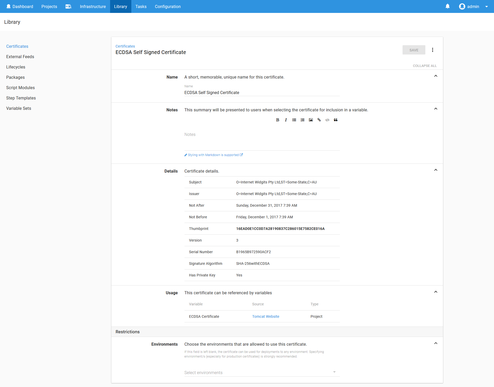

Read the blog post [Mixing Keys in Tomcat](https://octopus.com/blog/mixing-keys-in-tomcat) for more information on how these keys work in Tomcat.


## Creating the Deployment Project

Create a new project in Octopus, and add the `Deploy to Tomcat via Manager` step.

In this step we'll be deploying the `com.github.gwtmaterialdesign:gwt-material-demo` WAR file. This web application is a demo of the [GWT Material](https://github.com/GwtMaterialDesign/gwt-material) project, which has conveniently published a sample application as a WAR file into the central Maven repository. We'll take advantage of this to demonstrate how web applications hosted in a Maven repository can be deployed directly to Tomcat.

Set the `Context path` to `/demoapp`. This is the path that we will use to open the application on Tomcat.

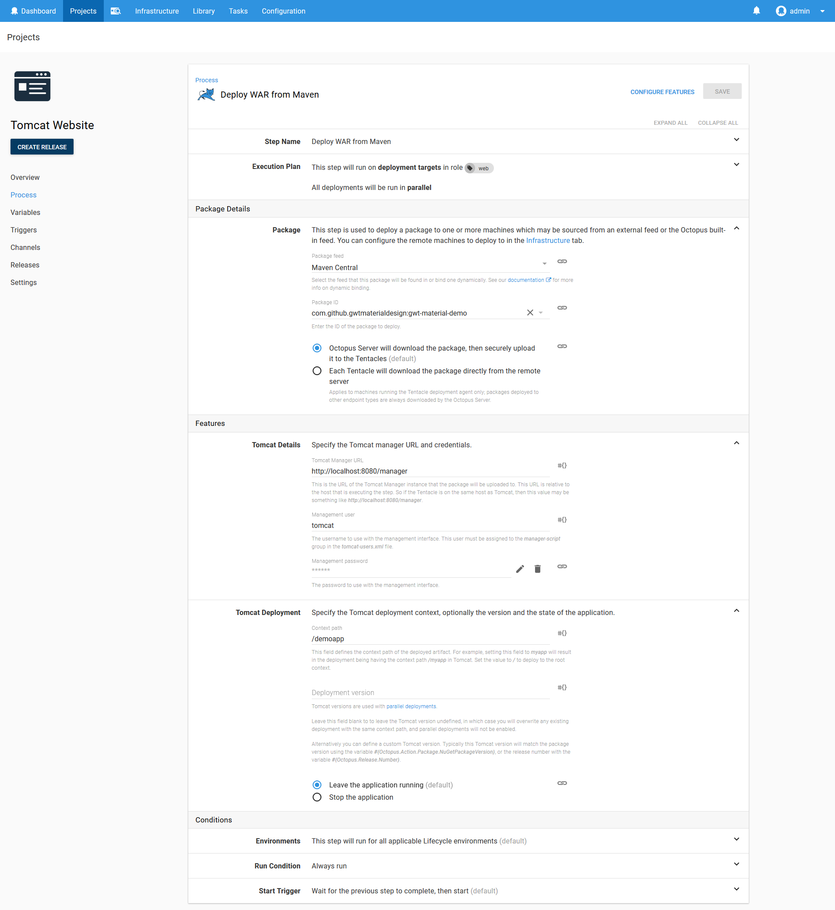

## Deploy the Certificate

Create a variable to reference the ECDSA certificate that was created earlier. We'll need to use this variable in the certificate deployment step.

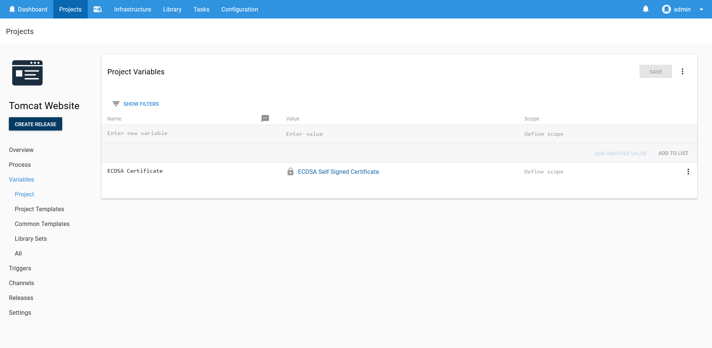

Next add the `Deploy a certificate to Tomcat` step. Select the certificate variable, set the `CATALINA_HOME` field to `C:\Program Files\Apache Software Foundation\Tomcat 9.0`, select the `NIO2` SSL implementation, and set the port to `8443`.

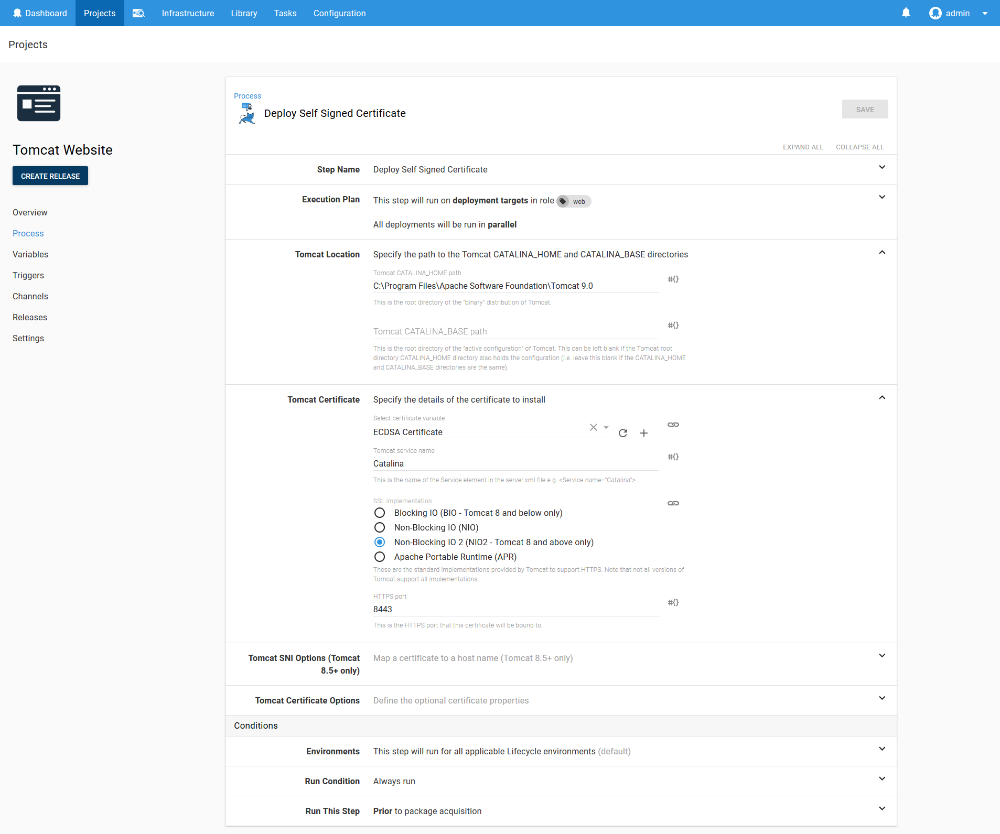

:::hint
In a production scenario you would not be redeploying a certificate along with an application. Once a certificate is deployed, it usually only needs to be redeployed once a year as the certificate is renewed. We have included the certificate deployment in the same project simply to demonstrate how these steps are configured.
:::

## Restart the Service

The last step is to restart the Tomcat service to allow it to pick up the new certificate configuration.

Add a `Run a Script` step, and run a PowerShell script to restart the `Tomcat9` service.

```
Restart-Service Tomcat9
```

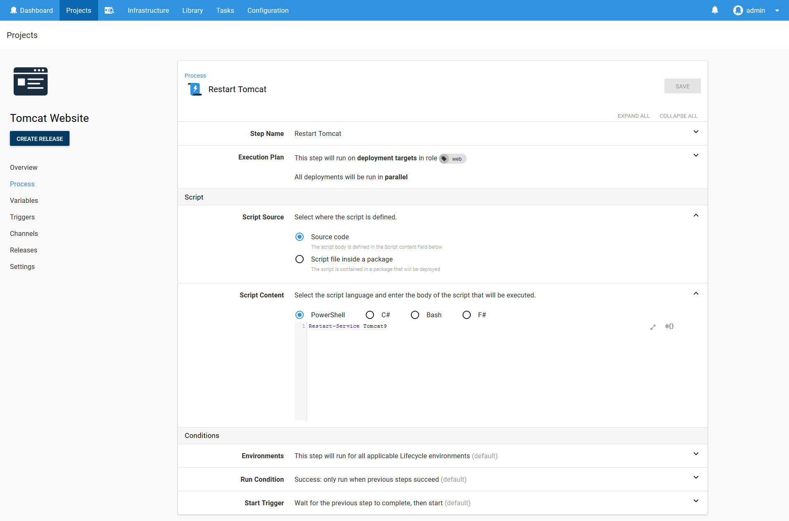

`Tomcat9` is the service that the Tomcat installer created for us.

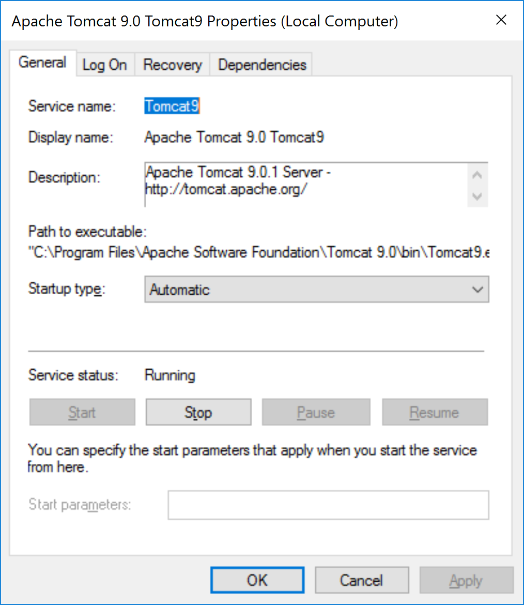

:::hint
Tomcat does not need to be restarted after an application is deployed. This script is run to allow Tomcat to pick up the certificate.
:::

## Run the Deployment

When the deployment is run, Octopus will automatically determine that the Maven artifact is a WAR file, and select the latest version to deploy.

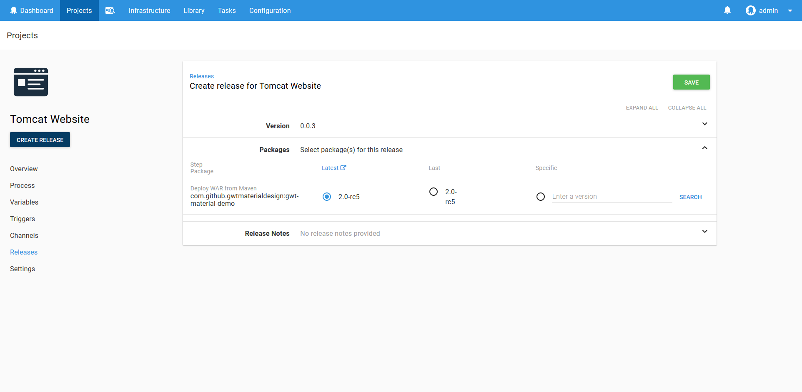

Once the deployment is finished, you find the following XML has been added to the Tomcat `conf/server.xml` file. This is how Tomcat is configured to support HTTPS.

```xml
<Connector SSLEnabled="true" port="8443" protocol="org.apache.coyote.http11.Http11Nio2Protocol">
  <SSLHostConfig>
    <Certificate certificateKeyAlias="octopus" certificateKeystoreFile="${catalina.base}\conf\Internet_Widgits_Pty_Ltd1.keystore" certificateKeystorePassword="changeit" type="EC"/>
  </SSLHostConfig>
</Connector>
```

## Testing the Result

Open up [https://localhost:8443/demoapp/index.html](http://localhost:8443/demoapp/index.html). You will see the demo application being displayed.

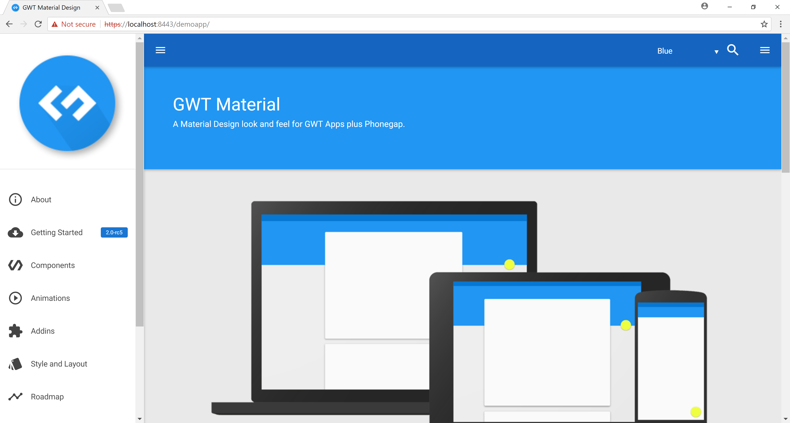

We can then verify the certificate by opening up the Chrome developer tools and viewing the `Security` tab.

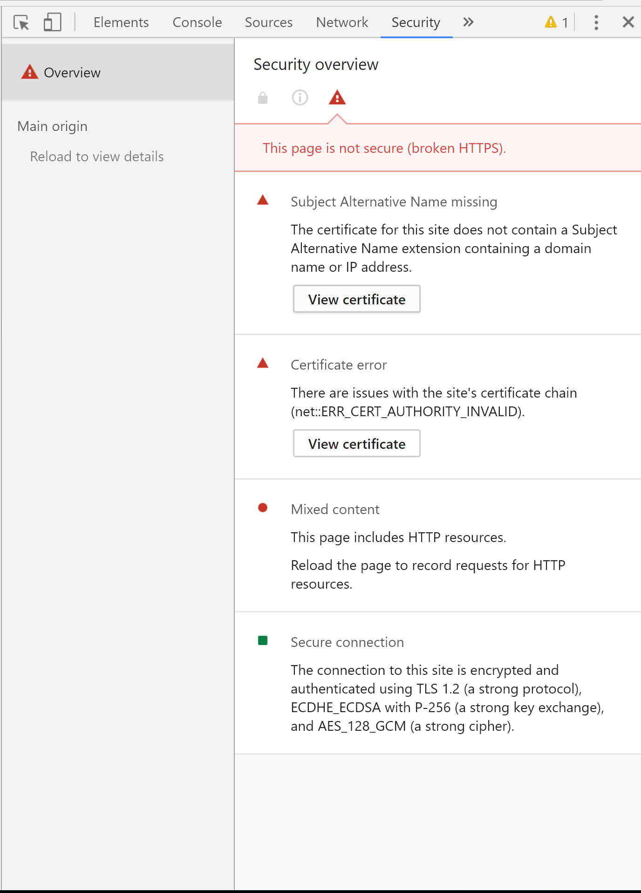

Click the `View certificate` to confirm that Tomcat is now configured with the self signed certificate.

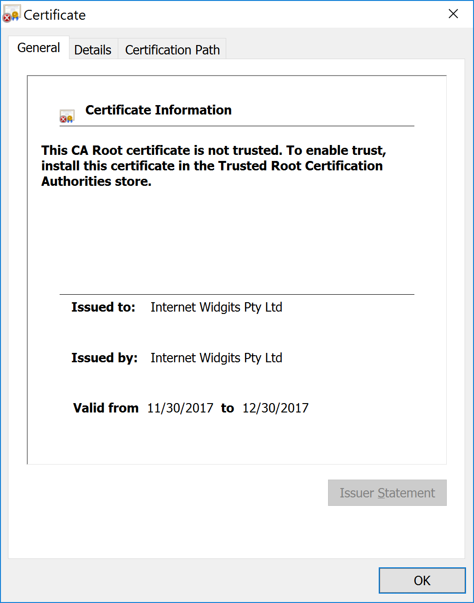

## Conclusion

With Octopus 4.1 you can now manage your application and certificate deployment lifecycles with built in steps, while seamlessly consuming artifacts from Maven repositories.

If you are interested in automating the deployment of your Java applications, [download a trial copy of Octopus Deploy](https://octopus.com/downloads), and take a look at [our documentation](https://octopus.com/docs/deploying-applications/deploy-java-applications).
