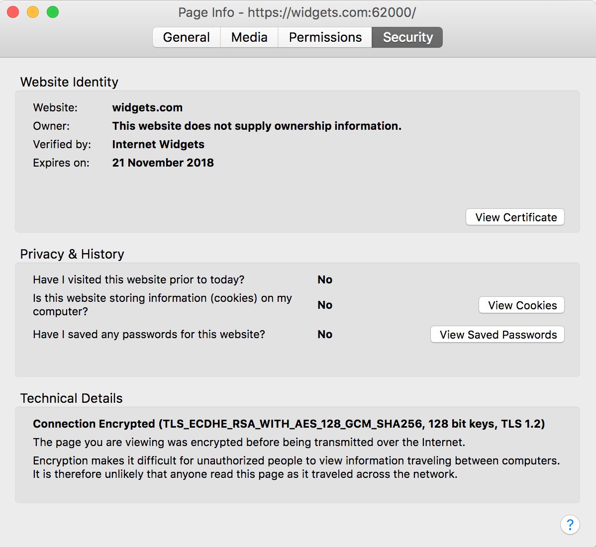
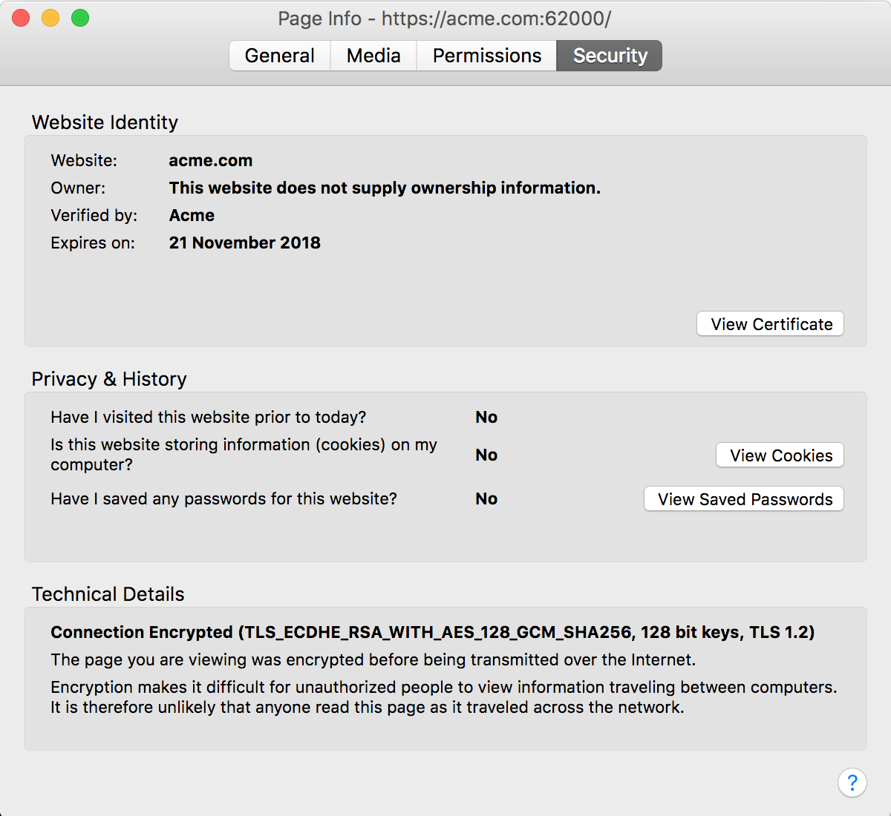
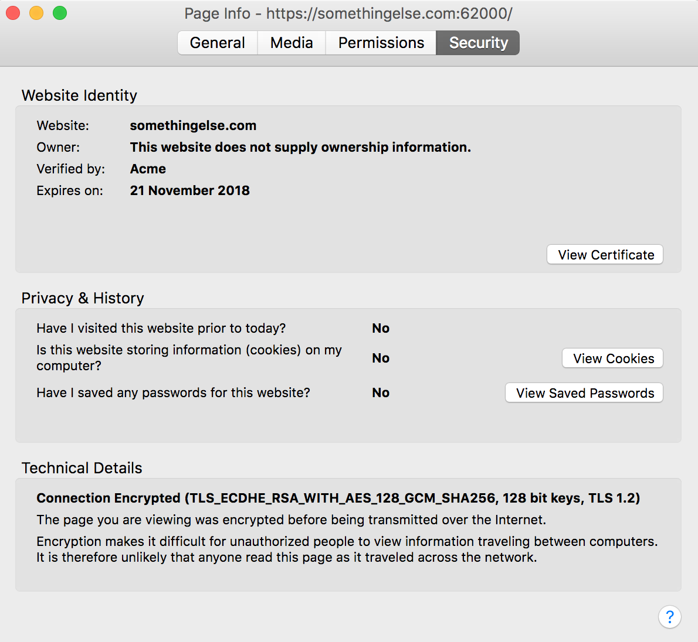

Server Name Indication (SNI) is a feature available in Tomcat 8.5 and 9 that allows certificates to be mapped to the hostname of the incoming request. This allows Tomcat to respond with different certificates on a single HTTPS port.

This blog post looks at how to configure SNI in Tomcat 9.

## Creating Self Signed Certificates

For this example we'll create two self signed certificates. This is done with the `openssl` command.

The output below shows how the first self signed certificate is created for the "Internet Widgets" company.

```
$ openssl req -x509 -newkey rsa:4096 -keyout widgets.key -out widgets.crt -days 365
Generating a 4096 bit RSA private key
......++
........++
writing new private key to 'widgets.key'
Enter PEM pass phrase:
Verifying - Enter PEM pass phrase:
-----
You are about to be asked to enter information that will be incorporated
into your certificate request.
What you are about to enter is what is called a Distinguished Name or a DN.
There are quite a few fields but you can leave some blank
For some fields there will be a default value,
If you enter '.', the field will be left blank.
-----
Country Name (2 letter code) []:AU
State or Province Name (full name) []:QLD
Locality Name (eg, city) []:Brisbane
Organization Name (eg, company) []:Internet Widgets
Organizational Unit Name (eg, section) []:
Common Name (eg, fully qualified host name) []:
Email Address []:
Octopuss-MBP-2:Development matthewcasperson$ ls
widgets.crt     widgets.key
```

We then create a second self signed certificate for the "Acme" company.

```
$ openssl req -x509 -newkey rsa:4096 -keyout acme.key -out acme.crt -days 365
Generating a 4096 bit RSA private key
..............................++
.....................................................................++
writing new private key to 'acme.key'
Enter PEM pass phrase:
Verifying - Enter PEM pass phrase:
-----
You are about to be asked to enter information that will be incorporated
into your certificate request.
What you are about to enter is what is called a Distinguished Name or a DN.
There are quite a few fields but you can leave some blank
For some fields there will be a default value,
If you enter '.', the field will be left blank.
-----
Country Name (2 letter code) []:Au
State or Province Name (full name) []:QLD
Locality Name (eg, city) []:Brisbane
Organization Name (eg, company) []:Acme
Organizational Unit Name (eg, section) []:
Common Name (eg, fully qualified host name) []:
Email Address []:
Octopuss-MBP-2:Development matthewcasperson$ ls
acme.crt        acme.key        widgets.crt     widgets.key
```

Copy the files `acme.crt`, `acme.key`, `widgets.crt` and `widgets.key` into the Tomcat 9 `conf` directory.

## Configuring the `<Connector>`

In the `conf/server.xml` file we'll add a new `<Connector>` element to reference these certificates.

```xml
<Connector SSLEnabled="true" defaultSSLHostConfigName="acme.com" port="62000" protocol="org.apache.coyote.http11.Http11AprProtocol">
  <SSLHostConfig hostName="acme.com">
    <Certificate certificateFile="${catalina.base}/conf/acme.crt" certificateKeyFile="${catalina.base}/conf/acme.key" certificateKeyPassword="Password01!" type="RSA"/>
  </SSLHostConfig>
  <SSLHostConfig hostName="widgets.com">
    <Certificate certificateFile="${catalina.base}/conf/widgets.crt" certificateKeyFile="${catalina.base}/conf/widgets.key" certificateKeyPassword="Password01!" type="RSA"/>
  </SSLHostConfig>
</Connector>
```

There are a few important aspects to this configuration block, so we'll work through them one by one.

The `defaultSSLHostConfigName="acme.com"` attribute has defined the `<SSLHostConfig hostName="acme.com">` to be the default. This means that when a request comes for a host that is not either `acme.com` or `widgets.com`, the response will be generated using the `acme.com` certificate. You must have at least one default host configured.

The `protocol="org.apache.coyote.http11.Http11AprProtocol"` attribute configures Tomcat to use the Apache Portable Runtime (APR), which means that the openssl engine will be used while generating the HTTPS response. Typically deferring to openssl results in better performance then using native Java protocols. The [Tomcat documentation ](https://tomcat.apache.org/tomcat-9.0-doc/ssl-howto.html) has more details on the protocols that are available.

We then have the certificate configuration for each of the hostnames. This is the configuration for the `acme.com` hostname.

```xml
<SSLHostConfig hostName="acme.com">
  <Certificate certificateFile="${catalina.base}/conf/acme.crt" certificateKeyFile="${catalina.base}/conf/acme.key" certificateKeyPassword="Password01!" type="RSA"/>
</SSLHostConfig>
```

The `certificateFile="${catalina.base}/conf/acme.crt"` and `certificateKeyFile="${catalina.base}/conf/acme.key"` attributes define the location of the certificate and the private key, relative to the CATALINA_BASE directory. The [Tomcat documentation](https://tomcat.apache.org/tomcat-9.0-doc/RUNNING.txt) has more details on what CATALINA_BASE refers to:

> The CATALINA_HOME environment variable should be set to the location of the root directory of the "binary" distribution of Tomcat.
>
> The CATALINA_BASE environment variable specifies location of the root directory of the "active configuration" of Tomcat. It is optional. It defaults to be equal to CATALINA_HOME.

## Testing the Connection

Since we don't actually own the `acme.com` or `widgets.com` domains, we'll edit the `hosts` file to resolve these addresses to `localhost`. On a Mac and Linux OSs, this file is found under `/etc/hosts`.

Adding the following lines to the `hosts` file will direct these domains to localhost. We'll throw in the `somethingelse.com` hostname to see which certificate an unmapped host returns.

```
127.0.0.1 acme.com
127.0.0.1 widgets.com
127.0.0.1 somethingelse.com
```

We can now open up the link [https://widgets.com:62000](https://widgets.com:62000). In Firefox, we can see that this request has the following certificate details. Notice the `Verified by` field, which shows `Internet Widgets`.



Then open up [https://acme.com:62000](https://acme.com:62000). The `Verified by` field now shows `Acme`.



Now open up [https://somethingelse.com:62000](https://somethingelse.com:62000). The `Verified by` field still shows `Acme`, because this certificate is the default, and is used for any host that doesn't have a specific mapping defined.



So we can see that a single instance of Tomcat on a single port can respond with multiple different certificates depending on the host that was requested.
