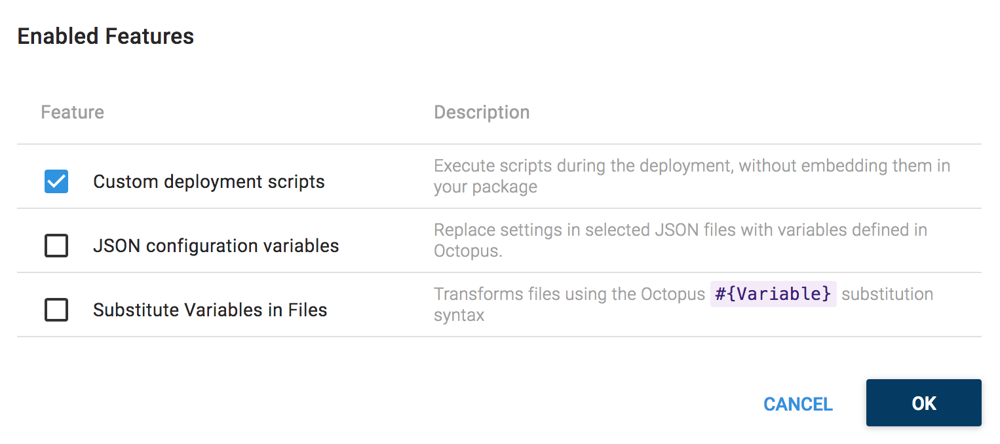
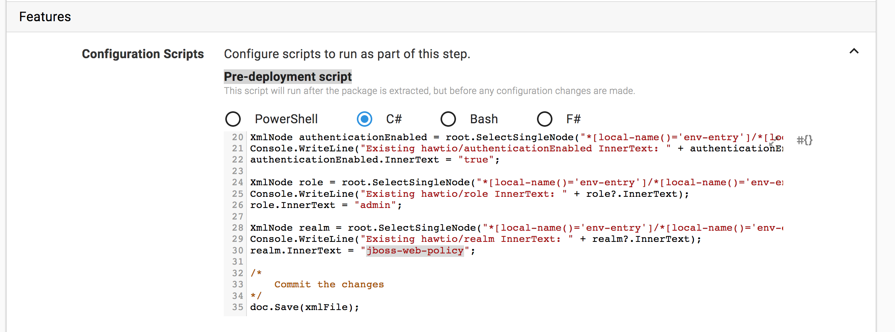
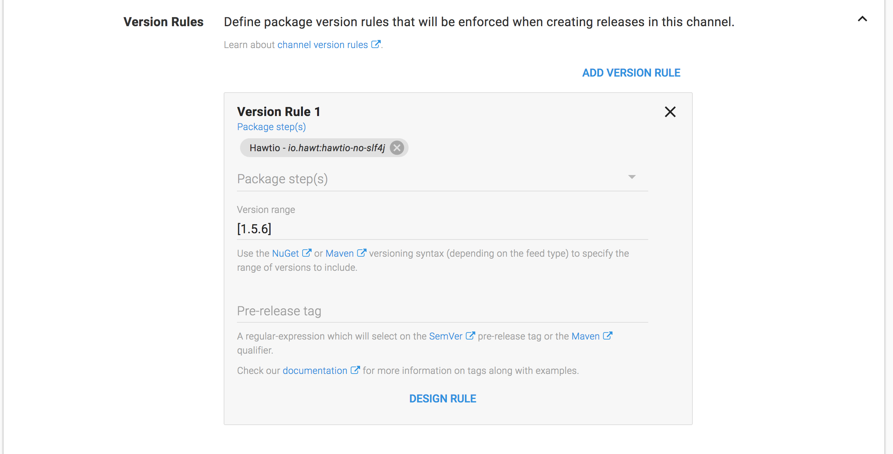
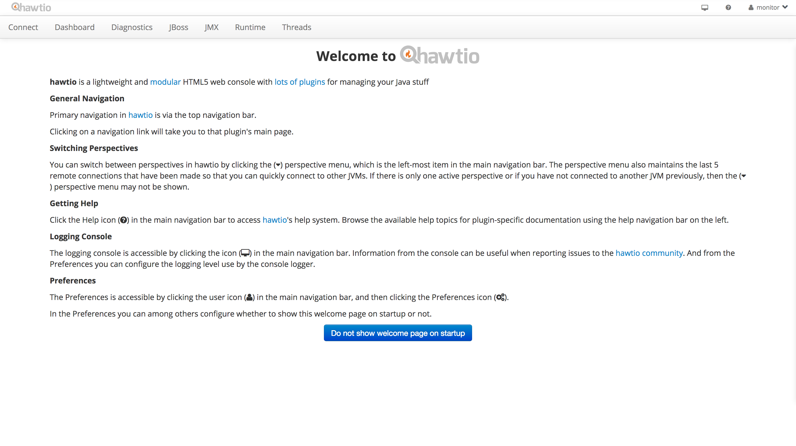

A typical deployment of a package with Octopus gives you the ability to replace markup in template file. This is great when you control the source package and can embed the required markup statements into configuration files, but what happens when you are deploying a package you don't control?

In this blog post we'll take a look at how to use some simple scripting to update the `web.xml` file in a Java web application sourced from Maven central and which we don't have any control over.

## Download Octopus Deploy 4.1

Start by grabbing a copy of Octopus Deploy 4.1 from the [downloads page](https://octopus.com/downloads). Version 4.1 includes the ability to integrate with Maven repos. You can find more information on installing Octopus from the [documentation](https://octopus.com/docs/installation).

:::hint
Octopus 4.1 is currently in beta, so if it is not available from the downloads page now, it will be soon. Watch this space!
:::

## Install WildFly

For this example we'll be installing the [Hawtio](http://hawt.io/) management application to WildFly. In particular we'll be installing the [io.hawt:hawtio-no-slf4j](https://mvnrepository.com/artifact/io.hawt/hawtio-no-slf4j) package.

So download a copy of [WildFly 11](http://wildfly.org/downloads/), and [configure it with an admin user that can be used by Octopus](https://octopus.com/docs/deploying-applications/deploy-java-applications#deploying-to-wildflyjboss-eap).

## Configuring the Maven Central Repository

The next step is to setup Maven central as an external feed. You can refer to the [documentation](https://octopus.com/docs/packaging-applications/package-repositories/maven-feeds) for more details, or this [blog post](https://octopus.com/blog/secured-tomcat-from-scratch#configure-maven-central-as-an-external-feed).

## Adding an Application User

We'll be updating the Hawtio `WEB-INF/web.xml` file during deployment to enable authentication. But before we do this, WildFly needs to be configured with the credentials that Hawtio users will log in with.

Run the `bin/add-user.sh` (for Linux and Mac) or `bin\add-user.bat` (for Windows) script to add a new `Application User` to the `admin` group. In the example below we have created a user called `monitor`.

```
PS C:\wildfly11_standalone\wildfly-11.0.0.Beta1\bin> .\add-user.bat
JAVA_HOME is not set. Unexpected results may occur.
Set JAVA_HOME to the directory of your local JDK to avoid this message.

What type of user do you wish to add?
 a) Management User (mgmt-users.properties)
 b) Application User (application-users.properties)
(a): b

Enter the details of the new user to add.
Using realm 'ApplicationRealm' as discovered from the existing property files.
Username : monitor
Password recommendations are listed below. To modify these restrictions edit the add-user.properties configuration file.
 - The password should be different from the username
 - The password should not be one of the following restricted values {root, admin, administrator}
 - The password should contain at least 8 characters, 1 alphabetic character(s), 1 digit(s), 1 non-alphanumeric symbol(s)
Password :
Re-enter Password :
What groups do you want this user to belong to? (Please enter a comma separated list, or leave blank for none)[  ]: admin
About to add user 'monitor' for realm 'ApplicationRealm'
Is this correct yes/no? yes
Added user 'monitor' to file 'C:\wildfly11_standalone\wildfly-11.0.0.Beta1\standalone\configuration\application-users.properties'
Added user 'monitor' to file 'C:\wildfly11_standalone\wildfly-11.0.0.Beta1\domain\configuration\application-users.properties'
Added user 'monitor' with groups admin to file 'C:\wildfly11_standalone\wildfly-11.0.0.Beta1\standalone\configuration\application-roles.properties'
Added user 'monitor' with groups admin to file 'C:\wildfly11_standalone\wildfly-11.0.0.Beta1\domain\configuration\application-roles.properties'
Is this new user going to be used for one AS process to connect to another AS process?
e.g. for a slave host controller connecting to the master or for a Remoting connection for server to server EJB calls.
yes/no? no
Press any key to continue . . .
```

## Deploy Hawtio

We can deploy Hawtio using the `Deploy to WildFly or EAP` step, selecting the external Maven feed, and deploying the package `io.hawt:hawtio-no-slf4j`.

During deployment we want to update three `<env-entry-value>` elements in the `web.xml` file. These values configure the `hawtio/authenticationEnabled`, `hawtio/role` and `hawtio/realm` `<env-entry>` settings. The default values are shown below.

```xml
<web-app xmlns="http://java.sun.com/xml/ns/j2ee"
	      xmlns:xsi="http://www.w3.org/2001/XMLSchema-instance"
	      xsi:schemaLocation="http://java.sun.com/xml/ns/j2ee
	      http://java.sun.com/xml/ns/j2ee/web-app_2_4.xsd"
	      version="2.4">

  ...

  <env-entry>
    <description>Enable/disable hawtio's authentication filter, value is really a boolean</description>
    <env-entry-name>hawtio/authenticationEnabled</env-entry-name>
    <env-entry-type>java.lang.String</env-entry-type>
    <env-entry-value>false</env-entry-value>
  </env-entry>

  <env-entry>
    <description>Authorized user role, empty string disables authorization</description>
    <env-entry-name>hawtio/role</env-entry-name>
    <env-entry-type>java.lang.String</env-entry-type>
    <env-entry-value></env-entry-value>
  </env-entry>

  <env-entry>
    <description>JAAS realm used to authenticate users</description>
    <env-entry-name>hawtio/realm</env-entry-name>
    <env-entry-type>java.lang.String</env-entry-type>
    <env-entry-value>*</env-entry-value>
  </env-entry>

  ...

</web-app>
```

We want the `<env-entry-value>` for `hawtio/authenticationEnabled` to be `true`, `hawtio/role` to be `admin` (the same group that we added the user to with the `add-user` script), and `hawtio/realm` to `jboss-web-policy`.

:::hint
`jboss-web-policy` is a default realm configured in WildFly and JBoss EAP which defers to the `Application User` credentials configured by the `add-user` script . You can read the [documentation](https://access.redhat.com/documentation/en-us/jboss_enterprise_application_platform/6.1/html/security_guide/use_a_security_domain_in_your_application) for more details.
:::

To make these changes we need to enable the `Custom deployment scripts` feature.



We'll use a C# Pre-Deployment Script to update the `web.xml` file before it is repacked and deployed to WildFly.



The script loads the `web.xml` file and uses some XPath statements to find the elements that need to be updated. The XML file is then saved, and the updated file will be repacked and deployed.

:::hint
The XPath statements avoid the problems associated with namespaces by referencing elements as `*[local-name()='env-entry']`.
:::

```csharp
using System.Xml;
using System.IO;

/*
	Get the location of the web.xml fie
*/
var installation = Octopus.Parameters["Octopus.Action.Package.InstallationDirectoryPath"];
var xmlFile = installation + Path.DirectorySeparatorChar + "WEB-INF" + Path.DirectorySeparatorChar + "web.xml";

/*
	Parse the web.xml file
*/
XmlDocument doc = new XmlDocument();
doc.Load(xmlFile);
XmlNode root = doc.DocumentElement;

/*
	Update the nodes
*/
XmlNode authenticationEnabled = root.SelectSingleNode("*[local-name()='env-entry']/*[local-name()='env-entry-value'][../*[local-name()='env-entry-name'][text()=\"hawtio/authenticationEnabled\"]]");
Console.WriteLine("Existing hawtio/authenticationEnabled InnerText: " + authenticationEnabled?.InnerText);
authenticationEnabled.InnerText = "true";

XmlNode role = root.SelectSingleNode("*[local-name()='env-entry']/*[local-name()='env-entry-value'][../*[local-name()='env-entry-name'][text()=\"hawtio/role\"]]");
Console.WriteLine("Existing hawtio/role InnerText: " + role?.InnerText);
role.InnerText = "admin";

XmlNode realm = root.SelectSingleNode("*[local-name()='env-entry']/*[local-name()='env-entry-value'][../*[local-name()='env-entry-name'][text()=\"hawtio/realm\"]]");
Console.WriteLine("Existing hawtio/realm InnerText: " + realm?.InnerText);
realm.InnerText = "jboss-web-policy";

/*
	Commit the changes
*/
doc.Save(xmlFile);
```

## Defining a Channel Rule

For some reason there is an old version of Hawtio published to Maven central that has the version 2.0.0. The latest version of Hawtio is actually 1.5.6. Octopus will by default try to deploy the latest version, but in this case the version with the largest version number is not the latest version. To work around this, we can create a channel rule that forces Octopus to deploy version 1.5.6.



## Testing the Deployment

With the Hawtio user configured in WildFly and the `web.xml` file being updated to require authentication, we can complete the deployment and check the results by opening [http://server:8080/hawtio](http://server:8080/hawtio). You will be presented with the login page.


Once logged in using the `monitor` user we created earlier, the welcome page will be displayed.



## Conclusion

With some simple C# scripting we can make whatever changes are required to XML files that we don't otherwise control. This is an example of the powerful customizations that can be applied to Java applications when being deployed by Octopus.

If you are interested in automating the deployment of your Java applications, [download a trial copy of Octopus Deploy](https://octopus.com/downloads), and take a look at [our documentation](https://octopus.com/docs/deploying-applications/deploy-java-applications).
