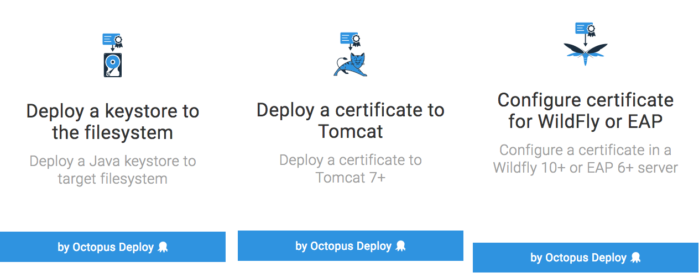
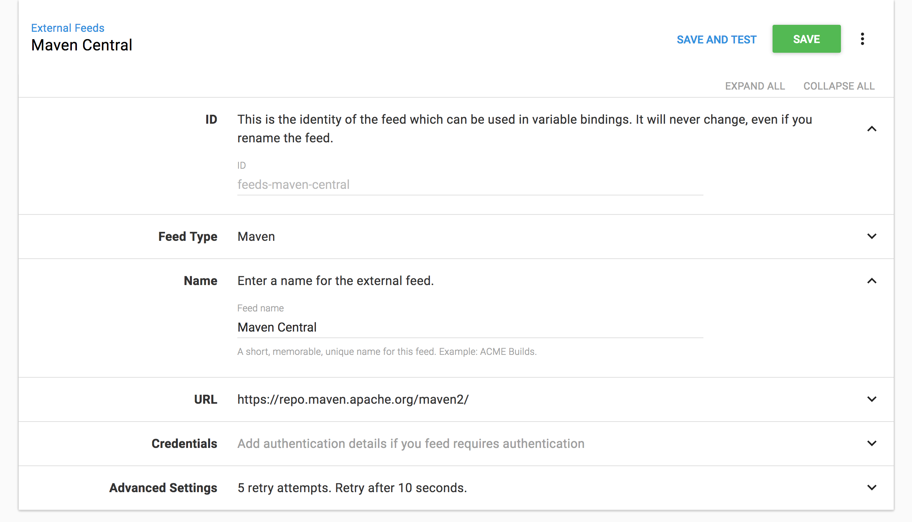
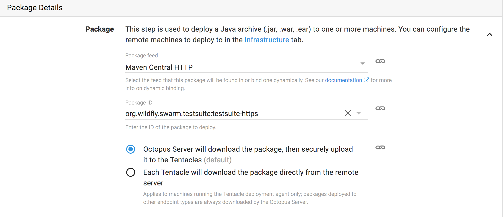
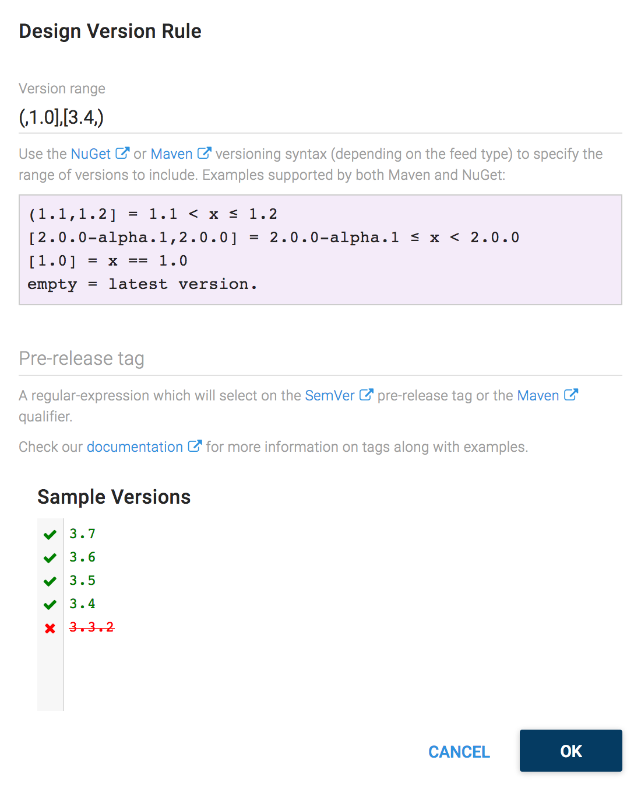

:::warning
TODO:

* Fix banner images
* Add release video
* Are there breaking changes?
:::

This December release of Octopus continues the support for Java that was [introduced back in 3.17](/blog/2017-09/octopus-release-3-17.md), with the ability to export certificates as Java KeyStores, as well as configuring certificates directly within existing Tomcat 7+, WildFly 10+ and Red Hat JBoss EAP 6+ application servers. This release also allows Maven repositories to be configured as external Octopus feeds, meaning Octopus can now consume Maven artifacts as part of a deployment. Read on for all the exciting details!

## In this post

!toc

## Release Tour

Add video here.

## Export Certificates as Java KeyStores and to WildFly, JBoss EAP and Tomcat

Octopus already has the ability to [manage your certificates](https://octopus.com/docs/deploying-applications/certificates), and now those certificates can be directly configured within an existing WildFly 10+ or Red Hat JBoss EAP 6+ application server with the `Configure certificate for WildFly or EAP` step, or within an existing Tomcat 7+ application server with the `Deploy a certificate to Tomcat` step. For those wishing to configure their certificates manually, the new `Deploy a keystore to the filesystem` step allows a certificate managed by Octopus to be saved as a Java KeyStore.

You can find out more by viewing the documentation for these steps:

* [Exporting a Certificate to a Java Keystore](https://octopus.com/docs/v/4.1/deploying-applications/certificates/java-keystore-export)
* [Importing Certificates into Tomcat](https://octopus.com/docs/v/4.1/deploying-applications/certificates/tomcat-certificate-import)
* [Importing Certificates into WildFly and JBoss EAP](https://octopus.com/docs/v/4.1/deploying-applications/certificates/wildfly-certificate-import)

## Maven Repositories as External Feeds

Maven repositories are extremely popular with Java developers, and with this release Maven repositories can be configured as external feeds in Octopus.

This means that Maven artifacts can now be downloaded as part of a deployment like any other feed.

All your favorite features like channels and version rules also work with Maven feeds, and you can use the standard [Maven version range syntax](https://g.octopushq.com/MavenVersioning) too!

Get more details about using Maven repositories as external feeds in our [documentation](https://octopus.com/docs/v/4.1/deploying-applications/maven-feeds).

## Breaking changes

There are no breaking changes in this release.

## Upgrading

All of the usual [steps for upgrading Octopus Deploy](https://octopus.com/docs/administration/upgrading) apply. Please see the [release notes](https://octopus.com/downloads/compare?to=4.1.0) for further information.

## Wrap up

That’s it for this month. We hope you enjoy the new features and our latest release. Feel free to leave us a comment and let us know what you think! Happy deployments!
