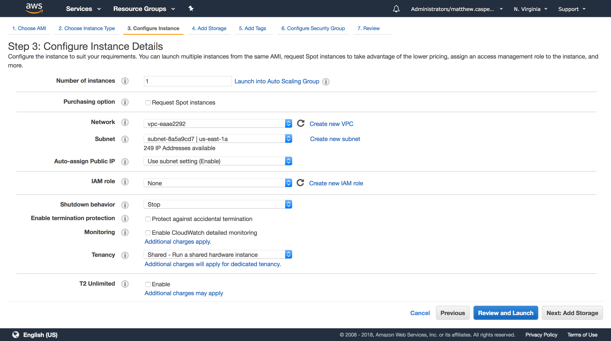

AWS allows resources like EC2 instances to have a IAM role assigned to them. In effect, this gives applications run on the EC2 instance the permissions of that role. This means that neither the code itself, nor the process running the code, need to supply any credentials or keys, which is very convenient when designing deployment practices.

In this blog post we'll look at how roles can be assigned to EC2 instances and then used to assume secondary roles.

## Assigning Roles to EC2 Instances

We'll start with an EC2 instance that has no roles and an IAM role called `ExampleRole` that has no policies attached to it. Roles can be assigned to an existing EC2 instance with the command:

```
aws ec2 associate-iam-instance-profile --instance-id i-0123456789abcdef0 --iam-instance-profile Name="ExampleRole"
```

The output will look something like:

```json
{
    "IamInstanceProfileAssociation": {
        "AssociationId": "iip-assoc-0123456789abcdef0",
        "InstanceId": "i-0123456789abcdef0",
        "IamInstanceProfile": {
            "Arn": "arn:aws:iam::123456789012:instance-profile/ExampleRole",
            "Id": "ABCDEFGHIJKLMNOPQRSTU"
        },
        "State": "associating"
    }
}
```

The EC2 instance now has a role assigned to it.

:::hint
You can assign a role during the creation of an EC2 instance using the `IAM role` drop down menu.


:::

## Creating Trust Policies

Before an EC2 instance can make use of an assigned role, the role needs to give the EC2 service permission to do so. This is done by assigning the following policy to the `ExampleRole` trust relationship.

```json
{
  "Version": "2012-10-17",
  "Statement": [
    {
      "Effect": "Allow",
      "Principal": {
        "Service": "ec2.amazonaws.com"
      },
      "Action": "sts:AssumeRole"
    }
  ]
}
```


## Generating Keys from an Instance Role

The list of roles assigned to an EC2 instance can be found from the instance metadata. This is accessed via a private HTTP API accessible under http://169.254.169.254/latest/meta-data.

To get the role associated with the instance, run this command from the EC2 instance itself. The slash on the end of this URL is important.

```
curl http://169.254.169.254/latest/meta-data/iam/security-credentials/
```

The output should be a single line with the name of the role.

```
ExampleRole
```

This command will return the access, secret, and session token keys.

```
curl http://169.254.169.254/latest/meta-data/iam/security-credentials/ExampleRole
```

The result of this call is the following JSON:

```json
{
  "Code" : "Success",
  "LastUpdated" : "2018-01-25T23:15:40Z",
  "Type" : "AWS-HMAC",
  "AccessKeyId" : "AKJBD787KHV7JHV7JGC9",
  "SecretAccessKey" : "oqfqoufbqow/qwobOUBuIViyciycIY7ivy7gcUCj",
  "Token" : "FQoDYXdzEID//////////wEaDMb+nhXW1CzKSssr7iK3A6xOpwS5AQ+Rx/3ZsvWa2mcnZv/e3LHOSU9oNShnnL91uu8NHiiZyKVhoH/G/58WwEUtMf5tZKLT05Rv7ihLNdhsyJ9YkIGplsnl3KQUGEVbg1yfjOLzEHcBcqzYorwVyqDyeo7xoo4CGqxMzjcBApKDTRRA8X146raCb1/marnHzhqDqpfJykKr8WXAhbIfxHTNPdKFIa7Fm9h1mNsbTZOy8obwMR3tOf88HtmxVSPpISSn3VTzcEpZT9VHDe6O7HEtTrTn9Phid0/Fq5KUh4KOgxDfzLSfJiGGTqs8wF99310DUdK8bQFLemrrOmq2iUhVv0SkH4MKlkMY8B7/T1gqoN1JaQ9xUXZL2J6ZDPFSmRmx7GiR8emN17wQAH0+VMVlrl0sXX8IkMoZyd3M5S9VRF4csRYyzPGhTBwYuBsf/85ANKc/k/K2/uBLqpabsqt+ccleU7A2PrcFqRL+MpZDfPotWspT6b9Q2By7D3X/5NtnIjIxutvdcn2MN38CCi1l/cYuc9iJwZVY2eluV5HXZbyV0oMwi9bYy7BZz0e/54tauABSf3s6JSmfBw0NByUEn5aZeT4o88mp0wU=",
  "Expiration" : "2018-01-26T05:40:31Z"
}
```

To use these keys, it is common to assign them to environment variables.

| JSON Field | Environment Variable |
|-|-|
|  AccessKeyId | AWS_ACCESS_KEY_ID  |
|  SecretAccessKey | AWS_SECRET_ACCESS_KEY |
| Token  |  AWS_SESSION_TOKEN |

## Using Role Credentials with the AWS CLI

Although it is possible to query the instance metadata and create environment variables from the keys, a good number of tools already know how to query the instance metadata for themselves. The AWS CLI is a good example of this.

Without creating any environment variables or running `aws configure` to save any keys in a local configuration file, running the command:

```
aws sts get-caller-identity
```

will result in:

```json
{
    "Account": "123456789012",
    "UserId": "ABCDEFGHIJKLMNOPQRSTU:i-0123456789abcdef0",
    "Arn": "arn:aws:sts::123456789012:assumed-role/ExampleRole/i-0123456789abcdef0"
}
```

In this case the AWS CLI knows to generate keys from the instance metadata, and will do so automatically if no other keys, environment variables or configuration files are present.

## Assuming a Secondary Role

From the role assigned to the EC2 instance, we can then assume a secondary role. Secondary roles might be used for testing permissions, or running processes with additional permissions in the same way you might use the `sudo` command.

Let's assume that we have a second role called `ExampleAssumedRole` that we would like to assume from `ExampleRole`.

The first step is to give `ExampleRole` the permissions to assume `ExampleAssumedRole`. This is done with the following policy on `ExampleRole`:
```json
{
    "Version": "2012-10-17",
    "Statement": [
        {
            "Sid": "Stmt1512947264000",
            "Effect": "Allow",
            "Action": [
                "sts:AssumeRole"
            ],
            "Resource": [
                "arn:aws:iam::123456789012:role/ExampleAssumedRole"
            ]
        }
    ]
}
```

Then `ExampleAssumedRole` needs to be updated to trust `ExampleRole`:

```json
{
  "Version": "2012-10-17",
  "Statement": [
    {
      "Effect": "Allow",
      "Principal": {
        "AWS": "arn:aws:iam::123456789012:role/ExampleRole"
      },
      "Action": "sts:AssumeRole"
    }
  ]
}
```

With these policies in place, run the following command to assume a role:

```
aws sts assume-role --role-arn arn:aws:iam::123456789012:role/ExampleAssumedRole --role-session-name MySession
```

The result then contains the `AccessKeyId`, `SecretAccessKey` and `SessionToken` that can be assigned to environment variables in the same way that was described in `Generating Keys from an Instance Role`:

```json
{
    "AssumedRoleUser": {
        "AssumedRoleId": "ABCDEFGHIJKLMNOPQRSTU:MySession",
        "Arn": "arn:aws:sts::123456789012:assumed-role/ExampleAssumedRole/MySession"
    },
    "Credentials": {
        "SecretAccessKey": "oqfqoufbqow/qwobOUBuIViyciycIY7ivy7gcUCj",
        "SessionToken": "FQoDYXdzEIH//////////wEaDB9lgc8b8VS+LXRmliLtAdYWQNM1RnhGG/UdRszkg1xOtCIVevt7W34A4Lu1McUpEMVsFUrhEYIZR3fVFbPP6dwnxQ/H78jN1jKZuXgXPIH00NA3PtvxR8zcHDmkVeeCrnz+TiNk5k8/Tzh1qyzaH29sPY6oXhLCfsKSaQkw3nGd5RoslByOnNywVtJc762ke4F9YXAZffelSmQIhKdntqQj7L+DDAijRmjxCjadItJz7oxRdkN11ez13dny1wzIdPC7vuszivgF9+uACjZFQxgPS95f7w1VOhcCtmSMt9ErZd29BWdiO5CPr2ytBVEhNG7URgljEup2zqLCTCjc1qnTBQ==",
        "Expiration": "2018-01-26T00:42:20Z",
        "AccessKeyId": "AKJBD787KHV7JHV7JGC9"
    }
}
```

## Conclusion

AWS offers a flexible security system that allows roles to be assigned to EC2 instances, and for secondary roles to be assumed. This allows for permissions to be assigned without embedding keys in applications or scripts, and for processes to be run with different privileges much as you would with the `sudo` command.
