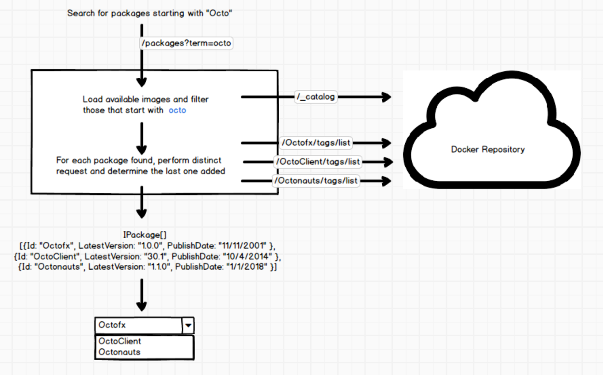

Building APIs are hard and in our case, _all_ user interaction with Octopus is through our API. Whether that's through the built-in web portal, the `Octopus.Client` libraries, the various 3rd party CI plugins or even directly through a curl request, the Octopus Server API is the common language that all these clients speak. Our recent built-in support for (https://octopus.com/blog/octopus-release-3-17#swagger-support-for-the-octopus-api)[Swagger] helps consumers of the API somewhat, however the internal implementations are starting to feel growing pains. The endpoints that search for packages were made back when the built-in feed and NuGet feeds were the only options available in Octopus. This design has becomes a sub-optimal fit as we expand our support to other feed types and as such this particular API endpoint need to be redesigned.

## Monolith API endpoint
Our old API for searching for packages or versions looked like
> ~/api/feeds/{id}/packages{?packageId,partialMatch,includeMultipleVersions,includeNotes,includePreRelease,versionRange,preReleaseTag,take,descriptionsOptional}

Take a look at that list of query string parameters. Thats because the old packages API was used for two different things.

1. Searching For Package
    * Package autocomplete input field while designing package steps.
    * Testing external feeds

2. Searching For Package Version
    * Getting the _latest_ version for a package when creating a release, potentially within a version range specified by a channel rule.
    * Paging through and searching the available versions when creating a release.

Although we decided to expose the results of these two operations with a resource of the same shape, an `IPackage` resource, both the usage and source of this information is completely dissimilar.

* Searching for a package involves using a search term and looking up a package index for packages that partially match that name. The intended result of that is to find and use the relevant package name.

* When searching for a package version on the other hand you (typically) have the package name that is of interest. You want to search through all the versions available for that specific package, potentially filtering using a version range or pre-release prefix. The expected result of _this_ search is information about the _specific version instances_ which could include publish dates, release notes, descriptions, etc depending on the package type.

From inside the server during the API call all we know is that we need to return an `IPackage` resource for either case regardless of what information needs to come back. So even if we are just looking to find package names to populate an auto-complete drop down, it is still expected to return objects with deep version information. This was ok in the past when we only supported NuGet feeds, since our APIs largely just sat on top of their existing ones, however as we start providing support for more feed types this pattern is unsustainable.

Adding support for Docker and Maven feeds (and soon a GitHub feed) means that these package search API calls need to potentially perform N+1 calls to the external providers to get all the information to properly populate the `IPackage` DTO. When performing a package search request one request will retrieve the packages that match that name, and another will need to go out and get the latest version number _for each package_.

The simple solution to this is to internally check if you are searching for a package as opposed to searching for a version. If this is the case and we can't get the relevant version from the first call (because this is unsupported by that feed type), then just send back dummy data. But this just sounds like internally we are recognizing that there could be two different types of requests.

When sharing a common entry point but using query string parameters to overload its operation we can also get into some unexpected scenarios. What would you expect if you provided `take=10` and `includeMultipleVersion=false`? When you say `take=10` do you expect it to return the last 10 versions for _each package_ or return just 10 matched package names? The `includeNotes` parameter exists because in some cases we want to display release notes, but not for the "search" activities. In the process of trying to always return a standard `IPackage` return type any request to any feed type needs to populate information that may not actually be relevant. Because it is also sharing an endpoint between the built-in feed and the external feeds, most of the hypermedia links that return on packages from external feeds are broken and only valid for packages from the built-in feed.

## The Break up
Given that we are effectively already treating the two different types of requests as two different API calls internally it makes sense to actually break the single monolith API endpoint into two separate endpoints. This way the code internally can be a bit more confident about what information the consumer really _needs_ given the operation. Likewise the consumer can be confident that the shape of the return type doesn't change as a result of changes to the query string.

Another side effect of this split is that the actual data being passed over the wire will be much smaller since we no longer need to return a whole bunch of version specific information when just looking for a list of package names.

## What does that mean for you?
The old API will remain largely as-is for the time being until the next major bump in the future to ensure backwards compatibility for anyone using the HTTP API directly. For anyone not calling these HTTP endpoints or if your interaction takes place through the portal then **you should notice no change at all** and this whole post will ideally be meaningless to you. Since these package search APIs are effectively just wrappers that sit on top of the user-provided external feed APIs, if these changes do not suit user's requirements a better solution may be to interact with those external feeds directly.

