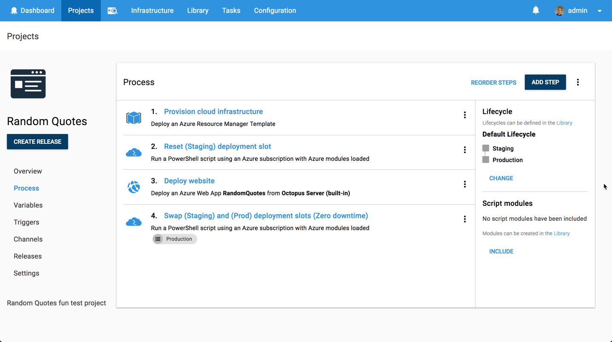
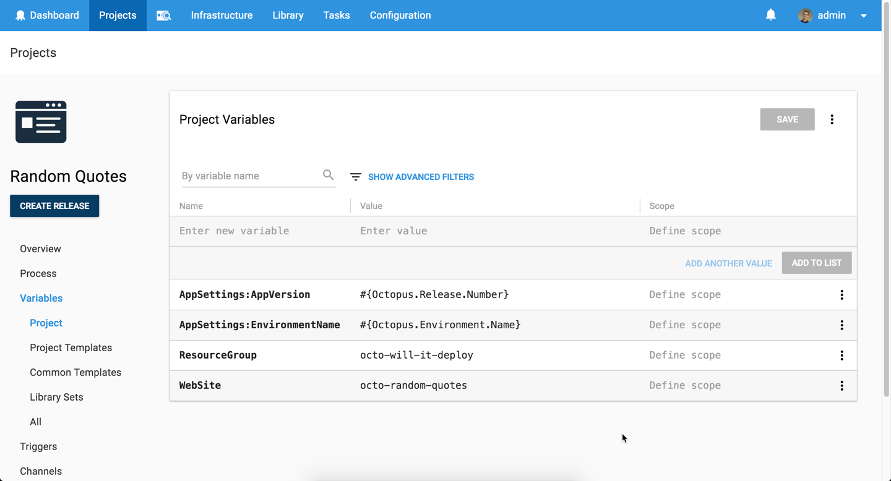

Today, we're launching **Will it Deploy?** This is our brand new video series where we try to automate the deployment of different technologies with Octopus Deploy. 

We're kicking off the series with a fun video as we try to deploy an ASP.NET Core web app to Microsoft's Azure platform. That alone is pretty easy, so we decided to make it a bit more interesting by automating the provisioning of our cloud infrastructure as well as ensure we have a zero-downtime production deployment. 

<iframe width="560" height="315" src="https://www.youtube.com/embed/tQb8PJ0jzvk" frameborder="0" allow="autoplay; encrypted-media" allowfullscreen></iframe>

## Problem

### Tech Stack

Our app is a quote generator called [Random Quotes](https://github.com/OctopusSamples/RandomQuotes). This is fairly simple, but it'll allow us to walk through how to automate the deployment of a web application to Microsoft Azure platform.

* Microsoft [ASP.NET Core 2.0](https://docs.microsoft.com/en-us/aspnet/core/) web app.
* [NUnit](http://nunit.org/) unit testing framework.

Kudos to our marketing manager [Andrew](https://twitter.com/andrewmaherbne) who has been learning to code and built the first cut of this app. Great work! 

### Deployment Target: 

* Microsoft's Azure Platform - [App Service](https://azure.microsoft.com/en-au/services/app-service/).
* Provision our cloud infrastructure with an [Azure Resource Manager Template (ARM Template)](https://docs.microsoft.com/en-us/azure/azure-resource-manager/resource-group-overview).
* Zero-downtime production deploy - [applying the blue-green deployment pattern](https://octopus.com/docs/deploying-applications/deploying-to-azure/deploying-a-package-to-an-azure-web-app/using-deployment-slots-with-azure-web-apps).

## Solution

So will it deploy? **Yes it will!** Our deployment process looks like the following.

The first step is to add an Octopus Azure account, which has all the details required to enable me to connect to the Azure platform, safely and securely. It is used to authenticate with Azure when deploying or executing scripts.

Then we add the following steps to successfully deploy our app including cloud infrastructure provisioning and a zero downtime production deployment.

- Octopus **Deploy an Azure Resource Group** step to provision our cloud infrastructure via an ARM Template.
- Octopus **Run an Azure Powershell Script** step to ensure we always have a fresh App Service staging deployment slot. We call the Azure Powershell cmdlets to delete and create an App Service deployment slot.
- Octopus **Deploy an Azure Web App** step to deploy our web application to our App Service staging deployment slot.
- Octopus **Run an Azure Powershell Script** step to swap our App Service staging and production (live) deployment slot. This is only done during a production deployment so that we achieve zero-downtime!

This project uses the following variables to store our resource group name, website name, and app settings. Nice and simple!

This episode's [GitHub repo](https://github.com/OctopusSamples/WillItDeploy-Episode001) contains all the resources and links used in this video.

### Wrap-up: 

We hope you like this new series, and we hope it can help people around the world learn how to automate the deployment of their application and services.  Don't forget to subscribe to our [YouTube](https://youtube.com/octopusdeploy) channel as we're adding new videos regularly. If there's a framework or technology you'd like us to explore, let us know in the comments.

Happy deployments! :)