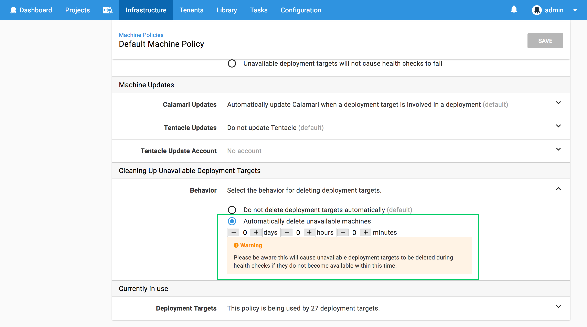

Over the last few months a number of new features have bee added to Octopus which allow you to deploy Java application, consume artifacts from Maven feeds, and deploy AWS CloudFormation templates. In this blog post we'll look at how all of these elements can be brought together to deploy Java applications in a cloud based environment.

## The Maven Feed

The application that we'll be deploying will be sourced from Maven central. To do this we need to have the Maven feed configured in Octopus. This is done in {{Library>External Feeds}}. The Maven Central URL is https://repo.maven.apache.org/maven2/.

## The AWS Account

## The Machine Policy

## The WildFly AMI

To start with we will need a cloud based instance that we can deploy a Java application to. For this we will take advantage of the AMIs provided by [Bitnami](https://bitnami.com/stack/wildfly). Bitnami provides a number of free and up to date images preinstalled with popular open source applications, and we'll take advantage of this to get a EC2 WildFly instance quickly up and running.

## The CloudFormation Template

Having an AMI is half the battle. The other half is building an EC2 instance from it, and for this we'll make use of the CloudFormation steps that were introduced in Octopus 2018.2.

This CloudFormation template has to perform a number of steps:

1. Deploy the AMI as an EC2 instance.
2. Configure some standard tags.
3. Install the packages required to support DotNET Core 2 applications.
4. Configure the file system permissions to allow WildFly silent authentication.
5. Register the EC2 instance with the Octopus server.

## Configuring the Octopus Project

Because we are potentially creating the infrastructure that we will be deploying to as part of the Octopus project, we need to configure some settings to allow Octopus to start the deployment without any valid targets. This is done in the project settings under `Deployment Targets`. Setting the value to `Allow deployments to be created when there are no deployment targets` means the project can start deploying even when there are no targets available yet.

## The CloudFormation Step

## The Health Check Step

## The WildFly Deployment Step

## The Final Output Step
