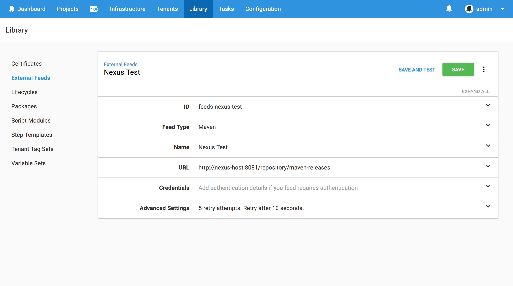
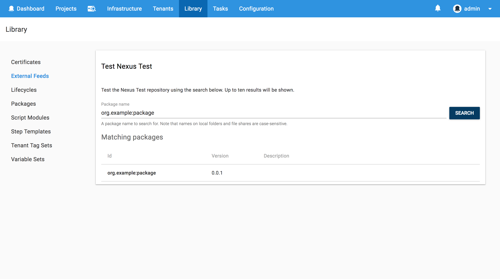
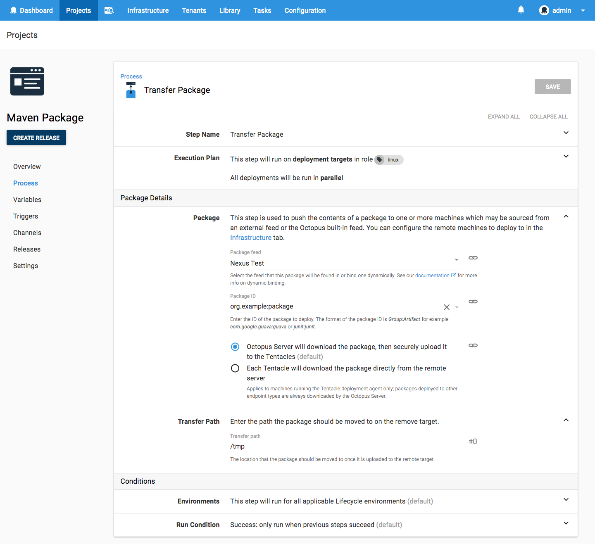

Maven is a versatile artifact repository that extends beyond traditional Java packages, like JARs and WARs, to provide the ability to host generic ZIP archives.  In this blog post, we’ll take a look at how generic archives can be published to a Maven repository, and how they can then be consumed in an Octopus project.

## Repository configuration

The first step is to configure the Maven repository in the `~/.m2/settings.xml` file. This file contains settings such as the Maven repository credentials.

The example below defines the default credentials for a Nexus Maven repository:

```xml
<settings xmlns="http://maven.apache.org/SETTINGS/1.0.0"
  xmlns:xsi="http://www.w3.org/2001/XMLSchema-instance"
  xsi:schemaLocation="http://maven.apache.org/SETTINGS/1.0.0
                      https://maven.apache.org/xsd/settings-1.0.0.xsd">
  <servers>
    <server>
      <id>Nexus</id>
      <username>admin</username>
      <password>admin123</password>
    </server>
  </servers>
</settings>
```

## Create a package

Next, we need to create the package that will be uploaded. In this example, we’ll create a standard ZIP archive called `package.zip` holding the file `test.txt`:

```
zip package.zip test.txt
```

## Upload the package

To upload the package we’ll use the Maven `deploy:deploy-file` goal. Maven can be download from [here](https://maven.apache.org/download.cgi).

:::hint
The `repositoryId` system property in this command needs to match the `<id>` element in the `settings.xml` file.
:::

```
mvn deploy:deploy-file \
  -DgroupId=org.example \
  -DartifactId=package \
  -Dversion=0.0.1 \
  -Dpackaging=zip \
  -Dfile=package.zip \
  -DrepositoryId=Nexus \
  -Durl=http://nexus-host:8081/repository/maven-releases
```

## Create the external feed

To consume the new artifact in Octopus, we need to add the Nexus server as an external Maven feed. This is done under {{Library>External Feeds}}:



We can then test the repository by searching for the artifact `org.example:package`, which is the `groupId` combined with the `artifactId`:



## Transfer the package

Now that we can access the Maven feed, we’ll use the `Transfer a package` step to download the artifact onto a target machine. Again we reference the Maven artifact with `org.example:package`:



## Conclusion

By hosting generic ZIP files, Maven repositories can be used to manage packages for all kinds of deployments, not just those targeting Java, and with native support for Maven feeds, Octopus can easily consume these artifacts as part of a deployment process.
