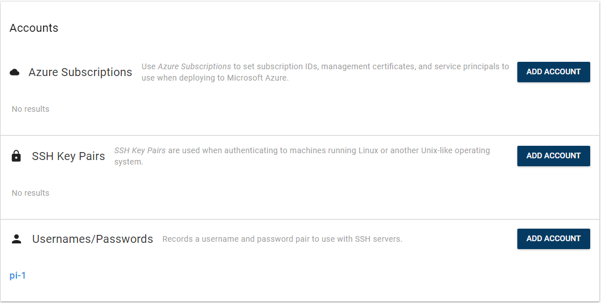
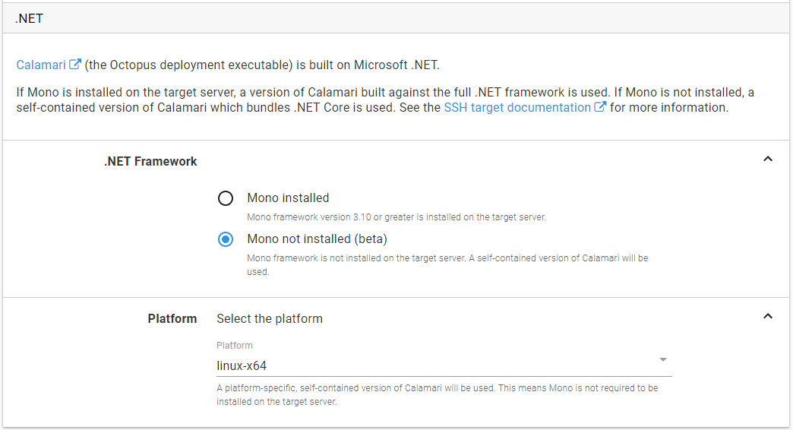

.Net Core has come a long way in the last few years, and Octopus Deploy has too. A while back we added support for running [Calamari without Mono](https://octopus.com/blog/octopus-release-3-16#ssh-targets-sans-mono) and in this post I will walk you through how you can deploy .Net Core applications on to a Raspberry Pi 3, no Mono required.

## Requirements before starting

* Editor - Visual Studio, Visual Studio Code, Rider
* [Octopus Command Line](http://octopus.com/downloads)
* [Octopus Server](http://octopus.com/downloads) and an [API key](https://octopus.com/docs/api-and-integration/api/how-to-create-an-api-key)
* Dotnet Core - https://www.microsoft.com/net/download/windows, https://www.microsoft.com/net/download/macos
* A Raspberry Pi 3 with dotnet core 2.0 Runtime [installed](https://github.com/dotnet/core/blob/master/samples/RaspberryPiInstructions.md)
    * Download link: [Linux ARM (armhf)](https://github.com/dotnet/core-setup)
* For Angular or React applications:
    * node and npm on your development machine - if your chosen application requires it (angular or react)
    * nodejs on your Pi 

:::hint
ASP.NET includes NodeServices in its bundle which requires Node to be installed before it can serve any requests. When you install Node.js on the Raspberry Pi, it installs version 4.x and the executable is called `nodejs`, but NodeServices is looking for `node` in your path. I was able to fix this by creating a symlink: `sudo ln -s /usr/bin/nodejs /usr/bin/node`
:::

## Build the Application

### Create a basic .Net Core Application
```powershell
dotnet new angular
```

### Modify the application to listen for external requests.
Add the following after the `.UseStartup<Startup>()` in `Program.cs`
```c#
.UseKestrel(options => {
                    options.Listen(System.Net.IPAddress.Any, 5000);
                })
```

### Build the application
```powershell
npm install
dotnet build
mkdir publish
dotnet publish -o publish --self-contained -r linux-arm
```

### Package it up
The simplest way to create a package of a Dotnet Core application is using the `Octo.exe` command line tool.

Create an `artifacts` directory and then use the `Octo Pack` command to create the package

```powershell
mkdir artifacts
octo.exe pack --id core4pi --version 1.0.0 --format nupkg --outputFolder artifacts --basePath publish
```

Using Octo.exe again, push the package to the server

```powershell
octo.exe push --server http://localhost:8085 --apikey API-6FGRLBN3XYXMMXWM70B9D9BLI6Y --package artifacts\core4pi.1.0.0.nupkg
```

## Building a service definition
To get the application to run as a service, Microsoft have a documentation page for [hosting .Net Core on Linux](https://docs.microsoft.com/en-au/aspnet/core/host-and-deploy/linux-nginx?tabs=aspnetcore2x)

Create a file called `core4pi.service` containing the following text:
```text
[Unit]
Description=core4pi

[Service]
WorkingDirectory=#{Octopus.Action[deploy web site].Output.Package.InstallationDirectoryPath}
ExecStart=/usr/local/bin/dotnet "#{Octopus.Action[deploy web site].Output.Package.InstallationDirectoryPath}/core4pi.dll"
Restart=always
RestartSec=10
User=pi
Environment=ASPNETCORE_ENVIRONMENT=Production
Environment=DOTNET_PRINT_TELEMETRY_MESSAGE=false

[Install]
WantedBy=multi-user.target
```

:::info
The `[deploy web site]` strings in the `core4pi.service` text above, represents the name of the step that deploys the package.
This output variable will contain the path to the newly installed service. This will ensure when the service is installed it is looking at the latest version.
:::

Create a package for the service definition and push it to the Octopus Server:
```powershell
octo.exe pack --id core4pi.service --version 1.0.0 --format nupkg --outputFolder artifacts
octo.exe push --server http://localhost:8085 --apikey API-6FGRLBN3XYXMMXWM70B9D9BLI6Y --package artifacts\core4pi.service.1.0.0.nupkg
```

## Create Infrastructure
If you don't already have an environment configured for your Raspberry Pi, create one:
```powershell
octo.exe create-environment --server http://localhost:8085 --apikey API-6FGRLBN3XYXMMXWM70B9D9BLI6Y --name "Pi Dev"
```

Or use the web interface via {Infrastructure,Environments,Add Environments}

 

Next, create an account to access the Pi, this can either be a Username / Password or an SSH Key



Then finally, create a deployment target under {Infrastructure,Deployment Targets,Add Deployment Target} as an SSH target.
Set the targets role to something that represents the responsibility of the target, e.g `PiWeb`
After filling in the details (IP Address or DNS name, SSH port and account), under the .Net section, ensure that you select _Mono not installed_, don't worry about the platform, we will be changing that later.



## Custom Calamari
Currently, Calamari does not support running on ARM architecture out of the box. You can easily fix this yourself with a few steps.
- Fork the [Calamari](https://github.com/OctopusDeploy/Calamari) repo.
- Pull down your forked version of Calamari
    - `git clone http://github.com/_username_/Calamari`
- Edit ./source/Calamari.csproj file, replacing the `<RuntimeIdentifiers>` line with `<RuntimeIdentifiers>linux-arm</RuntimeIdentifiers>`
- Run build
- Follow the instructions in the Calamari [README.md](https://github.com/OctopusDeploy/Calamari/blob/master/README.md) to configure Octopus Deploy to use a custom build of Calamari.

### Modify the target config to specify the Calamari version as `linux-arm`
```c#
c# code using Octopus.Clients to load target and modify the version string
```

## Creating the deployment project
Create a new Project via the {Projects} section in the Octopus web interface, or using the command line:

```powershell
octo create-project --server http://localhost:8085 --apikey API-6FGRLBN3XYXMMXWM70B9D9BLI6Y --name "PiWeb" --projectgroup "All projects" --lifecycle "Default Lifecycle"
```

### Create a deployment step for the application
In the new PiWeb project, define your deployment process. 

Add a `Deploy a Package` step, called `deploy web site`. 

:::hint
The step name here will allow the values in the service definition file to be updated correctly.
:::


Set the **Environment** to the `Pi Dev` environment.

Set the **Role** to the `PiWeb` role (or whatever you set the SSH target role to).

Under the **Package** section, select the package that you pushed to the server, `core4pi`


The rest of the options in here don't need to be configured. *Save it*

### Create a deployment step for the service definition
Add another `Deploy a Package` step. This one will install a service on the target to run the application.
For the package selection, select the `core4pi.service` package from the **Octopus Server (built in)** package feed.


You will need to `Configure Features` for this step:


In the `Substitute Variables in Files` feature add the name of the service definition file `core4pi.service`:


Under the `Configuration Scripts` feature, paste the below script in to the `Deployment Script` section:
```bash
#!/bin/bash
if [ -e /lib/systemd/system/core4pi.service ]
then
    echo stopping service
    sudo systemctl stop core4pi.service
fi

echo installing service
sudo cp core4pi.service /lib/systemd/system/
sudo chmod 644 /lib/systemd/system/core4pi.service
sudo systemctl daemon-reload
sudo systemctl enable core4pi.service
echo starting service
sudo systemctl start core4pi.service
```

This script will be executed during the step execution and actually perform the service installation.

## Deploy it

On the Project navigation menu, press the **Create Release**. 

The **Create Release** page will allow you to set a version number for the release, you can just leave the default. It will also allow to pick which versions of the packages you want to deploy, by default it will pick the latest version numbers.

Press **Save** and then press **Deploy to PI Dev**.

The first time you deploy Octopus Server will update Calamari on the target machine, this may take a couple of minutes.

## Test it
After the deployment has finished, navigate to the IP address or DNS name of your Raspberry Pi on port 5000, you should see the application


