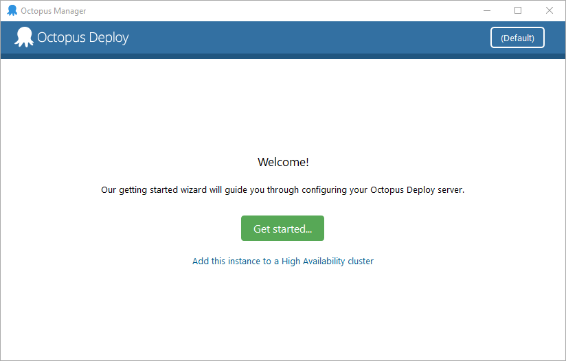
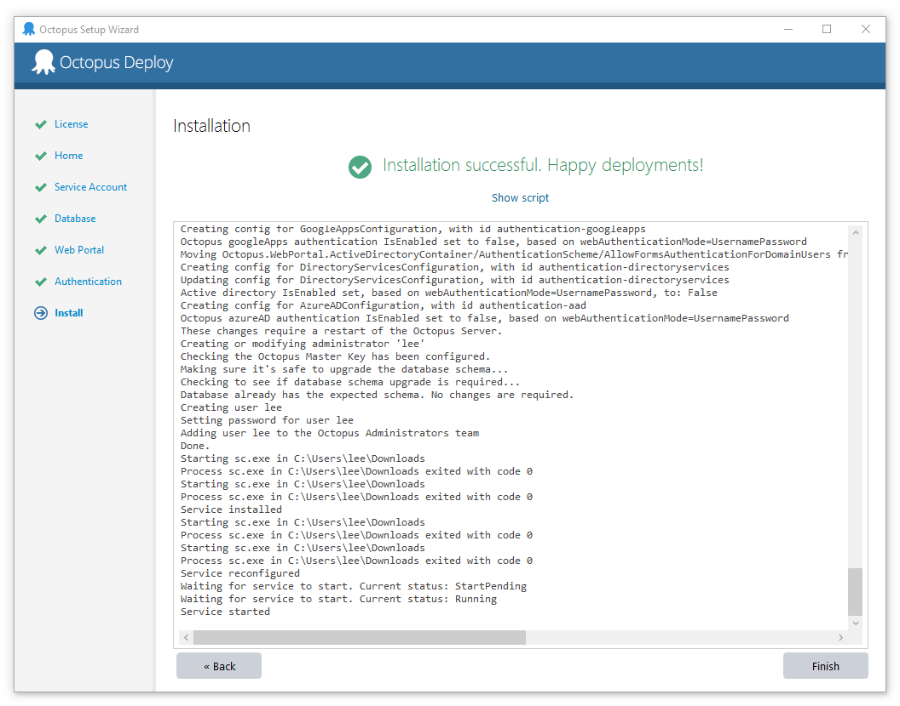

Octopus offers a no obligation 45 day free trial to give you a chance to evaluate the software and make sure it meets your application deployment needs.  If you've ever thought about spinning up your own Octopus and kicking the tentacles (please don't kick any tentacles), this blog post will help you set up a local evaluation instance so you can run through the process of automating a deployment without hooking it up to any critical infrastructure. In this post, I’m setting everything up in a single VM running Windows 10.

## Downloads

Next, you'll need to download the Octopus Server MSI, Octopus Tentacle MSI, and an SQL Server Database:

* [Octopus Deploy Server](https://octopus.com/downloads).
* [Octopus Tentacle installer](https://octopus.com/downloads).
* [SQL Server Express](http://www.hanselman.com/blog/DownloadSqlServerExpress.aspx).

For the purposes of this blog, we’re using SQL server express.

## Install SQL Server

First, we’ll install the SQL Server Database. Select the basic installation, accept the license and the defaults, and click install.

We’ll let Octopus configure the database in the next step.

## Install Octopus

Start the Octopus Server installer, accept the license and the defaults. When the installer is done, click finish to launch the Octopus Manager and click **Get Started...**. 

Enter your name, organization, and email address to activate the license. Accept the default storage location or select your own.

When you get to the **Database** screen, click the dropdown next to **Server Name** to detect the SQL Server you installed earlier. After the server name has been populated, leave the **Authentication** option with the default **Windows Authentication** and give the database a name by entering the name into the **Database** field.

For instance, **OctopusDB** and click **Next**.

Accept the default ports for the web portal. Add a username, email, and password to the authentication screen. You’ll use these to log into the web portal. 

The web portal is where you configure your infrastructure, define your release process, manage projects, and deploy applications.

Click **open in browser** to log onto the Octopus Web Portal using the username and password you created during installation.

## Infrastructure

Octopus organizes the machines (whether you’re deploying to physical servers or Microsoft Azure) into environments. Follow these steps to create an environment.

1. From the **Octopus Web Portal Dashboard**, select {{Infrastructure>Add Environment}} then click **ADD ENVIRONMENT**.
1. Give the environment a name; we’ll use “Test”.
2. Select the overflow menu and click **Add Deployment Target**. We're going to set up a listening tentacle, so select **Listening Tentacle**.
3. Copy the thumbprint, the long alphanumeric string further down the screen. Paste this somewhere you can access it. You'll need it soon.
4. Add a hostname. I'm using Localhost.

Next, we'll need some infrastructure to deploy to. We're going to configure a tentacle on the same machine as the **Octopus Server**. Tentacles are a lightweight deployment agent service that runs as a Windows service. You install them on the machines you plan to deploy software to. 

Start the Octopus Tentacle installer. Accept the license and the defaults. Click **Finish** to launch the **Tentacle Manager**. Click **Get Started** and accept the default storage options.

Select **Listening Tentacle**, on the next screen paste in the thumbprint you copied earlier, clink **Next**, and then **Install**.

Back on the Deployment Targets page of the portal, click **Discover**. Next, we give the deployment target a name, I'm going with **test-server**. Select the environment you set up earlier, and add a role, I'm using **web-server**, now save the settings.

If you click on the **Infrastructure** tab, you can see:

* Environments
* Deployment Targets
* Target Status
* Target Roles

If your deployment target is showing any warnings, select the target, and on the next screen click the overflow menu and select health check. I selected upgrade Calamari and let Octopus run the upgrade. After the upgrade, the target status shows as healthy.

And you’re good to go.

This gives you a working instance of Octopus, albeit, in a configuration that lets you evaluate the look and feel of Octopus and peek under the hood, but not a configuration that many people will use to deploy real world software.

Depending on what you want to deploy you could check out the [documentation](https://octopus.com/docs/getting-started) to learn about [packaging](https://octopus.com/docs/packaging-applications) and [deploying](https://octopus.com/docs/deploying-applications) your apps, watch our videos, or browse through the blog.