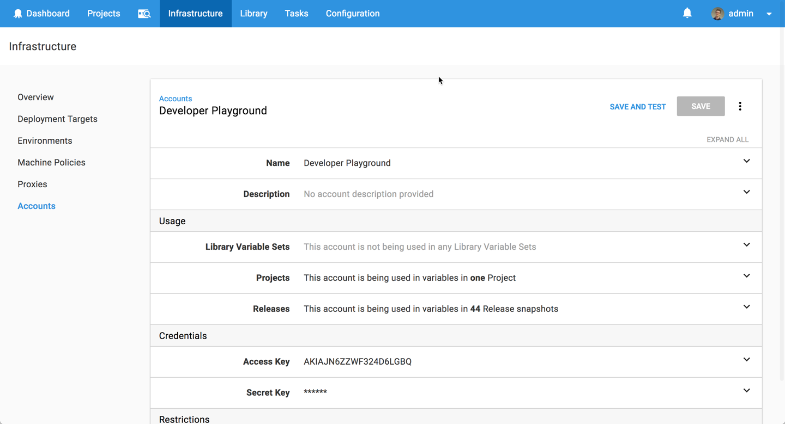

Welcome to another **Will it Deploy?** episode where we try to automate the deployment of different technologies with Octopus Deploy.  In this episode, we're trying to deploy a Spring Boot web app to Amazon Web Services platform with cloud infrastructure provisioning as well as ensuring we have a zero-downtime production deployment.

<iframe width="560" height="315" src="https://www.youtube.com/embed/Pd2Wya6kvIU" frameborder="0" allow="autoplay; encrypted-media" allowfullscreen></iframe>

## Problem

### Tech Stack

Our app is a quote generator called [Random Quotes](https://github.com/OctopusSamples/WillItDeploy-Episode002). The application is pretty simple, but it lets us illustrate how to deploy a Java web app to Amazon Web Services platform.

* [Spring Boot](https://projects.spring.io/spring-boot/) web app.
* [JUnit](http://junit.org/) unit testing framework, Mokito, and Hamcrest.

Kudos to our marketing manager [Andrew](https://twitter.com/andrewmaherbne) who has been learning to code and built the first cut of this app. Great work! 

### Deployment Target

* AWS - [Elastic Beanstalk](https://aws.amazon.com/elasticbeanstalk/).
* Provision our cloud infrastructure with an AWS [CloudFormation Template](https://aws.amazon.com/cloudformation/).
* Zero-downtime production deploy - [applying the blue-green deployment pattern](https://octopus.com/docs/deployment-patterns/blue-green-deployments).

## Solution

So will it deploy? **Yes it will!** Our deployment process looks like the following.

The first step is to add an Octopus AWS account, which includes all the details required to connect to the AWS platform, safely and securely. It is used to authenticate with AWS when deploying or executing scripts.

Then we add the following steps to successfully deploy our app including cloud infrastructure provisioning and a zero downtime production deployment.

- Octopus **Transfer a Package** step to transfer the Spring Boot jar package to the Octopus Server.
- Octopus **Run an AWS CLI Script** step to copy the web app package to an S3 bucket.
- Octopus **Deploy an AWS CloudFormation template** step to provision our cloud infrastructure including creating our Elastic Beanstalk application and two environments.
- Octopus **Run an AWS CLI Script** step to deploy our web app to the green or staging environment.
- Octopus **Run an AWS CLI Script** step to swap the Elastic Beanstalk app environment URLs so that our green (staging) environment receives our blue (production) URL. This is only executed during a production deployment so that we achieve zero-downtime!

This project uses the following variables to store our resource group name, website name, and app settings. Nice and simple!

This episode's [GitHub repo](https://github.com/OctopusSamples/WillItDeploy-Episode002) contains all the resources and links used in this video.

### Wrap-up

We hope you enjoyed this episode as we have many more in the works! If there's a framework or technology you'd like us to explore, let us know in the comments.

Don't forget to subscribe to our [YouTube](https://youtube.com/octopusdeploy) channel as we're adding new videos regularly. Happy deployments! :)
