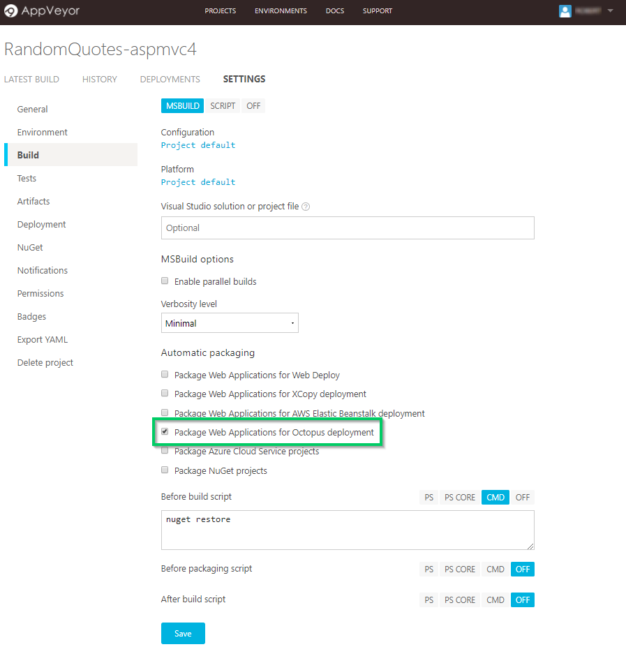
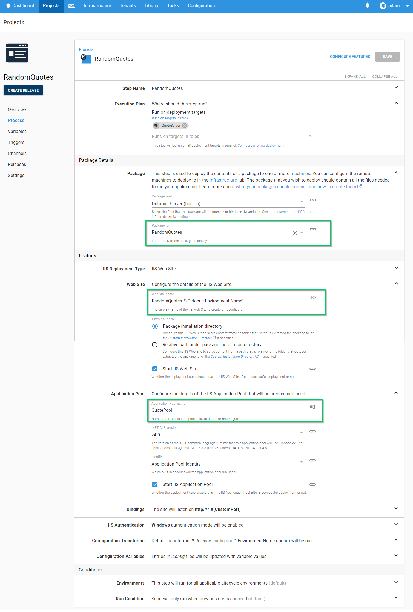
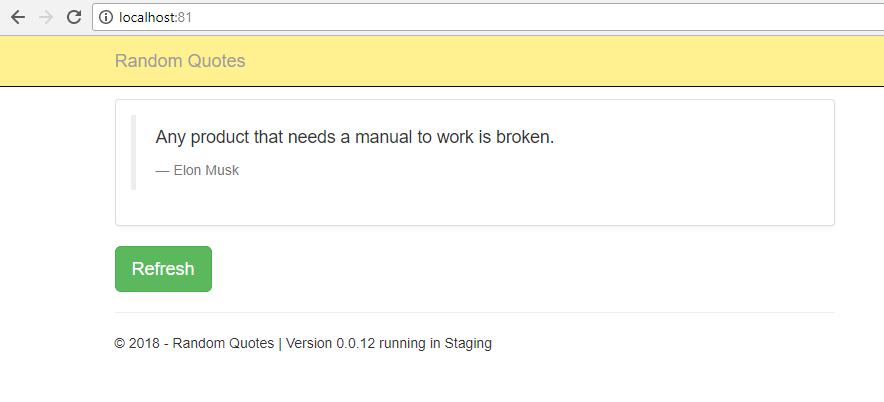
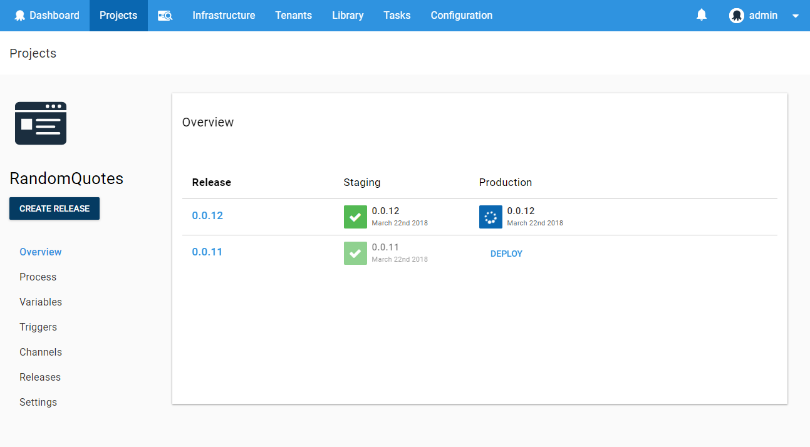
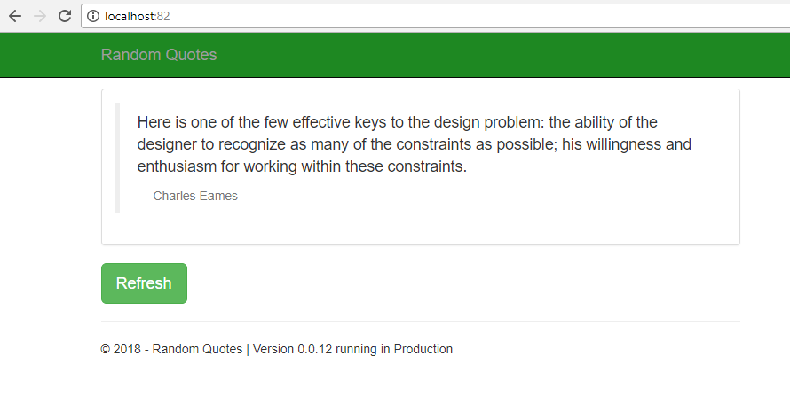

The fantastic team at [AppVeyor](https://www.appveyor.com/) have recently added built-in support for pushing and deploying your projects (.NET, Java, JavaScript etc) with Octopus Deploy. AppVeyor is a cloud-hosted continuous integration tool which is quite popular amongst open source projects, particularly in the .Net space. From direct integration with your source control to deployment plugins like their new Octopus Deploy offering, AppVeyor provides a simple out-of-the-box solution to building your application without having to manage your own build infrastructure. Each build gets its own clean environment with all the tools you need to kickstart your automated CI solution. Now with the new Octopus integration, the process will become even easier.

**Used in conjunction with our upcoming [Octopus Cloud](https://octopus.com/cloud) offering, you will soon be be able to create a cloud-based, completely scalable continuous deployment pipeline without having to manage a single machine yourself. How exciting is that!**

Lets take a look an example of how to make the most of this new offering.

## AppVeyor Octopus Plugin
After a simple and free sign-up process, we can start by creating a new AppVeyor project, I've added the `OctopusSamples/RandomQuotes-aspmvc4` GitHub repository as the source code repository. There are a whole range of other repository options available from BitBucket to VSTS. The public [OctopusSamples/RandomQuotes-aspmvc4](https://github.com/OctopusSamples/RandomQuotes-aspmvc4) repository provides a basic ASP.NET MVC app to display a bunch of wise quotes. Our goal is to set up a delivery pipeline to deploy this website to our IIS server for both a staging and then production environment.

### Build & Pack
Looking at the build phase, you should notice a `Package Applications for Octopus Deployment` flag.



This flag ensures that once the build has completed, the contents are zipped up into a package that can be pushed to Octopus Deploy. Although Octopus will accept any NuGet, zip, or tar package this flag will make use of `octo.exe` to [create a zip](https://octopus.com/docs/packaging-applications/creating-packages/creating-zip-packages), named using the application name and version of this AppVeyor project.

### Push
In the `Deployment` configuration, select the new `Octopus Deploy` deployment provider. This feature performs all the appropriate calls to pass the package into Octopus and create a related Octopus [Release](https://octopus.com/docs/deployment-process/releases) .


After adding your Octopus Server URL and API Key, tick the `Push Packages` option to allow AppVeyor to auto-detect the Octopus package built in the previous step. AppVeyor will then push the package to the Octopus [built-in NuGet feed](https://octopus.com/docs/packaging-applications/package-repositories/pushing-packages-to-the-built-in-repository). Although Octopus supports [automatic release creation](https://octopus.com/docs/deployment-process/releases/automatic-release-creation) when a new package is available, in this scenario we will trigger it through AppVeyor. Click the `Create Release` checkbox and provide the name of the project, `RandomQuotes` which we will later set-up in Octopus and which AppVeyor will programmatically trigger.


#### Source Controlled Configuration
Another great feature of AppVeyor is the ability to provide your build configuration via an `appveyor.yml` file that lives alongside your code instead being set through the web portal. This means the process an be tied directly to the source code which allows for easy versioning and for your build steps to evolve with your project. Read their [docs](https://www.appveyor.com/docs/build-configuration/#appveyoryml-and-ui-coexistence) for more information on how this works in practice. This approach is similar to a feature that we at Octopus are working through to allow the deployment side of your CD pipeline to be stored via source control configuration. [Check out the ideas](https://github.com/OctopusDeploy/Specs/blob/master/ProcessAsCode/index.md) on how we might approach "deployment configuration as code" and let us know what you think.

**With our AppVeyor build pipeline set up, let's now jump into our Octopus Server and get this website deployed.**

## Continuing Deployment Through Octopus

To match with the configuration we just provided in AppVeyor, create a new project and give it the name `RandomQuotes`. For our simple deployment scenario, we will first go to the `Process` section and simply add a new IIS step.
With the `Deploy to IIS` step selected, we will add a few settings to provide Octopus information to enable creating and configuring the IIS website.



After providing a role that maps to the target where we have IIS available, we will configure which package will be used for this step. Using the built-in feed (which AppVeyor will be pushing to) we can provide the PackageId `RandomQuotes`.

Configuring the website itself at its simplest consists of setting just two additional values, The `Website name` and the `AppPool`. For this example, we will host both `Staging` and `Production` on the same machine (not the best idea for a real project), so we will provide a different website name based on the environment being deployed. The `#{Octopus.Environment.Name}` section of the name will be replaced at deploy time with the name of the environment.

 In addition to the `Website Name` we have also decided to provide a different binding port between  `Staging` and `Production`. This value `#{CustomPort}` is set in the `Variables` section of the project and can be scoped to a different value based on various combinations of deployment contexts like environment, machine or [tenant](https://octopus.com/docs/deployment-patterns/multi-tenant-deployments), to name just a few.


A common pattern is to define variables in Octopus for the different environments which are replaced in configuration files used by the application at run time. Using them during the deployment process opens up a wide range of advanced scenarios.

For our `RandomQuotes` project, we have a config transformation file for each of our environments. The `Web.Production.config` transformation that looks like:
```xml
<?xml version="1.0"?>
<configuration xmlns:xdt="http://schemas.microsoft.com/XML-Document-Transform">
  <appSettings>
    <add key="ReleaseVersion" value="#{Octopus.Release.Number}" xdt:Transform="SetAttributes" xdt:Locator="Match(key)"/>
    <add key="EnvironmentName" value="#{Octopus.Environment.Name}" xdt:Transform="SetAttributes" xdt:Locator="Match(key)"/>
    <add key="BackgroundColor" value="#1e8822" xdt:Transform="SetAttributes" xdt:Locator="Match(key)"/>
  </appSettings>
  <system.web>
    <compilation xdt:Transform="RemoveAttributes(debug)" />
  </system.web>
</configuration>
```

Notice the value for `ReleaseVersion` includes a template pattern provided during a deployment. (jump to the end of this post if you can't stand the suspense and what to see what this looks like).

## Commit and Enjoy

We now have our automated CI/CD pipeline configured. When we commit a change to our project, AppVeyor will automatically detect and pick up the changes from GitHub, build the project, and push it to our Octopus Server. From that point on, Octopus Deploy takes over and deploys it to our `Staging` environment. Once we are happy with this release, we can deploy to `Production` with the click of a button. The same built package that has been tested will then be pushed to our production environment using new values provided by our variables.


When the deployment occurs, Octopus will apply any web.config transformations in your project and perform variable replacements so that the same built artifact is run in each environment, ensuring that the code that you test is the code that you run in production.

**Staging**



With the staging version of our application available we can inspect and test it before kicking off a deployment to production...



**Production**



Notice how the transformation has been applied changing the colour of the navbar, while the port and other variables have been updated based on the environment being deployed to.

For more information about this new feature, be sure to read our [docs](https://octopus.com/docs/api-and-integration/app-veyor)

## AppVeyor + Octopus = Deploy Any Time

AppVeyor in combination with Octopus Deploy offers a new and exciting way to automate your continuous delivery pipeline in a repeatable, reliable manner. Say goodbye to hand rolled custom scripting solutions which break down at 5pm on a Friday. Flex the powers of AppVeyor's new feature today with a [free Octopus trial](https://octopus.com/licenses/trial).

Happy Deployments!
