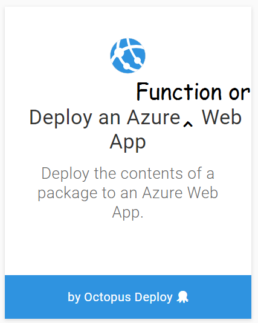
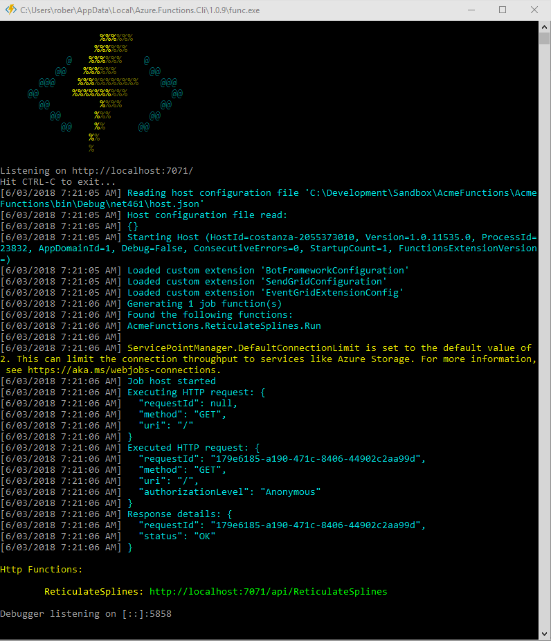
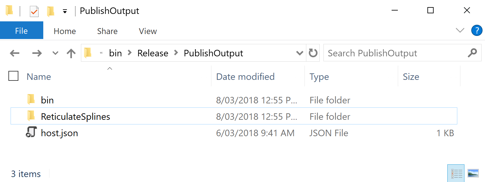
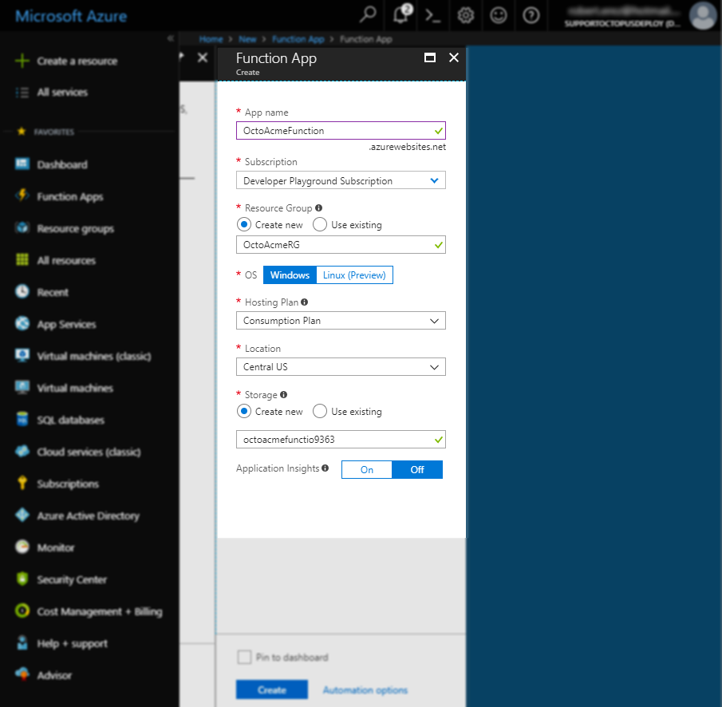
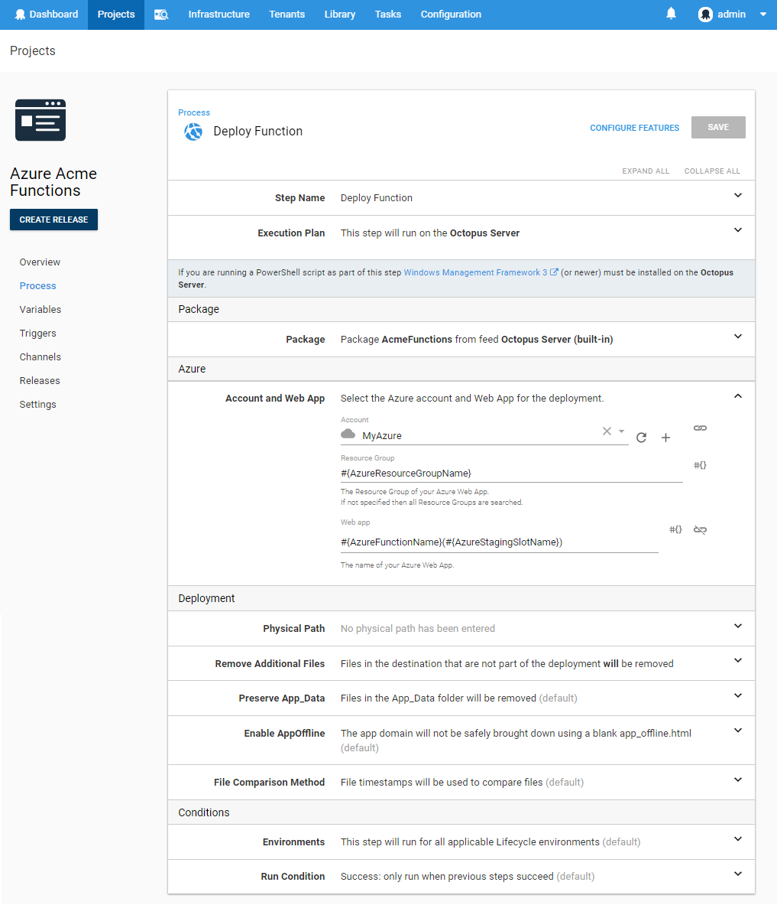
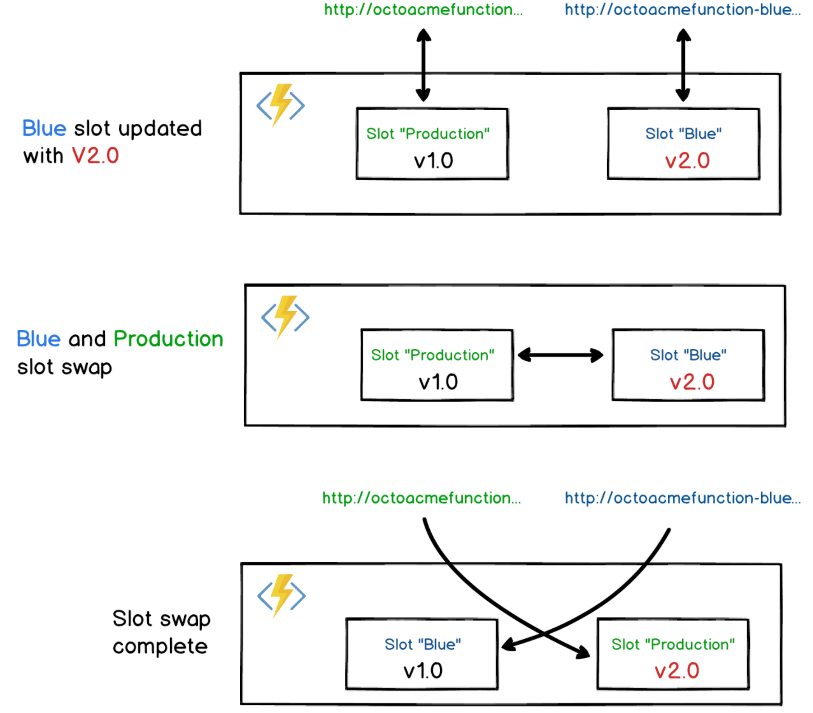

According to many cloud providers, the **serverless computing** application model is the way of the future (citation needed). AWS Lambdas and Azure Functions both allow you to write code that costs you for the actual usage that they incur. While this means you will now be forced to literally pay for writing sloppy code, it also allows you to write and deliver loosely-coupled services that only add to your bill when that code is executing and costs nothing when it’s idle.

At Octopus Deploy, we expect to provide first-class support for AWS Lambdas in the coming months, so stay tuned for their arrival. As it turns out, Azure Functions are basically just [Azure Web Apps](https://azure.microsoft.com/en-us/services/app-service/web) under the hood with a few extra handlers on top, so our existing **Deploy an Azure Web App** steps still fits the bill.



To prove the point and show that I’m not trying to avoid doing the work of adding a new Azure Function step, let’s take a look at building and deploying a basic Azure Function through Octopus Deploy.

## Create and package a simple Azure Function project

For our simple Azure Function, we will create a HTTP triggered endpoint that returns a JSON payload containing some values we want Octopus to provide during deployment.

### Visual Studio project

If you are creating the functions via Visual Studio, make sure you have [Visual Studio 2017 v15.4](https://www.visualstudio.com/vs/) or later, which includes the Azure SDKs.

Create a new project and select the `Azure Functions` project type. Right click on the project, **Add New Item**, and add an **Azure Function**.

Replace the generated class with the following:

```C#
    public static class ReticulateSplines
    {
        [FunctionName("ReticulateSplines")]
        public static async Task<HttpResponseMessage> Run([HttpTrigger(AuthorizationLevel.Function, "get", Route = null)]
            HttpRequestMessage req, TraceWriter log)
        {
            log.Info("Incoming Request request.");
            var myName = Environment.GetEnvironmentVariable("MyName", EnvironmentVariableTarget.Process);
            var release = Environment.GetEnvironmentVariable("Release", EnvironmentVariableTarget.Process);
            var reponse = new {Message = $"Hello {myName}", Release = release};
            return req.CreateResponse(HttpStatusCode.OK, reponse);
        }
    }
```
When invoked, this function will pull variables named `MyName` and `Release` and return them to the user in a JSON response.

Open the `local.settings.json` file in the solution explorer and add the following properties:

```json
{
  "IsEncrypted": false,
  "Values": {
    "MyName": "Steve",
    "Release":  "0.0.0"
  }
}
```

These values are used during local development. If you run the solution from Visual Studio, the Azure Functions development environment should start up and provide a local endpoint that you can test your code with.




### Package for Octopus

Unfortunately, due to the output of Azure Function projects, the standard [`OctoPack`](https://octopus.com/docs/packaging-applications/creating-packages/nuget-packages/using-octopack) generated NuGet package will not work. The configuration files for the functions are generated _after_ the build phase, which is when Octopack is configured to kick in. We recommend using `dotnet publish` to publish the project to a directory, then package the generated files:



Luckily, since Octopus will happily deploy anything that has been packaged into a zip, we can leverage a different Octopus command-line tool called [`octo.exe`](https://octopus.com/docs/packaging-applications/creating-packages/nuget-packages/using-octo.exe).
Using your standard build tool (or even locally for testing purposes), ensure that the current working directory set is the to the project directory and call:

```shell
dotnet publish --output bin\Release\PublishOutput --configuration Release
cd bin\Release\PublishOutput
octo pack --id=AcmeFunctions --format=zip --outFolder=./dist --version=9.14.159-pi
octo push --server=http://myoctopusserver.acme.com --apiKey=API-ABC123IS4XQUUOG9TWDXXX --package=dist/AcmeFunctions.9.14.159-pi.zip
```

Substitute the relevant values for your Octopus Server, API key, and version information. Alternatively, you can package and push the contents of the project as a zip using one of our plugins for [TeamCity](https://octopus.com/docs/api-and-integration/teamcity), [VSTS](https://octopus.com/docs/api-and-integration/tfs-vsts), [Bamboo](https://octopus.com/docs/api-and-integration/bamboo), or the soon-to-be-available [AppVeyor](https://www.appveyor.com).

## Create the Azure Function

Although I could use the **Deploy an Azure Resource Group** step in a separate deployment project to spin up an Azure function, to keep this demo simple, I'll create the function through the Azure portal directly.

From the portal, click the **Create a resource** button and search for **Function App**. Fill out the details and take note of the `App name` and `Resource Group` values as we need to add them to our Octopus project shortly. When the Function App has been created, open it up and go to the **Function App Settings** page and enable slots. This feature is currently marked as *preview*, and while not necessary, it will allow us to create a Blue\Green deployment pattern. With this strategy, we first deploy to one slot and confirm that it’s configured and running correctly before swapping it with the *Production* slot. In this case, the term *Production* is different to a *Production environment* from an Octopus *Production* environment. It simply refers to the fact that the Azure Function has multiple endpoints that can be configured independently. With the feature enabled, create a new slot called *Blue*:



## Create an Octopus Project

We will now create the project in Octopus deploy that will push our package to Azure with a Blue\Green deployment strategy and provide the appropriately scoped variables for use inside our function.

> **NOTE:** The appropriate model for deploying Azure Functions across multiple environments in Octopus Deploy is to have a **separate Azure Function for each environment**. This allows us to safely configure the functions at each stage without changes potentially leaking across environments. We recommend that you _do not_ try to use multiple slots on a single function to model environments. Azure functions are cheap and cost you nothing except for when being used so **there is no reason to try and "squeeze" them together as is sometimes done with other cloud resources.**

### Add Variables

Since we will need to script out a couple of post-deployment steps to deal with slot-swapping, putting all the configuration into the variables section of the project allows us to consolidate them all in one place and vary them across environments. In the case of a standard deployment lifecycle, we would typically use different Azure ResourceGroups and/or Azure Function Apps across the different Octopus environments.

For our simple one environment scenario these values are:

    - AzureFunctionName = "OctoAcmeFunction"
    - AzureResourceGroupName = "OctoAcmeRG"
    - AzureStagingSlotName = "Blue"
    - MyName = "Max Powers"


### Step 1: Deploy Function

As noted above, Azure Functions effectively use the same architecture under the hood as standard Azure Web Apps, and so we can create a project in Octopus that uses the **Deploy an Azure Web App** step to push the package.

Using the project variables defined above, set the resource name and Web app. Since we plan on deploying first to the Staging slot, the Web App name for this step takes the format of `<WebAppName>(<SlotName>)`:



### Step 2: Update AppSettings

Although we could perform variable replacement to configuration files during the package upload process, the recommended way to deal with configuration values for Azure Functions is through AppSettings. These expose themselves as environment variables to the running function process.

The AppSettings also contain other environment variables used by Azure Functions itself, so we can’t just wipe away any values contained within it. The safest method is to first load the existing variables, update the few key properties we want to change, and then update the whole collection (The Azure PowerShell cmdlets don’t provide a granular approach to modify individual values).

Create a **Run an Azure PowerShell Script** step and provide the following script:

```powershell
function UpdateAppSettings {
 param( [string]$ResourceGroup, [string]$FunctionAppName, [string]$Slot, [hashtable]$AppSettings )

    Write-Host "Loading Existing AppSettings"
    $webApp = Get-AzureRmWebAppSlot -ResourceGroupName  $ResourceGroup -Name $FunctionAppName -Slot $Slot

    Write-Host "Applying New AppSettings"
    $hash = @{}
    ForEach ($kvp in $webApp.SiteConfig.AppSettings) {
        $hash[$kvp.Name] = $kvp.Value
    }

	ForEach ($key in $AppSettings.Keys) {
        $hash[$key] = $AppSettings[$key]
    }

    Write-Host "Saving AppSettings"
    Set-AzureRMWebAppSlot -ResourceGroupName $ResourceGroup -Name $FunctionAppName -AppSettings $hash -Slot $Slot | Out-Null
    Write-Host "AppSettings Updated"
}

UpdateAppSettings -AppSettings @{"MyName" = $OctopusParameters["MyName"]; Release = $OctopusParameters["Octopus.Release.Number"]} `
	-ResourceGroup $OctopusParameters["AzureResourceGroupName"] `
    -FunctionAppName $OctopusParameters["AzureFunctionName"] `
    -Slot $OctopusParameters["AzureStagingSlotName"]
```

Notice how we have provided the Octopus variables that we want to be applied to the AppSettings. This allows us to be precise about what our function needs rather than blindly passing across _all_ Octopus variables and assuming that _something might_ be needed.

Once this and the preceding step is run during a deployment, the *Blue* slot will have been updated with the latest package and its variables. The previously deployed version of this Function (assuming this is not the first time the process ran) will still be available from the *Production* slot. All traffic to `https://octoacmefunction.azurewebsites.net/api/ReticulateSplines` will still go to the previous version, but the endpoint at `https://octoacmefunction-blue.azurewebsites.net/api/ReticulateSplines` will now use the new deployment which we can test and make sure works as expected. The next step will then swap these slots around so that requests without the slot name go to what we currently have deployed in the *Blue* slot:


### Step 3: SwapSlot

There is another existing step that was built for Azure Web Apps that we can also put to good use with Azure Functions. Add a new step and search for the **Switch Azure Staging Deployment Slot** step in the step library. Provide the variables for `ResourceGroupName`, `AppName`, and `SlotName` that were provided in the first step above. For the `AzureAccount` field, you will currently need to get the account ID for the Azure account you have configured in Octopus. This can be seen in the URL when you view the account through the Octopus Portal. In the coming weeks, we expect this requirement to go away as we provide a typed variable for [Azure Accounts](https://octopus.com/docs/deployment-process/variables/azure-account-variables.md) in the same way that we have done for [AWS Accounts](https://octopus.com/docs/deployment-process/variables/aws-account-variables.md).


The `SmokeTest` configuration will hit the host address of the function, and although it is more relevant for warming up Web Apps, it doesn’t hurt to make sure the function has deployed successfully.

## Deploy

With each deployment, the *Blue* slot will act as the update target, and then the external pointer to the two different slots will be switched around (remember it’s effectively a _name_ swap, the content itself does not move around). If the new deployment starts encountering problems, the option is available to swap the slots _back_ around so that traffic is again delivered to the previous version (though we always encourage the roll forward approach where possible):



## Azure Functions in Octopus

As we have seen, although Azure Functions provide a new mechanism to develop and host code, the underlying infrastructure is largely built upon the Azure WebSites offering, and so it _already_ works within Octopus Deploy out-of-the-box. Managing these deployments through Octopus provides a simple and easy to understand process that allows anyone to leverage the power of this new *serverless* approach to computing. With our future plans to provide first-class support for AWS Lambdas soon, there is no excuse not to try these new offerings.
