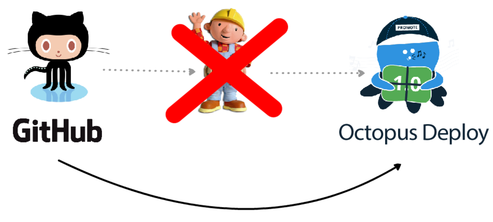
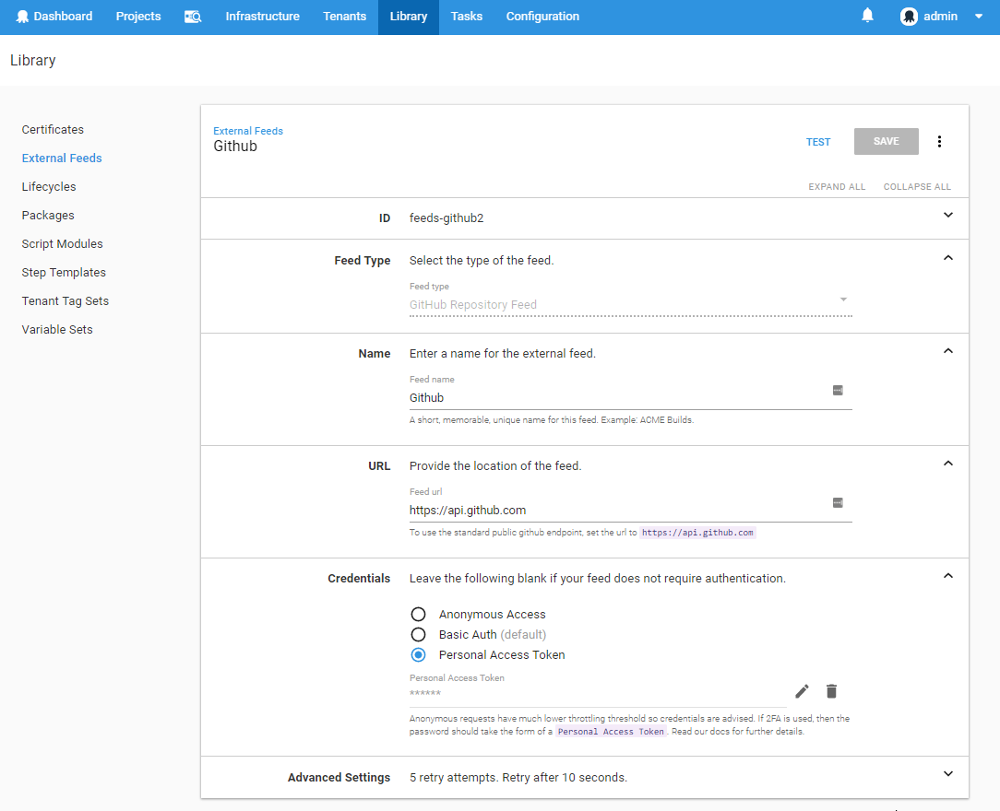
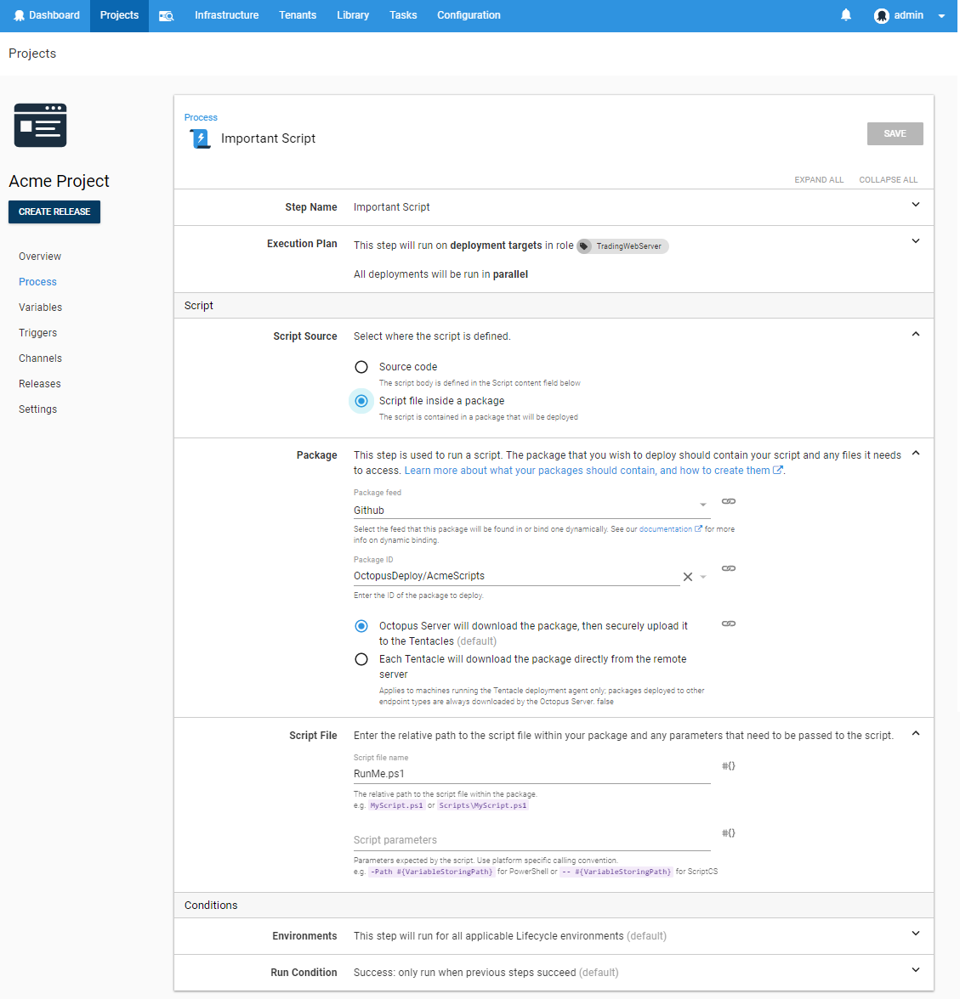
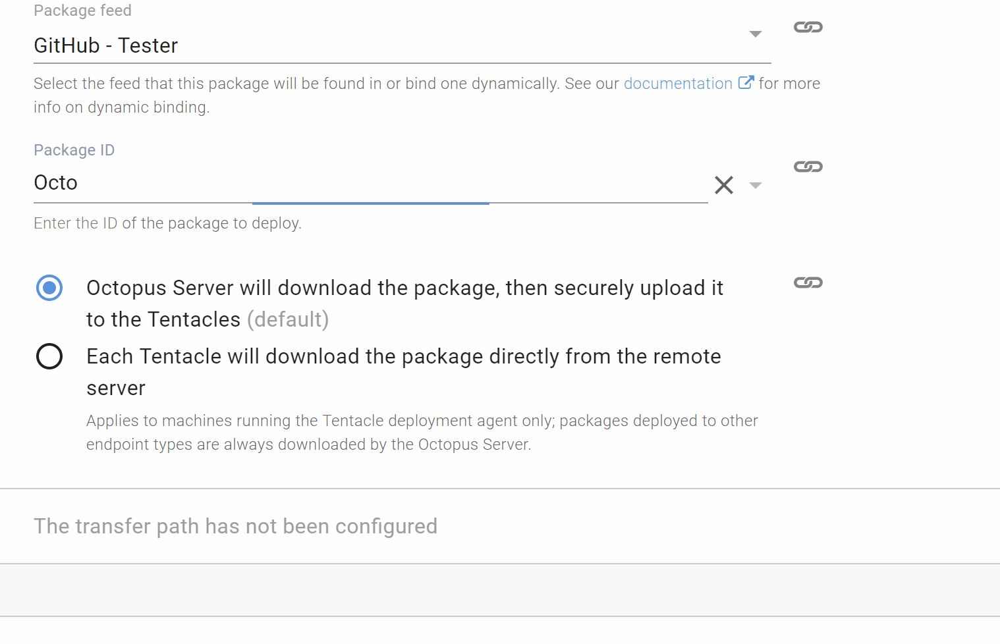
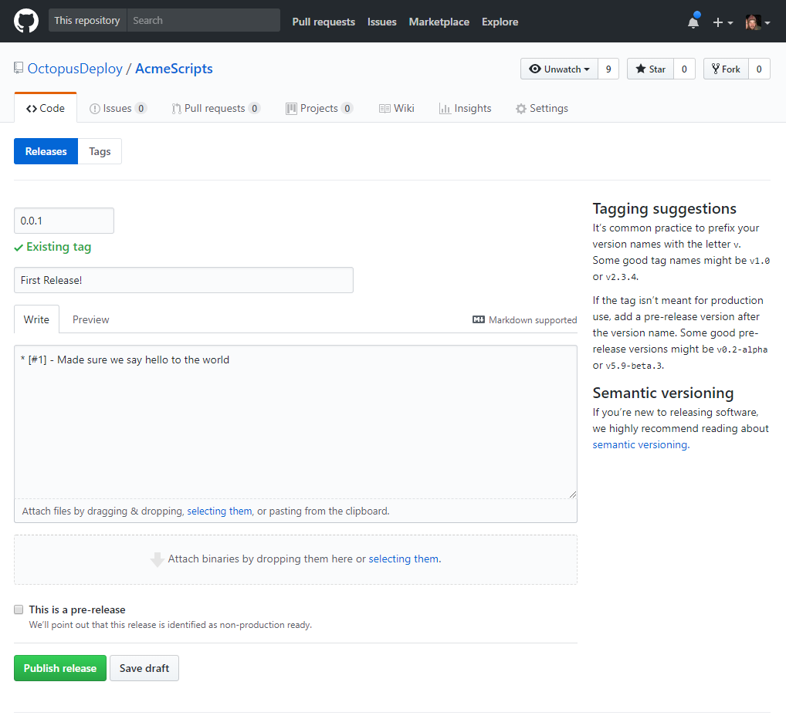
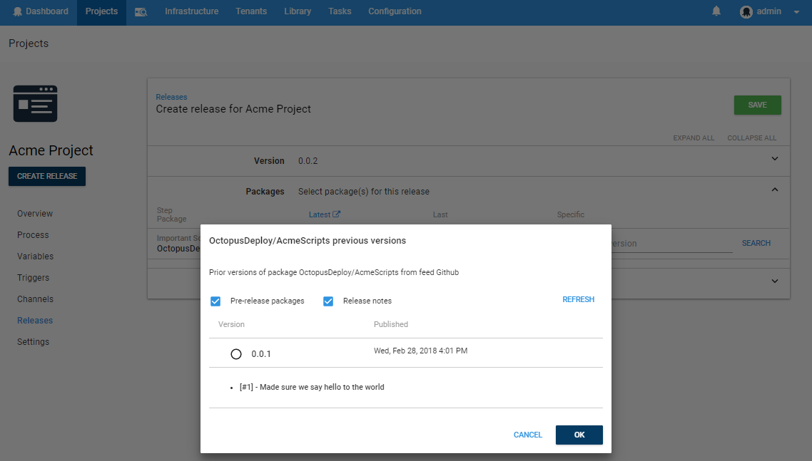
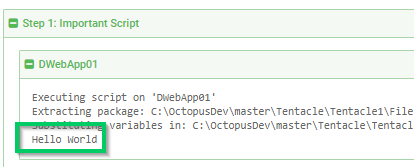

## Giving You GitHub
Sometimes you just want to deploy your app, but it doesn't need a build step. It might be a repository where you just store your Cloud Formation templates, a bunch of scripts to run within Octopus or a simple app you’re running in an interpreted language like nodejs. The GitHub feed type provided in `2013.3.0` provides a new way for you to access resources during an Octopus deployment. **That right, you heard correctly, we now support using GitHub as a feed source.**


> We now support using GitHub as a feed source.

This new feed type allows Octopus to deploy files directly from GitHub without any additional intermediate build steps. This means no more packaging your scripts just so that they can be used in Octopus and a better experience when storing parts of your deployment process in source control. **Tag, push, then deploy directly from Octopus, no build server necessary**



### Ins and Outs
From a deployment resource point of view, build artifacts from a package repository in many respects, look like completely different concepts to code sitting in source control. By looking at how we model the various parts of a NuGet package, we can, however, see some similarities in how the GitHub "package" package can be modeled to fit the Octopus ecosystem.

| Feed Type        | Feed Uri           | Package  | Version |
|:-------------:|:-------------| -----|---|
| **NuGet**      | Any feed that supports the NuGet v2 or v3 api (e.g. https://api.nuget.org/v3/index.json) | The name of the package, typically defined in the `.nuspec` file. (e.g. `Octopus.Clients`) |A distinct instance of the package versioned through the `.nuspec` file with the [semver 2](https://semver.org/) version format.|
| **GitHub**      | Any GitHub endpoint that supports the v3 api. This can be the standard public endpoint or private GitHub installations. (e.g. https://api.github.com)   | The full repository identity including the owner. (e.g. `OctopusDeploy/Calamari`) |A distinct tag that can be parsed as a [semver 2](https://semver.org/) version. If a release exists for that tag, then those release notes are shown in Octopus alongside that package in the release details.

This feed type was built to provide an easy way to treat GitHub resources as packages without the added complexity that comes with dealing with branches and commits. Since these concepts don't map very well to existing Octopus concepts, the decision was made to simply read and parse the tags on the repository and treat them as the version used by Octopus when identifying specific packages to deploy. Incidentally, since GitHub provides downloadable zip packages based on tags, this provided a simple mechanism to retrieve the files needed to then integrate into the existing Octopus deployment flow just as simple zip packages. Some further points are made at the end of this post outlining some future thoughts around _Git_ as a feed type. It's also worth pointing out that at the moment _only the source files_ are deployed by Octopus. Other binaries linked to the GitHub release are currently not included however this might change in the future.

## What Does it Look Like?
A classic example of a "package" that doesn't need a build process is a script stored in version control outside of Octopus but is run as part of a deployment. The following sections look at how we might configure a deployment to execute a script from the `OctopusDeploy/AcmeScripts` GitHub repository.

### Setting Up the Feed
To begin with, let's look at creating a GitHub external feed in Octopus.



As you can see, we have provided the ability to set the [Personal Access Token](https://github.com/blog/1509-personal-api-tokens) as opposed to just username and password. This allows you to create what GitHub refers to as a [Machine User](https://developer.github.com/v3/guides/managing-deploy-keys/#machine-users) which is effectively a GitHub user in the organization which is used for these sorts of automated tasks.

It is important to provide one of the authenticated options for Octopus to use when accessing the GitHub endpoints since anonymous requests are [rate limited](https://developer.github.com/v3/#rate-limiting) by GitHub to a much lower value than authenticated requests.

### Using the Package
"Packages" from this feed are treated exactly the same as any other package. In this scenario, we will select a script step and source our `RunMe.ps1` script from a package. The packageID is the full `Octopus/AcmeScripts` name which identifies our `AcmeScripts` repository.



Note that when you search for the package, if you omit the `/` character, it will search across all repositories (that your account has access to). Adding the `/` without the repository will list all packages by that owner, and adding a repository name will search for repositories by that owner.



### Adding the GitHub Tag

We now have Octopus configured, and we just need to add the PowerShell script to our GitHub repository `OctopusDeploy/AcmeScripts` which will then execute during our project.

```bash
echo Write-Host Hello World > RunMe.ps1
git add RunMe.ps1
git commit -m "Ready To Run"
git tag 0.0.1
git push
git push --tags
```

Just for good measure, we will also add some release notes to this tag through the GitHub portal.



### Creating a Release
Since we don't currently support Automatic Release Creation from external feeds (watch this space), Octopus doesn't know we just pushed this new tag until we create a new release (I'll cover using GitHub WebHooks + Azure Functions to trigger deployments in a future post).



At deployment time, Octopus will download the source code from that tagged commit through the GitHub API.

From that point on it, is effectively treated the same as a typical zip file through the deployment process, allowing it to be extracted, transferred or used as the source of scripts and templates.



> Look ma', no build!

## Future Plans
It's worth restating again that this new feed type is purely built upon tags and releases. Concepts like branches, commits, and heads are not _directly_ relevant when using the new feed type. You can _indirectly_ work with branches by tagging your commits in those branches appropriately (Keep in mind that once you merge those commits back into the `master` branch, then the tag might then end up referencing a commit that's in the `master` branch).
There are plans afoot to provide real Git-as-a-feed support where commits\branches will be treated more first class, but it was decided to keep this GitHub feed work separate.

One of the other points mentioned above is the lack of hooks from GitHub to trigger releases and deployments. Due to the nature of many of our customer's networks, calling in from the outside world is not always available. As a result, we will consider other mechanisms to support ARC from external feeds that are more practical.

## Git as a Package Feed
We are excited about the opportunities this new feed type brings to Octopus users. Using GitHub as the source of some of your deployment dependencies will encourage simplifying your CI pipeline and allow better versioning without the superfluous effort and time required to packaging up resources that don't really need to be packaged. Let us know your thoughts about this new direction and how it might come in handy in your deployment processes.
