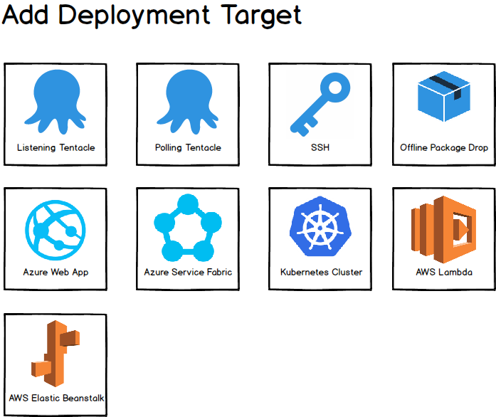

Octopus is a release-management and deployment-automation tool.  Not surprisingly, the concepts exposed in Octopus reflect this: Releases, Deployments, Environments, and _Targets_. 

Originally, Tentacle (i.e. a Windows machine running the Tentacle agent) was the only target type. Over time new targets have been added, and a few have been removed (e.g. FTP).

The current (as at March 2018) list of available targets is:

- Listening Tentacle
- Polling Tentacle
- SSH
- Offline Drop
- Cloud Region

With the exception of Cloud Region, these targets all represent connections to Windows or Linux machines (indirectly in the case of Offline Drop).

## PaaS

_[The Cloud enters, stage left]_

The world is changing. More and more, a deployment is not targeting a group of machines, but rather a platform-as-a-service endpoint such as an Azure WebApp, an AWS ElasticBeanstalk, or a Kubernetes cluster. There were a few options for how we model these.  

One of the strengths (we believe) of Octopus is that it models deployment concepts in a way that matches how people think and speak about them. Specifically, in Octopus-language, deployment targets live within environments.  This is a surprisingly rare approach.  Many of the tools that play in the same space are primarily build\CI servers, and as such have a different concept of environments and targets\agents.  

We made the decision to model the various flavors of PaaS as deployment targets.   

_This sounds familiar..._

Those of you who have been using Octopus for a while may remember that we started down this road once before.  When Octopus 3.0 was released, we [modelled Azure Web Apps and Cloud Services as targets](https://octopus.com/blog/deployment-targets-in-octopus-3).  Then we [changed our minds](https://octopus.com/blog/azure-changes).  

For the full details of why, please read the linked post.  In summary, it was because we didn't have an answer for people who wished to dynamically provision their infrastructure during deployments.  This was a mistake we greatly regret, but in many other ways the Azure target-types were pretty great. And we won't make that mistake again (see Dynamic Provisioning below). 

### PaaS Zoo

Which PaaS flavors will be supported?

As a first phase, in our April release (2018.4.0), we will add:

- Azure Web Apps (which also represent Azure Functions)
- Azure Service Fabric

In the coming months we will add:

- AWS Lambda
- Kubernetes 

And no doubt more will follow. 

## Benefits

Modelling these PaaS endpoints as deployment targets brings a number of benefits. Two in particular are worth mentioning.

### Multiple Targets in an Environment 

[Roles](https://octopus.com/docs/infrastructure/environments/target-roles) in Octopus provide a simple yet powerful ability to execute a step across multiple targets.  Targets are assigned one or more roles. Steps in a deployment-process specify which role they should execute on, and the step will then be executed once for each target matching that role. 

Admittedly with PaaS targets this ability isn't required as often as it is with machines.  For example, when deploying your web app to virtual machines, you must deploy to each machine in your cluster. Whereas with an Azure Web App for example, you just deploy to the PaaS endpoint and it scales internally (this is one of the key benefits).  But... you may have multiple Azure Web Apps in different geographic regions.  The combination of targets and roles provides an easy mechanism to deploy to all of these. Or you may have a multi-tenant application where each tenant has their own web app.  Targets + roles + tenants = a lovely way to model this.  

### Putting the Ops in DevOps

By explicitly modelling PaaS endpoints as self-contained targets which live in environments, Octopus has valuable information and concepts which wouldn't exist if the PaaS targets existed only as configuration values dispersed throughout variables and deployment-processes.  This opens many possible feature avenues, which we are excited to explore.  For example:

- Operations processes which execute against an environment. e.g. running custom health-check processes, or a backup task. 
- Custom status\diagnostic pages for targets. e.g. which pods are running on my Kubernetes cluster? 

## Dynamic Provisioning

## Pricing

Octopus licensing is machined-based, which has meant that Octopus has not charged for PaaS targets.  Historically deployments to PaaS endpoints have comprised a small proportion of overall Octopus usage, so this hasn't been a big problem.  But the trends are clear, and there is no reason to think adoption of the cloud-provider platform-as-a-service offerings won't continue.   

We have been investing significantly in these technologies, and will continue to do so.  So while the move to model these as targets wasn't _necessary_ to price them (there were other options), and certainly wasn't _the_ reason, it does provide a simple and clean way to include them under our licensing. 

As of the 2018.4.0 release of Octopus, the PaaS targets will be included in the machine count for licensing.

We genuinely hope this doesn't seem unreasonable. 

## Migration

There will be no breaking changes. Everything you have configured today will continue to work.

As of the 2018.4.0 release, if you wish to create new _Deploy Azure Web_ or _Deploy a Service Fabric App_ steps you will need to first configure targets in the appropriate environments.  

If you have any concerns or questions, please don't hesitate to reach out.