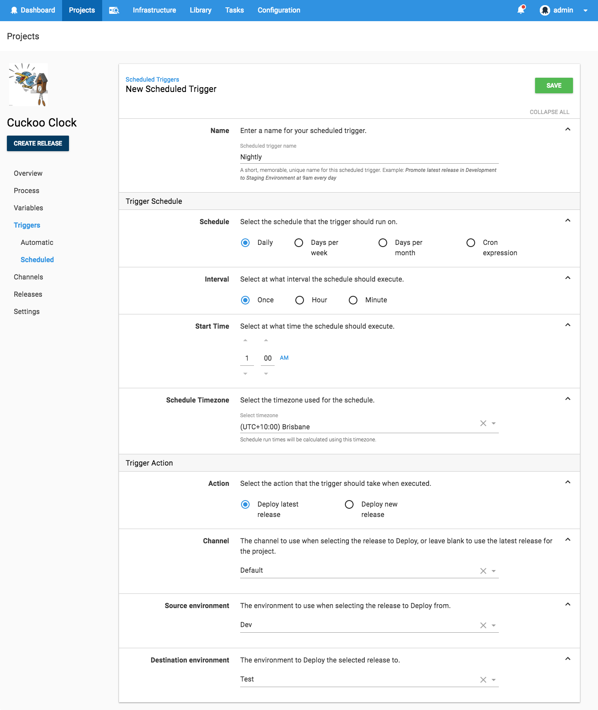

Since forever (at least in internet-time), Octopus has had the ability to schedule deployments for a specific time in the future.   
What was missing was the ability to schedule a deployment to _recur_ (this feature was known internally as _DTGAAA: Deployments That Go Again and Again_).  

This was a hugely popular [UserVoice item](https://octopusdeploy.uservoice.com/forums/170787-general/suggestions/6599104-recurring-scheduled-deployments) at #4 on our list with 460+ votes. 

## Why

Imagine you have the canonical three environments: `Dev`, `Test`, and `Prod`.

The development team have their continuous-integration pipeline configured so that everytime they push new commits, it builds and pushes the packages to Octopus where an automatic deployment is performed to the `Dev` environment.  This is the target both for the automated system tests and also an opportunity for the developers to perform any manual checks desired. 

The QA team want the latest version available each day, but they would also like it to be relatively stable, and not constantly shifting beneath them.  So they schedule a deployment which will run each night, and promote the latest release from `Dev` to the `Test` environment.  When the QA team arrives in the morning, they can check the release notes in Octopus, and see which new and shiny features those hard-working developers have delivered the previous day.  

If the QA team is satisfied, they can manually trigger a promotion of the release from `Test` into `Prod`. 

Or of course you may have a completely different use-case for this feature.  Please feel welcome to tell us in the comments, we'd love to hear about it.

## Here It Is 

You can create the schedule in hopefully every way you could ever want to: 

- Daily
- Days of the week
- Days of the month
- Cron expression 
- Halley's Comet appearances (ahh, actually this one didn't make the final cut)

Because timezones are hard (for example, the client and server can be different), we allow you to explicitly choose the timezone.  

- sometimes when we do our job right it means you interact with octopus less
- we have always had ability to schedule.. but not to recur
- why?
- implementation
- when it will ship
