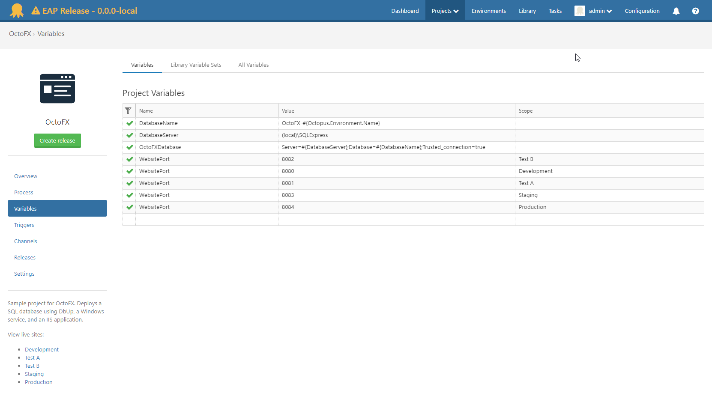
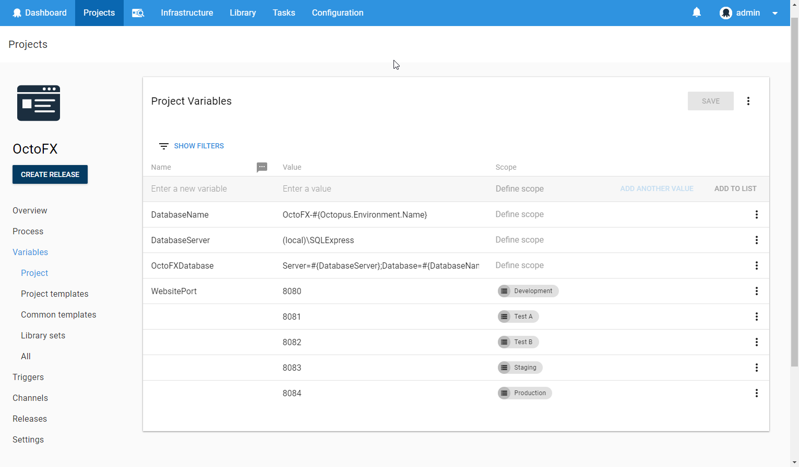
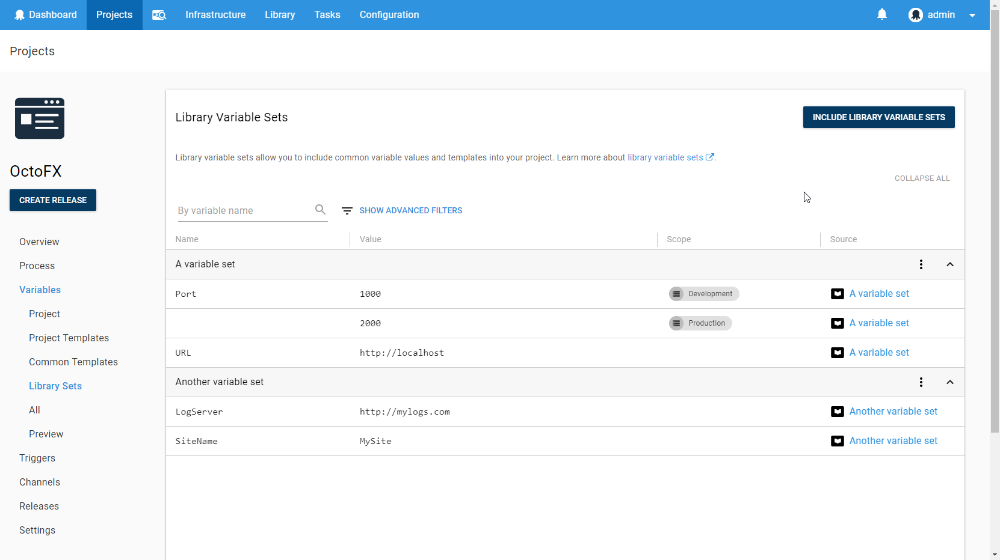
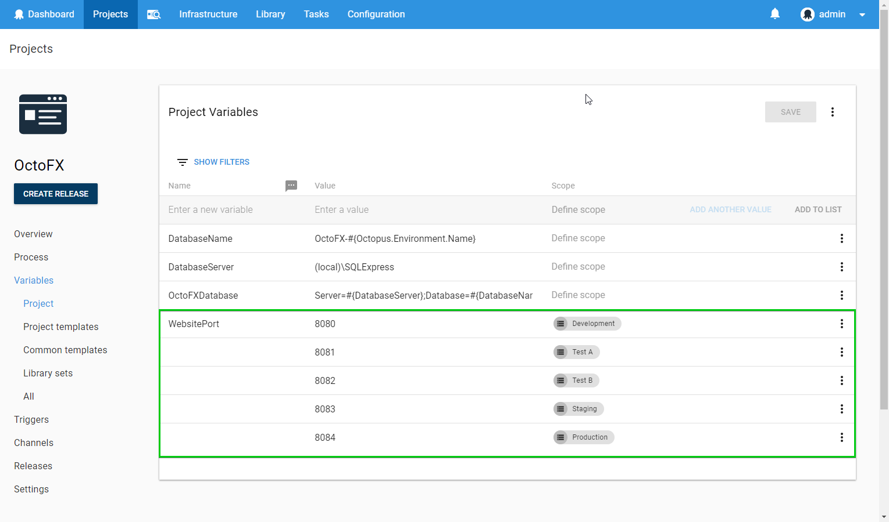
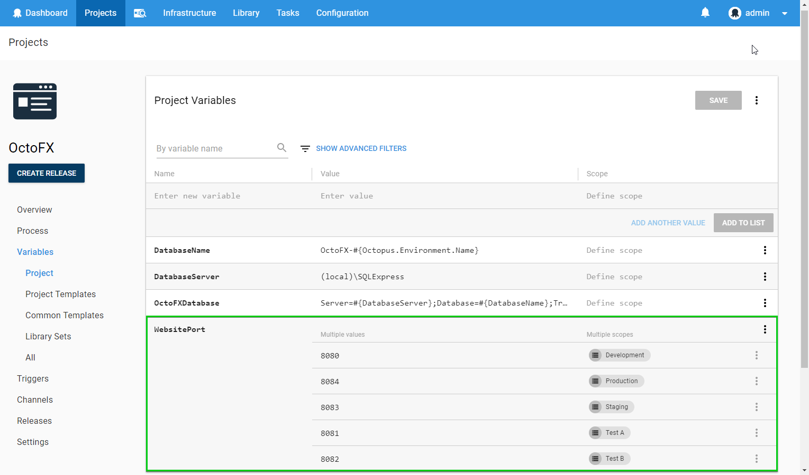
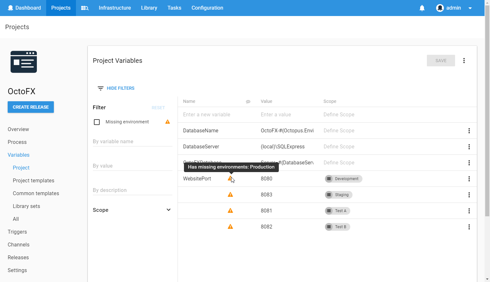
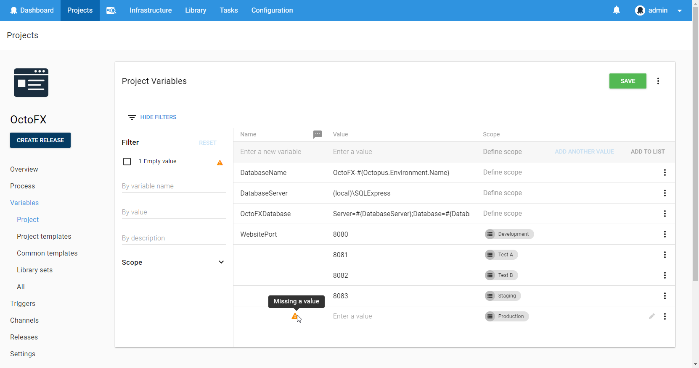
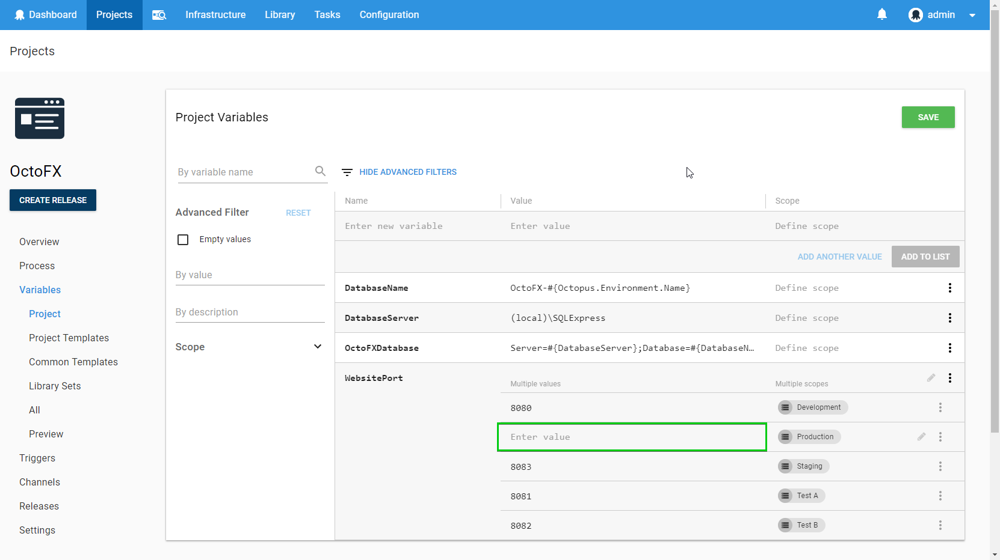
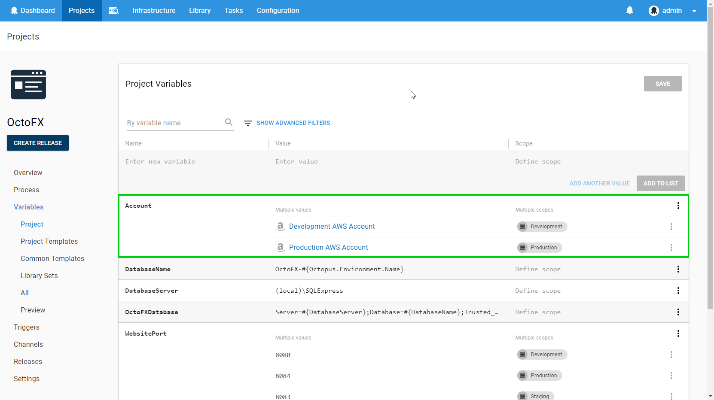

As part of the UI overhaul that occurred in Octopus 4.0, we took the opportunity to [redesign the Variable Editor](https://octopus.com/blog/octopus-v4-variable-editor).  This was a pain point for many of our users and was a highly requested change. Let me take you on a journey through the changes we have made to the Variable Editor!

## The Old Variable Editor

The Variable Editor used to look like this:

It was based on [SlickGrid](https://github.com/mleibman/SlickGrid) and it had a number of problems that we wanted to solve as part of the redesign:
- There was no grouping or sorting of variables.
- Two clicks were often required to highlight part of the text.
- Filters were not discoverable or easy to apply.
- It was necessary to enter a popup to edit variable scopes.

By far, the most important shortcoming of the old variable editor was the fact that it was difficult to extend. It was an area of code that received very little attention and any changes were often risky to make.

## The New Variable Editor

In 4.0, we shipped the new Variable Editor. It looked something like this:

It improved on the old Variable Editor in a number of ways:
- The ability to focus and select text with one click.
- Variables are automatically grouped by their name.
- Filters are discoverable and easy to use.
- Scope can be edited without a popup.
- The ability to add descriptions to variables.
- Support for a large number of variables using virtualization.

However, there were some still some major problems with this implementation:
- Users were unable to resize the columns.
- It was slow to render when scrolling, which made the experience feel unresponsive.

We decided that we would not delay the release of 4.0 in order to fix these issues, but instead focus on fixing them as soon as possible.

## Resizable Columns

In the old Variable Editor, users were able to resize the table columns. This was useful when you had long variable names or values and you wanted to resize the columns so that you could see more information. Omitting this feature proved to be problematic for a number of our users. The problem was made worse by the fact that the font size was larger in the new Variable Editor, leaving less space to display critical information.

In version 4.0.11 we shipped a Variable Editor in which you could resize columns.

These resizable columns were implemented with the help of the [react-dnd](https://github.com/react-dnd/react-dnd) library and works by applying a percentage width to the columns after you have resized them. The advantage of using a percentage width as opposed to a fixed width is that it automatically responds when the user resizes the browser window.

## Scrolling Performance

Scrolling was a big problem with the initial release of the Variable Editor, and it did not only affect large variable sets.

The problem is that rendering a row is a relatively expensive operation. One of the main reasons it is expensive is because of the specific components we are using in the Scope column. The widths of these chips need to be measured in order to calculate how many chips we can show in the available space.

Each render of this cell involves
1. Rendering _all_ of the chips.
2. Measuring _all_ of the chips (this involves an expensive browser reflow).
3. Re-rendering only the chips that we can fit alongside a "Show More" button.

This happens for each row in the variable editor as it scrolls into view because we are using virtualization, and this is the main reason that rendering is slow. An alternative to this approach would be to render all rows up front without virtualization, but this makes the initial render very slow. For a large variable set, this becomes painfully slow and is an even worse problem than the scrolling performance.

To address this problem, we were able to make a number of optimisations to the way we render and measure these components. There were a number of things that we were measuring more often than we needed to, and we were also able to minimise the cost of some of the reflows. These changes ended up having a noticeable impact on performance.

We also discovered that we were unnecessarily re-rendering more components than we needed to as the user scrolled. We focused on only rendering the bare minimum when you scroll, by using [immutable data structures](https://reactjs.org/docs/optimizing-performance.html#using-immutable-data-structures) and implementing [shouldComponentUpdate](https://reactjs.org/docs/react-component.html#shouldcomponentupdate) in a few key components.

The combination of these changes made the scrolling performance acceptable in both Chrome and FireFox.

IE11 and Edge seemed to have different performance characterstics, and we are still not satisfied with the scrolling performance in these browsers (although it now performs significantly better than it used to be). We have not yet worked out the root cause for these differences, so this is an ongoing investigation. For now, we have mitigated this issue by disabling virtualization for smaller variable sets that can perform an initial render in a reasonable amount of time.

## Lazily Load Variable Sets

If you view the Library Variable Sets page from within a project, you can see a collection of variables from each included Library Variable Set, grouped into expandable sections.

Each Library Variable Set was loaded from the server from a separate request when this page was loaded. If you had a large number of Library Variable Sets, then this was problematic because it could hit the browser request limit and this meant the whole page took a very long time to load. Even if we did load the Library Variable Sets in a more efficient way, it could still take a long time to load all of the data for this page if you included a large number of Library Variable Sets.

We decided to change the way we load data on this page so that it behaves more like the Environments page, where the content of each Environment is only loaded when you expand that Environment. Additionally, we optimised the way requests are made by adding a new endpoint to our API that allows you to load multiple Variable Sets at the same time.

All filtering of variables happens on the client side, so we needed to still make it possible for users to search through all variables in all Included Variable Sets. Fortunately, we have an `Expand All` button on the top of the page which has the side effect of loading all variable sets. If a user wanted to search all of their variable sets for a specific variable, then they can first `Expand All` of the variable sets, and then apply their filter.

## Variable Grouping UX

As part of this change, we wanted to change the way that users think about variables. In the old Variable Editor, each variable had a name and a value. If you wanted to change the value of a variable in a different scope (for example, a different Environment), then you would need to create a whole new variable and make sure that it had the same name as another variable.

| Variable    | Value   | Scope         |
|-------------|---------|---------------|
| WebsitePort | 1000    | Development   |
| WebsitePort | 2000    | Test          |
| WebsitePort | 3000    | Production    |

The new model that we wanted to introduce to our users was that a variable can have multiple values. Users can declare which values they want to use in different scopes. Since all of the values are associated with the same variable, they will use the same variable name at execution time.

| Variable    | Values             |
|-------------|--------------------|
| WebsitePort | (1000 for Development), (2000 for Test), (3000 for Production) |

We started off by only changing the UI to reflect this new model which meant that we could maintain backwards compatibility for the API. This meant that we were simply grouping variable by name in the UI, which many users found to be confusing at first.

A common complaint was that the name was missing for certain variables. It is easy to see why users thought that this was the case, because at first glance the main functional difference between the new Variable Editor and the old Variable Editor appeared to be that variable names were sometimes missing.

We ended up iterating on this design a few times, and came up with a new design which emphasised that we are showing multiple values and scopes for variables. There is now a separate "header" row in the Variable Editor for each variable that has multiple values. This also solved another problem that we had: we now had a sensible place to put an overflow menu that contained actions that were specific to the whole variable, rather than the individual values.

## Variable Warnings

The new Variable Editor has a number of different warnings and messages to provide more information to the user about the state of their variables and guide them towards crafting maintainable variables.

### Missing Variable Scopes

Originally, we wanted to add a warning that showed when a user was missing a value for a variable for a specific Scope. For example, if you had a variable which had values for Development and Test, but not Production, then you might expect the deployment to fail during production because there is a missing variable value.

This warning ended up being overly complex to get right. Consider a situation where you have a project with channels, and the channels use different lifecycles. We would need to check that each environment in each channel would have a value scoped to it.

The story gets even more complex when you consider that there are a number of other ways to scope your variable values such that there will be a valid value in every possible deployment scope. A common way to do this is to have a single unscoped value which applies to any environments which don't have a value explicitly scoped to them. However, there are other ways of achieving the same result. For example, instead of having an unscoped value, you could have a value scoped to the specific deployment steps which uses that variable.

We ended up removing this feature before the initial release of the Variable Editor because it proved too difficult to implement in a way that did not produce a large number of false positives.

### Empty Values

We shipped the new Variable Editor with the ability to show warnings to indicate when a variable value was empty.

We thought that it would be rare that this is what the user actually wants to do. However more users that we were expecting were using empty values in valid ways. The warning indicator ended up being a bad visual indicator for those users. It made them think they had done something wrong, and it also added a lot of visual noise. There was also no way to suppress this warning, which meant that they would be stuck forever with a useless warning. We still thought there was value in being able to filter to variable values that did not have a value, so we decided to just remove the warning indicator.

## New Features

As part of our improvements to AWS support in 2018.2, we added first class support for AWS accounts as a new type of variable. With the new Variable Editor, this was a relatively easy extension to add and works in the same way as Certificates.

## Variable Unification

We are starting to think about where the Variable Editor might go next, and the next major project we are thinking about has been internally named the "Variable Unification" project.

There are a few ideas around what will be involved as part of this project, but one thing we would like to do is re-use the Variable Editor when you are defining Tenant Variables. At the moment we are using a custom Tenant Variables UI component instead, but there is no reason why we shouldn't be able to use the Variable Editor in its place. This will solve a number of outstanding performance and usability issues with this part of the UI.

We also want to revisit how variable templates work and how we can improve the variable experience so that users have some confidence that they have specified all of the correct variables for their deployment. As part of this, we will probably change our variables API to reflect the new model for variables, where a single variable can contain multiple values. In fact, we have just finished refactoring our client side code so that it consistently uses this new model for variables and values.

## What's Next?

The Variable Editor has come a long way in the last 6 months, and this feels like just the beginning of its journey. What would you like to see in the next version of the Variable Editor?

