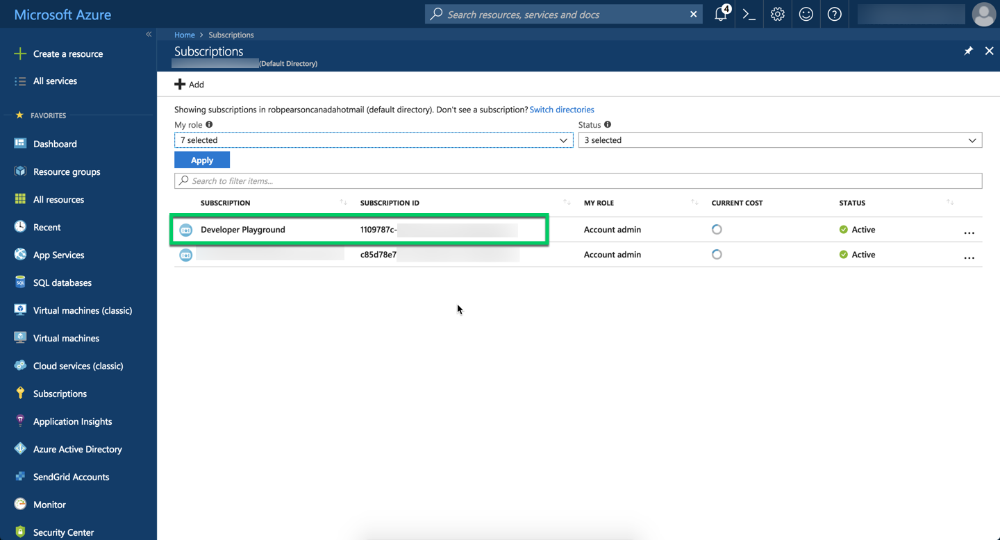
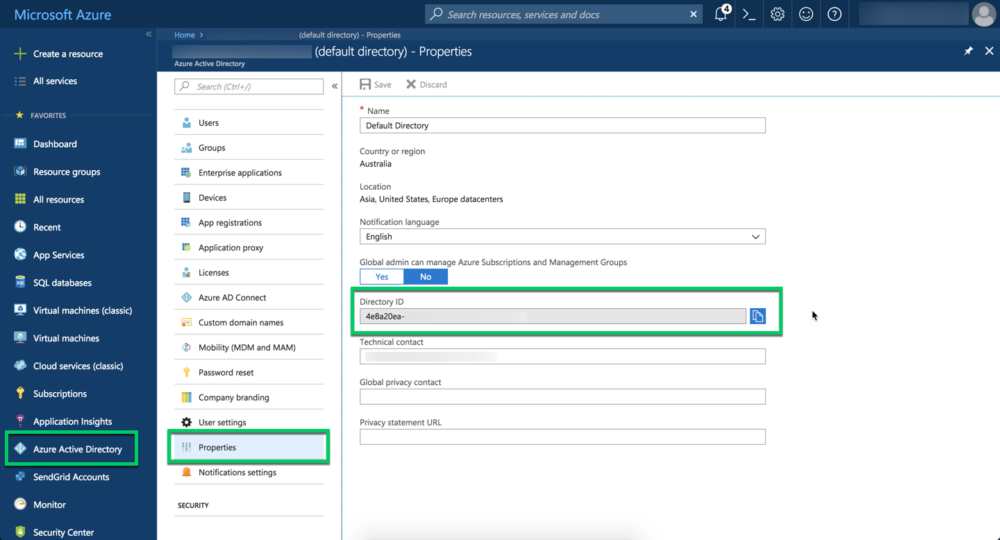

Octopus Deploy integrates with popular cloud services like [Amazon Web Services (AWS)](https://aws.amazon.com/) and [Microsoft's Azure platform](https://azure.microsoft.com/) to make it easy to deploy your apps safely and securely. Integrating with Amazon is as simple as adding your AWS Access Key and Secret Key however, Azure requires a few more details and it's not immediately obvious how to set things up. This is enabled by Azure Active Directory (AAD) registered applications (or app registrations) but it can be tricky to setup so we're going to take a deeper look.


Octopus requires four values which are utilised to authenticate with Azure and interact with it securely. 

* Azure Subscription ID
* AAD Tenant ID
* AAD Registered Application ID
* AAD Registered Application Password/Key

The first three values are GUIDs and the final one is a password. These values can be found via the Azure Portal or via Powershell. Personally, I stuggle to remember where to find all the values are found so we'll walk through the process now of finding/creating them.

<iframe width="560" height="315" src="https://www.youtube.com/embed/TODO" frameborder="0" allow="autoplay; encrypted-media" allowfullscreen></iframe>

## App Registration in the Azure Portal

### Azure Subscrition ID

This one is easy. Navigate to the Azure Portal `Subscriptions` blade and pick the appropriate Subscription ID.



### AAD Tenant ID

This is another easy one. Navigate to the `Azure Active Directory` service and select the Properties blade. The Directory is your AAD Tenant ID. NOTE: This value is a GUID.



### AAD Registered Application ID and AAD Registered Application Password/Key

If you have created an AAD registered application, then it's relatively straight forward to note the Application ID and Password/Key. Navigate to to the Azure Active Directory service and select the App registrations blade. Make sure to click `View all applications` if you don't see anything there. If you have already created an registered application for integration, select the app and note the Application ID. 

If you haven't created an application, Click the New application registration and fill in the appropriate deails and then click `Save`. THen note the Application ID. 

Application Passwords are one-time genereated tokens and so if you don't already know your password, you'll need to generate a new one. If you haven't set one, the process is the same. 

Click the settings button and then the `Keys` blade. Add a new Password with a good description and click save. The password will be displayed after you click save. Be sure to note it as it won't be displayed again. 

That's it, you now have your registered Application ID and password.

### Permissions

The final step is to ensure your registered app has permission to work with your Azure resources. Navigate to the 'Resource Groups' service and select the resource group(s) that you want our application to access. Next, select the Access Control (IAM) blade and if your app isn't listed, click the `Add` button. Select the appropriate role (Contributor is a good option) and search for your new application name. Select it from the search results and then click Save.  


## App Registration with Azure PowerShell


```


```

## Wrap-up

Now your'e good to go. You can enter all these values into Octopus or utilise them in your own application to integrate with Azure.  

If you've ever struggled to add an Octopus Azure account, we hope this makes it a lot easier for you. If there's another part of the Octopus that is puzzling you, let us know in the comments.

Don't forget to subscribe to our [YouTube](https://youtube.com/octopusdeploy) channel as we're adding new videos regularly. Happy deployments! :)
