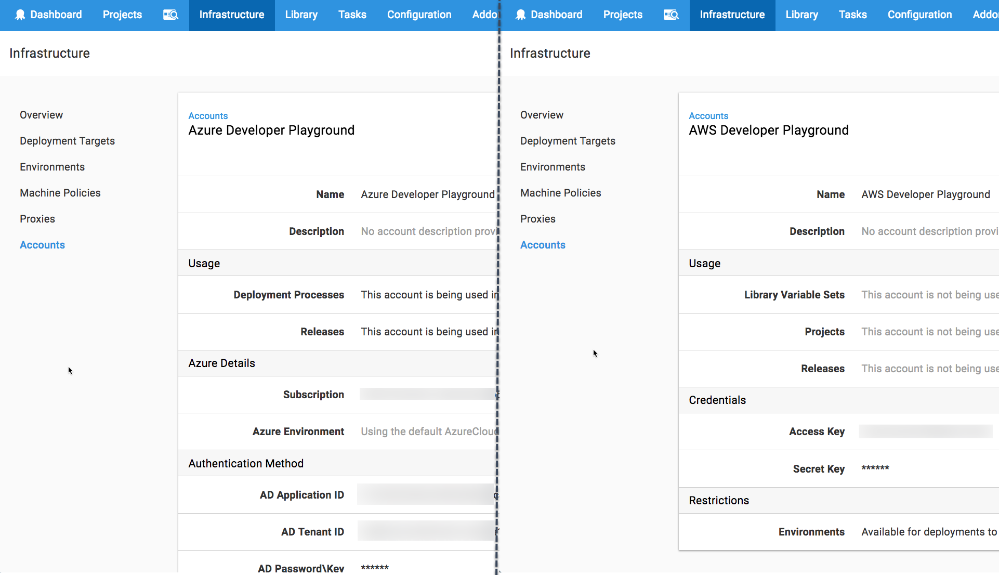

Octopus Deploy integrates with popular cloud services like [Amazon Web Services (AWS)](https://aws.amazon.com/) and [Microsoft's Azure platform](https://azure.microsoft.com/) to make it easy to deploy your apps safely and securely. Integrating with Amazon is as simple as adding your AWS Access Key and Secret Key however, Azure requires a few more details and it's not immediately obvious how to set things up. This is enabled by Azure Active Directory (AAD) registered applications (or applications registrations) but it can be tricky to setup so we're going to take a deeper look.

Octopus Azure Accounts require four values which are utilised to authenticate with Azure and interact with it securely. 

* Azure Subscription ID
* AAD Tenant ID
* AAD Registered Application ID
* AAD Registered Application Password/Key

The first three values are GUIDs and the final one is a password. These values can be found via the Azure Portal or via Powershell. Personally, I stuggle to remember where to find all the values are found so we'll walk through the process now of finding/creating them.

## Octopus Deep Dive

<iframe width="560" height="315" src="https://www.youtube.com/embed/KnN-ahD6nN4" frameborder="0" allow="autoplay; encrypted-media" allowfullscreen></iframe>

## Further reading

Checkout our [Azure docs](https://octopus.com/docs/infrastructure/azure) for further information include step by step instructures on how to create Octopus Azure accounts and other important issues like security and permisisons.

## Wrap-up

Now you're good to go. You can enter all these values into Octopus or utilise them in your own application to integrate with Azure. If you've ever struggled to add an Octopus Azure account, we hope this helps! If there's another part of the Octopus that is puzzling you, let us know in the comments and we'll take a look.

Don't forget to subscribe to our [YouTube](https://youtube.com/octopusdeploy) channel as we're adding new videos regularly. Happy deployments! :)
