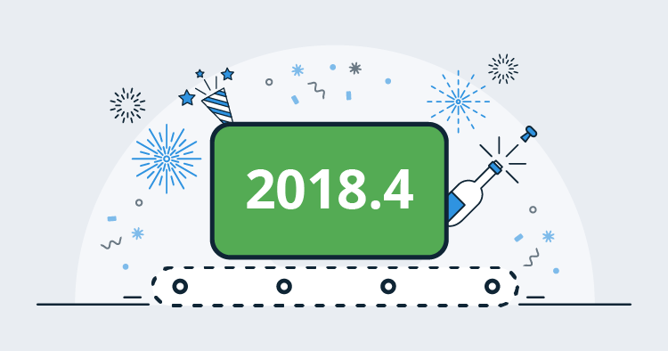
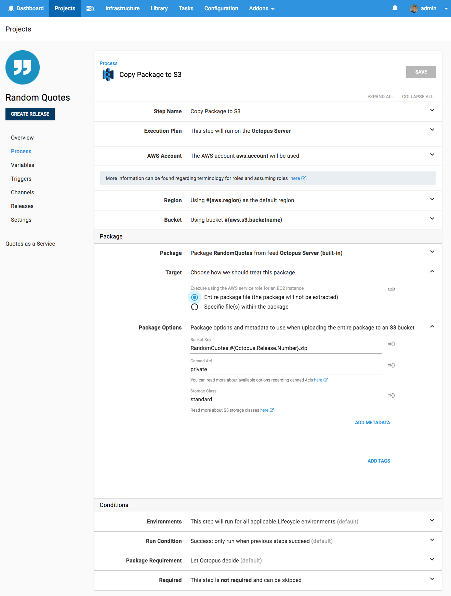

This month, we're shipping one our most highly requested features - 

## In this post

!toc

## Release Tour

<iframe width="560" height="315" src="https://www.youtube.com/embed/AR45wMd1_8o" frameborder="0" allowfullscreen></iframe>

## Recurring scheduled deployments

Octopus has long supported scheduled deployments. You can simply specify when to execute a deployment but this only worked a single time. Our new recurring scheduled deployments feature enables you to trigger a deployment as often as you like. This could be deploying a release to your test or QA environment for daily testing, or deploying your latest stable release every Friday at 5 pm or even spinning up and tearing down virtual infrastructure on a schedule to save money when it’s not being used ... like evenings and weekends. 

This story will become even stronger once we ship operations focused features enabling you to run [maintenance tasks](https://github.com/OctopusDeploy/Specs/blob/master/ProcessAsCode/index.md) on a schedule. Watch this blog for more information on upcoming features.

## First-class Amazon Web Services S3 support

We're continuing toCou improve our Amazon Web Services (AWS) support by adding a first-class S3 step. This greatly simplifies getting files/packages into S3 buckets and working with them in the AWS eco-system. 

## Required Steps

Deployment steps can be skipped at deploy time. There are times when this is undesirable. For example, you may have a manual intervention step to require approval. It is somewhat of a loophole that this can be skipped at deployment time.

## Breaking Changes

Automatically release creation (ARC) now enforces channel constraints when selecting packages.  Because channels can constrain packages to exclude pre-release packages, we will use the channel rules as a guard against pre-release packages and enable pre-release package selection by default. This means automatic release creation can start selecting pre-release packages for release create in a channel that has no channel rules, which differs from the existing behaviour and is a breaking change.

To continue only selecting stable packages for automatic release creation, setup the channel that automatic releases are created into to limit packages to those without pre-release tags (a pre-release tag of `^$`).

## Upgrading

As usual [steps for upgrading Octopus Deploy](https://octopus.com/docs/administration/upgrading) apply. Please see the [release notes](https://octopus.com/downloads/compare?to=2018.4.0) for further information.

## Wrap up

That’s it for this month. Feel free leave us a comment and let us know what you think! Go forth and deploy!