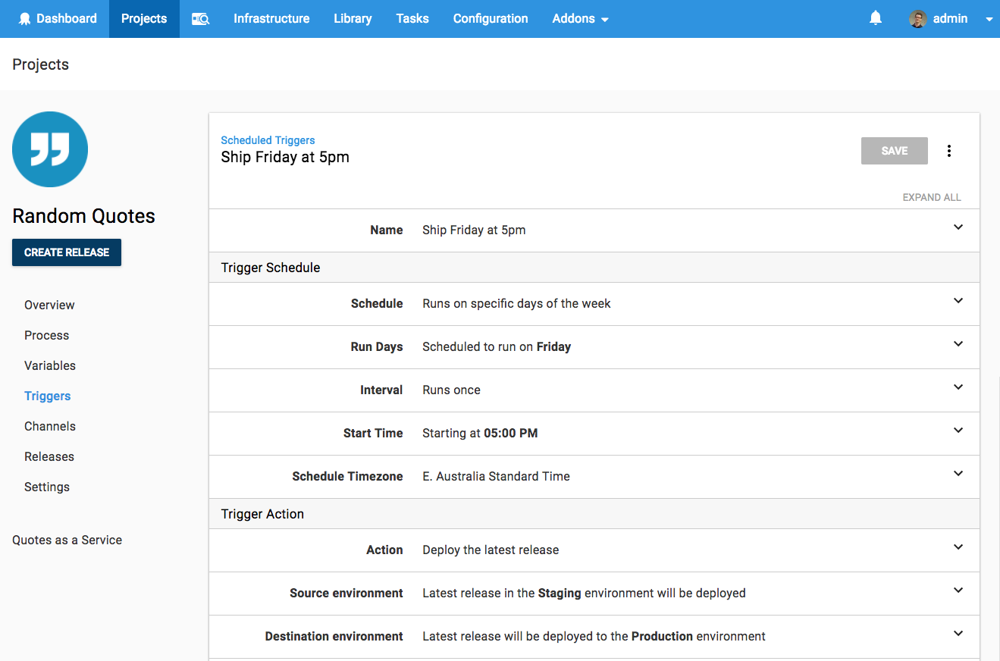
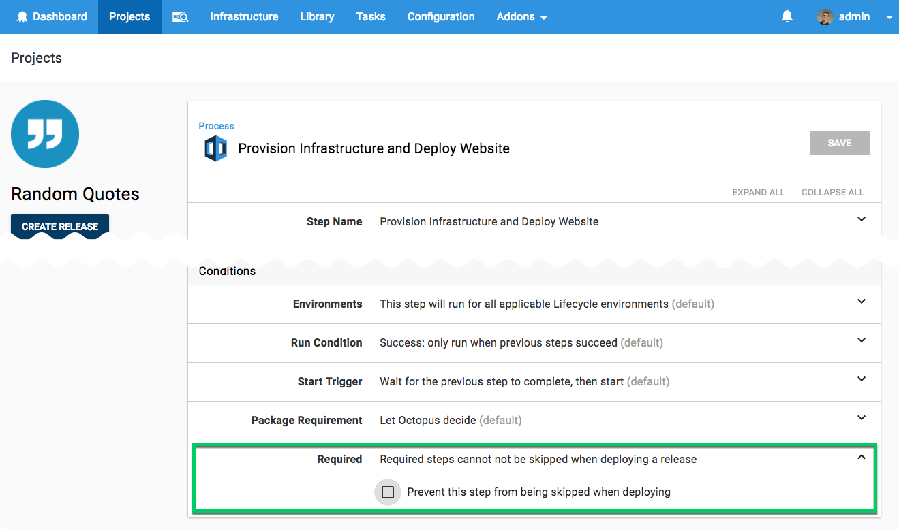

This month, our headline feature is _Recurring Scheduled Deployments_ which was one of our [most highly requested features](https://octopusdeploy.uservoice.com/forums/170787-general/suggestions/6599104-recurring-scheduled-deployments), and we’re very happy to ship it. We’re also shipping a new first-class AWS S3 step that makes working with Amazon Web Services easier, and we added the ability to set a step as required so it can't be skipped.

## In This Post

!toc

## Release Tour

<iframe width="560" height="315" src="https://www.youtube.com/embed/AR45wMd1_8o" frameborder="0" allowfullscreen></iframe>

## Recurring Scheduled Deployments

Octopus has long supported scheduled deployments. You can simply specify when to execute a deployment, but this only worked a single time. Our new recurring scheduled deployments feature lets you trigger a deployment as often as you like. This could be deploying a release to your test or QA environment for daily testing, deploying your latest stable release every Friday at 5pm, or even spinning up and tearing down virtual infrastructure on a schedule to save money when it’s not being used... like evenings and weekends.

This will become even more powerful when we ship operations focused [maintenance processes](https://github.com/OctopusDeploy/Specs/blob/master/MainenanceProcess/index.md) on a schedule. Watch this blog for more information on upcoming features.

## First-class Amazon Web Services S3 Support

We're continuing to improve our Amazon Web Services (AWS) support by adding a first-class S3 step. This greatly simplifies getting packages/files into S3 buckets and working with them in the AWS eco-system.

## Required Steps

Deployment steps can be skipped at deploy time but there are times when this is undesirable. For example, you may have a manual intervention step to require approval. It is somewhat of a loophole that this can be skipped at deployment time. So we've added the ability to set a step as required so it can't be skipped.

## Breaking Changes

Automatically Release Creation (ARC) now enforces channel constraints when selecting packages. Because channels can constrain packages to exclude pre-release packages, we will use the channel rules as a guard against pre-release packages and enable pre-release package selection by default. This means automatic release creation can start selecting pre-release packages for releases created in a channel that has no channel rules, which differs from the existing behavior and is a breaking change.

To continue only selecting stable packages for automatic release creation, setup the channel that automatic releases are created into to limit packages to those without pre-release tags (a pre-release tag of `^$`).

## Upgrading

As usual the [steps for upgrading Octopus Deploy](https://octopus.com/docs/administration/upgrading) apply. Please see the [release notes](https://octopus.com/downloads/compare?to=2018.4.0) for further information.

## Wrap Up

That’s it for this month. Feel free leave us a comment and let us know what you think! Go forth and deploy!
