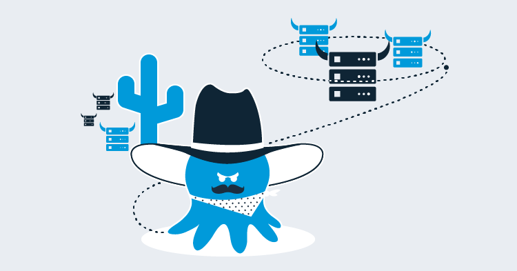
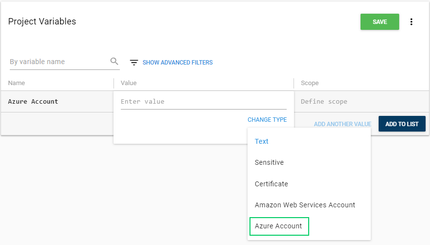
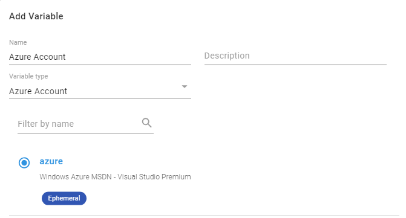
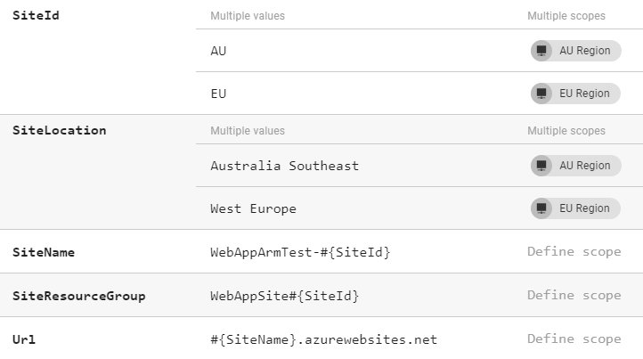

In this post, we will walk through an example of dynamic creation and teardown of Azure infrastructure, to create on-demand Web Apps per tester.
We will also look at deploying a website to multiple geographic regions and how to tear those down too. This will also be a technical overview of some of the topics discussed in [PaaS Deployment Targets](https://octopus.com/blog/paas-targets) and our [release video](https://www.youtube.com/watch?v=raepkFD7kx8).

In 2018.5, we have introduced the ability to easily manage your Azure deployment targets from within your deployment process.
Previously in Octopus, you could use the Azure PowerShell modules you can create Resource Groups and Web Apps within your Azure subscription, but you could not deploy your applications to them without some heavy lifting. The new dynamic target cmdlets make this straightforward.

Obviously, you will need an application to deploy, but I will leave that as an [exercise for the reader](https://octopus.com/blog/deploying-an-octopus-pi#build-the-application).

## Setup

First, we need to configure Octopus to manage our new project.

### Create an Azure Account

See the documentation on [Creating an Azure Service Principal Account](https://octopus.com/docs/infrastructure/azure/creating-an-azure-account/creating-an-azure-service-principal-account) for instructions.

### Create an Environment and Configure Dynamic Infrastructure

Create a new environment, if you don't already have one. By default, an environment is not allowed to have dynamic targets created or removed, so you will need to turn this on by editing the Environment settings.


### Create a New Lifecycle

So as to simplify our QA deployment, and prevent it from deploying to other environments (such as Production), we can create a new [Lifecycle](https://octopus.com/docs/infrastructure/lifecycles) that only allows deployments to our new environment.


### Create a Script Module

Script modules give you the ability to create functions that can be shared across projects. 
To generate a unique site name put the following PowerShell function in a **Script Module**, available under the **Library** section:

```powershell
function GetSiteName($prefix)
{
    # Octopus variables
    $environment = $OctopusParameters['Octopus.Environment.Name'].Replace(" ", "").Replace(".", "-")
    $tenant = $OctopusParameters['Octopus.Deployment.Tenant.Name'].Replace(".", "-")

    # A unique name based on the Octopus environment, release, and tenant
    $uniqueName = "$prefix-$environment-$tenant"

    return $uniqueName
}
```

### Create a Variable Set

Since we will need a common variable value between the setup and teardown projects, we can put that in a **Variable Set**, also available under the **Library** section.

Add a new **Variable Set**, and create a variable:


### Create the Setup Project

The first project we need to create is the one that will create all the infrastructure and deploy the application.

Create a new project and do some initial setup:

- Under *Process*, change the *Lifecycle* from the *Default* to the new lifecycle created earlier.
- Under *Variables* -> *Library Sets*, click *INCLUDE LIBRARY VARIABLE SETS*, and select the **Variable Set** created in the previous step.
- Under *Settings*:
  - change *Deployment Targets* to *Allow deployments to be created when there are no deployment targets*
  - change *Skip Deployment Targets* to *Skip deployment targets if they are or become unavailable*. If you don't change this setting, any Web App targets that have been removed from Azure but not cleaned up in Octopus will fail the deployment. This is optional and depends on your requirements, please see the [documentation](https://octopus.com/docs/deployment-patterns/elastic-and-transient-environments/deploying-to-transient-targets) for more information.

When setting up the process for this project, we are going to need an **Azure Account**, there are a few different ways to provide the account to the steps:

1. Directly on the step.

2. Via a tenant variable, if your tenants have different Azure Accounts.

    - Go to *Variables* -> *Project Templates* and click *ADD TEMPLATE*, set the *Control Type* to *Azure Account* and give the variable a name. This variable will be given a value later when we set up *Tenants*.

3. Via a project variable.
    - Go to the *Variables* page, and create a new variable, set its type to *Azure Account*, and then select the Azure account you created earlier.





### The Deployment Process

Let's get a deployment process configured.


The first step here is an **Azure PowerShell Script**. The step should be configured to run on the Octopus Server, it doesn't require a role at this point.

The script will query Azure to check for the existence of the target Resource Group and create the Resource Group, the App Service Plan, and the Web App if required. We are also setting an expiry date using a *Tag* on the Resource Group, which will be used later in the teardown project.

The last line in the script is the magic that allows our next step to work, it will create a new **Azure Web App Target** in the Octopus server and assign it a role of *QATest*. The `-updateIfExisting` parameter will allow the command to create or update an existing target with the same name.

```powershell
$uniqueName = GetSiteName($Prefix)
Set-OctopusVariable -name "SiteName" -value $uniqueName
Set-OctopusVariable -name "Url" -value "https://$uniqueName.azurewebsites.net/"

# Check for resource group
Get-AzureRmResourceGroup -Name $uniqueName -ErrorVariable notPresent -ErrorAction SilentlyContinue;

if ($notPresent) {
  # Create resources in Azure

  # set expiry tag on resource group to be used by our teardown script
  # this could be calculated to be a the end of the week or a specific future date
  $expiry =  ([System.DateTime]::Today.AddDays(7)).ToShortDateString();

  New-AzureRmResourceGroup -Name $uniqueName -Location "WestUS" -Tag @{Expiry="$expiry"}
  New-AzureRmAppServicePlan -Name $uniqueName -Location "WestUS" -ResourceGroupName $uniqueName -Tier Free
  New-AzureRmWebApp -Name $uniqueName -Location "WestUS" -AppServicePlan $uniqueName -ResourceGroupName $uniqueName

  # Create new target in Octopus
  Set-OctopusVariable -name "Action" -value "NewSite"
}
else {
  Set-OctopusVariable -name "Action" -value "ExistingSite"
}

# create a new Octopus Azure Web App Target
New-OctopusAzureWebAppTarget -Name $uniqueName `
                             -AzureWebApp $uniqueName `
                             -AzureResourceGroupName $uniqueName `
                             -OctopusAccountIdOrName $OctopusParameters["Azure Account"] `
                             -OctopusRoles "QATest" `
                             -updateIfExisting
```

The next step is a **Deploy an Azure Web App** step. This is where we will deploy the application to the target we created in the previous step. You will need to set the target roles to be *QATest*, it will not be available in the list, you will need to type it in and select *Add*.

:::info
Improved management for *Roles* is coming in the future, but for the moment, you will need to type the role name manually
:::

The last step is a notification step, which could be Slack, email, or something else.

In my Slack notification step, I set the following custom settings:

*Title* is `Deployment to #{Octopus.Deployment.Tenant.Name}`

*Message* is `#{Octopus.Project.Name} release #{Octopus.Release.Number} to #{Octopus.Environment.Name} for #{Octopus.Deployment.Tenant.Name} Deployed #{Octopus.Action[Setup Azure Web App].Output.Action} to #{Octopus.Action[Setup Azure Web App].Output.Url}`.

The `Url` and `Action` output parameters were created in the first script step.

### Create Tenants

In this example, I am leveraging tenants to demonstrate how you can structure a QA environment. A tenant might represent a Tester or a Customer. By applying this pattern, you can scale your deployments from just a few, up to hundreds of testers, deploying the Azure infrastructure and latest application to each one.

Under the **Tenants** menu, add two new Tenants and connect them to the **Web App Setup** project, and the environment we created earlier.


For each tenant, you will need to click **CONNECT PROJECT** and select the setup project we just created. If you have chosen to create your Azure account variable as a **Project Template** variable, you will need to provide the actual Azure account at this step. This allows you to provide different accounts for each tenant if required.

Using **Tenants** for your deployments will let you to provide configuration for each deployment per tenant using tenant variables. For example, each Tester/Customer could have their own database, the database name is provided by a variable per tenant to build the database connection string in the web app deployment project. See our [documentation](https://octopus.com/docs/deployment-patterns/multi-tenant-deployments) for more information and examples.

## Teardown

All of those Azure resources are potentially costing you money, even when no one is using them, so we can use a second project to teardown the applications from both Azure and Octopus.

Create a new project and do some setup configuration in *Settings*:

- Change *Deployment Targets* to *Allow deployments to be created when there are no deployment targets*.
- Change *Skip Deployment Targets* to *Skip deployment targets if they are or become unavailable*.

Under *Variables* -> *Library Sets* include the library variable set we created earlier. This will be used in our teardown script.

Using another one of the new Octopus Infrastructure Cmdlets `Remove-OctopusTarget`, we can teardown the Octopus targets and the Azure resources in a single *Azure PowerShell Script* step.

The script uses the Expiry tag on the Azure resource group to determine which resources to remove.

```powershell
$date = [System.DateTime]::Today
# find all resource groups marked for expiry, with a name starting with #{Prefix}
Write-Host "Checking for resources expiring on or before $date"
$resourceGroups = Get-AzureRmResourceGroup | `
                        Where { $_.ResourceGroupName.StartsWith($Prefix) `
                                -and $_.Tags -ne $null `
                                -and $_.Tags.ContainsKey("Expiry") `
                                -and [DateTime]::Parse($_.Tags["Expiry"]) -ile $date }

Write-Host "Found $($resourceGroups.Count) resource groups"

foreach ($rg in $resourceGroups) {
  Write-Host "Removing $($rg.ResourceGroupName)"
  Remove-AzureRmResourceGroup -Name $rg.ResourceGroupName -Force
  Remove-OctopusTarget -targetIdOrName $rg.ResourceGroupName
}
```

After running the teardown project, all resource groups with an Expiry tag of the execution date or earlier will be removed and the corresponding Octopus *Azure Web App* target will be removed as well.

Using the recently introduced [Scheduled Project Triggers](https://octopus.com/docs/deployment-process/project-triggers/scheduled-project-trigger) you can trigger the teardown script to be executed nightly or weekly.

## Azure Resource Manager Templates and Cloud Regions

Even with all the new targets added in `2018.5`, **Cloud Regions** still have a role in scoping your deployment scripts to support a [Multi-region Deployment Pattern](https://octopus.com/docs/deployment-patterns/multi-region-deployment-pattern).
You can incorporate **Cloud Regions** to run your PowerShell scripts or Azure Resource Manager Templates for different geographic regions, for example.

### Setup

For this example, we are going to create two **Cloud Regions**.


We can then use these *Cloud Regions* to create infrastructure across two different Azure geographic regions and deploy an [ARM template](https://octopus.com/docs/deployment-examples/azure-deployments/resource-groups) for each region.

Now, lets create a new project to run our Azure Resource Manager templates:


The first step is a **Deploy an Azure Resource Group**:


Set the step to run against the role that we assigned to the new **Cloud Regions**, created in the previous step.

In the Account section, you can select an account directly, or you can bind it to an Azure Account variable.

The ARM step will also require the target Resource Group to exist in Azure before you can deploy the template to create the resources inside the Resource Group. Previously, this would have to be done in an earlier step, in 2018.5 we have allowed configuration scripts to be run on the step. These can be turned on via the *Configure Features* option at the top of the step. Once this is turned on, you can add a pre and post *PowerShell* deployment scripts.

Since we want the Resource Group to have a different name and a different location for each geographic region, we can use variables to provide the region names and resource group names so that they can be different. In the Resource Group Name field, add the variable syntax `#{SiteResourceGroup}` and in the Pre-Deploy script section add the following *PowerShell* command:

```powershell
New-AzureRmResourceGroup -Name $SiteResourceGroup -Location $SiteLocation -Force
```

For the ARM template itself, the easiest way to get started is to go to the Azure Portal and create all the resources you want in your template. For this example, I created a *Resource Group*, *App Service*, and *App Service Plan*. Then under the *Automation Script* section on the *Resource Group* you can grab the template you will need to recreate the resources. Or you can grab one of the [samples](https://github.com/Azure/azure-quickstart-templates).

You will also need to make one modification to the template to allow the region to be an input parameter, add the following JSON into the parameters section, not forgetting the comma after the previous parameter:

```json
"location": {
    "defaultValue": "Australia Southeast",
    "type": "String"
}
```

Then replace all the occurrences of the `location` value throughout the template to be `"location": "[parameters('location')]"`.

When you put the final template into the template source on the step, it will extract the parameters and allow you to replace those values with your own.


The last part of the ARM template process is to add a post-deployment script to create the new **Azure Web App Target** in Octopus:

```powershell
New-OctopusAzureWebAppTarget -name $SiteName `
                             -azureWebApp $SiteName `
                             -azureResourceGroupName $SiteResourceGroup  `
                             -octopusAccountIdOrName "azure" `
                             -octopusRoles "CloudWebSite" `
                             -updateIfExisting
```

Now create all the variables that we need to support our process, taking note of scoping for some values for the different cloud region targets:



Lastly, we need to add a *Deploy Azure Web App* step to the process, which will run against the `CloudWebSite` role. This is exactly the same process as we used in the first example above.

### Teardown

You can use the same script as the previous teardown example, by adding an `Expiry` tag to the `New-AzureRmResourceGroup` command in the pre-deploy script in the ARM template step, or you could deploy an empty ARM template to the same resource group:

```json
{
    "$schema": "https://schema.management.azure.com/schemas/2015-01-01/deploymentTemplate.json#",
    "contentVersion": "1.0.0.0",
    "parameters": {},
    "variables": {},
    "resources": []
}
```

## Auto Deployment

With the introduction of the new *Azure* targets, you can also make use of [Automatic Deployment Triggers](https://octopus.com/docs/deployment-process/project-triggers/automatic-deployment-triggers), allowing you to have your infrastructure scripts/templates in a separate deployment process to your application processes. *Automatic Deployment Triggers* can then be set to trigger a deployment when a new instance of a web application gets created.

## Conclusion

The new Dynamic Target provisioning cmdlets fill in the gap with our first implementation of Azure Web App targets from version 3. You now have full end to end management of your targets.
This won't be the end of the road either for dynamic targets, with features such as dynamic environments and maintenance tasks on the horizon they will start to play a bigger role. We might even add a UI so it is one less line of code you have to write.

Happy deployments.
