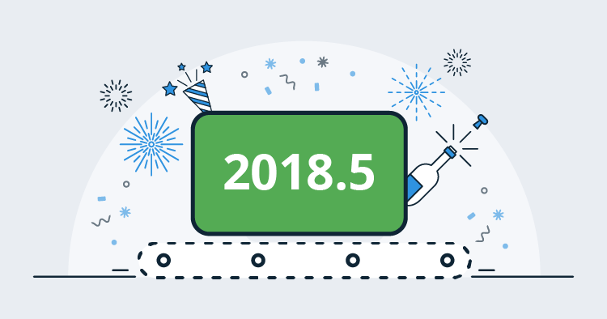

This month, our headline feature is ... 

## In This Post

!toc

## Release Tour

<iframe width="560" height="315" src="https://www.youtube.com/embed/TODO" frameborder="0" allowfullscreen></iframe>

## PaaS Targets for Azure

This release reintroduces Azure Web Apps modeled as deployment targets, and introduces Azure Cloud Service and Azure Service Fabric Clusters to the deployment target family.

For more information on the PaaS Targets, have a read of our previous [blog post](https://octopus.com/blog/paas-targets). 

## Azure Accounts as Variables

You will now be able to set your Azure Accounts as Variables, for both project variables, tenant variables and library variable sets.

This will give you the benefit of being able to scope different accounts across each environment or tenant. You will still be able to select an account directly on the Azure Powershell step, just as you have always done, but now you can also bind this to an Azure Account Variable.
The properties of the Azure Account (Client Id, Subscription Id, Tenent Id etc.) will also be available to use in your scripts. Just turn on the `OctopusPrintVariables` option to [see all the variables available](https://octopus.com/docs/support/debug-problems-with-octopus-variables#DebugproblemswithOctopusvariables-Writethevariablestothedeploymentlog).

## Managing Octopus Infrastructure

One of the problems with our initial implementation of Azure Web App Targets, was there was no easy path to be able to create them as needed, you could easily create the Azure Web App but Octopus required manual steps to represent them in Octopus. 
Now, you will be able to create those new PaaS targets as easily as you can create Azure resources using some built-in Powershell Cmdlets.

The initial release of these cmdlets will allow you to create Azure Accounts all the new Azure targets, and be able to delete those targets too. 
For more information see the [PaaS blog post](https://octopus.com/blog/paas-targets) and the [documentation](https://octopus.com/docs/infrastructure/dynamic-infrastructure). Also, look for more blog posts and [Will it Deploy](https://www.youtube.com/watch?v=tQb8PJ0jzvk&list=PLAGskdGvlaw13QRF-ypT9h83QTPutlbMn) videos.

## Breaking Changes

We have upgraded the Azure SDK library and the Azure Powershell modules to support the latest Azure features. Most notably missing was support for nested ARM templates, which will now work out of the box.

These upgrades have also forced the minimum supported environment for Octopus to .Net 4.5.2 and Powershell 5.0.

## Upgrading

As usual [steps for upgrading Octopus Deploy](https://octopus.com/docs/administration/upgrading) apply. Please see the [release notes](https://octopus.com/downloads/compare?to=2018.4.0) for further information.

## Wrap up

That’s it for this month. Feel free leave us a comment and let us know what you think! Go forth and deploy!