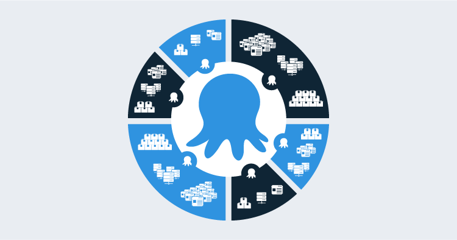

Octopus was originally designed with small teams in mind. Everything is at the global level: Projects, Environments, Lifecycles, Variable Sets, etc.

In large organizations, as more teams on-board, this doesn't scale well:

 - People end up "namespacing" things to avoid conflicts and confusion: "This is our Production environment"
 - People struggle to provide any segregation using our permission system.

## Spaces to the Rescue

Almost everything will be within a Space. The only things that will remain global are:

 - Octopus Server Configuration (License, Maintenance Mode, HTTPS Certificate, etc)
 - Users
 - Teams

The Spaces feature will be opt-in, if you currently do not see yourself with the need to partition what you do with Octopus then you can continue using Octopus as you do today. If one day you find what you're managing in Octopus has grown and could benefit from some segregation, then you can then choose to start making use of Spaces.

There's some small caveats to this, some of the changes we've made will have an impact to some APIs. Don't panic, at the moment they are limited to the Teams management API.  We will be sharing some technical details as part of this blog series, with specific details on the APIs that we are changing.

There's some detailed posts coming so be sure to check out our blog.

---

Blog series posts:

* [Team Configuration Improvements](/blog/2018-05/team-configuration-improvements.md)
