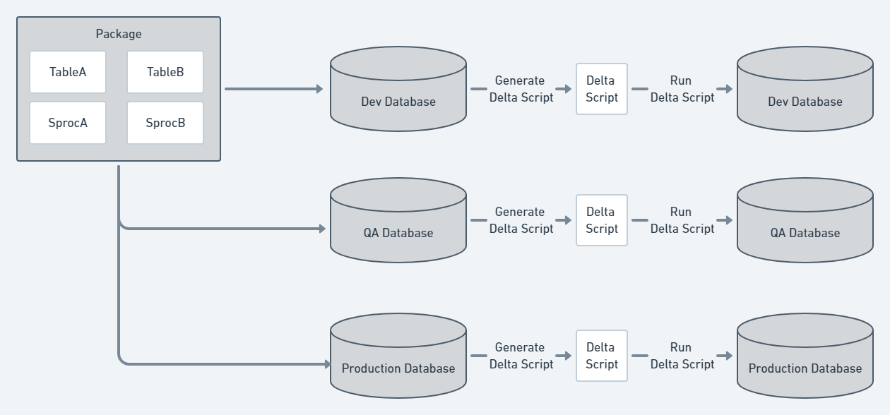
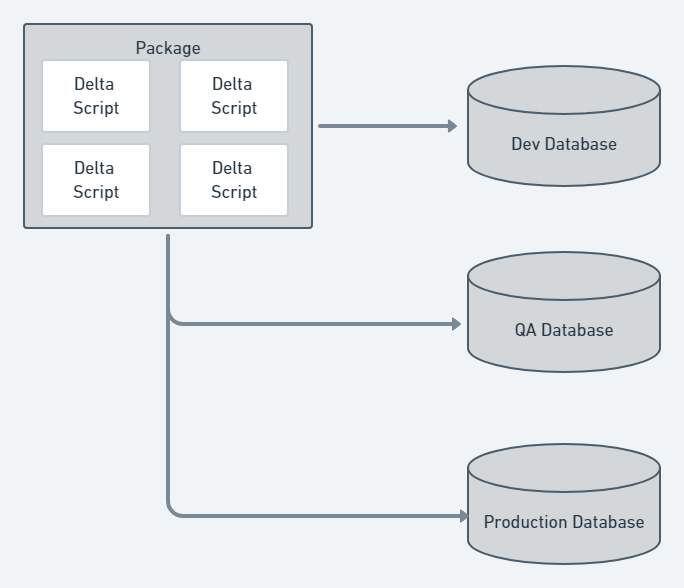
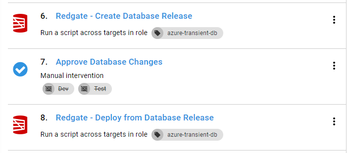
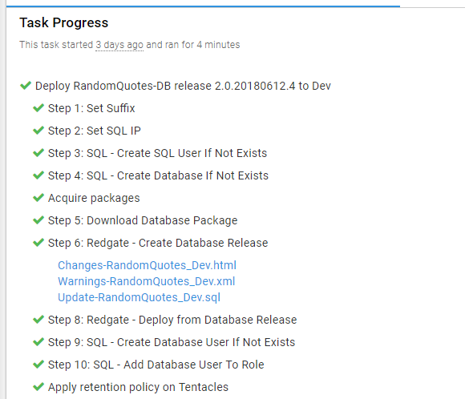

Hopefully after reading the [previous post](/blog/2018-06/automated-database-deployments-series-kick-off.md) you are ready to get started and dive right in with automated database deployments.  Hold on for a second before diving in.  Depending on your company, automating database deployments could be a large change which "moves a lot of cheese".  Moving that cheese could cause friction.  Friction is the enemy of change.  The higher the friction, the slower the adoption.  The goal of this post is to help remove that friction.  Before diving in too far, I want to point out this post covers Microsoft SQL Server.  The principles still apply to your database technology of choice. 

This post will be discussing the following:

!toc

## Deployment Approaches

Deploying databases can be very complex.  There are multiple approaches to deploying databases.  At Octopus Deploy, rather than forcing an approach, or a tool, upon users we decided to make it easy to integrate with third-party tools.  Allow the tools specifically designed for deploying databases do what they do best.  The flexibility of integrating with multiple tools means there is a lot to choose from.  As you evaluate third-party tools you will find they approach deployments one of two ways.  Each approach has its pros and cons.

### #1 Model-Driven Approach
With the model-driven approach, the desired state of the database is defined.  The state is saved into source control.  During the deployment, the tool will compare the desired state with the deployment target and generate a delta script.  This process will be done for each environment.

The database desired state is stored as files in source control.  It depends on the tool what the file will be.  It might be a series of create scripts.  It might be an XML file.  It could be something completely different.  The important thing to know is the tool will be responsible for updating and maintaining those files.

#### Model-Driven Pros
Often times the tooling for model-driven approach integrates right with your IDE.  For example, Redgate's tooling integrates with SQL Server Management Studio.  While Microsoft's SSDT tooling integrates with Visual Studio.  The changes to the schema are made using the IDE.  Then the plug-in for the IDE will take over.  It will run a comparison to determine the difference between the change and what is currently in source control.  Then it will make the change to the necessary script on the file system.

All the file system interaction happens behind the scenes.  The tool keeps track of the all the changes.  This allows you to focus on making the database changes and testing them.  After you are done testing those changes, then you use the tool to update the files in source control.  

Having a file containing the desired state in source control makes it very easy to view what it should look like as well as the history of a specific object.  All you have to do is go to the file in source control and open it up.  

Finally, some of the tools allow you to mark a table as "static data."  The data itself is checked into source control.  During deployments, the tool will check the data in the destination table.  If the destination table is missing data or the data is incorrect the delta script will include data change T-SQL statements. 

#### Model-Driven Cons
A unique delta script is generated during deployment per environment.  This is because a change could have been applied to one environment (dev) but not a higher environment (pre-production or production).  That makes the tooling much more complex.  Every once in a while, the tool will generate a delta script where an unexpected change is included, especially if permissions are not set correctly.

The tooling will want to control everything about the database, from the tables to the schemas to the users.  You must configure the tool to ignore certain parts of the database.

As smart as the tooling is, it has a difficult time handling more complex changes.  For example, moving a column from one table to another.  The tool doesn't know that is your intention.  It will drop the column from the old table and create a new empty column in the new table.  The tooling will often include some sort of migration script ability where you can write your own migration scripts.  The migration scripts have their own rules you must abide by.  

The lack of control can be a bit of a burden sometimes.  You might end up creating a custom process that works alongside the tool.  For example, the tool might not support post deployment scripts.  In order to get that you would have to create a post deploy folder which can get packaged up and sent to Octopus Deploy.  You would then have to update your process in Octopus Deploy to look for that folder and run any scripts it finds.  It works, but now you are responsible for maintaining that process.

### #2 Change-Driven Approach
A change-driven approach is where all the necessary delta scripts are handwritten.  This is also known as migrations.  Those scripts are checked into source control.  During the deployment, the tool will look to see which change scripts have not been run on the destination database and run them in a specific order.  

#### Change-Driven Pros
With the change-driven approach, you have complete control over all the scripts.  When deploying a change you know exactly what script is going to run.  Complex changes are much easier to deal with, you just need to write the script and save it to source control.  Some migration frameworks allow you to write code to do migrations to help make it easier to implement more complex changes.  In addition, it is much easier to exclude items from deployments.  Just don't include the script for items you want to exclude.

#### Change-Driven Cons
The model-driven approach ensures the entire destination database matches the desired state.  Not so with the change-driven approach.  A new table could be added to the destination database outside of the process.  Everyone who has permissions to change the database has to be on board and using the process.  One or two rogue developers could cause havoc.  

It is much, much harder to see the history of a specific object like a table or a stored procedure.  Instead of going to a single file and viewing the history you are required to do a search to find all the files where the object was changed.  Depending on the number of table changes going on, it could be easy to miss a key change and not even know it.  

Finally, a lot of developers are not expert SQL Developers.  They are used to using SQL Server Management Studio UI to create tables and indexes.  They don't know how to write a lot of the changes being made by hand.  It takes a lot of practice to get the T-SQL syntax memorized.  In the case where the tool allows you to write code for more complex changes, there is another learning curve to understand the syntax and the rules.

### Picking an Approach

The right approach is very subjective.  

The model-driven approach works best when any of the following apply:

- You're in the early stages of a project with lots of churn on the database.
- There are multiple people/teams are changing the database.
- Your company is first getting into automating database deployments.
- Your code base consists of mature databases with very little expected changes.
- You want to force developers to follow the process automatically (if a change is made to a destination database and it is not checked in then it will get deleted, that only needs to happen once before a person learns).
- The majority of the developers who will be making the changes lack the experience at making complex T-SQL Statements.

The change-driven approach works best when:

- Everyone who is making the changes is disciplined enough to always follows the process.
- The people making the changes have the experience to make complex database changes.
- You keep bumping into restrictions imposed by the model-driven approach.
- Everyone wants the most possible control over the process

Don't be surprised if you initially start with the model-driven approach and after a few years you want to move to the change-driven approach.  When you pick a vendor, RedGate, Microsoft, etc, be sure they offer a software suite which allows for either approach.

## Moving To Dedicated Databases

Regardless of the tool you pick, I recommend moving the developers to dedicated databases.  The typical approach for dedicated databases is to install SQL Server on the developer's laptop.  

This provides the following advantages:
1. Developers can try out risky changes without having to worry about affecting anybody else.  If they break something it is only one person affected.
2. Support for branching.  With a shared model there is only one database.  If a breaking database change was made without a corresponding code change then it would stop everybody from working.  Now, all changes can be made and checked in on a branch and deployed at the same time.
3. Developers apply new changes when they are ready.  With a shared model a breaking change required the developer to stop what they are doing and apply the latest code change.  With dedicated databases they can focus on their current task and pull down the change when they are ready to consume it.

The shared model is the opposite of that.  When using a shared model you don't get the flexibility of branching, everyone has to be up to date with their code.  Don't get me wrong, a shared model can work.  But it works best with a few developers with a static database schema.  As the team scales out the shared model falls apart rather quickly.

## Communication

Automating database deployments introduces an interesting challenge.  Prior to the automation, a developer could make a change on a shared database and everyone would see it right away.  That made it a little trickier to step on each other's toes.  But with automated database deployments and dedicated databases, the risk of that is much higher.  A change to a table could be made by developer A in their branch.  The same table could be changed by developer B in their branch.  Both of those changes could conflict with one another.  This means there needs to be a mechanism to let others know what changes are being made.  It could something as simple as a slack message or a discussion during a daily stand-up.  The important thing is to make sure everyone is on the same page.  

## Building Trust

In the past, DBAs were the ones who ran the scripts in production because they had the permissions.  Now an automated process will be doing that work.  That can be really scary.  If something goes wrong and the data is lost it could be very difficult to get it back.  Everyone is going to have to trust the process and tooling.  In my experience, the best way to build trust is to use Octopus Deploy artifacts and setting permissions on SQL Server. 

### Octopus Deploy Artifacts
With Octopus Deploy [artifacts](https://octopus.com/docs/deployment-process/artifacts) you can create a file containing all the scripts about to be run on the tentacle and upload it to the server.  A DBA can approve that script prior to it running on the database.  

In some cases, the step template provided by the third-party has artifact creation directly built in.  For example, here is the process for deploying tooling using Redgate.

During the deployment it created the artifacts automatically.

The artifacts help build that trust by not allowing an approval process, but also provide an audit history.  In three months I could come back to this deployment and view what changed on the database.

### Permissions
When implementing automated database deployments a common question I heard was "how can we prevent someone from inserting a script to give themselves sysadmin privileges?"  Using the artifacts is a good start, but it doesn't completely solve the problem.  If the DBA, or the person doing the approval, is swamped, they could easily miss that specific sql statement in the artifact.  The surefire way to prevent that from happening is to restrict the permission on the account doing the deployment.  [Our documentation](https://octopus.com/docs/deployment-examples/sql-server-databases#SQLServerdatabases-Permissions) provides several examples, from the least restrictive to the most restrictive.  Keep in mind, those are recommendations.  I encourage talking to your team to determine what you are comfortable with.

## Where to Install the Tentacle

You do not want to install the Tentacle directly on the SQL Server.  Often times an SQL Server will be a cluster or a high-availability group.  The Tentacles will try to apply the changes to all the nodes at the same time.  You do not want to have the Tentacles being used to deploy windows services or IIS web applications handle database deployments.  Those Tentacles could be in a DMZ.  The Tentacle should be running under a specific service account with the necessary permissions to perform the deployment.  The majority of the tools make use of port 1433 and simply run a series of T-SQL Scripts.  The Tentacle can be installed on any machine as long as it has a connection to the database.  For those reasons, I recommend you make use of a jump box which sits between Octopus Deploy and SQL Server.  

[Our documentation](https://octopus.com/docs/deployment-examples/sql-server-databases#SQLServerdatabases-Tentacles) does a good job of covering this topic (with included diagrams!), please refer to that for more information.

## Conclusion

At first glance, this feels like a lot of prep-work.  The important thing to remember is these are guidelines.  Don't spend weeks discussing and debating.  Come up with an initial plan and iterate through it.  At the start of this process, we spent about two days discussing and working through an initial plan.  My recommendation for rolling this out is:

1. Discuss the items above and come up with an initial plan
2. Establish a pilot team to iterate through any issues
3. Wait for the pilot team to have several successful deployments to production
4. Roll this out to other projects, one at a time.  Don't be surprised if each time you roll it out to a new project you come across something new requiring a change of some sort.  
5. Don't be afraid to reach out and ask experts.  We can provide some initial guidance, but in some cases you will need more help.  In that case, there are several companies out there which provide consulting services which are happy to help.

### More in the series:

* Blog Series: [Automating your database deployments with Octopus Deploy](https://hubs.ly/H0gCL070)
* Octopus Deep Dive: [Using Ad-Hoc Scripts in your Automated Database Deployment Pipeline](https://hubs.ly/H0gCLCl0)

### Learn more: 

* Documentation: [SQL Server Databases](https://hubs.ly/H0gCLCD0)
* [Database deployments with Octopus and Redgate SQL Release](https://hubs.ly/H0gCL0b0)
* [How to deploy a SQL Server with a DACPAC](https://hubs.ly/H0gCLD10)
* DevOps best practice: [How Octopus handles rollbacks](https://hubs.ly/H0gCL0d0)
* [Octopus vs. Build Servers - Why should I use Octopus when I already have a CI Server?](https://hubs.ly/H0gCLDj0)
* Video: [Deploying to SQL Server with Entity Framework Core](https://hubs.ly/H0gCLDx0)