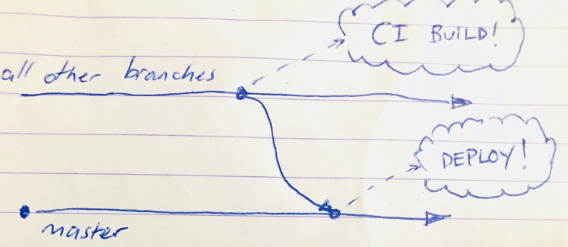
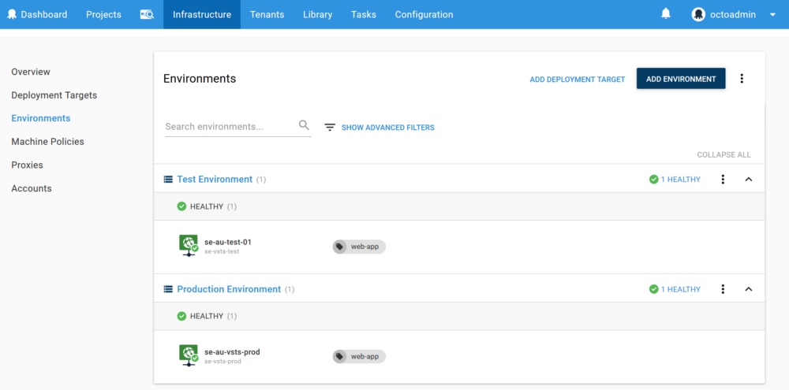
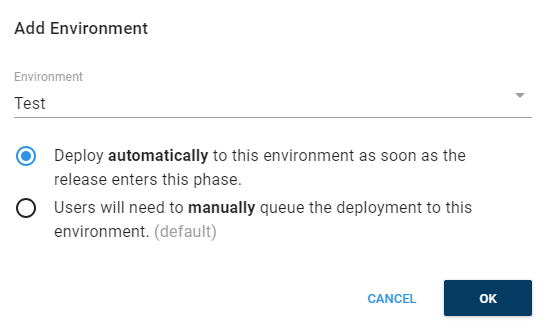
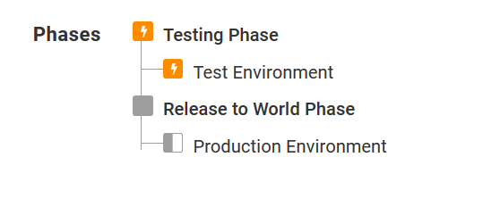
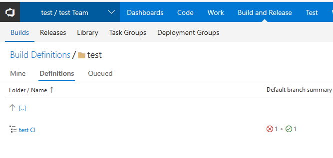
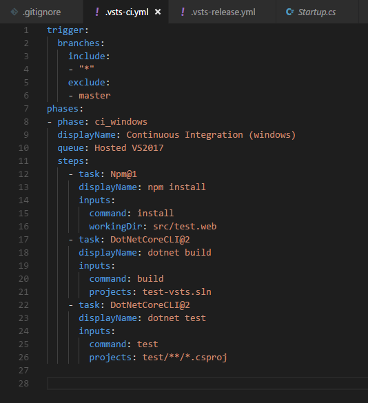

With the introduction of VSTS YAML syntax I thought it would be good to revisit integration of Octopus and VSTS. 

Dalmiro recently blogged about the [basics of integrating octopus and build servers](https://octopus.com/blog/octopus-build-server-integration-101) and Andrew on [BitBucket pipelines](https://octopus.com/blog/continuous-delivery-bitbucket-pipelines) so I thought I'd take a deep dive on how to do it, VSTS style.

## Nice Pipes Need Planning
First up, lets plan out a simple CD pipeline. Some typical goals for such a process might be:

- git push origin topic-branch - run a CI build
- git push origin master - build, pack, and commence our deployment chain
- semantic version numbers for deployments
- Two environments, one for testing & one for our customers
- Automatic deployments into the Test environment

I want to build a release package and deploy via my Octopus server whenever I commit to master (this would include PR's, merges, rebases etc). 

I also want this to occur auto-magically against my test environment, but leave me to manually promote my deployment to production when I choose to.

For any other branch, I want a continuous delivery build to trigger, to run tests and ultimately enable other quality gates, like [sonarqube](https://medium.com/r/?url=https%3A%2F%2Fwww.sonarqube.org%2F)

In terms of deployment targets, let's go with two Azure Web Apps, one for testing, and another for production.



I don't claim credit for this simple plan - it is just good old 'github flow' and  is probably good enough for my simple project. 

All in all, this means I'll want two build definitions - one for CI duties, and one for Releasing.

## Octopus Setup

### Azure Web Apps Targets

My weapon of choice for my deployment today is the Azure Web App. We have [first class support](https://octopus.com/docs/deployment-examples/azure-deployments/deploying-a-package-to-an-azure-web-app) for these and they are nice and easy to setup

As I mentioned earlier, I am going with a Testing and Production environment, so I've create two Azure Web App targets, one in each. You could also go for a blue / green approach, using an [Azure Powershell Script](https://octopus.com/docs/deployment-examples/azure-deployments/deploying-a-package-to-an-azure-web-app/using-deployment-slots-with-azure-web-apps) to swap deployment slots if thats your thing.

Here is how they look on my Octopus:



### Lifecycles

Once we've deployed, my delivery pipeline is a simple two phase deployment: 
- Automatically deploy to Test. 
- Manual promotion to Production.

When we create a life cycle we get the option to deploy automatically, and we can set this *per phase* which is awesome for reducing human bottle necks while retaining control where it matters.



Once configured the life cycle looks like this



## VSTS YAML Basics

To build a suitable build chain declaratively, we need to push a pair of definition files up to VSTS first. 

- .vsts-ci.yml
- .vsts-release.yml

If you head on over to the build definitions page now the CI build definition is created for you.



Subsequent build definitions need to be created manually, so to create a 'release build' we need to create a new build definition and apply the 'Config as code' template to it.


>Be sure to set the name and the path correctly before saving the second definition


We now have to empty build definitions!


The VSTS team have created some [getting started guidance](https://docs.microsoft.com/en-us/vsts/build-release/actions/build-yaml?view=vsts#get-started), if you want to learn more about this process.

## Defining our builds

With stubs for our builds in place and some environments to deploy to, we now need to get our hands dirty with some 'configuration as code'. 

### Build triggers

Starting with the CI build - we can explicitly state which branches should trigger a CI build and which ones shouldn't. Since CI builds are on by default for all branches, for our CI build we only need to exclude the master branch.

```yaml
trigger:
  branches:
    include:
    - "*"
    exclude:
    - master
```

This looks a little different for the release build - we *only* want to include master for that one:

```yaml
trigger:
  branches:
    include: master
```

> NOTE: Continuous integration builds are on by default for all branches. Full trigger syntax [here](https://github.com/Microsoft/vsts-agent/blob/master/docs/preview/yamlgettingstarted-triggers.md)

### Build phases

After our trigger is defined we can optionally organize steps into phases. The highest organizational unit seems to be 'phases'.

We group build steps into phases. Phases are labelled with a name, and executed by a queue, and they contain the steps we want to perform. In this example I'm just going to use the Hosted VS2017 queue. Phases are pretty cool and have a [bunch of tricks](https://medium.com/r/?url=https%3A%2F%2Fgithub.com%2FMicrosoft%2Fvsts-agent%2Fblob%2Fmaster%2Fdocs%2Fpreview%2Fyamlgettingstarted-phases.md). But I don't need anything fancy...

```yaml
phases:
  - phase: ci_windows
  displayName: Continuous Integration (windows)
  queue: Hosted VS2017
  steps:
  
```

>Other hosted queues out of the box:
>- Hosted 
>- Hosted Linux Preview
>- Hosted macOS Preview
>
> As above, I'm using the Hosted VS2017 build agent

### CI Build Steps

Next we want to define our steps so that we can get the real work of building and testing the application done. 

In my project I am creating an ASPNET core 2.1 react/redux SPA, so my CI Build steps look like this:

1. npm install
2. dotnet build
3. dotnet test

Because I used the ```dotnet new reactredux``` boilerplate, a csproj file was setup that ensured that webpack was called, with a before build target, a little bit like this:

```xml
<Target Name="webpack" BeforeTargets="Build">
    <Exec Command="node node_modules/webpack/bin/webpack.js" />
</Target>
```

To create this process, the YAML steps, in isolation, will look like this:

```yaml
steps:
  - task: Npm@1
    displayName: npm install
    inputs:
      command: install
      workingDir: src/test.web
  - task: DotNetCoreCLI@2
    displayName: dotnet build
    inputs:
      command: build
      projects: test-vsts.sln
  - task: DotNetCoreCLI@2
    displayName: dotnet test
    inputs:
      command: test
      projects: test/**/*.csproj
```

> That @[Number] on the end of each task? This denotes the *version* of the task.

Our final result ends up looking something like this



Looks nice and simple to me! Here's the CI build...


## Release Build Steps

Now onto the fun stuff! CI builds are all well and good but we want to ship things.

 For my release builds, I want to see semantic versions and a nuget package that I can send along to my Octopus Deploy instance

1. Install tools (GitVersion, Octo CLI)
2. dotnet restore
3. Set the package version of the project
4. npm install
5. dotnet pack the website, using the version number from step 3
6. octo push this package to Octopus Deploy 
7. octo create-release to trigger a release in Octopus Deploy


This gets a bit deeper than the CI build, so I'll show you the final script up front, and then we shall break it down.


It is not as simple as our CI build, but it is still under 50 lines of configuration. 
Let's unpack it step by step and see what we have here.

### Installing prerequisite tools with Chocolatey

On VSTS host build agents, chocolatey just works, so lets install some cool tools: GitVersion and Octo CLI
```yaml
- powershell: |
    write-host "Installing GitVersion" ;
    cinst GitVersion.Portable --version 3.6.4 -y --no-progress ;
  displayName: Install Gitversion
- powershell: |
    write-host "Installing Octo CLI" ;
    cinst octopustools --version 4.0.7 -y --no-progress ;
  displayName: Install Octo CLI
```
These will help us to automate our package versioning and our releases. 

Let's use GitVersion straight away. To facilitate later steps that need a version number we can setup a phase scoped environment variable:

```
$version_number = $(gitversion -showvariable NugetVersionV2) ;
write-host "##vso[task.setvariable variable=version_number]$version_number" ;
```

### Setting a semantic version
So that my packages get a sensible version before being sent off to Octopus, I'll make use of the pretty awesome GitVersion CLI.

I've setup a gitversion.yml file to hint to my team, and the build server, the next intended version of the software. It is also configured with YAML

```
next-version: 0.2.1
mode: ContinuousDeployment
branches: {}
ignore:
  sha: []
```

> NOTE: run gitversion init to get a menu to help generate this file for you

Now because this is a dotnet core application, I can also use a [great little tool](https://medium.com/r/?url=https%3A%2F%2Fgithub.com%2FTAGC%2Fdotnet-setversion), called ```dotnet setversion``` to set my assembly versions. 

```
- powershell: |
    cd $ENV:BUILD_REPOSITORY_LOCALPATH/src/test.web ;
    echo "Applying version number $env:version_number" ;
    dotnet setversion $env:version_number ;
  displayName: Set Semantic Version
  ```

### Publish, Package & Push

Once the building is done, it is time to publish and package our application. We'll use dotnet pack to do this, and then send our package over to octopus deploy, using the Octo CLI and the ```octo push``` verb.

> Watch out! ASPNET core 2 web apps can be  marked as 'un packable' which needs to be unset in your csproj in order to produce a viable deployment package. The dotnet pack command will fail silently if this is not done.

### The secret should not be in the source

Now, Octopus requires credentials to do this - so I'll make a concession to some manual intervention: we will store a variable that is only set in VSTS and kept away from our source code.

I'll store a 'PackagePusherAPIKey' and feed URL in VSTS and keep my secrets away from prying eyes.


We can then refer to this in our YML script like any other TFS variable like this

```
octo push 
--package test.web.nupkg 
--server $(PackageFeedHost)
--apiKey $(PackagePusherAPIKey)
```

### Trigger the deploy to the test environment
As our last step - we can trigger our release process using the following octo CLI calls:

```
octo create-release 
--server $(PackageFeedHost) 
--apiKey $(PackagePusherAPIKey) 
--project=$(DeploymentProjectName) --package:test.web:$env:version_number --releaseNumber=$env:version_number
```
### git push origin master
Now that our build & deployment script is all setup - we can allow builds on master to occur.

Because I configured Octopus to automatically deploy when a release is created - this will immediately send my web application over to my Azure test target, and the beginning of my deployment pipeline is initiated!


## Happy Deployments!

We've covered a lot of ground here, but hopefully now you have everything you need to make VSTS and Octopus work in harmony and keep your build definitions in check with YAML!