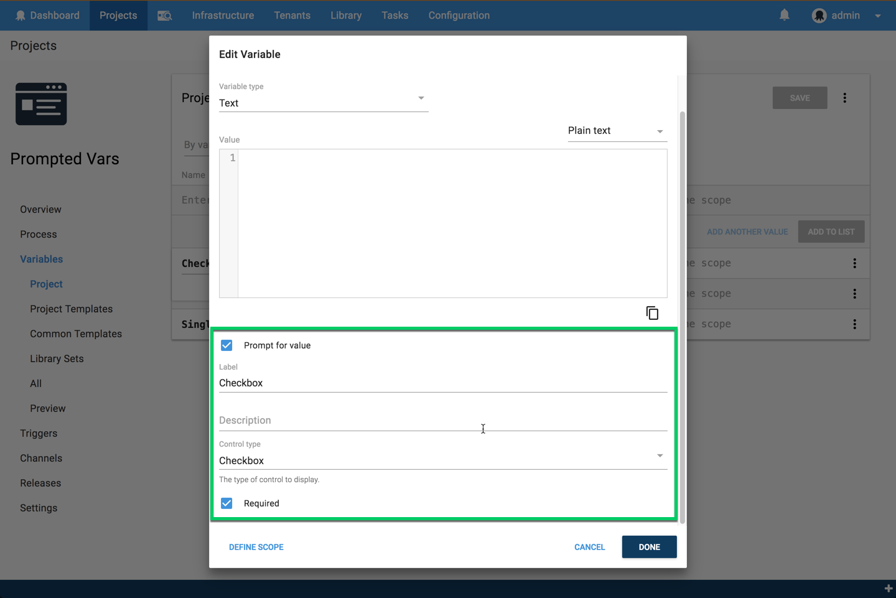
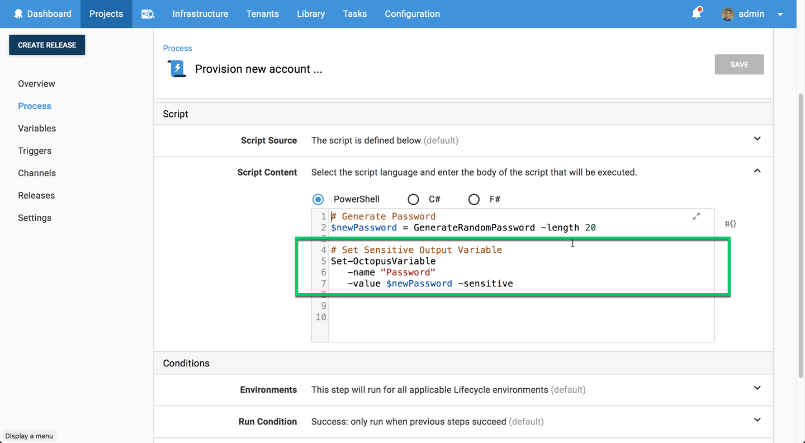
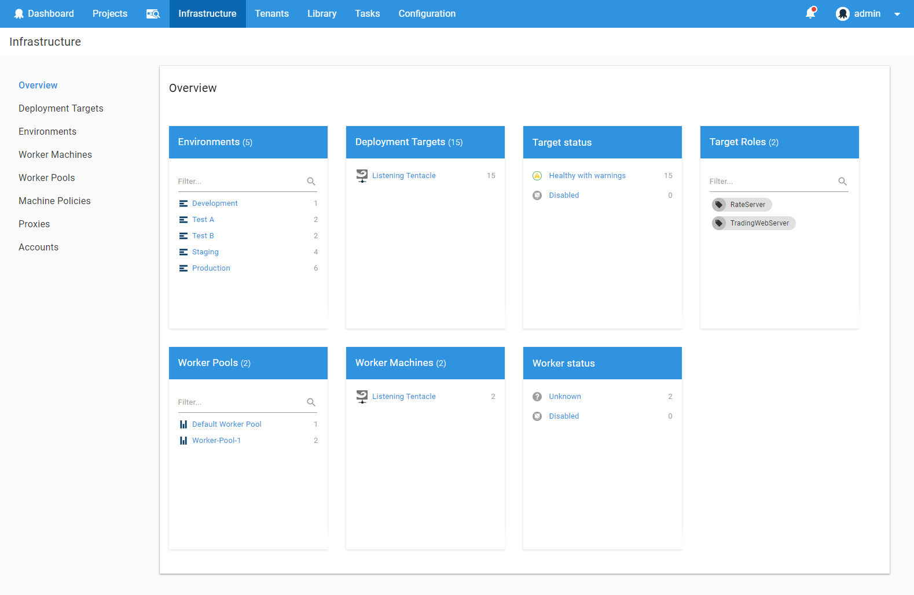
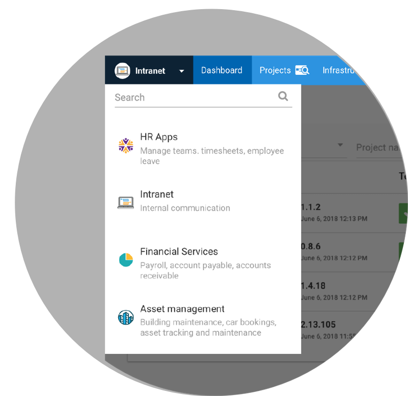
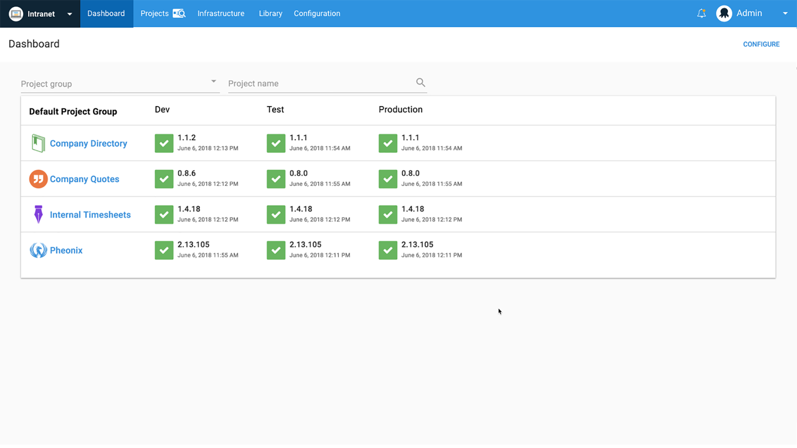

This month, Octopus 2018.6 includes two UserVoice community requested improvements, and it's also building the foundation for some fantastic new features that should be available in the upcoming months. Keep reading for the full details!

## In This Post

!toc

## Release Tour

<iframe width="560" height="315" src="https://www.youtube.com/embed/tNuYRs_J8cY" frameborder="0" allowfullscreen></iframe>

## UserVoice Community Requested Improvements

First up, we’re introducing a couple of smaller UserVoice community requested improvements from our [UserVoice site](https://octopusdeploy.uservoice.com).

### Prompted Variables Control Types

The first [UserVoice suggestion](https://octopusdeploy.uservoice.com/forums/170787-general/suggestions/30965434-set-octopusvariable-to-support-issensitive-flag) is a nice improvement that lets you specify control types for prompted variables. Previously this was not available as the variable could only be a text input, but now you can also use checkboxes or lists.

### Sensitive Output Variables

Another [UserVoice suggestion](https://octopusdeploy.uservoice.com/forums/170787-general/suggestions/30965434-set-octopusvariable-to-support-issensitive-flag) is similarly small yet valuable, you can now set sensitive output variables. This change is an excellent addition to keep your sensitive data secure, and it's handy in dynamic provisioning scenarios when you generate passwords on the fly and then use them throughout your deployment.

## Building the Foundation - Designed to Scale

Next, this release is building the foundation for two new features designed for larger teams and companies with big Octopus instances. They’re designed to help our customers scale with thousands of projects, environments, and deployments.

## Octopus Workers Backend Enhancements

This month we're including backend changes for a more extensive feature, called Workers, which is coming soon. The changes are technical and transparent, but it's an excellent opportunity to review the feature. Workers can be used to replace and extend our feature to run steps on the Octopus Server. This is something we introduced in Octopus 3.0, and it's commonly used to execute one-off tasks like database scripts or other things that don't need to run on a specific machine. Workers build upon this with improved security whereby custom scripts aren't run on the Octopus Server during deployments. And it can also improve performance by shifting deployment steps from your Octopus Server onto a pool of workers, leaving the Octopus Server to orchestrate the deployments. There are number other benefits that we'll talk about when we launch this great new feature.

NOTE: This feature is optional. You can leave everything just the way it is, and your deployments will keep working. _We call the Octopus Server the "built-in worker" after all!_ Workers are an optional feature you can add to your deployments as you see fit.

## Octopus Spaces Backend Enhancements

We've also included the initial backend changes for another significant feature, called Spaces, which is also coming soon. Spaces allow you to create your own custom world within Octopus just for your team. So you only see your projects, your environments, and your machines. This is incredibly beneficial for large companies with hundreds of developers, testers, and managers using Octopus or simply smaller teams with a lot of projects and environments. It can be difficult to find the details that are important to you, but that changes with spaces, which is coming soon.

## Licensing Changes

Back in Febuary this year, we [announced we will no longer support the free Community Edition](https://octopus.com/blog/removing-free-tier) of Octopus Deploy. Starting with Octopus 2018.6 we will be enforcing that decision in the product itself using a cutoff date of **31 March 2018**:

- If you already have a commercial license for Octopus Deploy, nothing has changed for you.
- If you are already using the free Community Edition, don't worry, it will keep working!
- If you started a trial of Octopus Deploy before the cutoff date, nothing has changed for you. Your trial will automatically downgrade to the free Community Edition.
- If you started a trial of Octopus Deploy after the cutoff date, you will need to purchase a commercial license once your trial concludes. Don't worry, we've introduced some [very affordable commercial licenses](https://octopus.com/pricing).

If you have any concerns at all, please don't hesitate to [contact us](https://octopus.com/support).

## Breaking Changes

The only change we're making is to remove the `Octopus.Server.exe external-worker` command which let you use a single Tentacle to replace the built-in worker. If you are already using Tentacle as an external worker, we will automatically migrate it as the first worker in the default worker pool.

Otherwise there aren't any breaking changes in this release so you can upgrade worry free!

## Upgrading

As usual, [steps for upgrading Octopus Deploy](https://octopus.com/docs/administration/upgrading) apply. Please see the [release notes](https://octopus.com/downloads/compare?to=2018.6.0) for further information.

## Wrap up

That’s it for this month. Feel free to leave us a comment and let us know what you think! Go forth and deploy!
