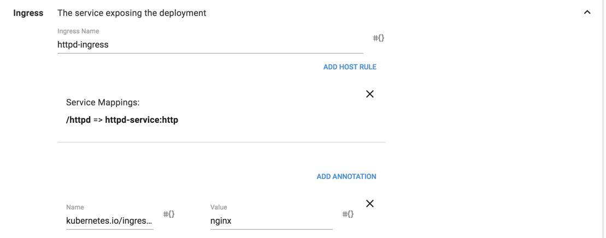
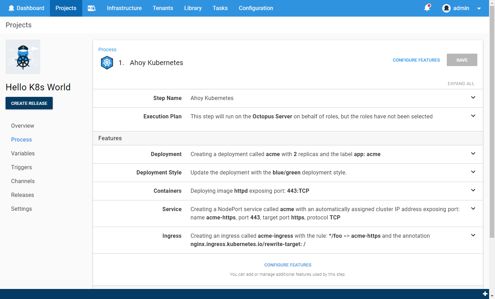

A few months back we asked the Octopus community if they could spare a few minutes and brain-cycles to provide some feedback on the [first-draft of our Kubernetes plans](https://octopus.com/blog/kubernetes-rfc).  And you certainly delivered.  So first, thank-you!  We sincerely appreciate everyone who shared their thoughts.  The product will certainly benefit from it.

There were a few common themes in the feedback, which caused us to alter course slightly.  We'll talk a little about those, and then finally give a summary and progress update.

!toc

## #1 A more friendly Kubernetes

One of the strengths of Octopus has always been that it is user-friendly.  It lets you deploy to an ASP.NET website without being a Level 100 IIS Wizard.

It was pointed out that we were perhaps missing an opportunity to provide a similar experience for Kubernetes; to possibly smooth the learning curve a little. We agreed.

As part of the first-cut, we are going to include a _Deploy Containers to Kubernetes_ deployment step.  This step will have a rich user-interface and will walk through the process of:  

- Creating a Kubernetes Deployment, including selecting the deployment-style and the container images:

- Creating (or updating) the Kubernetes service, including mapping ports:

- Configuring Ingress Rules:

The end result (with collapsed sections) will look something like:

One of Octopus's other strengths is managing [variables](https://octopus.com/docs/deployment-process/variables), including [transforming configuration files](https://octopus.com/docs/deployment-process/configuration-features).  But this is redundant if you can't get those files into your Kubernetes pods.

Kubernetes has the concept of ConfigMaps (and Secrets, for sensitive data).  We will provide an easy way to leverage the Octopus variable and configuration-file power and to push the results to a ConfigMap or Secret.  

We are excited about the _Deploy Containers to Kubernetes_ step.  Starting with an empty YAML file, the Kubernetes learning-curve can be daunting, and we feel there is scope for Octopus to help with that.
We are especially enthused about the ability to select `Blue\Green` as the deployment style.  This will hopefully make some tricky scenarios much easier to configure.  We will talk more about this in future posts.

## #2 Helm

So plenty of you really like Helm, huh?  

It seems a significant portion of Kubernetes users are using Helm, and many made it clear that not having Helm integration would result in them razing their Octopus installation and salting the server that was hosting it ;)  Fortunately, once we investigated, Helm actually fits pretty nicely into the Octopus architecture.

So we are committed to also adding Helm integration. This will be in the form of:

- A Helm Chart Repository feed type

- A Helm Deploy Release step

We want to provide a great experience whether you use Helm or not. And OK, to be honest, we're a little scared of the Helm militia :P   

## #3 Not just Kubernetes

We were also reminded that there are many container scenarios which don't involve Kubernetes, and there are a few rough edges in Octopus currently for these. For example, deploying to ECS.

To help unlock all the scenarios we won't be adding first-class support for at this moment, we are making a few changes to the _Run a Script_ steps to make working with container images a bit nicer.

Previously, the only way you could reference a package from a script step was to embed the script in the package.  And this wasn't even supported for container images. This meant that working with container images in custom script steps generally involved adding the image tag as a regular variable, and modifying it before creating the release. This works, but it forfeits the traditional Octopus-goodness around versioning, for example:
- Selecting the package versions when creating a release.
- Being able to bind the release version to the package version.
- Seeing which package versions are included in the release.

Customers are even simulating these by including dummy packages (e.g. NuGet or Zip) in their deployment process to represent their container images, since these would be captured in the release. This is very clever, but also made us sad. It shouldn't require that level of ingenuity.

You will now be able to reference packages (including container images) from script steps. The versions of these packages will be selected when creating a release, and will then be available from your custom script, both as a set of variables and the package itself depending on the acquisition options selected (see [the spec](https://github.com/OctopusDeploy/Specs/blob/master/Script-Step-Packages/index.md) for more details).

This change will apply to the following steps:
- `Run a script`
- `Run an Azure PowerShell Script`
- `Run an AWS CLI Script`
- The new `Run a kubectl Script` step (see below)

We're also adding an `AWS Elastic Container Registry` feed type.  You can currently [configure AWS ECR as a feed](https://octopus.com/docs/packaging-applications/package-repositories/registries/amazon-ec2-container-services#amazon-ec2-container-service) in Octopus, but it is rather fiddly and comes with the significant drawback that the credentials will time-out after 12 hours.  The new feed will avoid this problem.

We're hopeful these changes will make container scenarios feel a lot more natural, and be better able to leverage the power of Octopus.

## Summary

The first cut of Operation Make-Octopus-Love-Containers will include the following:

- [Kubernetes Cluster deployment target](https://github.com/OctopusDeploy/Specs/blob/master/Kubernetes/index.md#kubernetes-cluster-target)
- [Deploy Containers to Kubernetes deployment step](https://github.com/OctopusDeploy/Specs/blob/master/Kubernetes/index.md#deploy-containers-to-kubernetes-step)
- [Run a kubectl Script deployment step](https://github.com/OctopusDeploy/Specs/blob/master/Kubernetes/index.md#run-a-kubernetes-script-step)
- [Helm Chart Repository feed type](https://github.com/OctopusDeploy/Specs/blob/master/Kubernetes/helm.md#helm-chart-feed)
- [Helm Deploy Release deployment step](https://github.com/OctopusDeploy/Specs/blob/master/Kubernetes/helm.md#helm-deploy-release-step)
- [Ability to reference container images (and other packages) from script steps](https://github.com/OctopusDeploy/Specs/blob/master/Script-Step-Packages/index.md)
- AWS Elastic Container Registry feed type.

### When?

Much of the functionality above has been built. We are planning to begin alpha-testing this in the coming weeks.  We have many volunteer K8s lab rats, and we are going to reach out to you with the details of how you can play with this very soon.  

As soon as we are satisfied with the feedback from the early adopters, we will ship this in a coming monthly release.

### Step 1 of N

The is only the beginning.  If there is something we have left out that you would like to see supported, then please let us know. Things on our radar include:

- A `Docker Compose` deployment step
- The [Kubernetes Apply](https://github.com/OctopusDeploy/Specs/blob/master/Kubernetes/index.md#apply-a-kubernetes-template-step) step we originally proposed
- ECS support

As always, please feel welcome to leave comments on this post. We've also created a `#containers` channel in the [Octopus Deploy community Slack](https://join.slack.com/t/octopususergroup/shared_invite/MjMxOTEzMTE2NjcyLTE1MDM5MTc1MTUtZmVlYjBjMmZhMA
), so you can also come and chat with us there.
