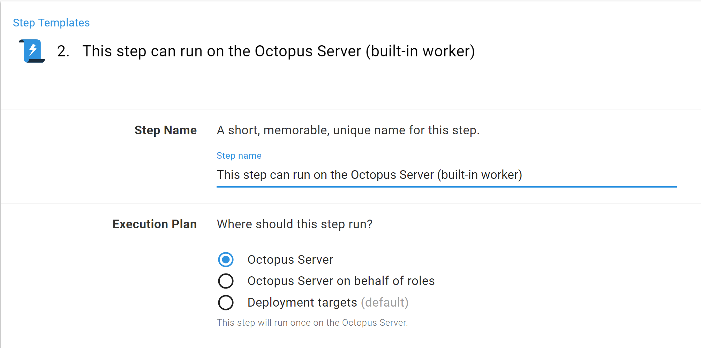
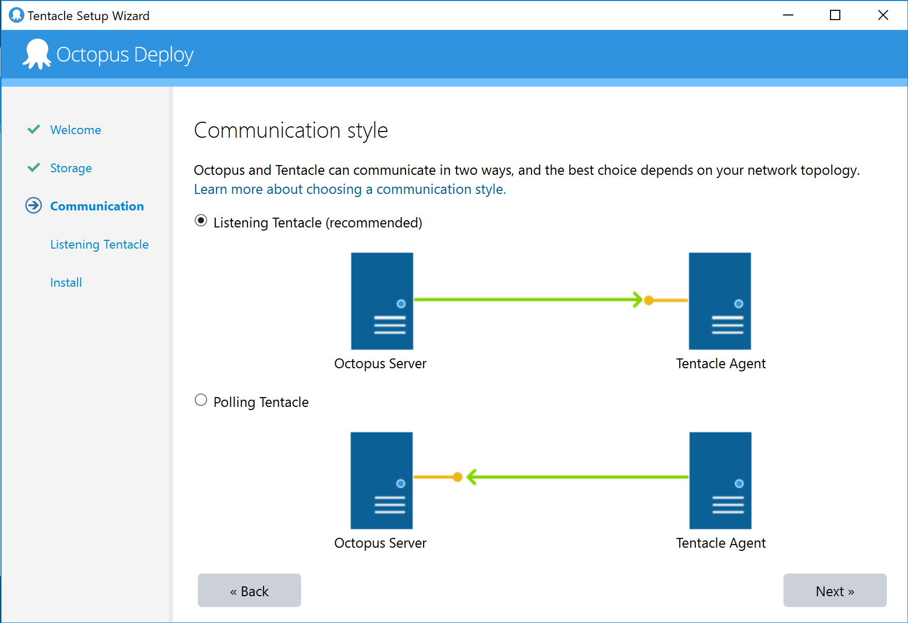
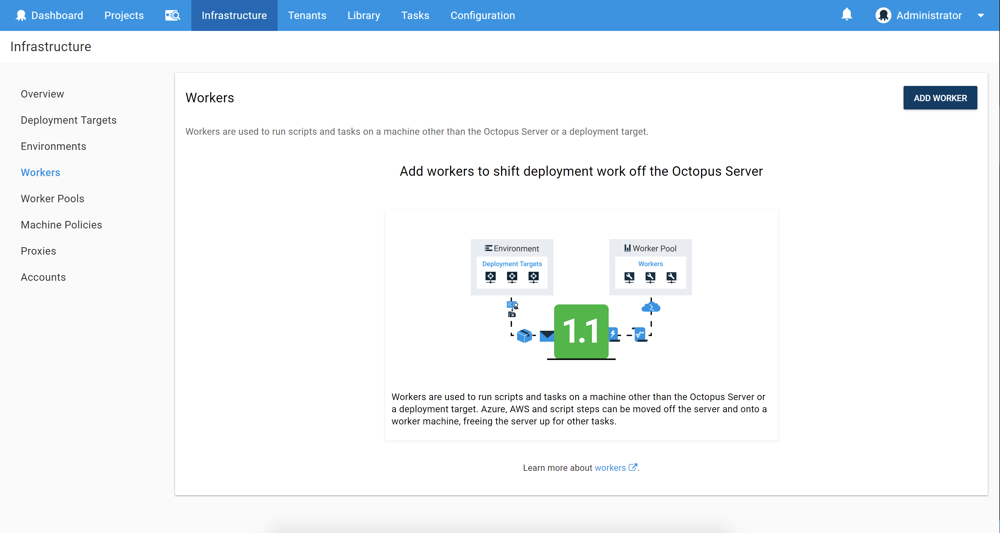
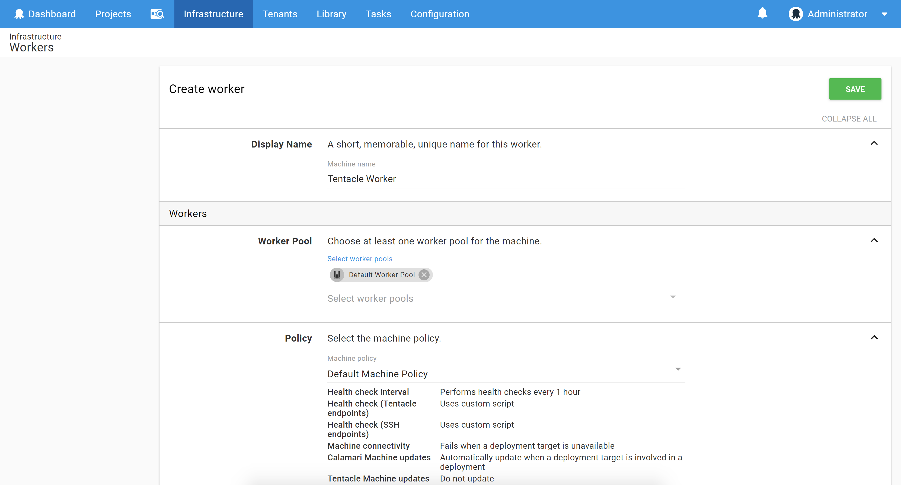
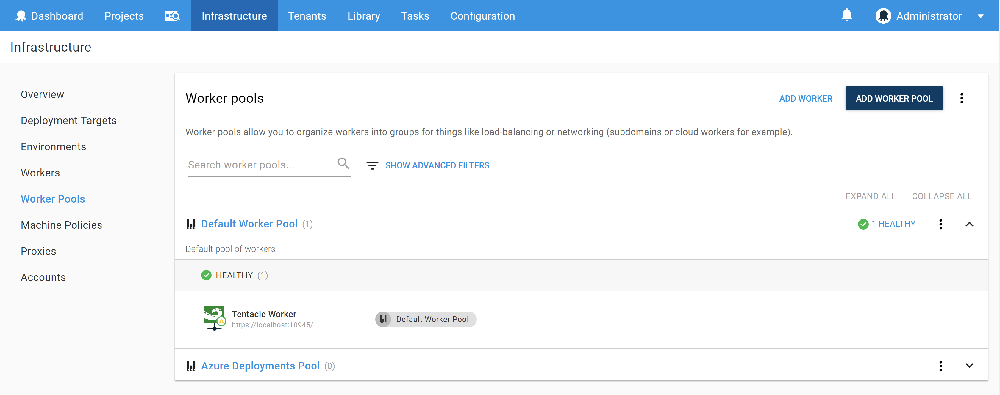
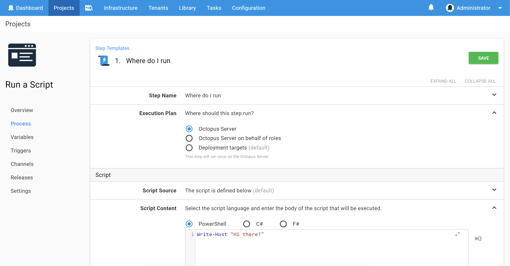
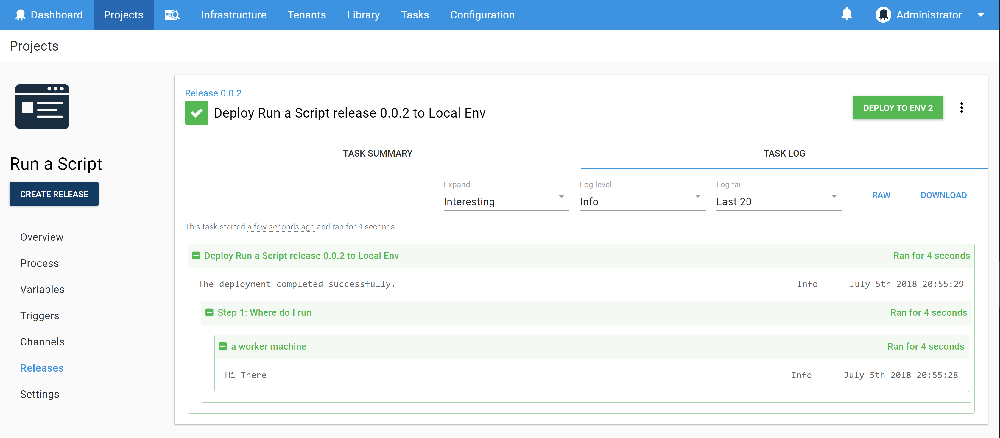

**top image**

We are just about to release a great new feature that gives you all kinds of new power in setting up your Octopus infrastructure.  In 2018.7.0 we'll introduce Workers.  

In this post, I'll give you a pre-release peak, tell you the what and why of Workers, and show you how to use Workers to move steps off the Octopus Server.  

Following posts will give more walk-through examples for scalling with Workers and using Workers for cloud deployments.

Workers allow some nice ways to set up your deployments and move work off your Octopus Server, so it's well worth reading carefully, but we've also designed it [so you never even need to know it's there](#What-wait-No-Now-theres-workers-and-pools-and-a-built-in-worker-I-don-t-care-just-let-me-have-it-back-to-how-it-used-to-be) if you don't want to use it.

## What are these workers anyway?

Since version 3.0, Octopus has had one Worker.  We didn't call it a Worker to start with, and you might have used it without even knowing it was there.  It's called the Built-in Worker, and it's bundled with the Octopus server.

Azure, AWS and Terraform steps all need somewhere to run, so, out-of-the-box that's the Built-in Worker on the Octopus Server.  Steps in Octopus are executed by [Calamari](https://github.com/OctopusDeploy/Calamari), our open-source, conventions-based deployment executable.  Lots of the time, Calamari runs on a deployment target.  But in the case of Azure, AWS and Terraform steps, the Octopus Server uses the Built-in Worker to invoke Calamari locally.

The give-away that the server can invoke Calamari is script steps.  Those call out the option of running the step on the Octopus server.

All a Worker does is takes these points where the server could execute Calamari locally, using the Built-in Worker, and gives you the option of executing on a Worker somewhere else.

### What a Worker is and isn't

A Worker doesn't take over orchestrating a deployment in place of the Octopus Server; it just executes steps that the server instructs it to.  Nothing has even changed about how script, Azure, AWS or Terraform steps are executed; Workers just provide an option about **where** those steps are executed.

The Octopus Server orchestrates the whole deployment process, deployment targets are where your deployment goes, and Workers are machines that can execute some steps for the server but aren't the target of the deployment.  

So, Workers are just machines that can run script, Azure, AWS and Terraform steps, and can be Listening Tentacles, Polling Tentacles or SSH machines (SSH Workers can only run bash scripts).

## When might you want to use a Worker

Over the course of a couple of posts, I'll flesh out the details of three cases where Workers come in handy (or are essential).

1. [Moving steps off the Octopus Server - security](#Stopping-steps-running-on-the-server)
1. Workers for scaling up - performance (in a following post)
1. Setting up cloud Workers - cloud (in a following post)

Of course, there are also other ways to use Workers.

But, before we get into the examples, let's look at how the whole Workers setup works.

## How Workers _works_

### Workers

Workers are Listening Tentacles, Polling Tentacles or SSH machines.  The setup is the same as for tentacle or SSH deployment targets.  Workers even use the same Tentacle and Calamari binaries as deployment targets.

For example, here I'm using the Tentacle Manager to [set up a Tentacle](https://octopus.com/docs/infrastructure/windows-targets), but you can also [script it](https://octopus.com/docs/infrastructure/windows-targets/automating-tentacle-installation), and even do the full [worker registration](https://octopus.com/docs/api-and-integration/tentacle.exe-command-line/register-with) from the command line.

Once I've setup the Tentacle, I navigate to the new *Workers* tab in *Infrastructure* and select "ADD WORKER".

After entering the host and port of the Tenacle I configured, I give the Worker a name, select a machine policy and put the Worker in a Worker Pool.

### Worker Pools

Workers are grouped into Worker Pools.  From the Octopus Server's point of view, all the Workers in a Pool are equivalent. Pools might represent machines setup to assit with particular kinds of deployment, or for a specific set of tools installed, or maybe you'll assign Pools for particular teams or projects you are undertaking (that'll work nicely in a short while when our Spaces feature comes in).

### Running steps on Workers

Steps - well, script, Azure, AWS or Terraform steps - can now target a Worker Pool and will be executed on a Worker from that Pool.  There's always a default Pool that steps are assumed to target if nothing else is specified.  You're free to change which pool is the default.  Initially it starts out, unsurprisingly, as a pool called "Default Worker Pool".

Just two rules govern how Octopus decides where to execute a step that requires a Worker.  Octopus will run the step on...

1. the Built-in Worker, if the step resolves to the default Pool and there are no Workers in the default pool, or
1. any healthy Worker from the given pool, otherwise.

That's pretty much it: you setup Workers (as easy as setting up Deployment Targets), group the Workers into Pools (as easy as putting Deployment Target into Environments), and then you point a step at a Pool and Octopus distributes out the work of your deployment process.

## What, Wait, No.  Now there's Workers and Pools and a Built-in Worker, I don't care, just let me have it back to how it used to be

No worries, we've got you covered.  We took a hard look at use cases for not using Workers and for transitioning to Workers.  We think we got smooth answers for both.

**If you don't want to use Workers, then it's really simple - just ignore it**.  If you're an existing Octopus user, your steps won't change, there's no changes to any of your deployment processes, your Octopus experience won't change, even your deployment logs won't change.

Point (1) above says it all.  Any steps that would require a Worker will resolve to the default Worker Pool, because your steps won't say any different, and that will end up at the Built-in Worker, which is the same experience Octopus users have had since version 3.0. 

## Stopping steps running on the Octopus Server

We've also got a nice story for the transition away from runnings steps on the Octopus server.  No deployment processes need updating, just a tiny bit of setup and Octopus will move steps off the server and onto Workers.

We all love our dev teams (at least developers like me hope you do), but maybe you would much rather if they couldn't execute code on your Octopus Server.  

Well, all your existing Azure, AWS and Terraform steps (and any script steps targeted at the server) Won't mention a Worker Pool and so end up with the default Pool, which is empty, and thus the steps run on the Built-in Worker.  But, if you drop even one Worker in that default Pool, then rule (2) applies and the step runs on that Worker and not the Built-in Worker.

Let's have a look at that in action.  I started with an Octopus Server setup with no Workers (other than the Built-in Worker, of course) and no Worker Pools (other than the default Pool). I created a simple project with a script targeted at the server.

After deploying the project, the logs clearly point out that the script ran on the Octopus Server.

I then, as [descirbed above](#Workers), provisioned a Tentacle and registered it as a Worker in the Default Worker Pool.

On deploying release 0.0.2 of the same project (unchanged), the logs let me know it ran on the Worker instead of the server.

That's all it takes.  Just one Tentacle is enough to stop user code executing on the Octopus Server.  

Of course it's also possible to provision multiple Workers to share the work the server hands out.

It's also possible to turn off the Built-in Worker, meaning that it never gets invoked even if the default pool happens to be empty.  Check the option in Configure -> Features.

The same concurrency rules apply as always did.  The server still respects your parallel steps and `Octopus.Action.MaxParallelism`, so multiple concurrent steps could be running on Workers, even on the same Worker, just as the Built-in Worker runs many steps concurrently.

## Comming soon

Workers is about the be released in Octopus 2018.7.0, so keep an eye on our releases for that.  

On the blog, I'll be posting a couple more installments about Workers.  Next up, I'll be looking at using Workers to reduce load on the Octopus Server.  After that, I'll take a look at how we can use Workers for some nice patterns for cloud deployments.
