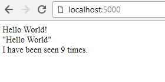
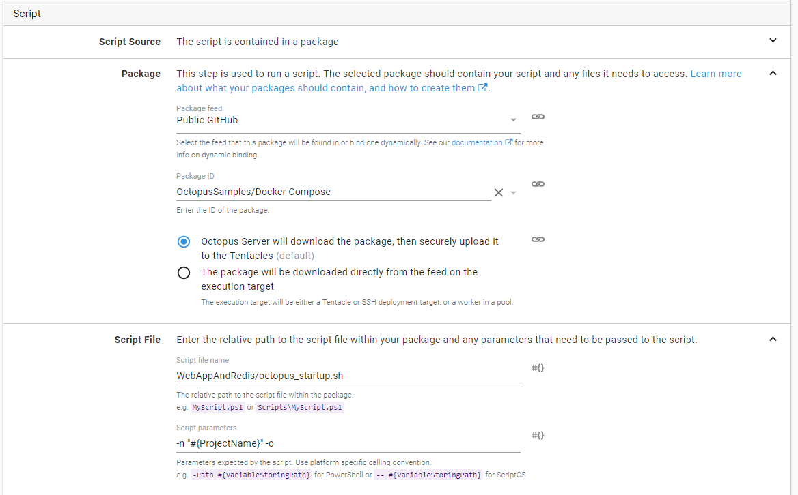
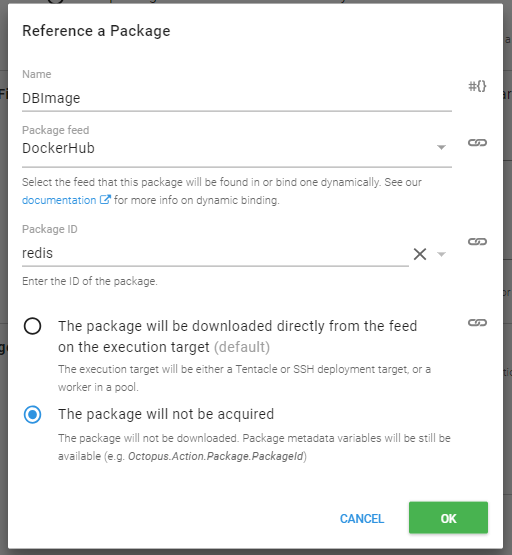
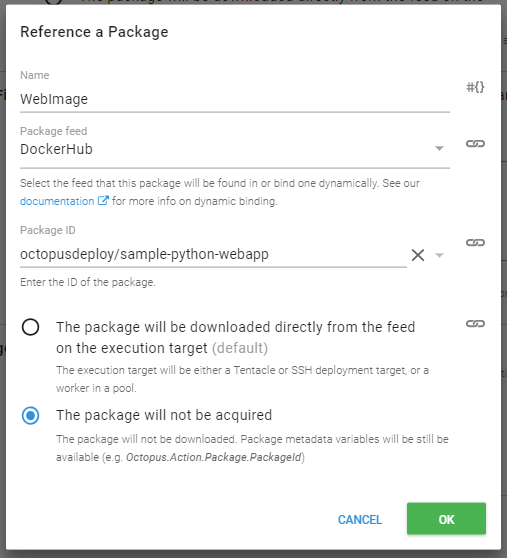
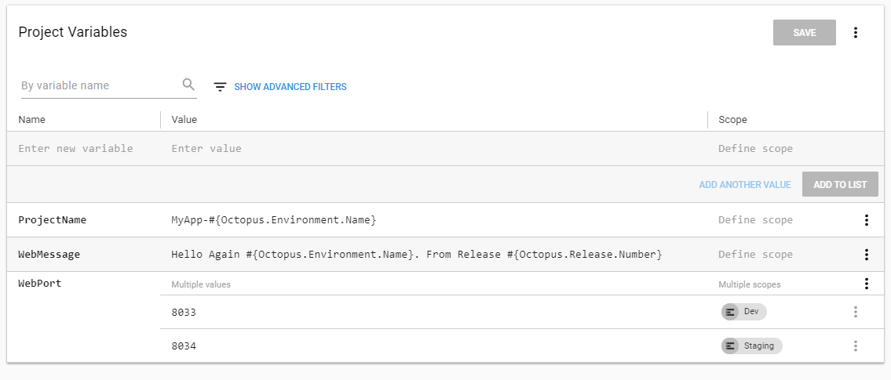
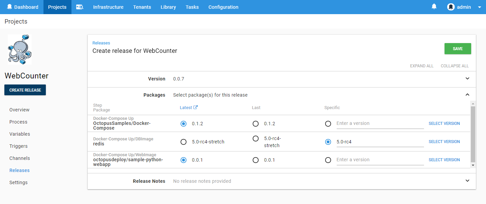

Support for simple Docker steps has been available in Octopus from version 3.5.0 and since that time the containers landscape has dramatically changed. An increasing number of continuous deployment pipelines make use of containers, whether that be to standardize the build environments, testing or even runtime. Although we have recently focused our attention on improving our [Kubernetes support](../../2018-07/kubernetes-containers-update/index.md), for some requirements a simple docker-compose file is all that is needed. Why use a nail gun, when all you need is a hammer?

With a recent upscaling of the `Run a Script` deployment step, performing `docker-compose` tasks can now be better integrated into your Octopus Deploy project. In this post we will look at how environment variables can be easily supplied and image versions tied to Octopus releases by leveraging some great new scripting features. All of the images and scripts in this example is available either on GitHub or DockerHub where indicated.

## Starting with a simple compose
We want to build a simple website that has a visitor counter (hello 1990's) and a simple message. To do this we are going to run a small python website that stores the visitor state in a redis data store. Wrapping the website up into a container and running them through docker-compose means that we can be sure that the execution environment always matches our expectations. I won't go into the details of writing python scripts or building the docker image for this website but feel free to check out the source code for the [web app](https://github.com/OctopusSamples/Docker-Compose/blob/master/WebAppAndRedis/app/app.py) and [Dockerfile](https://github.com/OctopusSamples/Docker-Compose/blob/master/WebAppAndRedis/app/Dockerfile) on the [GitHub repo](https://github.com/OctopusSamples/Docker-Compose) that hosts these project files.

After building our web app image we can create a `docker-compose.yml` file that looks like
```yaml
version: '2'
services:
  web:
    image: sample-python-webapp:latest
    ports:
     - "5000:5000"
    environment:
      - text="Hello World"
  redis:
    image: redis:latest
```
then its just a matter of running `docker-compose up` and we get our awesome website



## Deploying through Octopus
Now that we know our website works, we want to deploy it via Octopus Deploy so that we can make the most of environmental progression, controlled image versioning and variable injection.

### Custom values during docker-compose
Rather than hard-coding the image details in the `docker-compose.yml` file, we want to be able to dynamically pass in the details via standard docker variables.

The `docker-compose.yml` file then looks like

```yaml
version: '2'
services:
  web:
    image: ${WEB_IMAGE}:${WEB_TAG}
    ports:
     - "${WEB_PORT}:5000"
    environment:
      - text=${TEXT_MESSAGE}
  redis:
    image: ${DB_IMAGE}:${DB_TAG}
```

If I were to try and run this locally however, I would get a bunch of errors since docker doesn't know what value these variables should have. We can solve this problem by providing a [`.env` file](https://docs.docker.com/compose/env-file/).

```
WEB_IMAGE=mywebapp
WEB_TAG=1.0.0
DB_IMAGE=redis
DB_TAG=latest
TEXT_MESSAGE=I Am A Local Message
WEB_PORT=5889
```

Now when i run `docker-compose up`, docker will use the values from this file.

### The Octopus Project
Although there are no docker-compose specific steps, we can use the multiple package abilities provided in the latest version of the script steps to provide the information about the specific images we want to use for the `.env` file. We are going to invoke `docker-compose` ourselves so what we will start with is a `run a script` step.

Since we want to version all of our scripts and `docker-compose.yml` files, we will source them via a [GitHub feed](https://octopus.com/docs/packaging-applications/package-repositories/github-feeds). We don't really have any build process required for these scripts (ignoring our web app image itself which we build through a separate process) so using the GitHub feed allows Octopus to obtain our script code directly from source control. In our case we will  use the public GitHub repository we mentioned earlier and set the script file to `WebAppAndRedis/octopus_startup.sh` and pass though a couple of parameters `-n "#{ProjectName}" -o`. This script will contain the code we want Octopus to run during a deployment and we will go over it's contents and those parameters shortly.



Under these fields is the new feature, `Additional Packages`. Lets add references to the two docker images that are used for this project. In this case we will make use of a [DockerHub feed](https://octopus.com/docs/packaging-applications/package-repositories/registries/docker-hub) and have selected the official `redis` image



 and the `sample-python-webapp` image we were using earlier that has since been pushed to the [OctopusDeploy DockerHub](https://hub.docker.com/u/octopusdeploy) registry.

 

 In both of these cases we have opted to _not_ acquire them on the server. What this means is that the package details will be available as variables to the script but acquisition wont be performed. In the case of our `docker-compose` step, docker will pull them down for us automatically if necessary however there may be some cases where you want the package file to be available, for example where you want to make use of additional scripts or tools not contained in the primary package we selected in the first step. Take note of the names that we gave these two additional package references (`DBImage` and `WebImage`), this is what will be used to reference the different package details as variables.

### Getting Octopus variables into docker-compose
What we want to do is provide selected image details to the `docker-compose.yml` file through the `.env` file. We could replace the existing `.env` file with a bunch of Octopus variables to [replace at deploy time](https://octopus.com/docs/deployment-process/configuration-features/substitute-variables-in-files), but then we wouldnt be able to run it locally during development. Instead lets create a separate file `octopus.env`

```yaml
WEB_TAG=#{Octopus.Action.Package[WebImage].PackageVersion}
WEB_IMAGE=#{Octopus.Action.Package[WebImage].PackageId}
DB_TAG=#{Octopus.Action.Package[DBImage].PackageVersion}
DB_IMAGE=#{Octopus.Action.Package[DBImage].PackageId}
TEXT_MESSAGE=#{WebMessage}
WEB_PORT=#{WebPort}
```

One of the other great new features available to script steps is the ability to perform variable replacement or config transformation. Let's enable this feature and ensure that this new file `octopus.env` has the variables replaced.


Here are the other variables that are used for this project.



### The execution script
We skipped over the actual script execution earlier, so now that we know we will have an Octopus provided `.env` file, lets take a look into what this script actually does.

As of the time of writing, `docker-compose` does not provide a simple way to pass a custom `.env` file, although there is an active [GitHub issue](https://github.com/docker/compose/issues/4841) so the following step may become simplified in the future. To get around this limitation we will rename the `octopus.env` file to `.env` at deployment time. This occurs after the variable substitution has taken place so that when we then run `docker-compose` it will make use of _these_ variables rather than the default ones that we have included for dev-time.

Since we also want to be able to run and test this script locally, we will ensure that the `.env` file change can be configured to _not_ occur based on the absence of the `-o` argument that we only pass in during the Octopus deployment.

```bash
#!/bin/bash 
 
 cmd="up"
 octopus=0
 project_name="MyApp"
 while getopts ":n:c:o" opt; do
  case $opt in
	o) octopus=1
    ;;
	n) project_name="$OPTARG"
	;;
    c) cmd="$OPTARG"
    ;;
    \?) echo "Invalid option -$OPTARG" >&2
    ;;
  esac
done

if [[ $cmd = "up" ]]; then
	if [[ octopus -eq 1 ]]; then
		echo "Replacing '.env' file with '.octopus.env'"
		mv ./.env ./.env.old
		mv ./octopus.env ./.env
	fi
	#docker-compose pushes non errors onto stderr. Redirect to stdout
	docker-compose --project-name $project_name  up -d  2>&1
else
	docker-compose --project-name $project_name  $cmd  2>&1
fi
```

We can now run this script locally with `.octopus_startup.sh up` or `.octopus_startup.sh down`. Passing a project name using the `-n` parameter makes it possible to set the name that docker puts on the containers and allows us to run multiple instances on the same server. Since we will be running both Octopus environments on the same machine for this example, the compose project name will incorporate the Octopus environment name as a project variable `MyApp-#{Octopus.Environment.Name}`.

Depending on how simple or complex your deployment may be, your execution script may need to be quite different to this one so treat is as a guide to illustrate the intended behavior. The core goal is to replace the `.env` file and invoke the `docker-compose up` command. You may for example, want to scale up the number of instances of specific containers, or perform additional configuration like set up volume mounts, etc.

We are running this script on an SSH target so I have used a bash script, but there is a similar PowerShell script available in the GitHub repo.

### Create release and deploy
Now that we have everything in place we can deploy our project! When we create a release we can see that we are able to select 3 different packages, even though we only have 1 step!



As you can see we can select the version of the package that contains all our script files from GitHub as well as the versions of the two images which are contained in DockerHub.

We can then deploy our release to dev


 and staging


If we want to update the greeting text passed into our container we can just update the project variable and deploy again! If we push a new version of our web app we just create a new release, specify the latest version of that image and deploy!

## Docker-Compose and Octopus
As shown above, using the new multi-package selection available in script steps opens up a whole new set of possibilities for deployment automation including easier docker-compose deployments. To integrate docker-compose in your Octopus process, select each image as an additional script-step package and make use of the `.env` file to supply the values that need to change.

Hopefully this post gives you some ideas on where to start with your docker-compose deployments. We are continuing to add additional functionality to Octopus Deploy to make deploying your containers as easy as possible so that you can get back to the work of actually writing code! Keep an eye out for our Kubernetes support in our next big release!