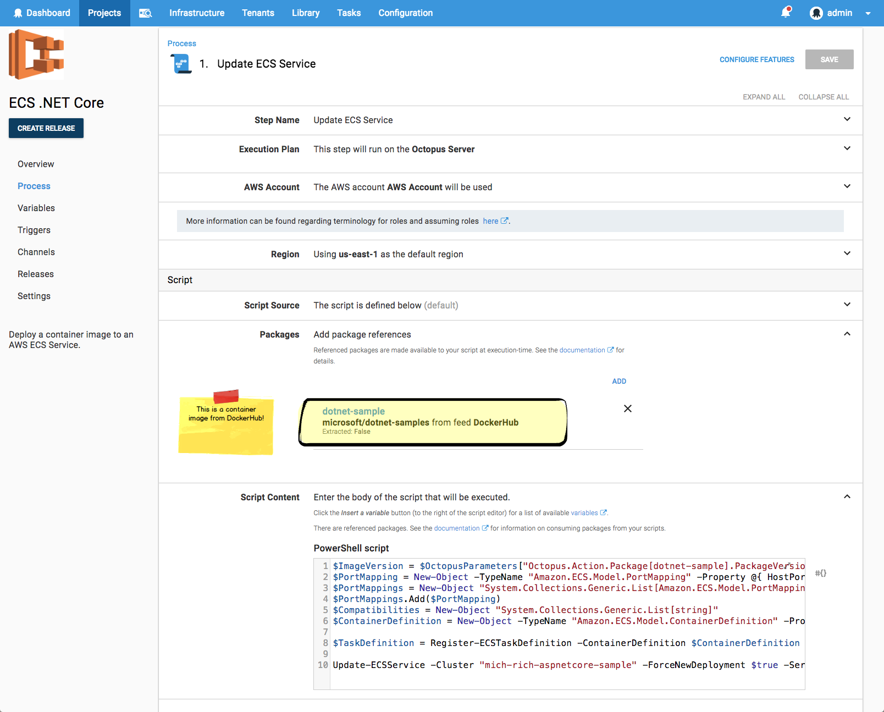
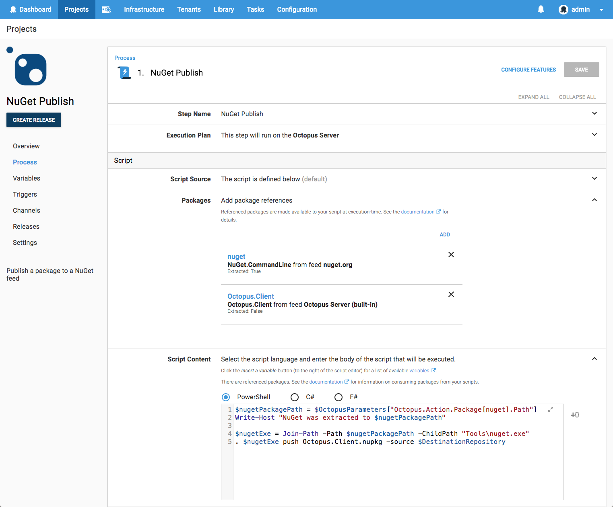
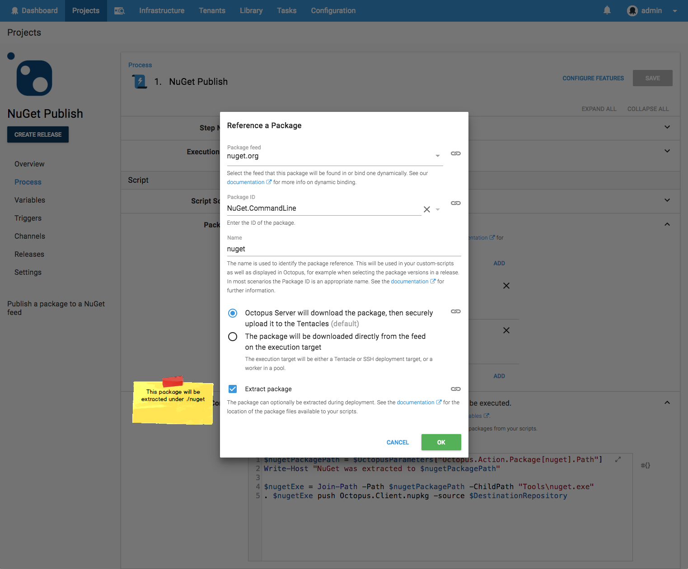
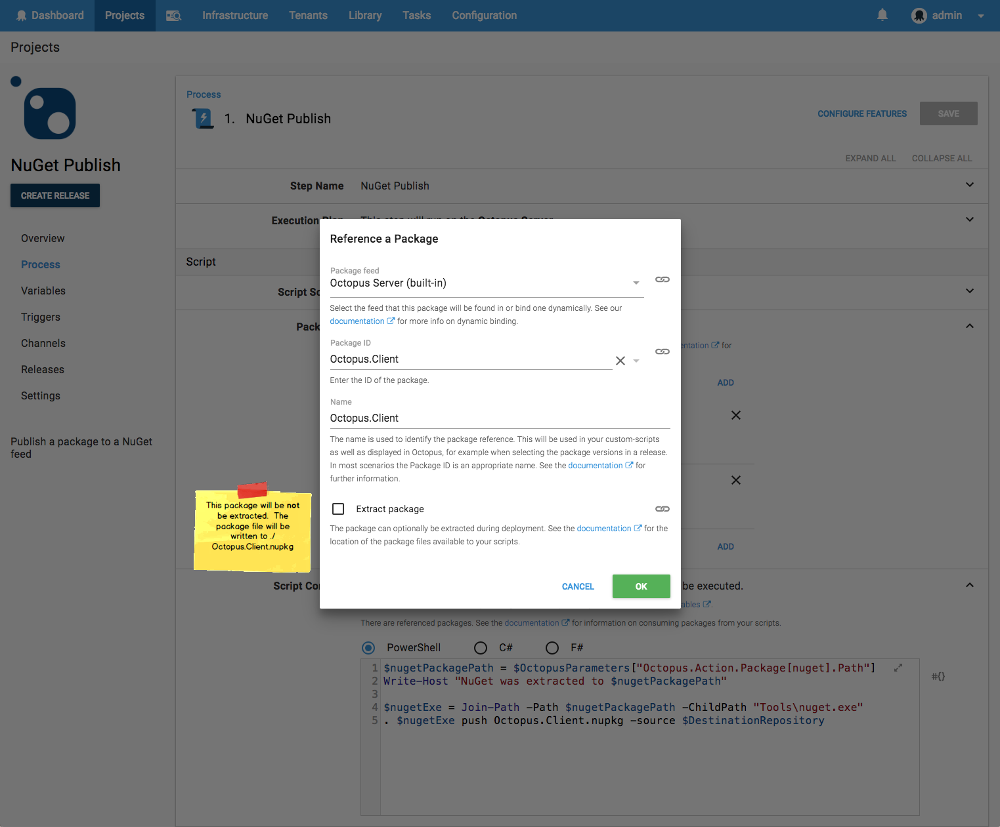
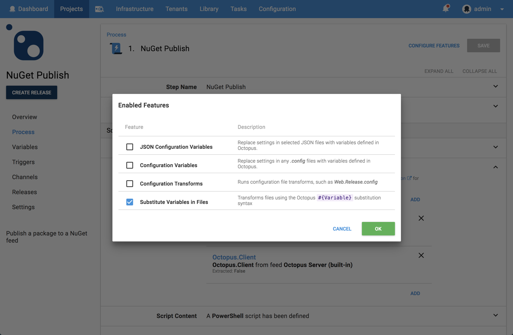

In Octopus 2018.8 Script Steps are evolving, and gaining some new super-powers.

## Packages++

We are adding the ability to add package references to the family of script steps:
- `Run a Script`
- `Run an Azure PowerShell Script`
- `Run an AWS CLI Script`

Previously these steps were able to reference a single package which contained the script to be run.  They can now also reference packages which do not contain the script.  Yes, packages, _plural_.  Oh, and when we say _packages_ we are including container images (see [below](#container-images)).  

## Why?

Scripts often need to interact with packages. They may need to read\write files within a package (for example to execute another script contained in a package) or in some cases only the package metadata is required (for example updating the image version used by an AWS ECS service). 

Previously when accessing files from a scipt there were two patterns:

### 1) The "wrapper" package 

<div style="float: right; margin: 30px; margin-top: 0">
    
</div>

Octopus has long had the ability to use a package as the source of the script to be executed.  A side-effect of this is that the package is first extracted, and the files inside then sit alongside the script file being run. This has led many a savvy user to realize they could either embed their script inside the package they wish to consume, or vice-versa to embed the package in the same package as the script.   

This works, but we would prefer to not force the creation of these artificial wrapper packages.


### 2) The "deploy-the-packages-first" pattern

In this pattern, one or many _Deploy a Package_ or _Transfer a Package_ steps are configured to push the packages to a location on the target servers.  The script step then simply assumes the packages have already been deployed.

The key drawback of this approach is that it can only be used to execute the script on a target machine.  It can't be used to run on the Octopus Server or a Worker.
It also makes the deployment process more complicated than it should be. 


### Container Images

You can now reference container images from script steps in a first-class way!



This means the version (the image tag) of the images will be captured at release creation time, just like any other package.

Container images can be configured to be acquired on the execution target, or to not be acquired at all.  For example, in the image above we are updating an AWS ECS service to use version of the container image.  Since we are simply using the metadata, we don't need to bear the cost of pulling the image locally.  

## An Example: NuGet Push 

A real example scenario we have at Octopus HQ is pushing packages to NuGet.  

The release process for, as an example, our Octopus.Client .NET library is to push the package to a NuGet repository.  For our `Test` environment, we push to a private MyGet feed, and then for our `Production` release we push to [nuget.org](https://www.nuget.org/packages/Octopus.Client/)

This involves two packages: 
- `NuGet.CommandLine` from nuget.org, which we need to extract to run `nuget.exe push` 
- `Octopus.Client` which is the package we have just built and want to push un-extracted to a NuGet repository 

We previously did the "deploy-the-packages-first" dance. With the new script-step powers the deployment process becomes: 



When we add the `NuGet.CommandLine` package reference we specify that it should be extracted. We also give it a name, `nuget`, that is convenient to use from our custom script. 



Contrast this with the `Octopus.Client` package reference, which we specify to _not_ be extracted.



Our script to publish the package then becomes:

```
# Build the path to nuget.exe
$nugetPackagePath = $OctopusParameters["Octopus.Action.Package[nuget].ExtractedPath"]
$nugetExe = Join-Path -Path $nugetPackagePath -ChildPath "Tools\nuget.exe"

# nuget push
. $nugetExe push Octopus.Client.nupkg -source $DestinationRepository
```

The referenced packages are available to the custom script in two ways.  

### Package Files

If the package reference was configured to be extracted, then the package will be extracted to a sub-directory in the working-directory of the script. This directory will be named the same as the package-reference.  In the example above, a package reference named `nuget` would be extracted to directory similar to `C:\Octopus\Work\20180821060923-7117-31\nuget` (this is obviously a Windows directory; a script executing on a Linux target may have a path such as `/home/ubuntu/.octopus/Work/20180821062148-7121-35/nuget`). 

If the package reference was _not_ configured to be extracted, then the un-extracted package file will be placed in the working directory. The file will be named as the package reference name, with the same extension as the original package file.  In the example abolve, the `Octopus.Client` package reference, which resolves to a nupkg package, the file would be copied to a path such as `C:\Octopus\Work\20180821060923-7117-31\Octopus.Client.nupkg` (for Linux: `/home/ubuntu/.octopus/Work/20180821062148-7121-35/Octopus.Client.nupkg`). 

These locations were designed to be convenient for use from custom scripts, as the relative path can be predicted, e.g. `./nuget`.  If the absolute path is required the variables may be used (see below). 

### Package Variables

Package-references contribute variables which can be used just as any other variable. These variables are (using the `nuget` example):

| Variable                                      | Description                                            | Example value |
| ----------------------                        | ------------------                                     | ------------- |
| Octopus.Action.Package[nuget].PackageId        | The package ID                                         | NuGet.CommandLine 
| Octopus.Action.Package[nuget].FeedId           | The feed ID                                            | feeds-nuget-org 
| Octopus.Action.Package[nuget].PackageVersion   | The version of the package included in the release     | 4.7.1 
| Octopus.Action.Package[nuget].ExtractedPath    | The absolute path to the extracted directory           | C:\Octopus\Work\20180821060923-7117-31\nuget  
| Octopus.Action.Package[nuget].PackageFilePath  | The absolute path to the package file (This will not be set for the `nuget` example, as it was configured to be extracted)  | C:\Octopus\Work\20180821060923-7117-31\Octopus.Client.nupkg 
| Octopus.Action.Package[nuget].PackageFileName    | The name of the package file (This will not be set for the `nuget` example)           | Octopus.Client.nupkg 

## Variable Substitution

One more thing...

We've enabled the file variable-substitution features for script steps.  



This allows substituting Octopus variables into files contained in referenced packages. 

## When 

Package-References from Script Steps are available in Octopus 2018.8, which will be available for download by the time you are reading this.  

_Happy multi-package deployments!_