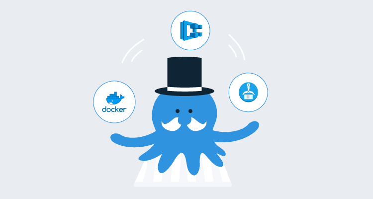
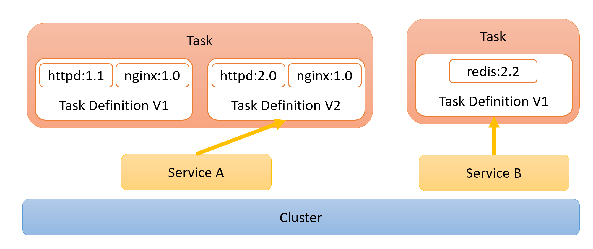
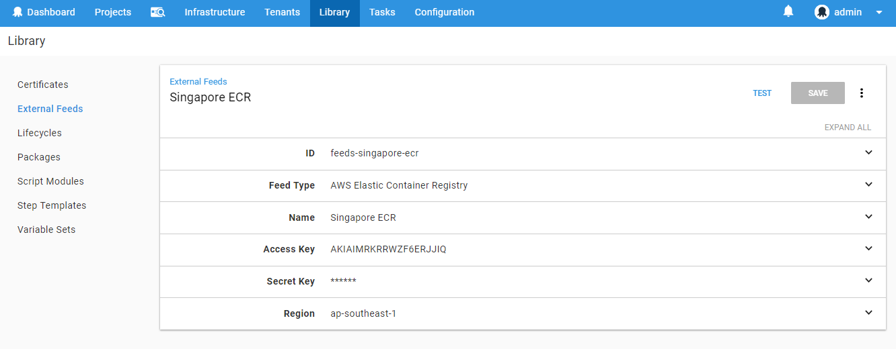
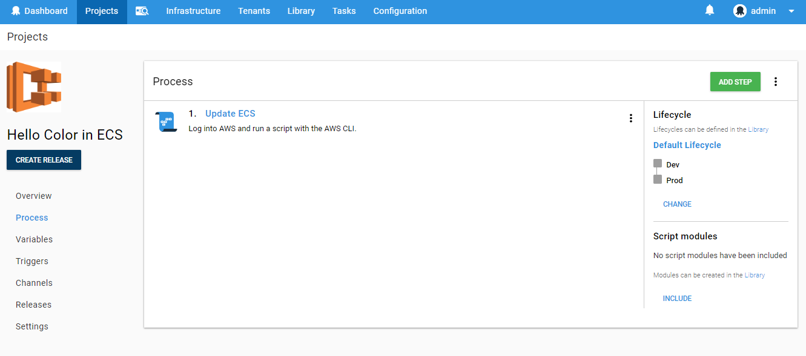
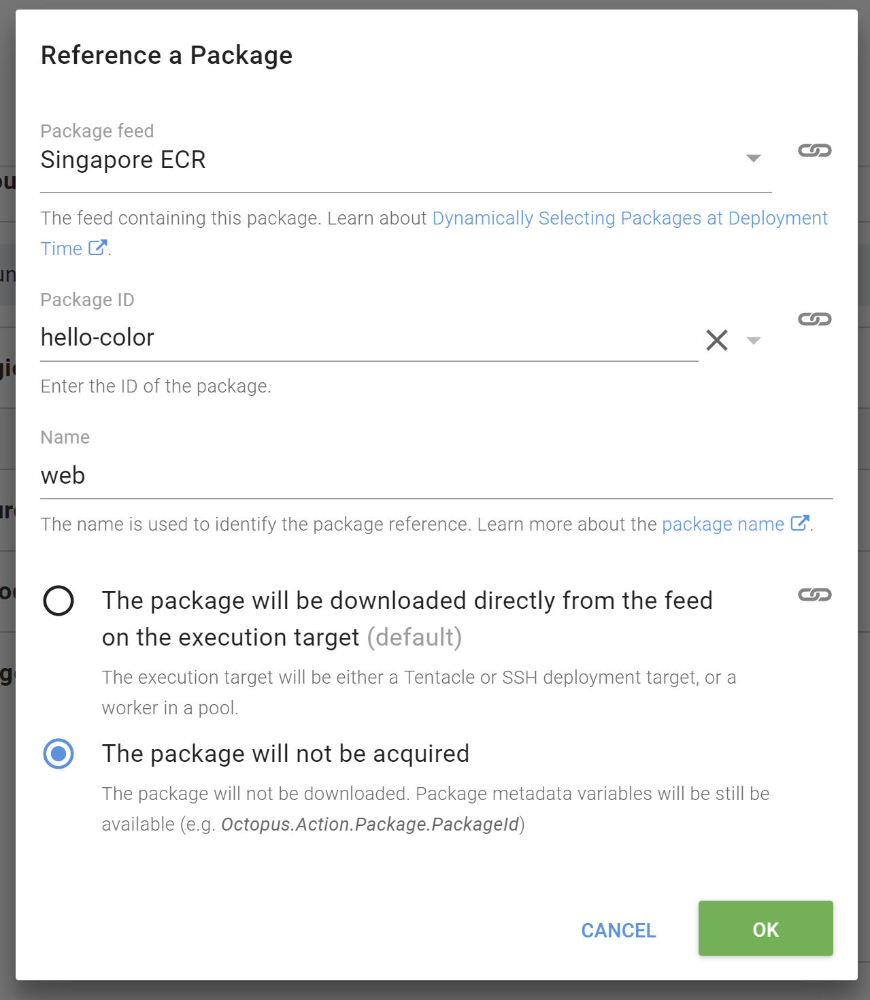
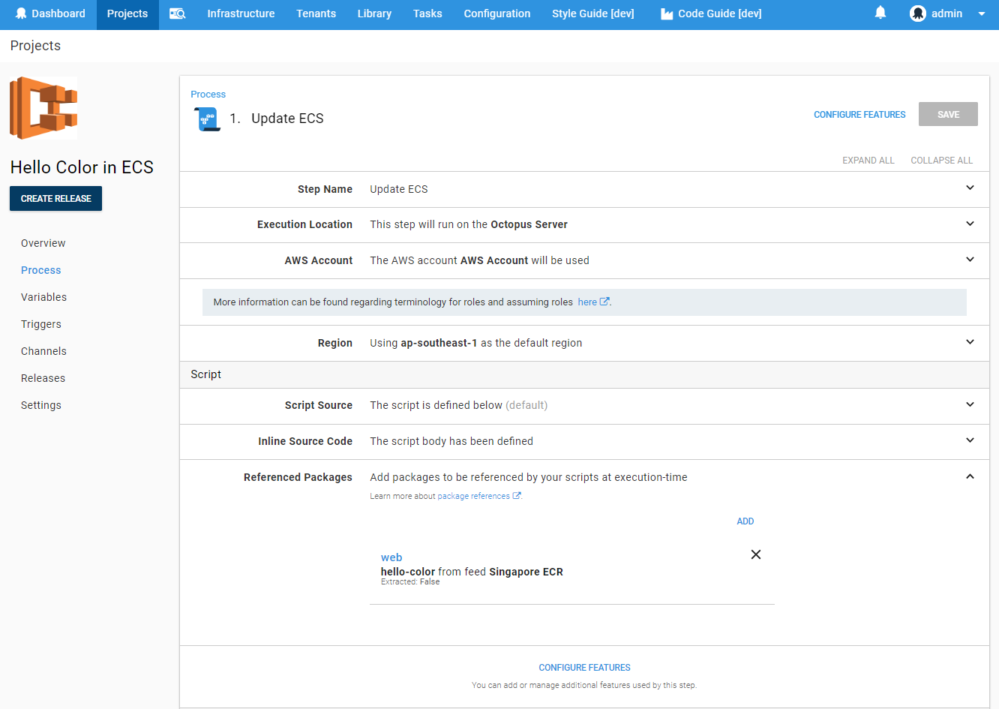
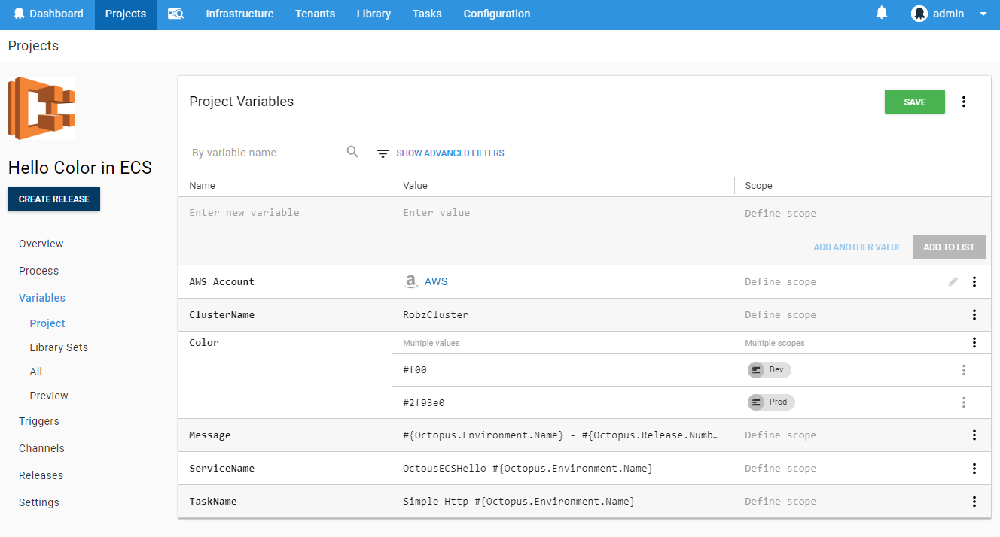
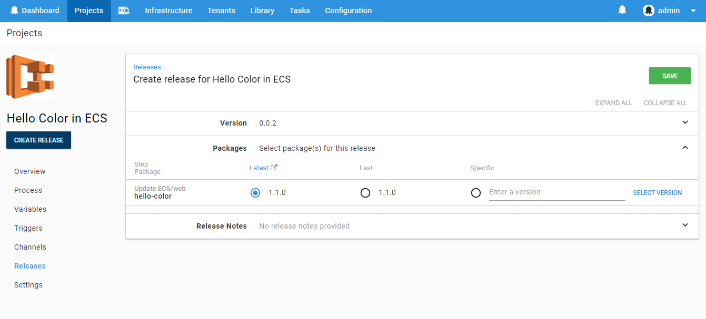
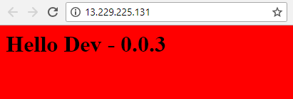

Amazon's Elastic Container Services (ECS) provides a simplified way to orchestrate the running of your Docker containers that is a popular alternative to Kubernetes. With the multi-package script steps available in Octopus Deploy from version `2018.8.0`, you can now guide deployments to ECS with all the benefits of Octopus's versioning and variable management. This release also provides support for Amazon's Elastic Container Registry (ECR) as a first-class feed type.  To demonstrate how this might work for you, the following post will walk through an example from Dockerfile to Deployment.

But first some background.

## Elastic Container Services (ECS)
Before Kubernetes became the leader in container orchestration, AWS came up with its own abstraction that helps manage scaling and load balancing across multiple container instances. ECS defines the configuration of container deployments in a way that feels closer to how they have approached [AWS Lambdas](https://aws.amazon.com/lambda) Similar to with Lambdas, the primary configuration is versioned each time it is updated and a [service](https://docs.aws.amazon.com/AmazonECS/latest/developerguide/ecs_services.html) provides an abstraction above that (analogous to an [alias](https://docs.aws.amazon.com/lambda/latest/dg/versioning-aliases.html) for Lambda) can point to a specific version. The services are all located within a [cluster](https://docs.aws.amazon.com/AmazonECS/latest/developerguide/ECS_clusters.html) of nodes which previously would be a bunch of EC2 instances that you had to manage. With the release of [Fargate](https://aws.amazon.com/fargate/), AWS will now happily abstract away and manage the individual machines entirely.



Services run in a cluster, and their active tasks are based on a specific version of a task definition.

## Elastic Container Registry (ECR)
The ability to use a Docker container registry in Octopus Deploy has been possible since the first Docker steps were available back in 2016. Although AWS provides a Docker container registry under the Elastic Container Registry (ECR) offering, there has been a slight hurdle that makes using it very difficult. The standard V2 Docker Registries API that Octopus integrates with, take a username and password for authentication. Although ECR does not provide a static set of credentials, they do provide login details through a `get-login` API request. The catch, however, is that these credentials are only valid for 12 hours. This means that to use an ECR feed in Octopus Deploy, you would need to ensure you retrieve the credentials and update the feed details every 12 hours at a minimum. This is obviously a bit of a dampener for any attempt to build an automated deployment pipeline.

In the `2018.8.0` release we have now provided a way to add AWS ECR feeds as first-class feed types. By providing the appropriate AWS credentials, Octopus can take care of this two-step authentication process so that you can just work with standard IAM roles.

## Deployments with Octopus

### Building the Image For ECR
Our sample image is a basic HTML website that changes content based on some environment variables that we plan to provide and is built on top of the `httpd` container image.

```dockerfile
FROM httpd:2.4

ENV OCTO_COLOR="#f00"
ENV OCTO_ENV="DEFAULT"
CMD echo "<html>\
    <head>\
        <title>Octopus Container</title>\
        <style>body {background-color: $OCTO_COLOR;} </style>\
    </head>\
    <body><h1>Hello $OCTO_ENV</h1></body>\
</html>" > /usr/local/apache2/htdocs/index.html && httpd-foreground\
```

Like any good continuous deployment system we want to build once and deploy many times, so building the image will take place outside of an Octopus Deploy during our build phase. I would suggest reading some of AWS's extensive [docs](https://docs.aws.amazon.com/AmazonECR/latest/userguide/docker-push-ecr-image.html) for details on pushing an image to ECR.

### Adding ECR feed to Octopus Deploy
With our image ready for deployment, we can go ahead and add ECR to Octopus as a first-class feed type.
From the `Library` section, add a new feed and select the type `AWS Elastic Container Registry`. You will then need to supply your AWS credentials and region that the registry is in.



When we save and test the new feed, Octopus should be able to find the registry we configured earlier. What Octopus is doing under the hood is using the credentials provided to contact AWS and get the standard username/password credentials used by Docker to interact with remote repositories. It then uses the retrieved username and password to interact with the v2 Docker registry exposed by AWS just like a standard Docker feed type.

:::info
Because the Octopus Server itself needs access to the registry to list images and tags (as versions when creating a release), assumed IAM roles are currently not supported for this feed type. While this _may_ be supported in the future, it would also require the Octopus Server to itself be running in AWS infrastructure to work. At the moment the AWS ECR feed type requires standard AWS credentials to operate.
:::

### Deploying Image to AWS ECS
Although Octopus doesn't currently have an ECS specific deployment step, we can still make use of a multi-package script step to update our ECS Task and Service. This will allow us to use Octopus to control the image version released throughout our deployment pipeline, as well as manage the different variables that need to be supplied to the running container. Add a `Run an AWS CLI Script` step to your project.



Enter the AWS Region that the ECR services are located in and select the AWS account that has the necessary permissions to create ECR Tasks and update the ECR services. This account is likely to differ between staging and production, so it is best to supply the account through a project variable scoped to your different environments.

Skip down the `Referenced Packages` section and add the Docker image that we added to our ECR feed. For this image we don't need to do any package acquisition since that will be handled by AWS itself, so select the `The package will not be acquired` option. We have also given it a simple name that we will use to access these variables in the script, however, this field can be left blank, and it will then be defaulted to the packageId.



When referencing a [package in a script](https://octopus.com/docs/deployment-examples/custom-scripts/standalone-scripts#accessing-package-references-from-a-custom-script) we get access to a bunch of variables that are indexed by the name we provided above.

- `Octopus.Action.Package[web].PackageId` - The package ID. In the case of docker images this roughly correlates with the repository name ("hello-color")
- `Octopus.Action.Package[web].PackageVersion` - the version of the package included in the release. In the case of docker images this correlates with the image tag
- `Octopus.Action.Package[web].FeedId` - The feed ID ("feeds-singapore-ecr")

A docker specific variable `Octopus.Action.Package[web].Image` is also provided that resolves to the fully qualified image name. In the case of this package, it might look something like `918801671493.dkr.ecr.ap-southeast-1.amazonaws.com/hello-color:1.0.1`. It is this `Image` variable that we need to make use of in the following script.

We can break up the script into 3 basic parts:

#### 1. Define the containers
``` powershell
$PortMappings = New-Object "System.Collections.Generic.List[Amazon.ECS.Model.PortMapping]"
$PortMappings.Add($(New-Object -TypeName "Amazon.ECS.Model.PortMapping" -Property @{ HostPort=80; ContainerPort=80; Protocol=[Amazon.ECS.TransportProtocol]::Tcp}))

$EnvironmentVariables = New-Object "System.Collections.Generic.List[Amazon.ECS.Model.KeyValuePair]"
$EnvironmentVariables.Add($(New-Object -TypeName "Amazon.ECS.Model.KeyValuePair" -Property @{ Name="OCTO_COLOR"; Value=$OctopusParameters["Color"]}))
$EnvironmentVariables.Add($(New-Object -TypeName "Amazon.ECS.Model.KeyValuePair" -Property @{ Name="OCTO_MSG"; Value=$OctopusParameters["Message"]}))

Write-Host "Adding Container Definition for" $OctopusParameters["Octopus.Action.Package[web].Image"]
$ContainerDefinitions = New-Object "System.Collections.Generic.List[Amazon.ECS.Model.ContainerDefinition]"
$ContainerDefinitions.Add($(New-Object -TypeName "Amazon.ECS.Model.ContainerDefinition" -Property @{ `
    Name="web"; `
    Image=$OctopusParameters["Octopus.Action.Package[web].Image"]; `
    PortMappings=$PortMappings; `
    Environment=$EnvironmentVariables
    Memory=256;}))
```
We have to explicitly set the environment variables into the container definition for this task. Although you can override the environment variables when running a task directly on a cluster, when being run through a service there is currently no such option, and dynamic configuration is left up to the user based on the [environmental metadata](https://aws.amazon.com/about-aws/whats-new/2017/11/amazon-ecs-allows-containers-to-directly-access-environmental-metadata/). There is an open ECS [GitHub issue](https://github.com/aws/amazon-ecs-agent/issues/3) asking for better support, however, being almost 4 years old means it might not be addressed any time soon. For this reason, I would recommend keeping a separate task for each environment and using project variables to vary the task being updated depending on the deployment.

Notice that when providing the image details, we are using the `Octopus.Action.Package[web].Image` variable described above. This value will be derived from the image version selected during the release.

#### 2. Create Task with Container Definition

```powershell
$Region = $OctopusParameters["Octopus.Action.Amazon.RegionName"]
$TaskName = $OctopusParameters["TaskName"]
$ExecutionRole = $(Get-IAMRole -RoleName "ecsTaskExecutionROle").Arn

Write-Host "Creating New Task Definition $TaskName"
$TaskDefinition = Register-ECSTaskDefinition `
    -ContainerDefinition $ContainerDefinitions `
    -Cpu 256 `
    -Family $TaskName `
    -TaskRoleArn $ExecutionRole `
    -ExecutionRoleArn $ExecutionRole `
    -Memory 512 `
    -NetworkMode awsvpc `
    -Region $Region `
    -RequiresCompatibility "FARGATE"
```

Although you could load a previously constructed task configuration as a template and update just the image, this approach ensures that the Octopus deployment process becomes the source of truth for what is expected to be running. In addition, it means that this script can be run where there is _no_ previous script yet set up, for example, when you want to configure a new endpoint for a new testing environment.

By loading the task name from an environment variable, it means that we can vary the task per-environment (and tenant if relevant) which allows us to have multiple task definitions for our different deployment contexts.

#### 3. Upgrade the Service to Use the New Task
```powershell
$ClusterName = $OctopusParameters["ClusterName"]
$ServiceName = $OctopusParameters["ServiceName"]

Write-Host "Updating Service $ServiceName"
$ServiceUpdate = Update-ECSService `
    -Cluster $ClusterName `
    -ForceNewDeployment $true `
    -Service $ServiceName `
    -TaskDefinition $TaskDefinition.TaskDefinitionArn `
    -DesiredCount 2 `
    -DeploymentConfiguration_MaximumPercent 200 `
    -DeploymentConfiguration_MinimumHealthyPercent 100
```
So that we can have multiple services running for each environment, the name of the service is provided via a project variable that uses a naming convention that varies by environment (see the project variables screenshot at the end of this post for details).

An alternative approach to what's described in this post might involve running the task directly in the cluster without using a service. This is really only useful for ad-hoc tasks rather than scalable applications, since using a service makes it easier to set up more advanced configuration like including a load balancer to spread traffic across multiple tasks or setting up auto-scaling rules.

#### Putting it All Together
If we put all these scripts together and add a few logging flourishes it should look something like the following:
```powershell
# Define Container
$PortMappings = New-Object "System.Collections.Generic.List[Amazon.ECS.Model.PortMapping]"
$PortMappings.Add($(New-Object -TypeName "Amazon.ECS.Model.PortMapping" -Property @{ HostPort=80; ContainerPort=80; Protocol=[Amazon.ECS.TransportProtocol]::Tcp}))

$EnvironmentVariables = New-Object "System.Collections.Generic.List[Amazon.ECS.Model.KeyValuePair]"
$EnvironmentVariables.Add($(New-Object -TypeName "Amazon.ECS.Model.KeyValuePair" -Property @{ Name="OCTO_COLOR"; Value=$OctopusParameters["Color"]}))
$EnvironmentVariables.Add($(New-Object -TypeName "Amazon.ECS.Model.KeyValuePair" -Property @{ Name="OCTO_MSG"; Value=$OctopusParameters["Message"]}))

Write-Host "Adding Container Definition for" $OctopusParameters["Octopus.Action.Package[web].Image"]
$ContainerDefinitions = New-Object "System.Collections.Generic.List[Amazon.ECS.Model.ContainerDefinition]"
$ContainerDefinitions.Add($(New-Object -TypeName "Amazon.ECS.Model.ContainerDefinition" -Property @{ `
    Name="web"; `
    Image=$OctopusParameters["Octopus.Action.Package[web].Image"]; `
    PortMappings=$PortMappings; `
    Environment=$EnvironmentVariables
    Memory=256;}))

# Create Task
$Region = $OctopusParameters["Octopus.Action.Amazon.RegionName"]
$TaskName = $OctopusParameters["TaskName"]
$ExecutionRole = $(Get-IAMRole -RoleName  "ecsTaskExecutionROle").Arn
Write-Host "Creating New Task Definition $TaskName"
$TaskDefinition = Register-ECSTaskDefinition `
    -ContainerDefinition $ContainerDefinitions `
    -Cpu 256 `
    -Family $TaskName `
    -TaskRoleArn $ExecutionRole `
    -ExecutionRoleArn $ExecutionRole `
    -Memory 512 `
    -NetworkMode awsvpc `
    -Region $Region `
    -RequiresCompatibility "FARGATE"

if(!$?) {
    Write-Error "Failed to register new task definition"
    Exit 0
}
Write-Host "Created Task Definition $($TaskDefinition.TaskDefinitionArn)"
Write-Verbose $($TaskDefinition | ConvertTo-Json)

# Update Service
$ClusterName = $OctopusParameters["ClusterName"]
$ServiceName = $OctopusParameters["ServiceName"]
Write-Host "Updating Service $ServiceName"
$ServiceUpdate = Update-ECSService `
    -Cluster $ClusterName `
    -ForceNewDeployment $true `
    -Service $ServiceName `
    -TaskDefinition $TaskDefinition.TaskDefinitionArn `
    -DesiredCount 2 `
    -DeploymentConfiguration_MaximumPercent 200 `
    -DeploymentConfiguration_MinimumHealthyPercent 100
if(!$?) {
    Write-Error "Failed to register new task definition"
    Exit 0
}
Write-Host "Updated Service $($ServiceUpdate.ServiceArn)"
Write-Verbose $($ServiceUpdate | ConvertTo-Json)

```


We then add the following variables which will supply configuration for both the ECS infrastructure itself and the details we want to push into the container.



### Deployment
When creating a release, you will be prompted to provide the version of the image that you wish to deploy. Octopus obtains this information directly from the container registry, so you can see exactly which images have been deployed and which have yet to be released. The version numbers are actually derived by parsing the image tag so although you can provide any tag as the "version", only tags that can be parsed as [semver 2](https://semver.org/) will be visible.



Kicking off a deployment you should also notice that although we are using a package (the image), there is no acquisition that takes place. This is because Octopus is just providing the values _describing_ the package for use in our scripts. When the deployment executes the ECS service will run new tasks and, based on the `DesiredCount`,  `DeploymentConfiguration_MaximumPercent`, and `DeploymentConfiguration_MinimumHealthyPercent` configuration ensure that the correct number of tasks are active at any given point. This results in a rolling-update style deployment.

Let's take a look at our dev and production deployments:




Huzzzah! Colors and messages, when I consider the traffic this app is going to get I'm glad we have that load balanced!

### Activities Left for the Reader
This deployment script is likely to be quite a bit simpler than what you may want in the real world. You may need to configure volume mounts, CPU limits, custom scaling rules or any number of the various configuration options exposed by the AWS APIs. This script focused on the "Fargate" offering which abstracts away the management of the servers in the cluster, however, the same principle will work with a few modifications if you are using the "EC2" configuration of ECS.

## Octopus Deploy's Future Plans for ECS
Although recently Kubernetes has taken the industry's attention in the container space, ECS continues to be a popular option, and we anticipate there may be more first-class ECS step on the horizon. In keeping with the "Octopus is the source of truth" philosophy, I would expect that any ECS specific step would end up mirroring many of the configuration options available through the AWS portal today, however with tighter integration to Octopus variables and package selection.

With every release Octopus provides richer and more useful integration with various cloud providers, and AWS is no exception. If you are using ECS today, hopefully, this post gives you some idea on how to approach deployments with Octopus Deploy, leveraging all the things that Octopus is great at. Let us know of your deployment successes (or failures) with Octopus to ECS!
